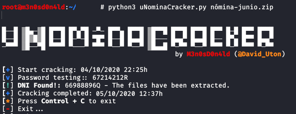

It is incredible how much information a company constantly generates, regardless of its size or capital. All, and I mean absolutely all, need to manage files on a daily basis or at least once a month, such as payroll files.

This reminded me of a news item last year, where Facebook suffered a theft of a hard drive containing sensitive information of 29,000 employees, including a large number of payrolls and with these, personal data, bank accounts, salary details and hierarchical position in the corporation.

Commenting on this at a lunch with friends, they told me that in their company they protect the payroll files with a password, their ID card. I was amused, because I know many companies that do exactly the same, they send a monthly .zip file protected with the employee's National Identity Document (DNI) number... **Really? Do you really think this is "safe"?**

A few days later, I accidentally "_stumbled_" upon a vulnerability in an email service, this vulnerability allows an attacker to intercept the traffic, in other words, this flaw would allow him to obtain data from the incoming and outgoing emails from the server, getting hold of very sensitive information. In view of what happened, I checked the first ten requests... No way! A payroll!

 

It can be seen that an attacker could collect emails and view their content, being able to perform targeted phishing attacks, but this will not be the case here.

Now, the attacker would retrieve the **request to send** the email to obtain the email information:

You can see from the **server's response** that this is a payroll:

 

#### Display of the content in HTML format:

In addition, the attacker could download the file, being able to obtain sensitive information from the employee. It can be seen in the following image that the file is protected by a password... _Would we be facing a company that protects the files with the ID of its employees? Could an attacker obtain the password? How long would it take?_

I got down to work and programmed a small _script_ in **Python** to carry out this task. With 4 lines of code, anyone could create their own cracking tool, as can be seen in the following image:  

 

After obtaining the remainder of the division, we would know the letter by its position number (e.g., if the remainder is "**4**", the letter would be "**A**").

#### Table with letters of the DNI:

You can download the script from my **github**: [https://github.com/m3n0sd0n4ld/uNominaCracker](https://github.com/m3n0sd0n4ld/uNominaCracker)

  
I run the script passing the name of the .zip file as parameters and now we only have to wait. After **14 hours and 12 minutes**, the tool has managed to find the password and has successfully extracted the files.

We can visualize the payroll and obtain confidential and sensitive employee information **(Attention!!!: the data in this payroll are fictitious).**

## Improve security with technology

1.  Generate **alphanumeric passwords**, including **symbols** and with a minimum of **12 characters** to protect each employee's files.
2.  Have a **new password sent monthly** to employees' **mobile devices**, these devices must be protected with a biometric system (e.g. fingerprint). _Remember! Something you know (password), something you have (mobile) and something you are (fingerprint)._
3.  Send files with _sensitive information_ through **secure** and **corporate channels**, avoid using third party services.

## Conclusion

It is clear that this method of file protection is **not enough**, any attacker could "_break_" the protection by brute force in less than 24 hours using a mid-range computer and a few lines of code. 
  
We must remember that payrolls contain very sensitive employee information, any information is good for cybercriminals, and they will shamelessly use it against the weakest link... **Our people**.