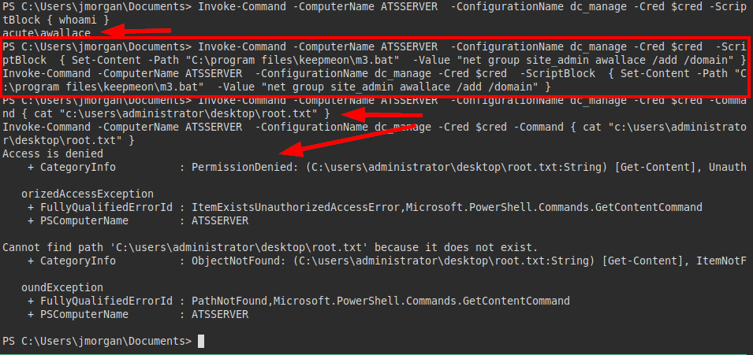
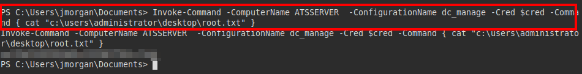

## Scanning
We run nmap on port 443 with scripts and software versions.


## Enumeration
We put the subdomain name "atserver.acute.local" and *"acute.local"* found in the DNS in the file *"/etc/hosts"*.

We access the website of "*acute.local*", but it is not available.


We tried accessing the other web resource and it appears that there is a corporate website exposed.


The website does not seem to be complete, only the "*about.html*" section works, there is a link in the "*New Starter Forms*" section with an office file:


It looks like we have an office file with internal information, in the document it explains the different areas of the different departments, but it also includes several links that would be very relevant for an attacker.


We list below another link that takes us to a "*Windows PowerShell Web Access*" portal and the name of a person who appears to be a corporate administrator.


In addition, we list the **default password** used in the entity:


## Exploitation
We access the "*Acute_Staff_Access*" site, we list an authentication panel where we could gain access by powershell. But we will not be able to exploit this site without having valid credentials or at least valid users to try password spraying. 


Remember that we have access to the "*about.html*" file, where we can list several corporate users.


We also check the metadata of the office file, usually we usually find corporate users (and their format ;)), computer names and software used.


As there were not many names, I manually generated several users in different ways of the most typical I find in real scenarios:


They are few, so it is possible to use **Burp's intruder**, we see that the user "*edavies*" appears:


We see that we can access the **powershell**, but at least we can't find the flag on that user.


It seems to have the AV, since we can't run ps1, we will have to try to evade it.


We check if there are any directories that are excluded from the AV, we see that there are two:


We create an exe file with **msvenom** and *shikata_ga_nai* to bypass EDR:


Now we transfer and run the file to gain access.


We get the reverse shell and check our privileges.


The reverse shell closes every now and then, I can't run, so I upload another binary with a meterpreter to maintain a more stable interactive connection.


Taking screenshots, we see how someone is using the same session, since the first ss was in the powershell and the 2nd one appears on the desktop (and we have not been).


We see how it is typing some credentials and passing them in *SecureString*:


I tried several combinations until I managed to execute commands as the user "*imonks*".


```powershell
$user = 'acute\imonks'
$password = ConvertTo-SecureString 'W3_4R3_th3_f0rce.' -AsPlainText -Force
$cred = New-Object System.Management.Automation.Pscredential ($user,$password)
Invoke-Command -ComputerName ATSSERVER  -ConfigurationName dc_manage -Cred $cred -ScriptBlock { whoami } 
```


## Privilege Escalation
We see if your directory exists and we see two files, the user flag and "*wm.ps1*".


It appears that the file is a script running as the user "*jmorgan*".


We see that we are able to change the "*Invoke-Command*" and insert a malicious binary to be executed by the user "*jmorgan*".


Now we run the script and get a reverse shell with the user "*jmorgan*":


Ok, let's create the shell and look at our privileges (which are not few hehehe)


We see that we are also administrators, so we can still read the administrator flag, but it is not in the directory.


We try to extract the hashes:


We cracked with hashcat the hashes, we managed to get the password on the local administrator's plane. 


I try this password with the rest of the users, it seems to work only with the user "*awallace*":


We see that we are *users of the domain* and we are in the group "*managers*".


We are executing system commands to list files, we find a script "*keepmeon.bat*".


We read the script, we see that there is a comment that "*Lois*" (remember that she is the administrator) is executing every *5 minutes this script*, this makes me think of repeating the same move, writing in it or in another bat file a reverse shell or code execution to read the root flag.


##### Content "keepmeon.bat":


We try to list the users and see the user "*lhopkins*", which should belong to the administrator:


After several unsuccessful tests, we tried to create a malicious **bat** to add the user "*awallace*" to the site_admin group.

We try to read the flag, but we see that we will have to wait a few minutes for the scheduled task to run and get scale privileges.



After waiting a few minutes, we tried again to read the flag and succeeded.


