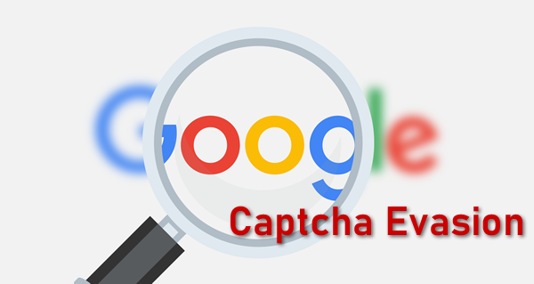
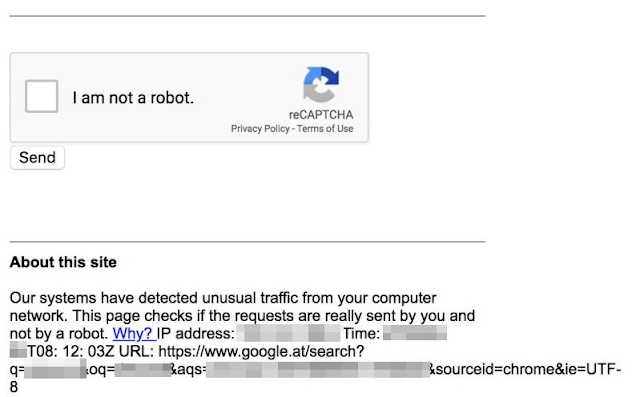
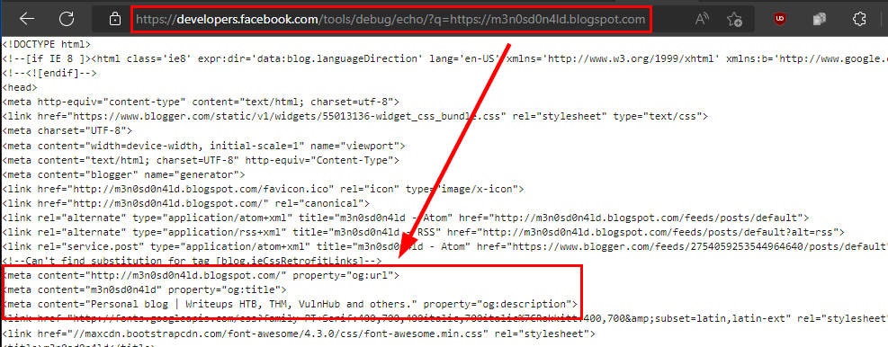
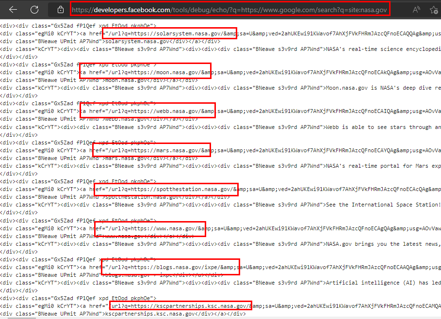
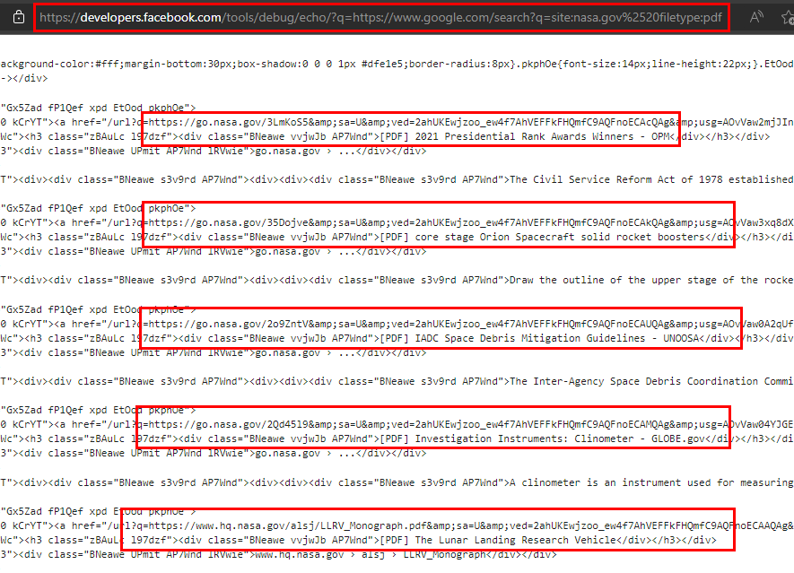
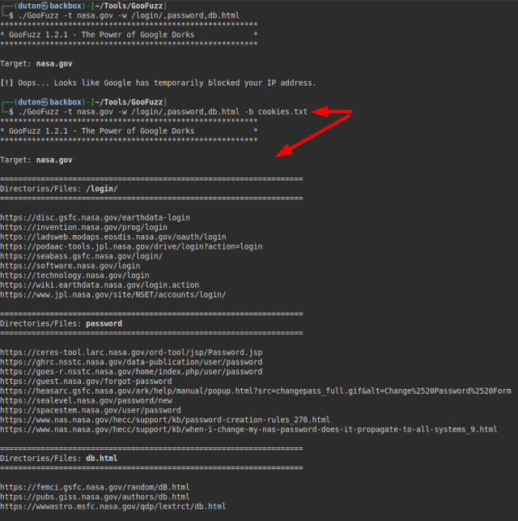
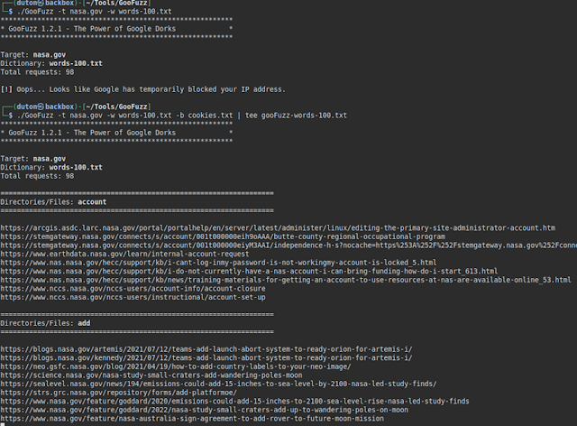

  

Today I bring you a way to bypass the **Google Search** captcha.  
Surely the image below sounds familiar to you, it is when **Google Search** detects suspicious activity and kindly asks us to solve a captcha to continue searching.

   

## Meeting Google friends

**Facebook** has a utility for developers called "*[Echo debugging](https://developers.facebook.com/tools/debug/echo/?q=)*", in which it allows searches on a website, for example my blog:

As you can see in the image, from this **Facebook** resource we could get to see the source code of a website, but **we will need to be authenticated** and for that we will **need to have a Facebook account**.  
  
## Thinking outsite the box

Being clear that we can see the source code of a website (so far nothing relevant), it occurred to me to cross a search to **Google Search** filtering by the domain "*nasa.gov*", in the following image it is shown how it is possible to obtain results from **Google Search** from this utility.

  
  
So I tried several executions with different special dorks and noticed that at no time did it ask to solve the security captcha due to suspicious activity (It seems that they completely trust **Facebook** :P)  
The following image shows a search for *PDF* files in the "*nasa.gov*" domain:  

 

I know friend, it also occurred to me that this advantage could be used to automate it in a tool ;)  

## What is GooFuzz?

 

**GooFuzz** is a tool to perform fuzzing with an OSINT approach, managing to enumerate directories, files, subdomains or parameters without leaving evidence on the target's server and by means of advanced Google searches (Google Dorking).

**Github**:[ https://github.com/m3n0sd0n4ld/GooFuzz](https://github.com/m3n0sd0n4ld/GooFuzz)  

Although **GooFuzz** ​​​​does **not require the use of Facebook cookies**, I did find it interesting to add a functionality to evade the captcha and be able to make more requests on the browser. 

By taking advantage of the "*ByPass*" functionality, we can use a **dictionary of 100 words maximum without being blocked**.  

 

### Proof of concept video with avoidance option:



## What does Google think about this?

This was discovered a few years ago, where **they mentioned that it was not a vulnerability**, but I have to say that they have been silently solving it (another case of "*Bad bounty*").  
  
## Conclusions

Without going into detail about whether or not it is a vulnerability or deficiency, what it reveals is that an attacker would be able to abuse this technique to <u>make massive requests and evade the search engine's detection system (captcha)</u>.  

Thank you for your time in reading this article and I hope it has been of interest.  

Until next time!  