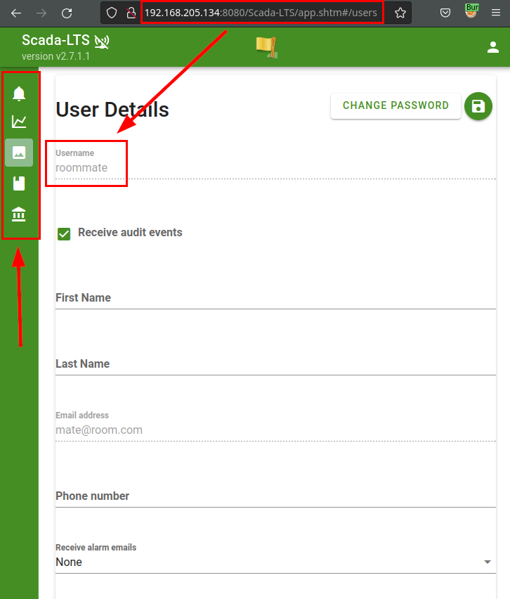
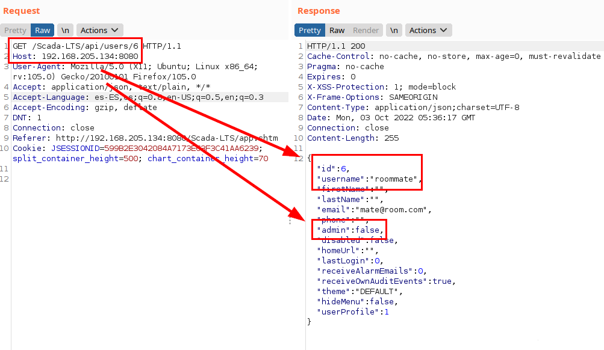
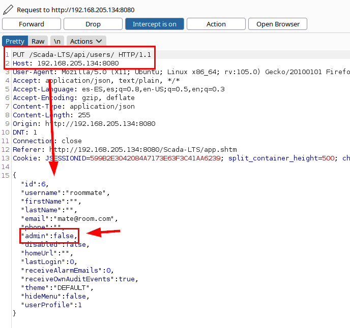
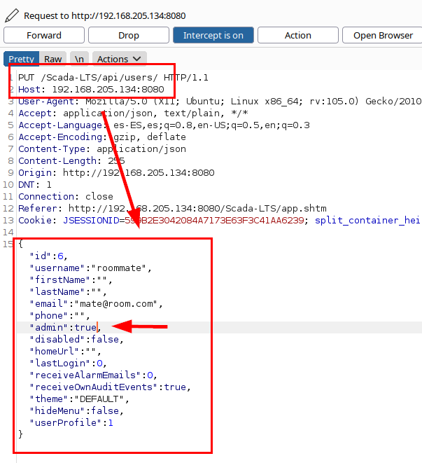
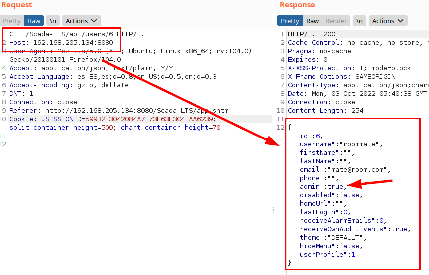
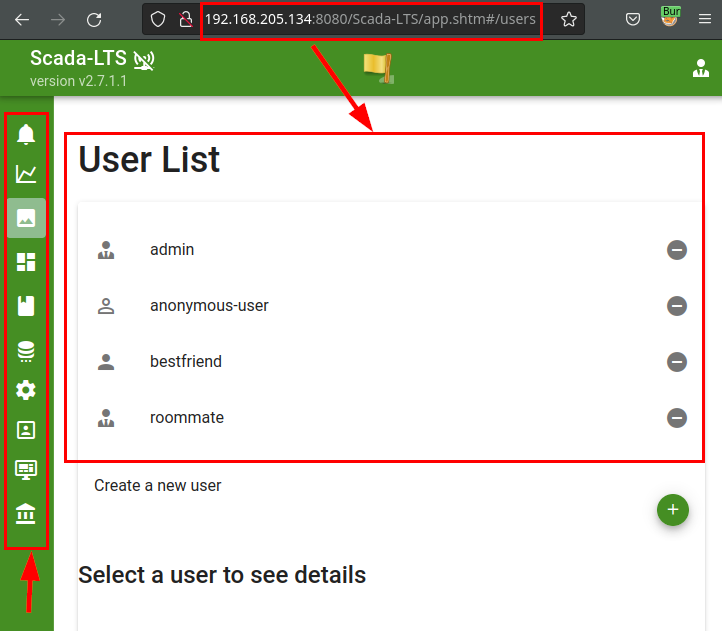
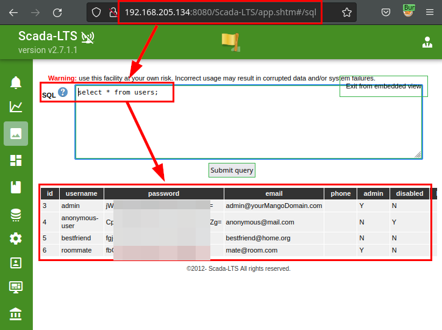

## Introduction

**CVE-ID:** [CVE-2022-41976](https://cve.mitre.org/cgi-bin/cvename.cgi?name=CVE-2022-41976)
**Vulnerability Type:** Incorrect Access Control
**Affected Product Code Base:** Scada-LTS v2.7.1.1 build 2948559113 (or before to v2.7.3)
**Affected Component:** Affected source code file and API
**Attack Type:** Remote 
**Impact:** Privilege escalation, SQL code execution to RCE, arbitrary data alteration, information leakage (e.g. users and password hashes) and service unavailability.
**Attack Vectors:** To exploit the vulnerability, it is required to be authenticated with a low privilege user.

## Description

A remote attacker, authenticated in the application as a low-privileged user, can change role (e.g., to administrator) by updating their user profile..

## Exploitation

The attacker authenticated as "*roommate*", it is evident that he only sees his profile data and that the menu has no administrative options.p

If we capture the request with a tool such as *Burp Suite*, we can see our profile data, which shows that we are not an administrator (*admin=false*).

But, if an attacker were to click on the "*save profile data*" icon, he could intercept the request and it becomes evident that the *"admin":false* parameter is stored from the client side.

By modifying the parameter *"admin":false* to *"admin":true*, the attacker would be able to manipulate his role (possibly some more data and about other users) and assign himself other privileges.

In the following illustration, the profile with the "*admin*" role is shown again, evidencing the escalation of privileges and commitment of the **SCADA-LTS**.

If we update the application, it is now possible to see all the menu options and the rest of the users, thus contemplating the privilege escalation and the commitment of the application.

In addition, this vulnerability would allow SQL queries to be performed on the application, obtaining confidential information, creating files with malicious code for command execution or extracting encrypted user credentials for reusing passwords in other services.

## Mitigation

The issue has been patched in [SCADA-LTS v2.7.3**](https://github.com/SCADA-LTS/Scada-LTS/tree/release/2.7.3), so it is recommended to upgrade as soon as possible to mitigate this deficiency.

## Acknowledgments

I would like to thank the **SCADA-LTS** team for their attention, in which they have always been grateful for my contribution and even offered me to collaborate with the project.

I would also like to thank **Mitre** for the attention and speed in the procedures with the CVE identifier.

## References

- [Mitre - CVE-2022-41976](https://cve.mitre.org/cgi-bin/cvename.cgi?name=CVE-2022-41976) 
- [SCADA-LTS - Fixed commit](https://github.com/SCADA-LTS/Scada-LTS/issues/2369)
