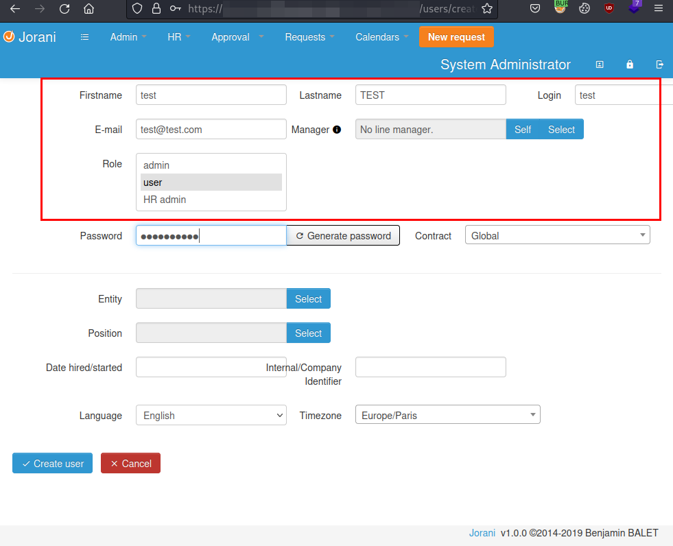
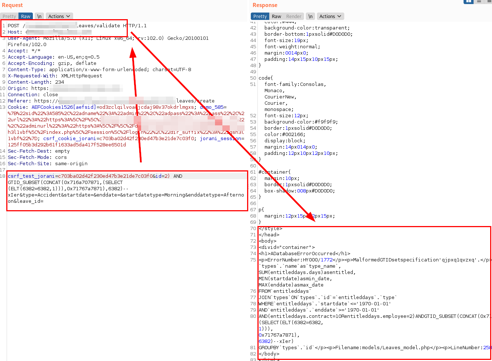
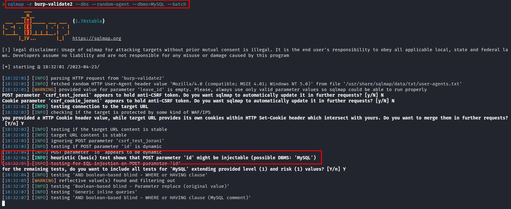
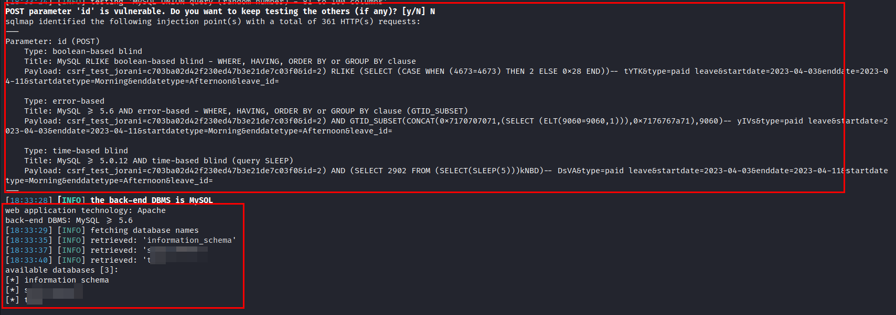
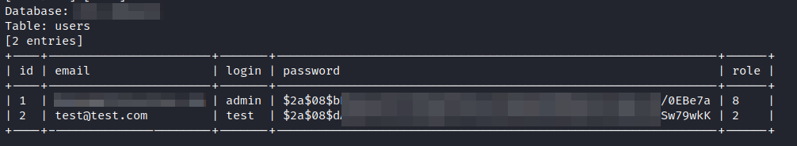

## Introduction
- **CVE-ID:** [CVE-2023-2681](https://cve.mitre.org/cgi-bin/cvename.cgi?name=CVE-2023-2681)
- **Vulnerability Type:** SQL Injection
- **Affected Product Code Base:** Jorani v.1.0.0 (or before to v1.0.0)
- **Affected Component:** Affected source code the "*id*" parameter of the "*/leaves/validate*" section.
- **Attack Type:** Remote 
- **Impact:** Extraction or alteration of information stored in the database, and on occasion, could lead to remote code execution and server compromise.
- **Attack Vectors:** To exploit the vulnerability, it is required to be authenticated with a low privilege user.

## Description
A remote attacker, authenticated in the application as a user with few privileges, can perform queries with malicious SQL code on the path "*/leaves/validate*" and the "*id*" parameter, managing to extract arbitrary information from the database.

## Exploitation
In the following evidence, a user with the role "*user*" is created (from here this user is used for the following scenario)



With the following payload, the SQL injection vulnerability is evidenced, managing to extract part of the query in the server response error.

#### Payload: 
```
csrf_test_jorani=c703ba02d42f230ed47b3e21de7c03f0&id=2) AND GTID_SUBSET(CONCAT(0x716a707871,(SELECT (ELT(6382=6382,1 ))),0x71767a7871),6382)-- xIer&type=Accident&startdate=&enddate=&startdatetype=Morning&enddatetype=Afternoon&leave_id=
```


In the following illustration, the extraction of the existing databases is performed with the **SQLMap** tool, the "*id*" parameter is shown to be vulnerable.



Finally, the three databases and the technologies used in the server "*Apache server and MySQL 5.6*" are obtained:



By extracting encrypted user data and credentials, this could allow the attacker to obtain passwords outright if a correct password policy is not followed.



## Mitigation

The issue has been patched in [Jorani v1.0.2](https://github.com/bbalet/jorani/releases/tag/v1.0.2), so it is recommended to upgrade as soon as possible to mitigate this deficiency.

Other recommended mitigation measures include:

- Use pre-built statements, parameterized queries, or stored procedures to ensure that SQL elements in user input fields are never treated as genuine queries
- Validate user input using an allow list to prevent unwanted data from being sent to the database
- Show only generic error messages to users (malicious users can get a lot of information from specific error messages related to failed queries)

## Acknowledgments

I would like to thank the **Jorani (Benjamin Balet)** team for their attention, in which they have always been grateful for my contribution.

I would also like to thank **Mitre** for the attention and speed in the procedures with the CVE identifier.

## References

- [Mitre - CVE-2023-2681](https://cve.mitre.org/cgi-bin/cvename.cgi?name=CVE-2023-2681)
- [INCIBE (Spanish) - CVE-2023-2681](https://www.incibe.es/incibe-cert/alerta-temprana/avisos/inyeccion-sql-en-jorani)
- [INCIBE - CVE-2023-2681](https://www.incibe.es/en/incibe-cert/notices/aviso/jorani-sql-injection)
- [Jorani - Fixed commit](https://github.com/bbalet/jorani/commit/9c54f783405cb7f1f0c9f321566e4be052698593)
- [Jorani 1.0.2 (Parched version)](https://github.com/bbalet/jorani/releases/tag/v1.0.2)