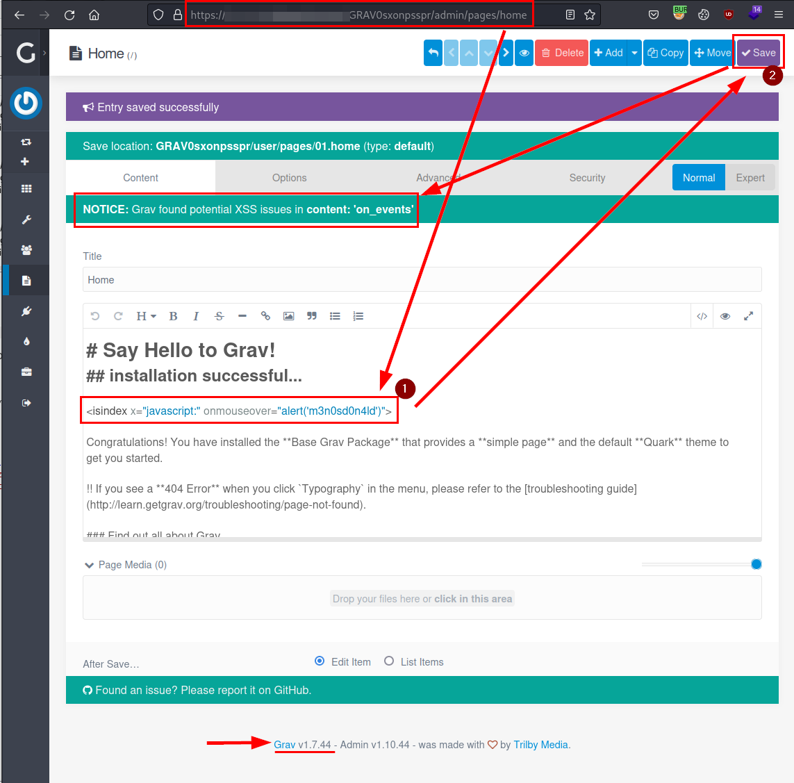
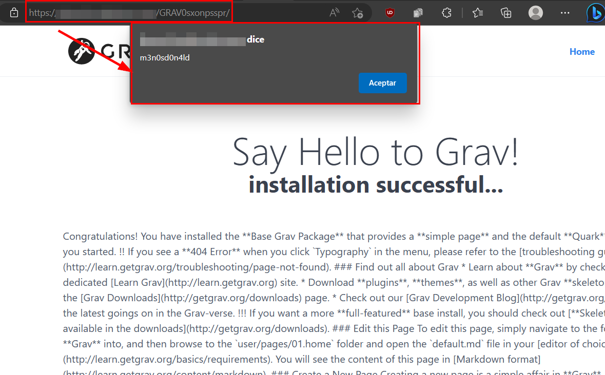

## Introduction

- **CVE-ID:** [CVE-2023-31506](https://cve.mitre.org/cgi-bin/cvename.cgi?name=CVE-2023-31506)
- **Vulnerability Type:** Stored Cross-Site Scripting (Authenticated)
- **Affected Product Code Base:** Grav 1.7.44 (or before)
- **Affected Component:** Affects the CMS text editor (e.g. articles on the main page).
- **Attack Type:** Remote 
- **Impact:** A remote and authenticated attacker (editor role or permissions to publish), would manage to inject malicious JavaScript code in the form fields to be executed on the users or administrators of the application when accessing the article or another area of the application.
- **Attack Vectors:** To exploit the vulnerability, you need to be authenticated with a user with editor or publisher access.

## Description

A remote and authenticated attacker (editor role or permissions to publish), would manage to inject malicious JavaScript code in the form fields to be executed on the users or administrators of the application when accessing the article or another area of the application.

## Exploitation

In the following evidence, the payload used:

```javascript
<isindex x="javascript:" onmouseover="alert('m3n0sd0n4ld')">
```

When saving, the application shows that there is a potential XSS, but has allowed the saving of the file:.



The following illustration, the victim's browser is shown, in which the reload or access to the section is performed and the javascript code is executed.




## Mitigation
- Perform strict server-side validation for all data entered by the user.
- Correctly escape or filter special characters, preventing them from being printable or executed.
- Filter or restrict entries with certain types of characters used in HTML/JavaScript in the different user input fields.

## Timeline
- 17/04/2023 - The vendor is notified without response.
- 11/05/2023 - MITRE is notified and the CVE identifier is assigned.
- 07/02/2024 - MITRE is notified of the status, fulldisclosure is authorized.

## Acknowledgments
We would like to thank [**MITRE CVE**](https://cve.mitre.org/) for their attention and speed in the procedures with the CVE identifier.

## References
- [Mitre - CVE-2023-31506](https://cve.mitre.org/cgi-bin/cvename.cgi?name=CVE-2023-31506)
- [OWASP - Cross Site Scripting](https://owasp.org/www-community/attacks/xss/)
- [OWASP - HTML Injection](https://owasp.org/www-project-web-security-testing-guide/latest/4-Web_Application_Security_Testing/11-Client-side_Testing/03-Testing_for_HTML_Injection)