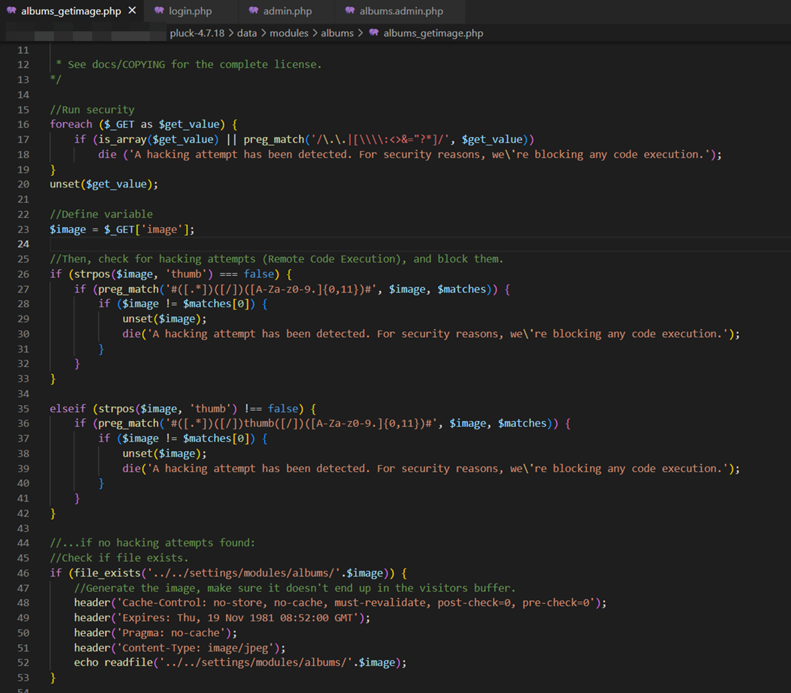
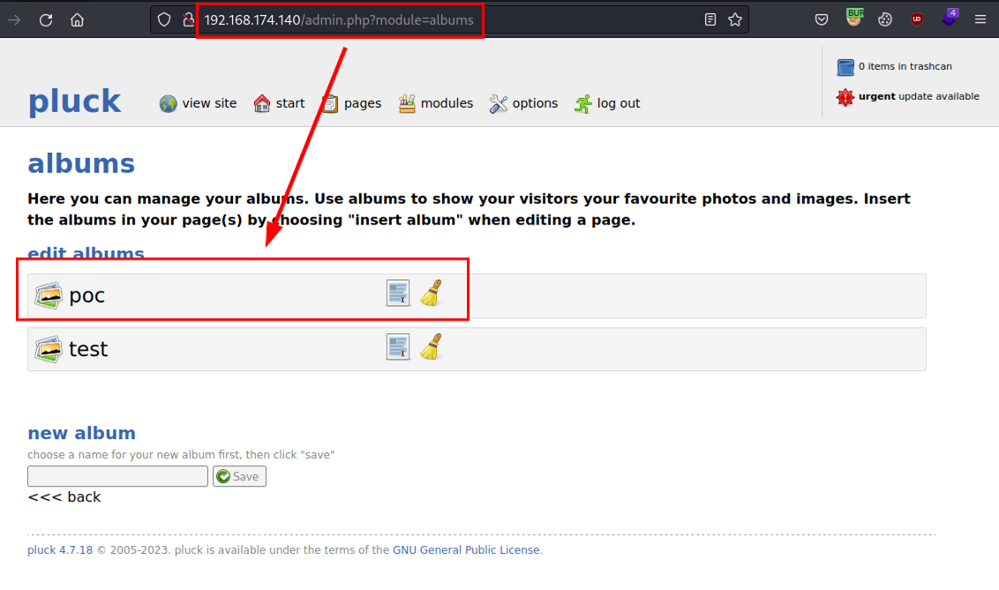
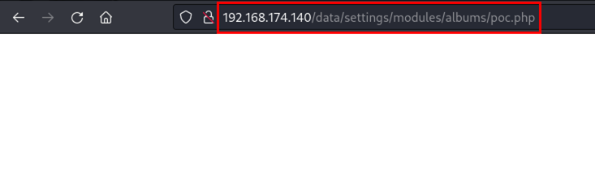
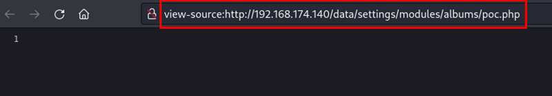
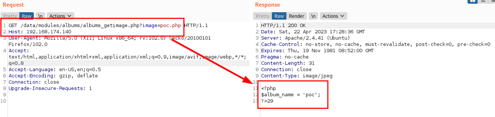
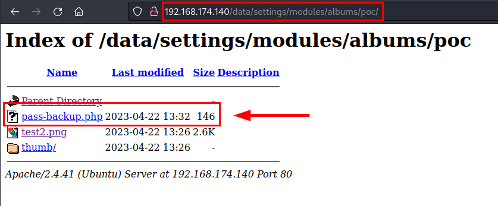
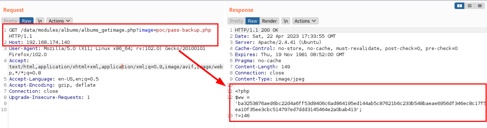
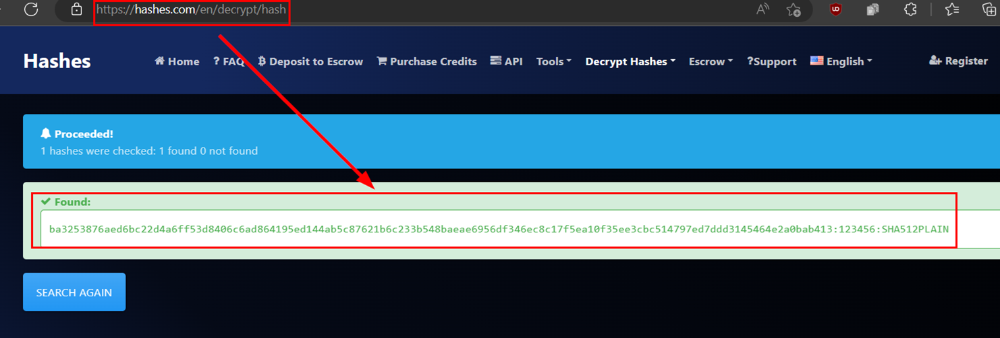
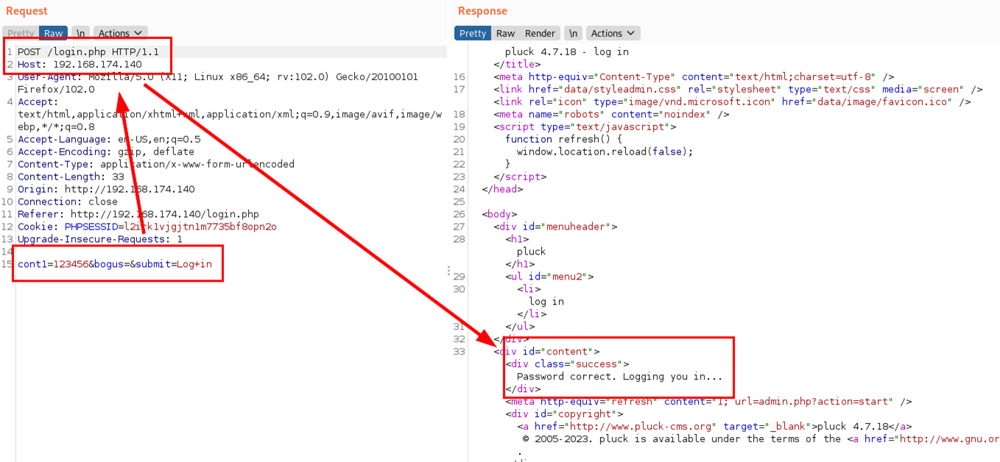

## Introduction
- **CVE-ID:** [CVE-2024-9405](https://cve.mitre.org/cgi-bin/cvename.cgi?name=CVE-2024-9405)
- **Vulnerability Type:** Local File Inclusion (Unauthenticated)
- **Affected Product Code Base:** Pluck CMS v.4.7.18
- **Affected Component:** Affected file and parameter '*/data/modules/albums/albums_getimage.php=<FILE>*'
- **Attack Type:** Remote 
- **Impact:** A remote, unauthenticated attacker could extract sensitive information from the server through the absolute path of a file located in the same directory or subdirectories of the module, but not from recursive directories.
- **Attack Vectors:** Nothing.

## Description
A remote, unauthenticated attacker could extract sensitive information from the server through the absolute path of a file located in the same directory or subdirectories of the module, but not from recursive directories.

## Discovery
Before we start, we review the code of the file "*albums_getimage.php*", you can see below that it makes an "*echo readfile*" without filtering by type of image files, allowing a malicious actor to read the contents of files with server language (e.g. PHP).


## Disclaimer
The information contained in this disclosure is for educational and research purposes only. I am not responsible for any improper or illegal use of the details provided. It is intended to help improve the security of affected systems. System administrators and software owners are advised to take the necessary steps to mitigate the risks associated with this vulnerability. Unauthorized use of the information to exploit systems without permission is illegal and may have criminal consequences.

## Exploitation
From the administration panel, the existing albums are shown, being the "*poc*" album the one we are going to perform the proof of concept with:


Next, the file "*poc.php*" is shown, this file is generated through the title of the album, creating a PHP file whose content cannot be read.



But it is possible to read the content of this file through the following URL and parameter: 
```
http://192.168.174.140/data/modules/albums/albums_getimage.php?image=poc.php
```


By fuzzing techniques or directly visiting the folder (due to lack of an *.htaccess* file in this directory or other protection), the remote and unauthenticated attacker would manage to list relevant PHP files in the root folder of the album or in other folders generated by the CMS or the user himself.

In the following scenario, the *Pluck CMS administrator* has exposed a backup file of the application, this file contains hardcoded and encrypted administration panel password:


By reusing the vulnerable parameter and specifying the new directory and file "*albums_getimage.php?image=poc/pass-backup.php*", the attacker would be able to read the contents of this file and extract the password hash.


#### Bonus track
On the other hand, the **Pluck CMS** application lacks a proper password policy, which allows users to use poor passwords, increasing the chances of success in cracking the password hash.


In case of success, the remote attacker could hijack the application, achieving the compromise and seriously affecting the confidentiality, integrity and availability of the stored information.

It has also been detected that it is possible to upload PHP files from the file manager, the concatenation of vulnerabilities would gain access to the machine that deploys the application, increasing the scope of the attack and the possibility of lateral movement in the network.


## Mitigation
Implement in the code some function that checks the type of files, using a white list for allowed image extensions (eg .png | .gif |jpeg...), thus preventing a malicious user from uploading other files that are not expected by the application.

## Timeline
- 10/12/2023 - The vendor is notified without response.
- 29/01/2024 - INCIBE is notified.
- 29/09/2024 - The vendor has responded and confirms that the vulnerability exists, but remains unpatched.
- 01/10/2024 - INCIBE is notified of the status, fulldisclosure is authorized. 
- 01/10/2024 - NVD published the first details for [CVE-2024-9405](https://cve.mitre.org/cgi-bin/cvename.cgi?name=CVE-2024-9405)
- 01/10/2024 - Estimated the CVSS score as MEDIUM

## Acknowledgments
We would like to thank [**INCIBE-CERT**](https://www.incibe.es/incibe-cert) for their attention and speed in the procedures with the CVE identifier.

## References
- [INCIBE-CERT](https://www.incibe.es/en/incibe-cert/notices/aviso/incorrect-limitation-path-restricted-directory-pluck-cms)
- [Mitre - CVE-2024-9405](https://cve.mitre.org/cgi-bin/cvename.cgi?name=CVE-2024-9405)
- [OWASP - Local File Inclusion](https://owasp.org/www-project-web-security-testing-guide/v42/4-Web_Application_Security_Testing/07-Input_Validation_Testing/11.1-Testing_for_Local_File_Inclusion)