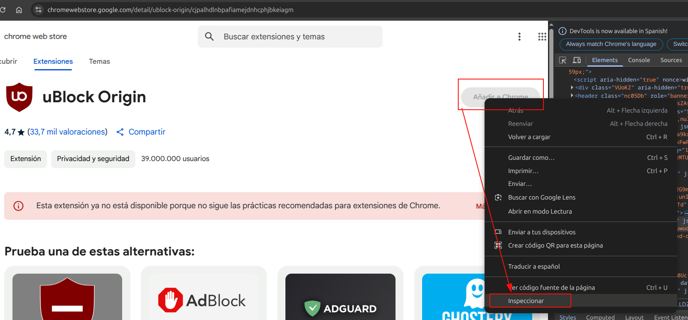

(Imagen extraída del artículo de [Genbeta.com](https://www.genbeta.com/actualidad/usas-ublock-origin-google-chrome-pronto-tendras-que-cambiar-navegador-bloqueador-anuncios))

## Descripción del problema
Utilizo diferentes navegadores en mi día a día, para el trabajo me gusta utilizar *Brave* o *Microsoft Edge*, para las pruebas de Pentesting (Hacking Ético) si que prefiero *Mozilla Firefox*, pero en mi equipo personal sí que utilizo *Google Chrome*, por el simple hecho de que soy usuario Linux y utilizo varias herramientas de *Google* con sincronización en mis dispositivos personales.

Pero hoy me he encontrado con este mensaje, en el que *Google Chrome* te '*invita*' a desinstalar el bloqueador de anuncios *uBlock Origin*. Y como todos sabemos, es muy incómodo navegar por la red sin disponer de alguna protección similar:

## ¿Aún lo tienes instalado?
Si aún lo tienes instalado, solo debes pulsar en el botón '**Gestionar extensión**', luego hacer clic en el icono de los '*tres puntitos*' y seleccionar '**Conservar por ahora**'. De esta forma, seguirás manteniendo la extensión y el mensaje desaparecerá. (*Es posible que vuelva a aparecer con futuras actualizaciones o en cada apertura del navegador*.)

## ¿Desinstalado? Evasión de la restricción en la instalación
Lo has desinstalado, como fue mi caso? Al parecer, *Chrome Web Store* presenta una falla del lado cliente (*Client-Side*) que permite la manipulación de objetos web. Esto haría posible modificar el código fuente para alterar valores o estados, como habilitar un botón desactivado (guiño, guiño). Obviamente, esto solo afecta al propio navegador del usuario y los cambios se deshacen al actualizar o al reiniciar el navegador.

Para comenzar, si buscamos la extensión en su [proveedor](https://ublockorigin.com/es) o en *Chrome Web Store*, veremos que el botón '**Añadir a Chrome**' está deshabilitado. Además, más abajo se indica que ya no está disponible:

Al hacer clic derecho sobre el botón '**Añadir a Chrome**' y seleccionar '**Inspeccionar**', se abrirá una ventana con el código fuente que muestra los identificadores, clases y valores de este objeto:

Notaremos que el botón contiene la palabra '*disabled*', lo que impide que sea funcional:

Ejecutamos un doble clic sobre '*disabled*', la eliminamos y pulsamos Enter. Observamos que el botón '**Añadir a Chrome**' ahora está habilitado y podremos pulsarlo para instalar nuevamente la extensión:

Tras la instalación, este debería de ser el aspecto:

Me surgió la duda de si realmente no era compatible, pero al parecer sigue siendo funcional. En la siguiente ilustración, los anuncios publicitarios no aparecen porque *uBlock Origin* los está bloqueando:

## Conclusiones
Este es un claro ejemplo de que nadie está exento de los riesgos de amenazas y ataques a los activos de una organización, incluso en grandes empresas como *Google*, *Microsoft* o *Amazon*. Por ello, es crucial realizar auditorías de *Hacking Ético*, ya que no solo afecta al negocio y la reputación, sino también al usuario final.

¡Hasta la próxima! ¡Que la “suerte” os acompañe!