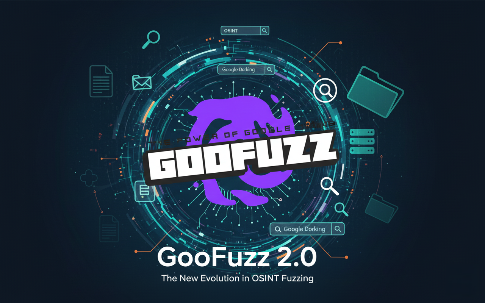
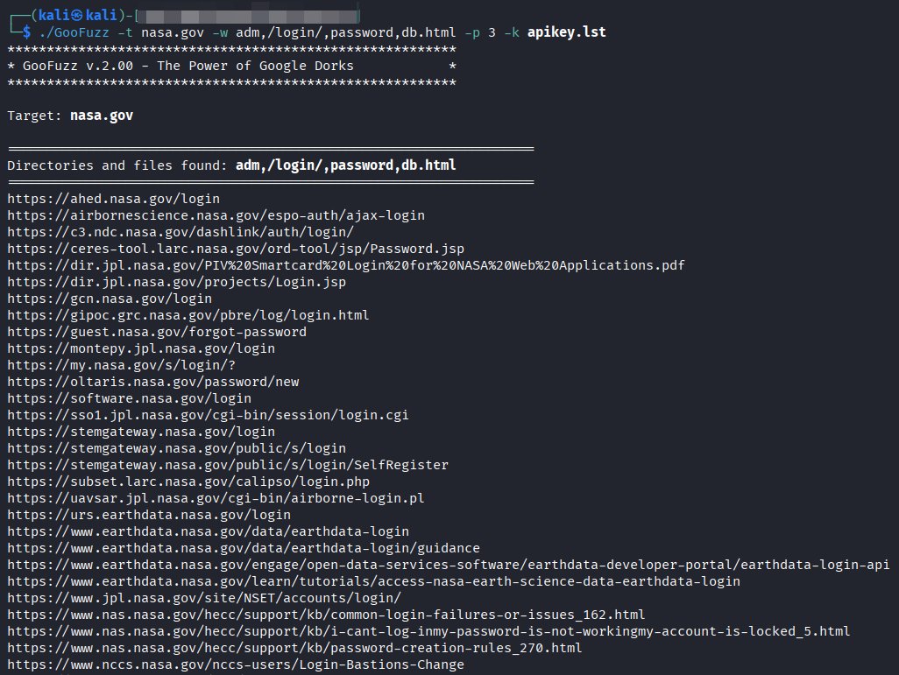

## Descripción de la herramienta
**GooFuzz** es una herramienta desarrollada en Bash Scripting diseñada para realizar "*fuzzing*" bajo un enfoque OSINT. Su arquitectura permite la enumeración precisa de directorios, archivos, subdominios, credenciales y parámetros de forma pasiva, evitando la detección en el servidor objetivo y optimizando la fase de recolección de información en auditorías de seguridad.


## ¿Requisitos previos que requiere GooFuzz?
Para asegurar el correcto funcionamiento de **GooFuzz**, es necesario contar con un entorno basado en Unix (Linux o macOS) y las siguientes dependencias instaladas:

- **Bash/Zsh**: El motor principal donde se ejecuta el script.
- **curl**: Utilizado para realizar las peticiones HTTP a los motores de búsqueda.
- **jq**: Necesario para procesar y filtrar las respuestas en formato JSON.
- **sed**: Herramienta estándar de procesamiento de texto en sistemas Unix.
- **API de Google y crear un buscador programable**: Se requiere para añadir a un fichero el `cxId` y `apikey` . Ambas son gratis y se explica en este artículo.

En caso de usuarios Windows, la alternativa actual es utilizar la versión **Docker**:

## El fin del "Web Scraping" tradicional y el salto a la API
Si habéis intentado hacer *dorking* o *scraping* a lo bestia últimamente, ya sabréis que Google se ha puesto pesadísimo. Con la última actualización, **ahora te obligan a que todo pase por navegadores que soporten JavaScript**. Esto, básicamente, se ha cargado un montón de herramientas que usábamos para automatizar (*incluído GooFuzz v1.x*).

He estado semanas probando de todo: **Selenium**, alternativas a **Selenium**, navegadores *headless* (embebidos)... y la verdad es que era un dolor de kinders. O iba lentísimo, o Google te pillaba la IP al tercer intento (incluso en el primero!), o te saltaba un Captcha que no había forma de saltarse. Incluso usando navegadores reales, la cosa no terminaba de ser estable y me llegaban quejas de que la herramienta fallaba más que una escopeta de feria.

**¿La solución? Me he dejado de líos y me he pasado a la API oficial.**
Sé que a veces da pereza usar APIs, pero escuchadme:

- **Es fiable al 100%**: Se acabaron los bloqueos raros y las IPs baneadas.

- **100 peticiones gratis al día**: Sinceramente, para un Pentest normal o una sesión de Red Team, con 100 búsquedas avanzadas tienes de sobra para encontrar lo que buscas.

- **Sistema de rotación**: Si eres de los que necesita más, en esta v2.0 he metido un sistema para que puedas meter varias API Keys. **GooFuzz** irá saltando de una a otra a medida que se gasten, así que puedes seguir dándole caña sin parar.

Al final, prefiero que la herramienta funcione rápido y bien a la primera, que estar peleándome con los cambios de humor de Google. Más abajo os cuento cómo configurar estas llaves, que se hace en dos minutos.

## ¿Qué hay de nuevo en esta versión?
En esta v2.0, **GooFuzz** da el salto de fe y se integra con la **API oficial de Google**. ¿Qué ganamos con esto? Básicamente, salud mental. Se acabaron los bloqueos por "tráfico inusual", las restricciones de IP y Captchas. Ahora las búsquedas avanzadas vuelan y son estables.

Pero claro, trabajar con la API oficial tiene sus reglas de juego y hay que saber optimizarlas:

**El arte de no fundirse los créditos**
Google nos regala **100 peticiones diarias**. Puede parecer poco si vas "a lo loco", pero he diseñado la herramienta para que sea lo más tacaña posible con tus créditos:

- **El contador de páginas**: Ten en cuenta que cada página de resultados cuenta como una consulta. Si usas el parámetro `-p 3` para profundizar en los resultados, estarás gastando **3 créditos**.

- **Consultas Híbridas (Ahorro inteligente)**: Para que no tires el presupuesto en tonterías, he programado un sistema de consultas híbridas (*consolidate mode*). Si buscas 5 extensiones (ej. pdf, doc, docx, txt, xls), **GooFuzz** las empaqueta en una sola petición usando operadores `OR`.

    - **Resultado**: Buscas 5 tipos de archivos de golpe gastando **solo 1 crédito**.

**Límites técnicos y ráfagas**
La API de Google tiene un tope de caracteres por envío, así que he fijado el límite en **5 extensiones o palabras clave** por ráfaga. Si te vienes arriba y pides más de 5, **GooFuzz** dividirá la tarea y lanzará peticiones extra de forma automática.

- **Ejemplo rápido**: Si lanzas un `-e pdf,doc,docx,txt,xls,zip` (6 extensiones) con `-p 3` (3 páginas), el consumo será de unas **7 solicitudes**. Una gestión eficiente para que no te quedes a cero en el primer café de la mañana.

**El secreto: Menos es más (No seas "bruteforce")**
Aquí es donde toca aplicar un poco de sentido común. He visto a mucha gente (compañeros y conocidos incluidos) usando la herramienta como si fuera un fuzzer de directorios tradicional (tipo Gobuster o ffuf), y ahí es donde se equivocan.

**GooFuzz no es para hacer fuerza bruta, es para filtrar inteligencia.**
La gran ventaja de GooFuzz sobre otras herramientas de OSINT es que somos infinitamente más eficientes con menos peticiones. Piénsalo:

- **Enfoque tradicional (Fuzzing)**: Para encontrar directorios como *adm*, *admin*, *administrator*, *administrador* o *administradores*, tendrías que lanzar **5 peticiones** contra el servidor de la víctima.

- **Enfoque GooFuzz**: Solo necesitas **una petición** y una sola palabra clave: `-w adm`.

Fijaos en el siguiente ejemplo. Al lanzar una consulta con varias palabras, directorios y ficheros, **GooFuzz** logra enumerar rutas que, de otra forma, serían un dolor de muelas encontrar.

Para que os hagáis una idea: localizar muchos de los resultados que vais a ver a continuación os costaría horas, días o incluso semanas de fuzzing constante con diccionarios kilométricos. Y eso suponiendo que el WAF no os banee la IP en el primer minuto.

Con **GooFuzz**, lo que antes era una cacería a ciegas, ahora es una consulta de segundos:


¿Por qué? Porque Google ya ha hecho el trabajo sucio por nosotros. Él ya ha indexado toda esa información; nosotros solo tenemos que "pedírsela" con elegancia. Al ser una técnica **pasiva**, no tocas el servidor del cliente en ningún momento, vas más rápido y eres indetectable.

En definitiva: no alimentes el diccionario con 200 variaciones de la misma palabra. Dale la "raíz" a **GooFuzz** y deja que Google te haga el trabajo. **Eficiencia pura, señores y señoras**.

## Cómo conseguir tus llaves (API Key y CX ID) sin morir en el intento
#### 1. Conseguir tu API Key
La **API Key** es tu "DNI" para que Google sepa quién lanza las peticiones (**NO LA COMPARTAS!!!**).
1. Ve a [Google Cloud Console](https://console.cloud.google.com/).
2. Crea un proyecto nuevo (ponle un nombre, como `GooFuzz-Project`).
3. En el buscador de arriba, escribe "**Custom Search API**" y dale al botón de **Habilitar**.
4. Una vez habilitada, ve a la pestaña de "**Credenciales**" en el menú de la izquierda.
5. Haz clic en "**Crear credenciales**" -> "**Clave de API**".
6. ¡Guárdala bien! Esa es tu `apikey`.

#### 2. Conseguir tu CX ID (Buscador Programable)
El **CX** es el ID que identifica a tu motor de búsqueda personalizado.

1. Entra en el panel de [Programmable Search Engine](https://programmablesearchengine.google.com/).
2. Dale a "**Añadir**" para crear un nuevo buscador.
3. En el apartado de "**Qué buscar**", selecciona "**Buscar en toda la Web**" (esto es vital para que **GooFuzz** no se limite a una sola web).
4. Ponle un nombre (ej. `GooFuzz-Search`) y dale a **Crear**.
5. Ahora entra en la configuración de ese buscador que acabas de crear y busca donde pone "**ID del buscador**".
6. Ese código alfanumérico es tu `cxId`.

#### ¿Dónde meto estos datos en GooFuzz?
Ahora que ya tienes tus credenciales, no hace falta que las vayas cambiando a mano cada vez que se agoten. He diseñado **GooFuzz** para que sea inteligente: solo tienes que crear un fichero de texto (por ejemplo, `apikey.lst`) y meter allí todos los `cxId` y `apiKeys` que hayas generado.

El formato es de una pareja por línea, separadas por una coma. Cuantas más metas, más "gasolina" tendrá la herramienta para seguir trabajando sin parar:
```bash
> cat apikey.lst    
<cxId>,<apiKey>
<cxId_2>,<apiKey_2>
<cxId_3>,<apiKey_3>
```
**¿Cómo funciona la magia?** **GooFuzz** leerá este fichero y empezará a usar la primera pareja. En cuanto Google le diga que has llegado al límite de las 100 peticiones, la herramienta **saltará automáticamente a la siguiente línea**.

Es el sistema de rotación perfecto para sesiones de Red Team intensas donde 100 búsquedas se te quedan cortas. Solo tienes que lanzarlo indicando el fichero y olvidarte de los bloqueos.

## ¿Listos para darle caña?
Toda la información detallada sobre la instalación, los parámetros avanzados y el uso de la herramienta la tenéis disponible en el repositorio oficial. No tiene pérdida:

**GitHub oficial**: [**https://github.com/m3n0sd0n4ld/GooFuzz**](https://github.com/m3n0sd0n4ld/GooFuzz).

Si os sirve en vuestras auditorías o sesiones de Red Team, no olvidéis darle una estrella al repo para apoyar el proyecto. ¡Cualquier feedback es más que bienvenido!

¡Hasta la próxima! ¡Que la “suerte” os acompañe!