# AdmirerToo HackTheBox Writeup
### Level: `Hard` | OS: `Linux`

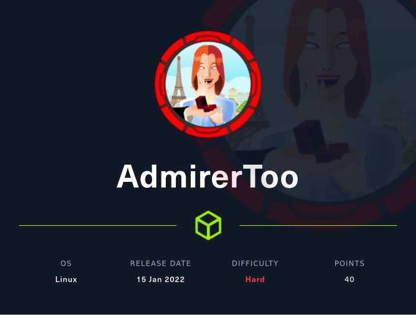

## Scanning
We run nmap on all ports with scripts and software versions.

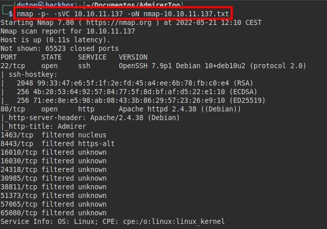

## Enumeration
We access the website, review source code and versions, but it looks like a simple corporate website.

We found an open directory listing with image files of the site, nothing we can use:

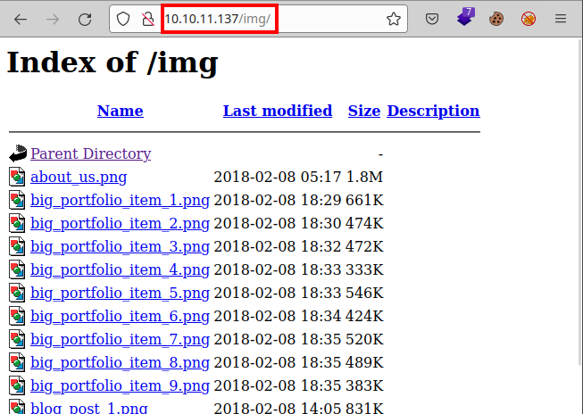

If we access a non-existent resource, we find that a domain name appears in "*mailto*".

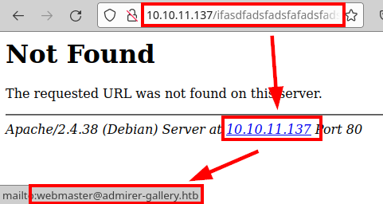

We insert the domain in our "*/etc/hosts*" file, but we continue to see the same web site.

We tried to enumerate subdomains with the **wfuzz** tool, we managed to enumerate the subdomain "*db.admirer-gallery.htb*".

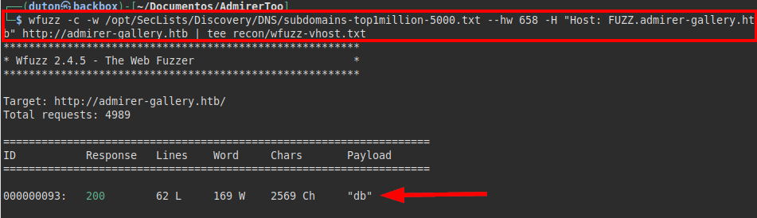

We access the resource and find the **Adminer 4.7.8** database manager.

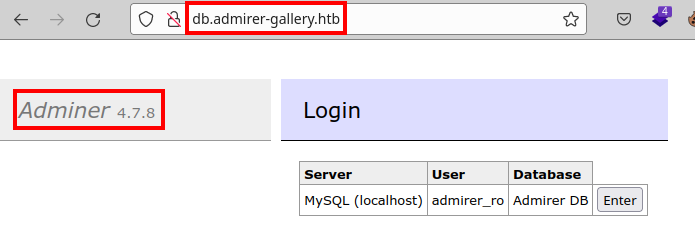

Searching for information about known vulnerabilities and public exploits, we found an article from [Tenable](https://www.tenable.com/plugins/was/112910) mentioning that this version is vulnerable to SSRF (Server-Side Request Forgery).

We access the database manager, we list a table called "*gallery*" and we also have a *SQL command console* that might help us:

## Exploitation
Reviewing exploits, we found that we require authentication, the curious thing is that we have accessed only by clicking on the "*enter*" button, if we review the code we will find the credentials in hidden fields.

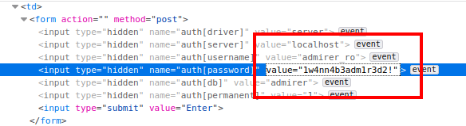

It was this resource that helped me to exploit the **SSRF**: [Vulnerability/Adminer SSRF（CVE-2021-21311)](https://github.com/EdgeSecurityTeam/Vulnerability/blob/main/Adminer%20SSRF%EF%BC%88CVE-2021-21311%EF%BC%89.md)

We create the redirection script, intercept the authentication request, change the IP and put the one of our VPN:

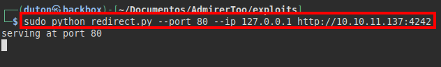

We intercept the request, change the server IP, the driver type and send the request.

The following image shows an unsuccessful attempt to upload a remote file.

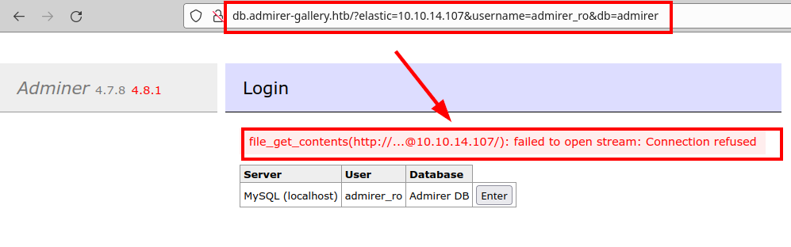

Let's do another test, this time we will set the local IP to port 80 (default) and see what happens.

We run it and see that we are able to print the HTML code of the adminer site:

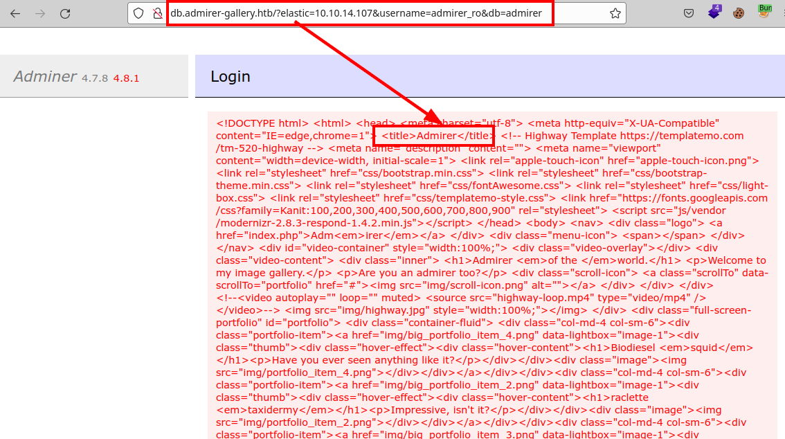

If we remember, there were ports that were *filtered*, I tried one by one until this one caught my attention.

We list an internally deployed **OpenTSDB**.

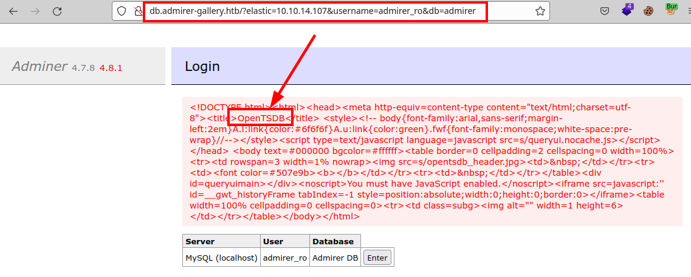

#### Exploit: [OpenTSDB Arbitrary Code Execution](https://security.snyk.io/vuln/SNYK-JAVA-NETOPENTSDB-1041751l)

We make a proof of concept to send us 4 packets by icmp, we see that we are able to execute commands.

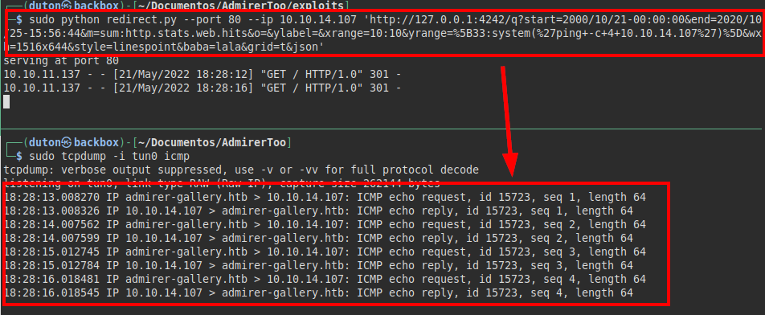

We set up a reverse shell and concatenate both vulnerabilities to gain access to the machine.

We try to read the file "*user.txt*", but we do not have permissions.

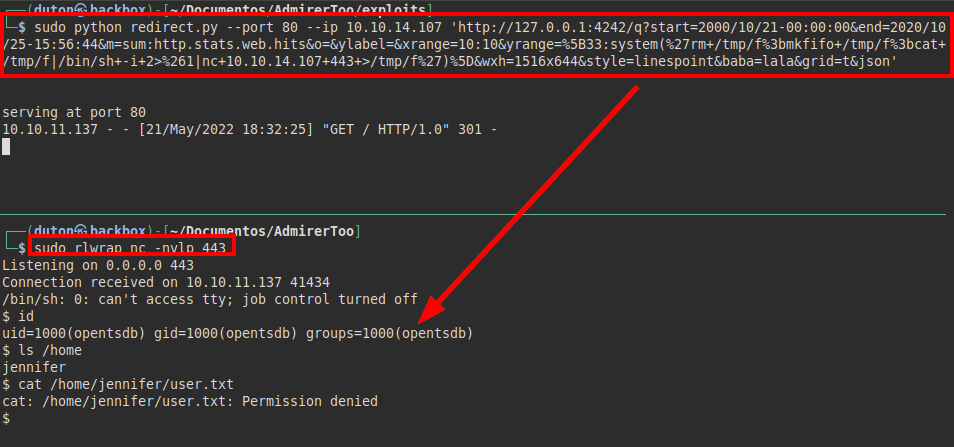

We continue reviewing files, we find commented credentials in the file "*servers.php*".

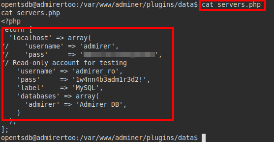

We tested the credentials obtained on the user "*Jennifer*", managed to access by **SSH** and read the file "*user.txt*":

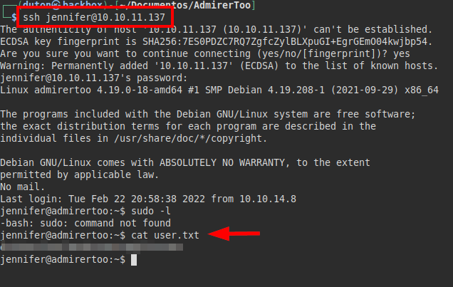

## Privilege Escalation
We launch **linpeas.sh** and list a configuration file of the **OpenCATS** application:

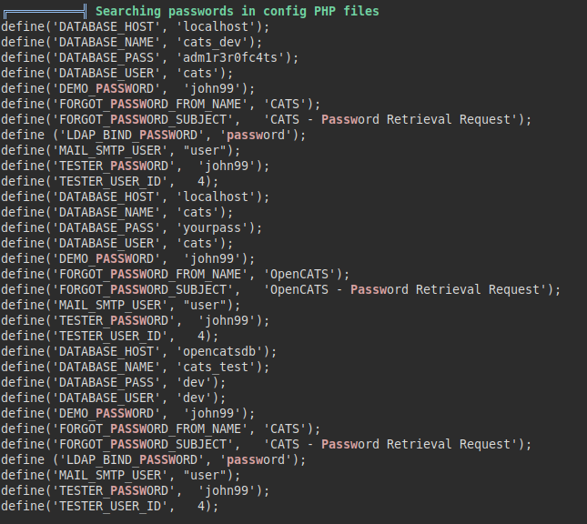

We also list **fail2ban** deployed on the server.

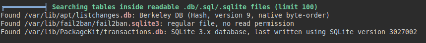

This binary adds us to a block list when multiple failed **SSH** connections are made (exploited on other machines to escalate privileges).

#### Version Fail2ban v0.10.2:

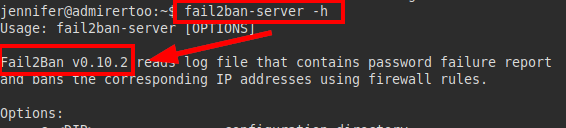

We check the file, but we do not have write permissions, so we cannot abuse it:

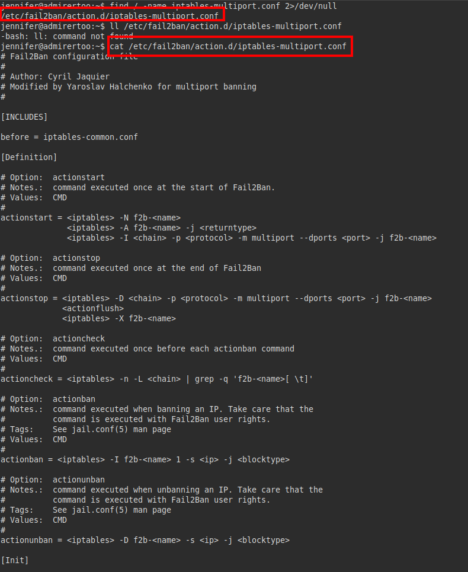

We don't have permissions to write to other files either, but we see something interesting, the configuration to where it sends the mails.

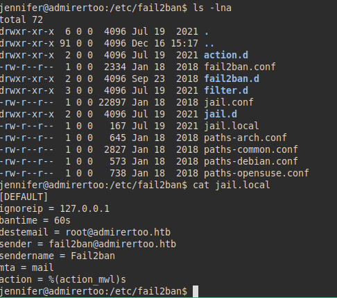

Continuing to review and list other services, we found a service running on port *8080*:

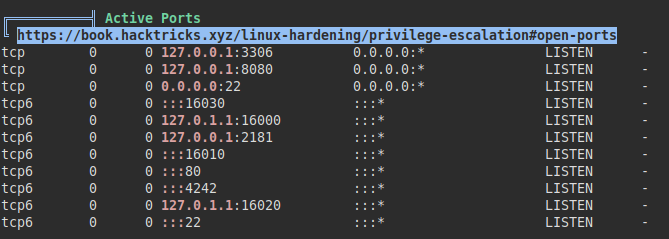

We run curl on the port and find the **OpenCATS** authentication file (sounds familiar, right?):

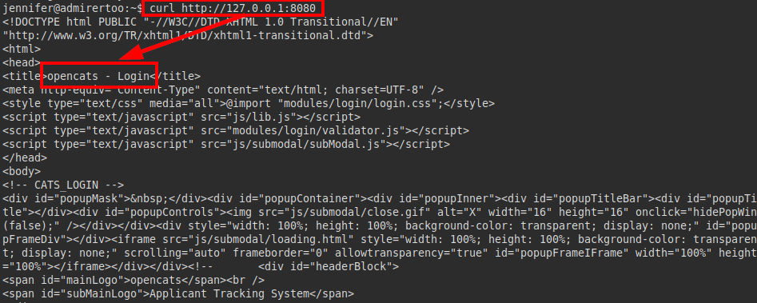

So, we do port forwarding via **SSH** and we manage to run the service from our attacker's computer.

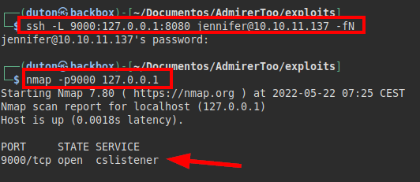

We already reach the resource from our port *9000*. In addition, we identify the **OpenCATS 0.9.5.2** version:

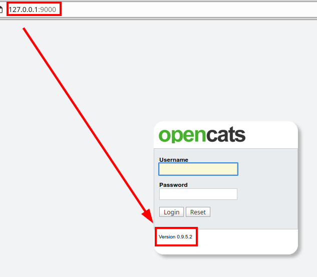

But we don't know the access credentials, remember that we did have db credentials, we will have to get the hashes from the DB.

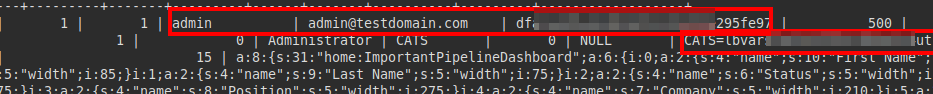

We couldn't crack the admin user hash, we can't reuse the cookie either, so we tried the credentials of "*jennifer*" and managed to log in to the panel:

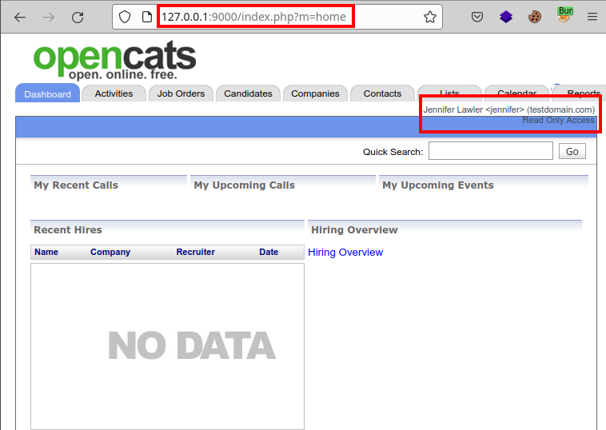

Although we are inside, we see that we only have read.... permissions. But if we are inside the database? Why not change the password hash for another one we know? :D

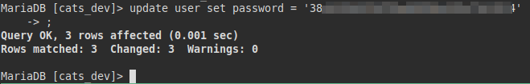

Yeah!

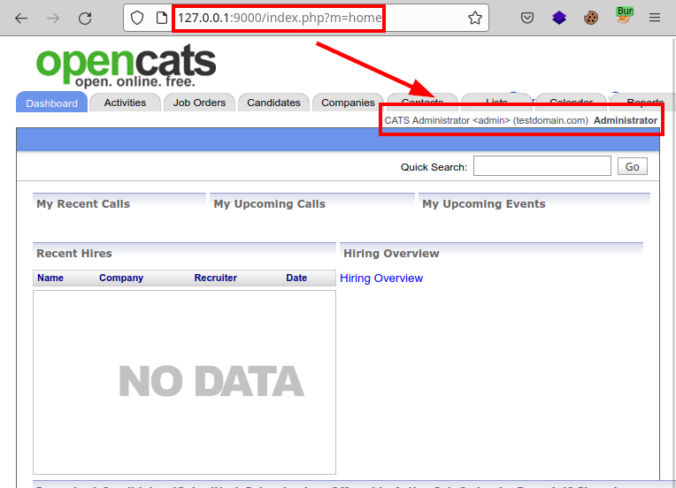

#### Interesting Article: [OpenCATS PHP Object Injection to Arbitrary File Write](https://snoopysecurity.github.io/web-application-security/2021/01/16/09_opencats_php_object_injection.html)

Logically, we are not interested in gaining access to the machine, since we have access via **SSH**, what we are interested in is to manage to overwrite the **fail2ban** configuration file, to concatenate vulnerabilities and achieve privilege escalation. 

To generate payloads in the serialization I used the [**phpggc**](https://github.com/ambionics/phpggc) tool.

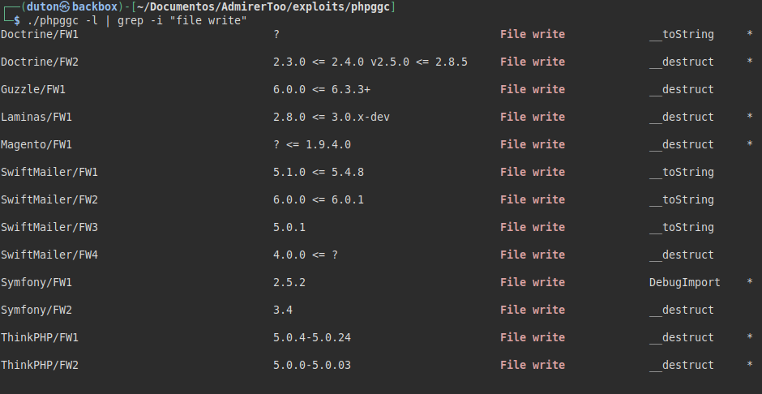

#### PoC

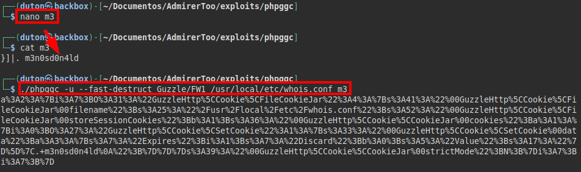

We insert it in **Burp** and execute the request:

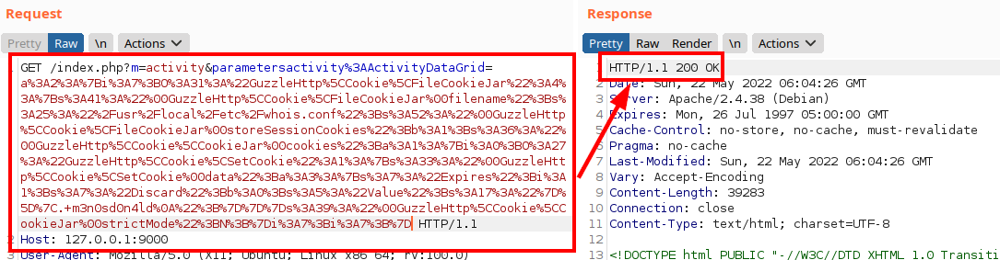

Now we see that the "*whois.conf*" file did not exist, but now it does and it contains our value, so we would be able to write files (and overwrite):

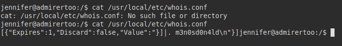

The idea would be the following, if we create a payload in the whois configuration, this would be executed after the banning of our IP by **fail2ban**, since it would send an email and would have to make a **DNS** call... It's a bit far-fetched, but it could work. 

I know, you will be thinking why not modify directly a file of the *root user* or **fail2ban**, the problem is that we drag permissions of the service that runs **OpenCATS** and this does not have write permissions for those files.

#### PoC with ping:
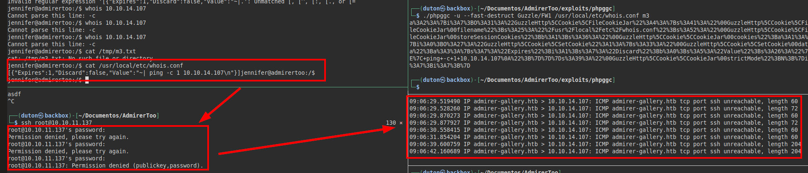

We review the contents of the file and run the "**whois**" binary on our IP address

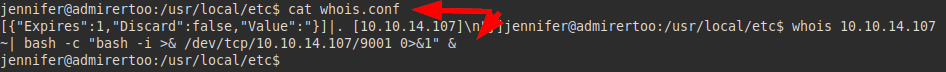

We listen with **ncat** and we see that we receive the connection from the machine:

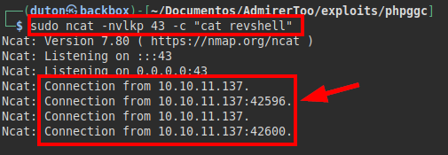

We listen on port *9001* and receive a connection with the *root user* and read the file "*root.txt*".

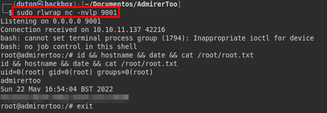

---
## About

David Utón is Penetration Tester and security auditor for web and mobiles applications, perimeter networks, internal and industrial corporate infrastructures, and wireless networks.

#### Contacted on:

 [David-Uton](https://www.linkedin.com/in/david-uton/)
 [@David_Uton](https://twitter.com/David_Uton)