# Late HackTheBox Writeup
### Level: `Easy` | OS: `Linux`

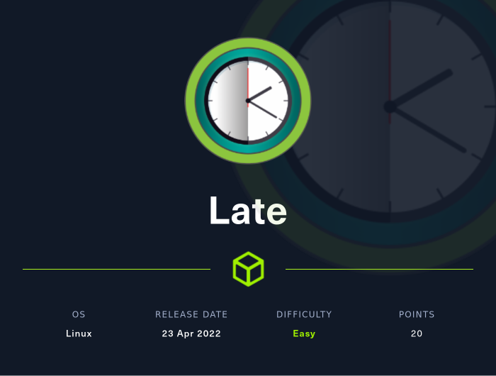

## Scanning
We run nmap on all ports with scripts and software versions.

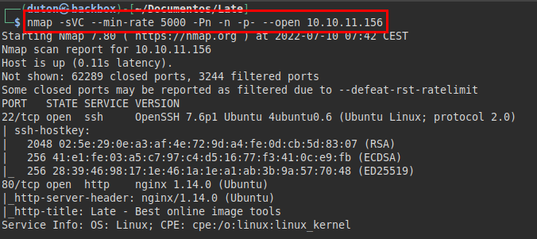

## Enumeration
We access the web site and find the domain (we put it in our */etc/hosts* file).

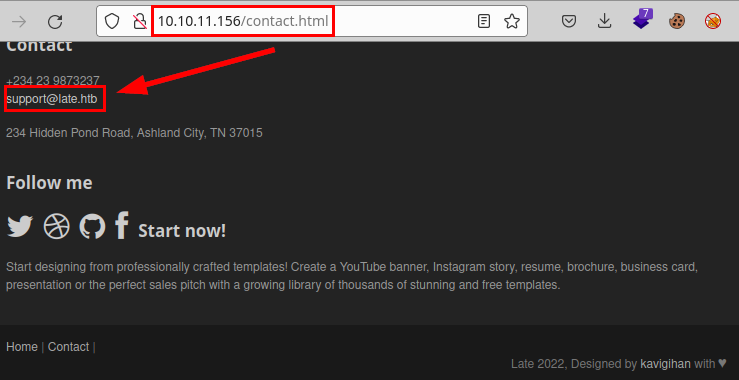

It also tells us about a photo editing application, but we can't find any link to it, so it's probably on another subdomain.

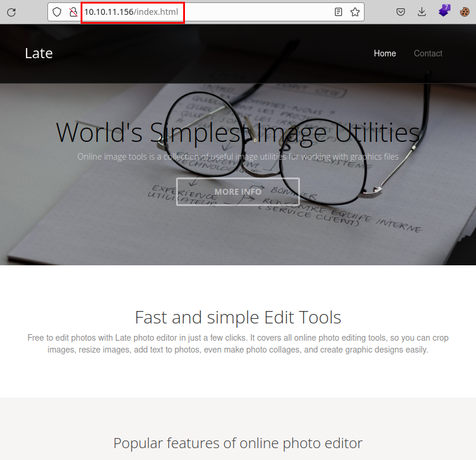

We launch **wfuzz** to enumerate subdomains and find the "*images.late.htb*" (we insert it in our */etc/hosts* file).

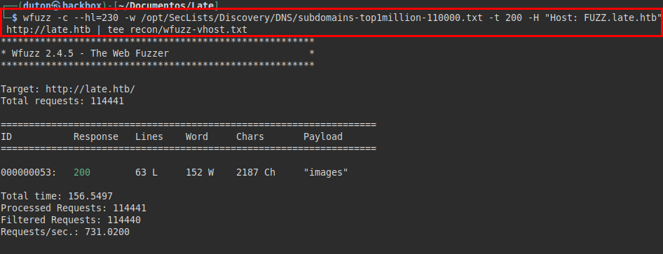

We access the site, we find the application that seems to be able to convert the image to text.

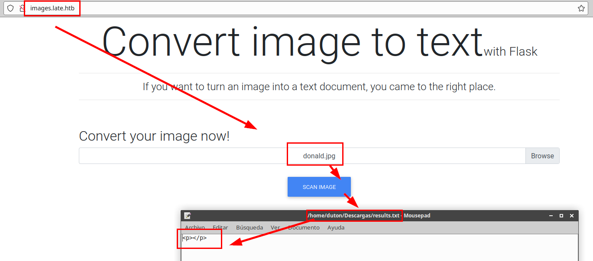

It seems that the app does not control the errors well, trying a python import os we see that it gives error and returns the absolute path with the user name.

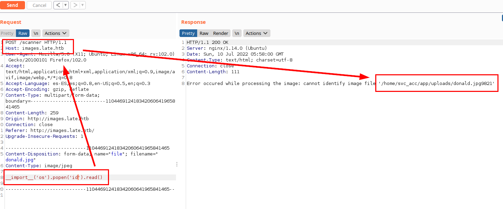

## Exploitation
We try to insert possible commands to identify a possible *SSTI*, we put those payloads in a photo with **gimp**:

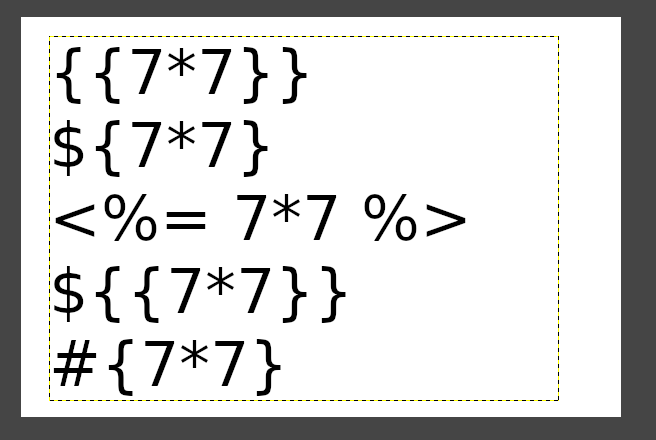

We see that there are at least two possible payloads (**jinja2**) that we can use to exploit the *SSTI*.

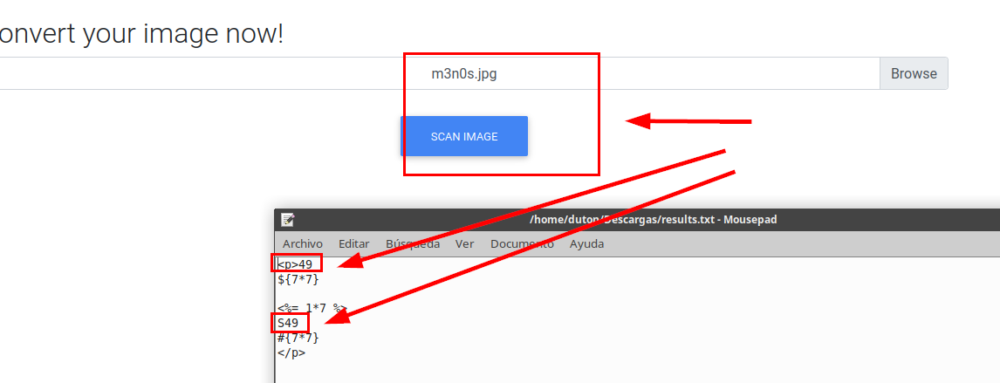

I think this was the most complicated part of the machine, it took me several hours to explode the whole line, I had to "*play*" with the font and size.

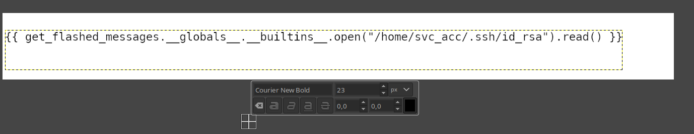

And finally I got the user's **SSH** private key.

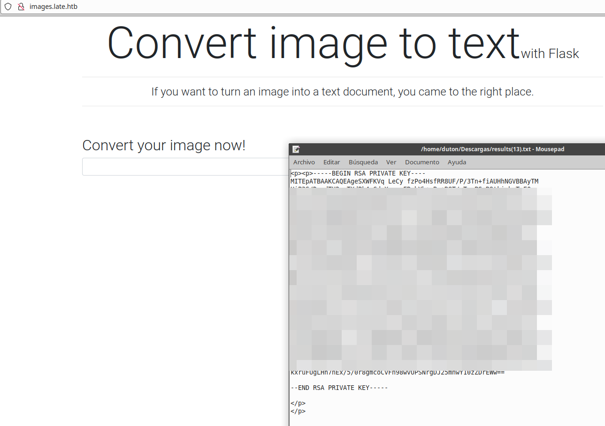

We connect via **SSH** and read the user flag:

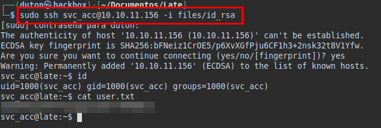

## Privilege Escalation
Transfer and run **pspy64** to check if the script is being executed by root.

We see that it is, so we check the permissions and verify that we have permissions to modify the file "*ssh-alert.sh*" and insert a line to get a reverse shell when executed by the scheduled process.

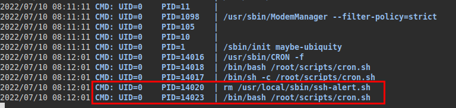

We put a **netcat** listening, we make a **SSH** connection, we see that the script is executed and we manage to obtain root access.

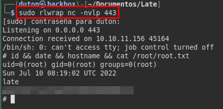

---
## About

David Utón is Penetration Tester and security auditor for web and mobiles applications, perimeter networks, internal and industrial corporate infrastructures, and wireless networks.

#### Contacted on:

 [David-Uton](https://www.linkedin.com/in/david-uton/)
 [@David_Uton](https://twitter.com/David_Uton)