# Pandora HackTheBox Writeup
### Level: `Easy` | OS: `Linux`

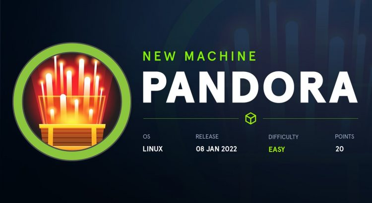

## Scanning
We run nmap on all ports with scripts and software versions.

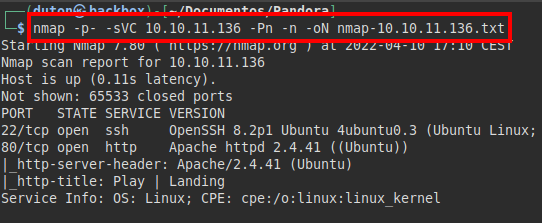

## Enumeration
We access the web service, enumerate a domain name and put it in our "*/etc/hosts*" file.

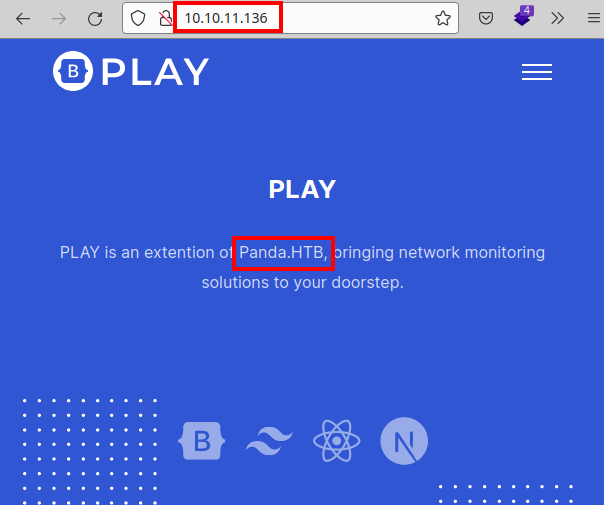

We found nothing enumerating, neither by fuzzing, nor by vhost, we checked by UDP ports and found the **snmp** open:

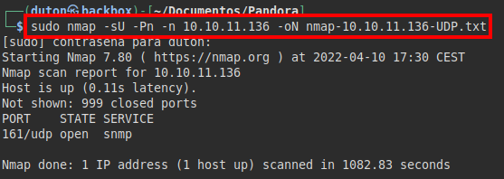

We use the **snmpwalk** tool with public channel and see that information is being exfiltrated.

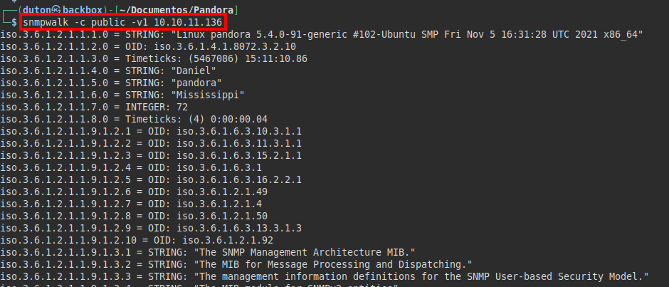

We saved all the information in a file and found quite relevant information:

#### Kernel linux used:

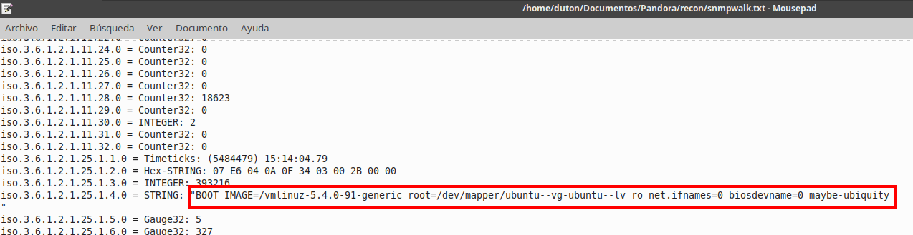

We found an internal process running with plaintext credentials.

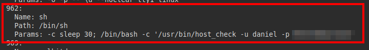

## Exploitation
We successfully used the credentials via the **SSH** service, but we do not have sufficient permissions to read the "*user.txt*" file.

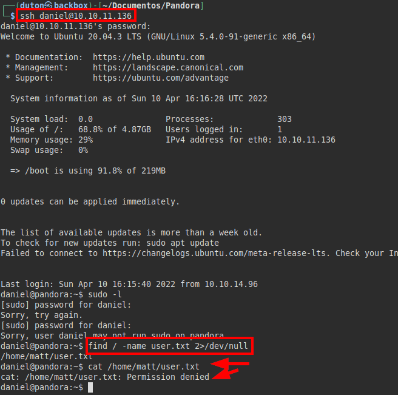

We launch the "**linpeas.sh**" tool, check that the last modified files correspond to "*Pandora*" (wow, just like the name of the machine ;))

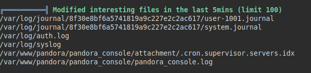

Reviewing the information extracted from the "**snmp**" service, we find a process called "*pandora_backup*", we look for the binary and we see that it would be possible to execute it with the "*root*" or "*matt*" user:

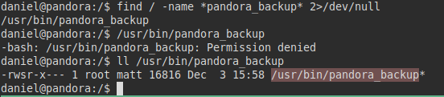

We list the **Pandora FMS 5.1** version:

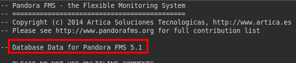

From outside it was not possible to see that resource, so I checked the "*/etc/hosts*" file of the machine and discovered that there is "*localhost.localdomain*" and "*pandora.pandora.htb*".

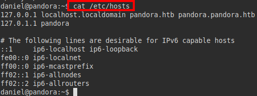

Let's remember that we can enumerate the exact version of **Pandora FMS**, but we can only reach the resource locally, so we will have to perform port forwarding and redirect the traffic to our machine through **proxychains**:

 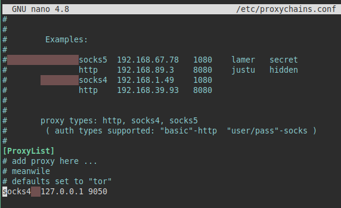

We make the port forwarding by **SSH** and we see that we already have access to the resource from our machine.

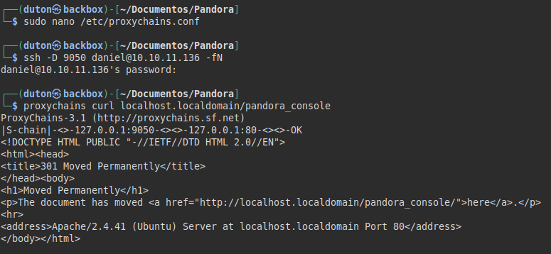

For the version, there is an exploit that affects this version of **Pandora** and would allow us to execute remote code, the bad news is that it requires credentials and we don't have them. 

We searched for other exploits and found an [article](https://blog.sonarsource.com/pandora-fms-742-critical-code-vulnerabilities-explained/) that talks about SQL Injection and we could use it to steal the session cookie and do cookiejacking.

In addition, it is clear that we will only be able to operate via API:

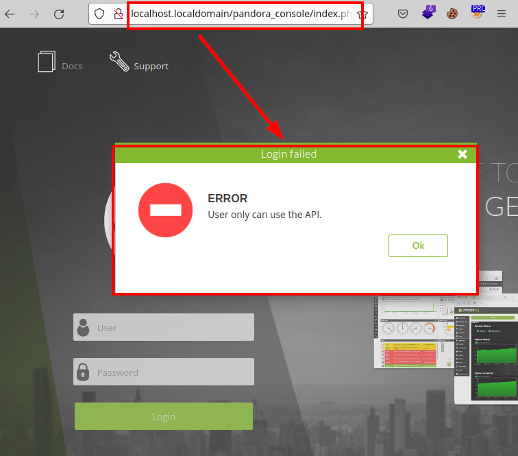

We inject in the "*session_id*" parameter with the "**SQLMap**" tool and manage to enumerate the database.

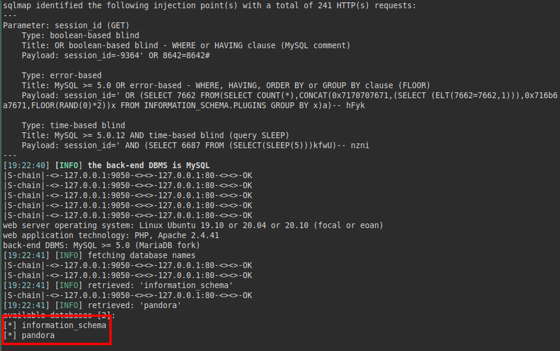

We extract the interesting tables and columns, we have the hashed password of the user "**matt**", but we can't crack it.

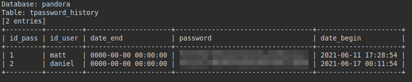

So, we extract the session cookie stored in the database and from the user "*matt*", add it in the URL and insert it in our browser cookies. We managed to access with the user's session.

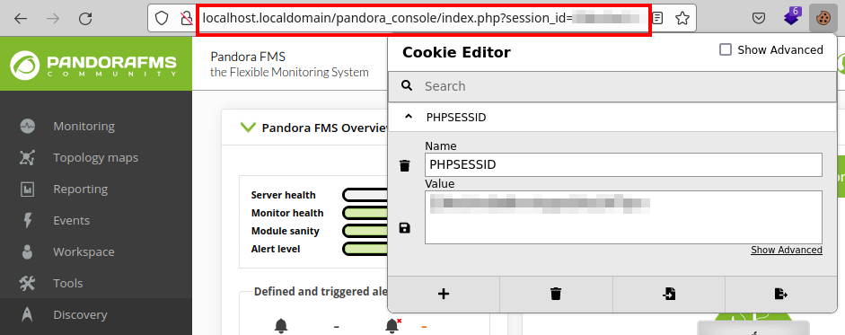

Checking the CMS, we found a file manager, we tried to upload a PHP file with a reverse shell.

##### Execute m3.php file:

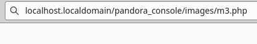

We managed to gain access to the machine with the user "*matt*", we read the file "*user.txt*".

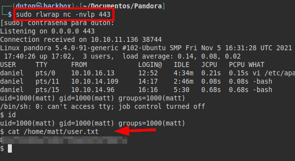

## Privilege Escalation
We check the "*pandora_backup*" binary, we see that it is calling the "**tar**" binary without the absolute path, so we could try to do path hijacking and execute an illegitimate binary with root privileges.

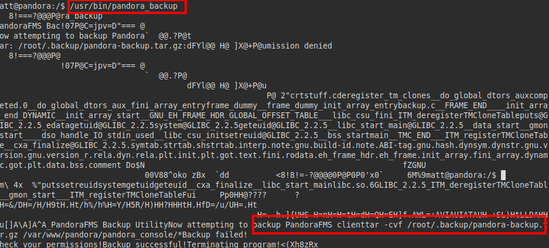

We create a file called "**tar**" that will contain a "**bash**", give it execution permissions and change our PATH. We run the binary, log in as the user "*root*" and read the file "*root.txt*".

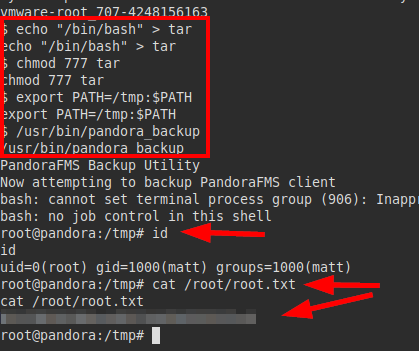

---
## About

David Utón is Penetration Tester and security auditor for web and mobiles applications, perimeter networks, internal and industrial corporate infrastructures, and wireless networks.

#### Contacted on:

 [David-Uton](https://www.linkedin.com/in/david-uton/)
 [@David_Uton](https://twitter.com/David_Uton)