# RouterSpace HackTheBox Writeup
### Level: `Easy` | OS: `Linux`


## Scanning
We run nmap on 22 and 80 ports with scripts and software versions.

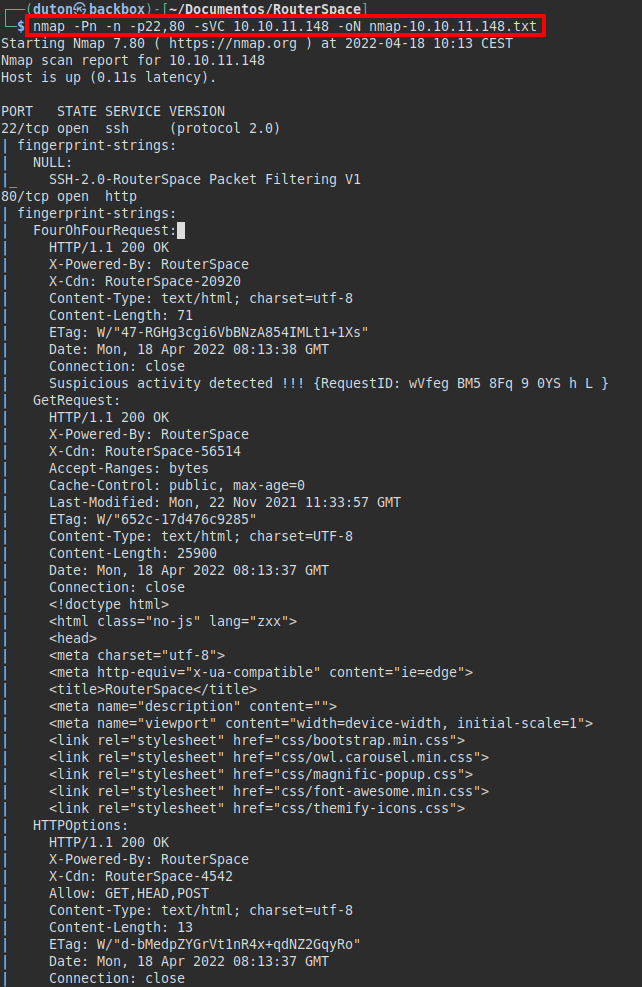

## Enumeration
We access port 80, we see the website of a router.

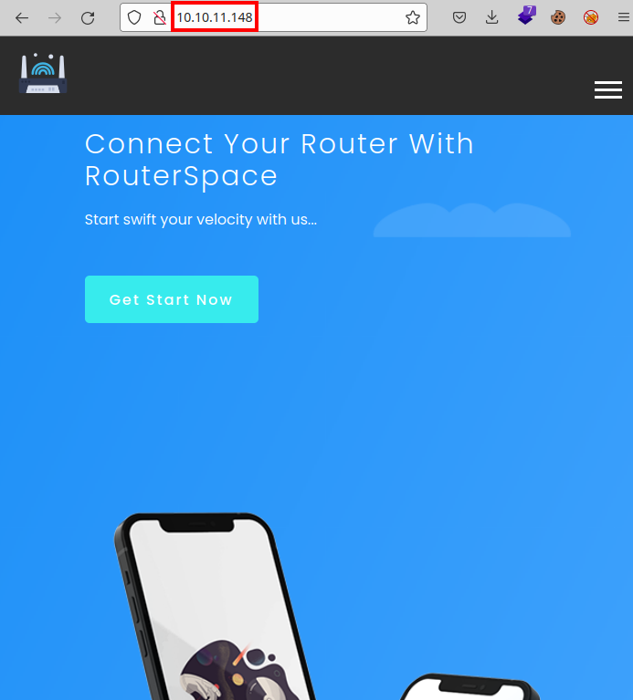

We can see a button where we download a file "*RouterSpace.apk*".

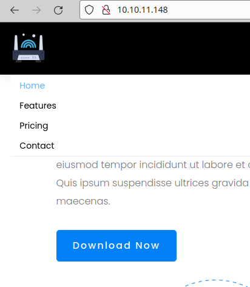

Download and extract the contents of the apk. I looked in case it stored some credentials that I could use for the **SSH** service, but it did not.

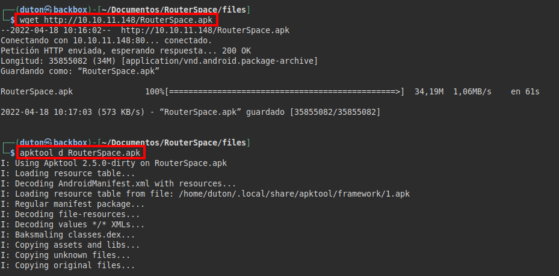

We check the apk with **MobaSF**, we find the domain "*routerspace.htb*":

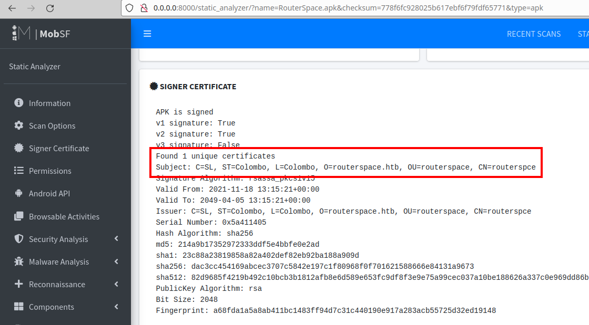

We access the web service through the domain, but it goes to the same site.

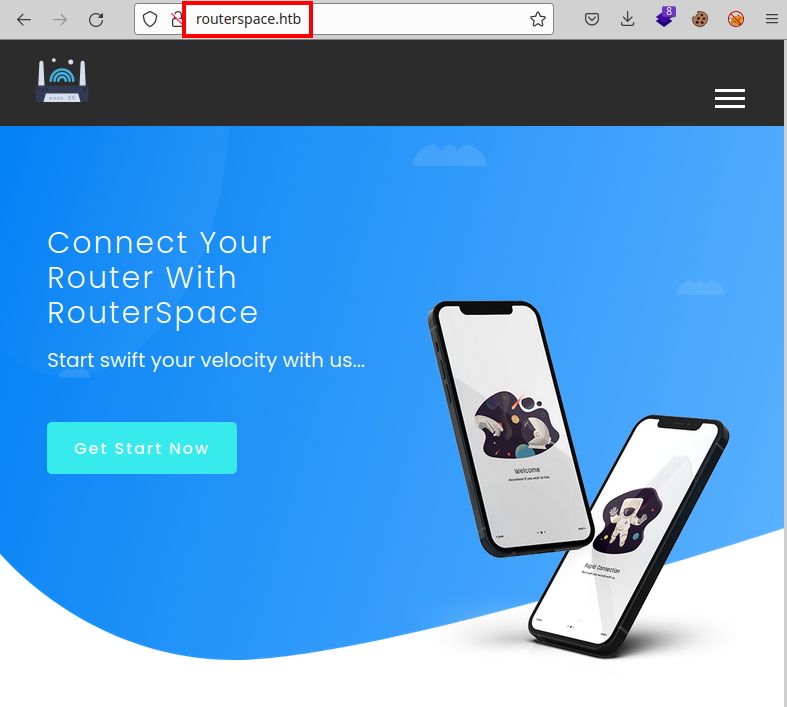


## Exploitation
We proceed to virtualize the apk (I used **Anbox**) and I configured my *Burp on port 9000*. (Yes, the picture is wrong, sorry)

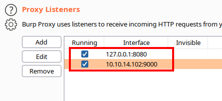

```bash
adb shell settings put global http_proxy 192.168.174.130:9000
adb install RouterSpace.apk
```

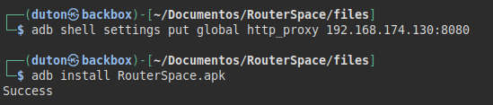

We check that it has been installed correctly, double click and run them.


#### View RouterSpace application
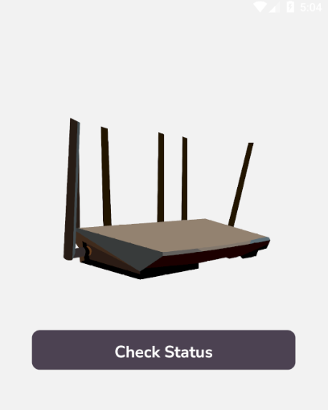

We intercept the request by pressing the button on the mobile application, we see that it appears to be executing an action such as a *ping* on the remote device activity check.

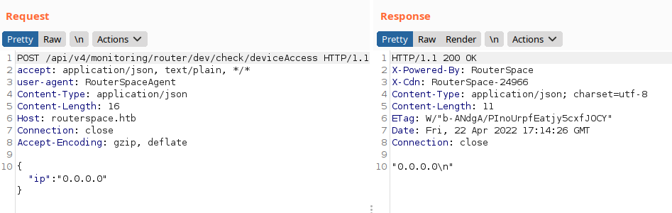

It was easy, as it is a typical vulnerability in IoT/IIoT devices, we evidenced that it is possible to inject commands.

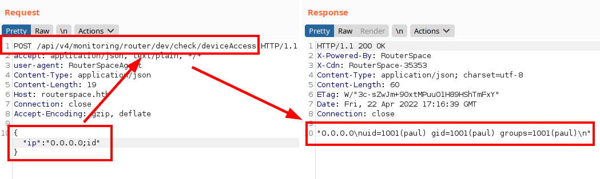

We abuse vulnerability for read "*user.txt*" file:

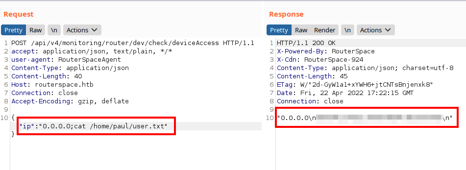

I saw that it did not reach the *id_rsa*, but it does have the *authorized_keys* file

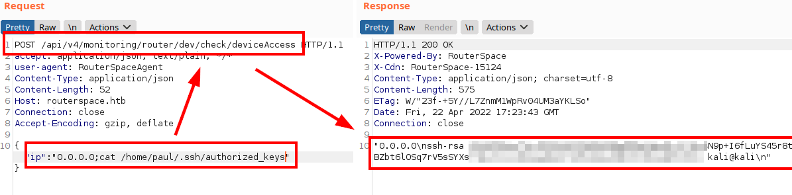

So I will insert my public key in the file and I should get access to the machine via **SSH**.

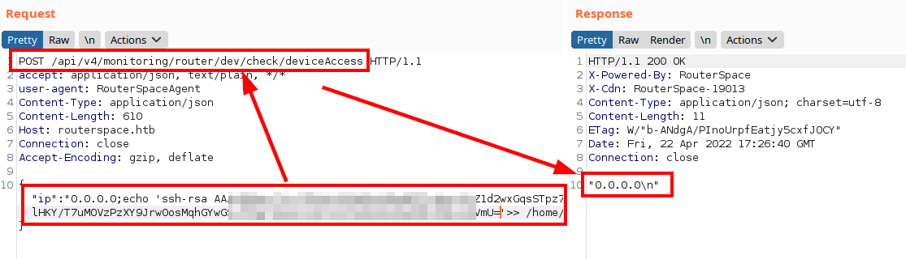

We connect to **SSH** service:

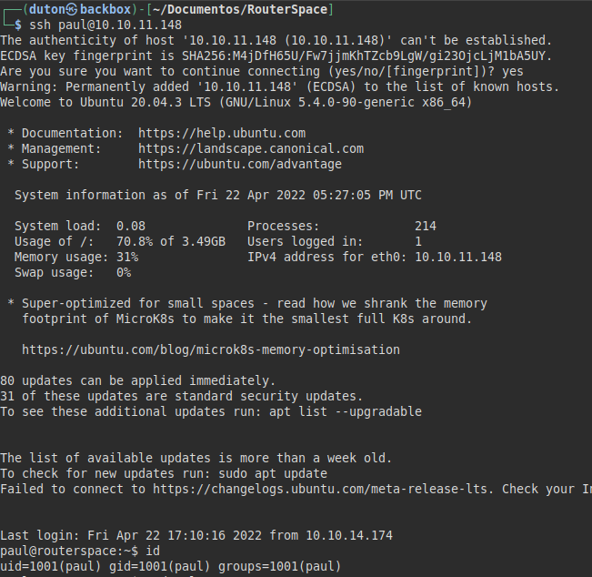


## Privilege Escalation
We can use **linpeas** tool and we enumerate the **SUDO** version *1.8.31*:

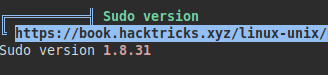

I downloaded the checker and PoC from Bl4sty and my friend Lockedbyte.
#### Exploit: [CVE-2021-3156](https://github.com/m3n0sd0n4ld/CVE-Exploits/tree/main/CVE-2021-3156)

We upload the files, compile and run the checker... It is vulnerable! We run the exploit with option "*1*", become root and read the flag.

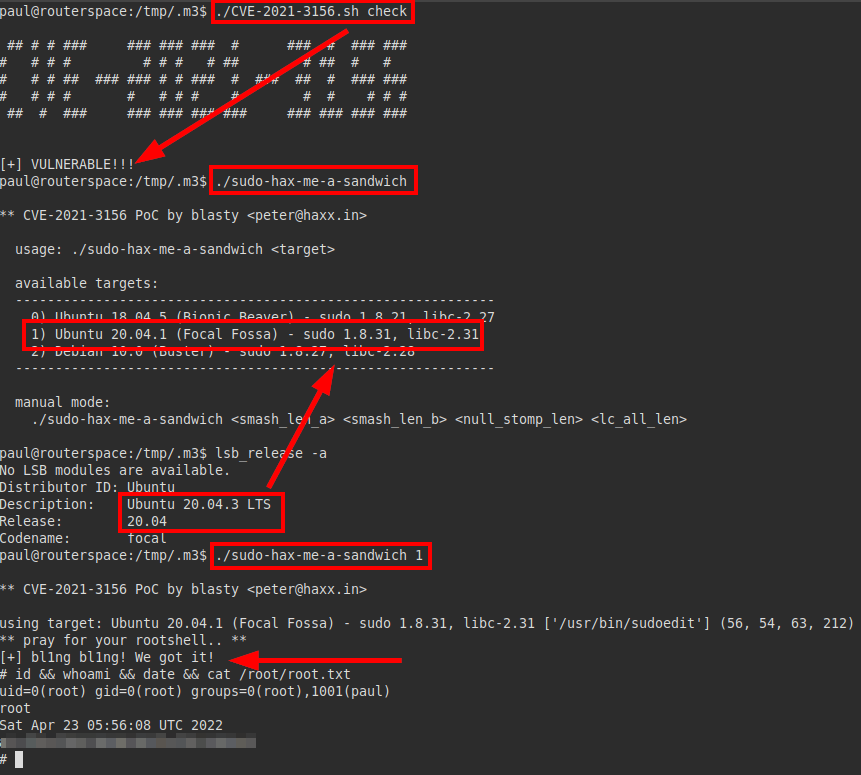

---
## About

David Utón is Penetration Tester and security auditor for web and mobiles applications, perimeter networks, internal and industrial corporate infrastructures, and wireless networks.

#### Contacted on:

 [David-Uton](https://www.linkedin.com/in/david-uton/)
 [@David_Uton](https://twitter.com/David_Uton)