# Shibboleth HackTheBox Writeup
### Level: `Medium` | OS: `Linux`

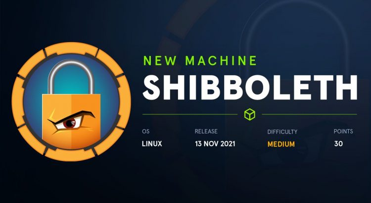

## Scanning
We run nmap on all ports with scripts and software versions.

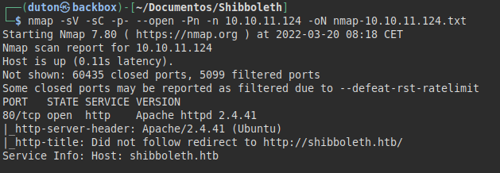

## Enumeration
We put the domain in our "*/etc/hosts*" file and access the web site.


There seems to be nothing interesting on the site, I do fuzzing and virtual hosting to get more valid subdomains.
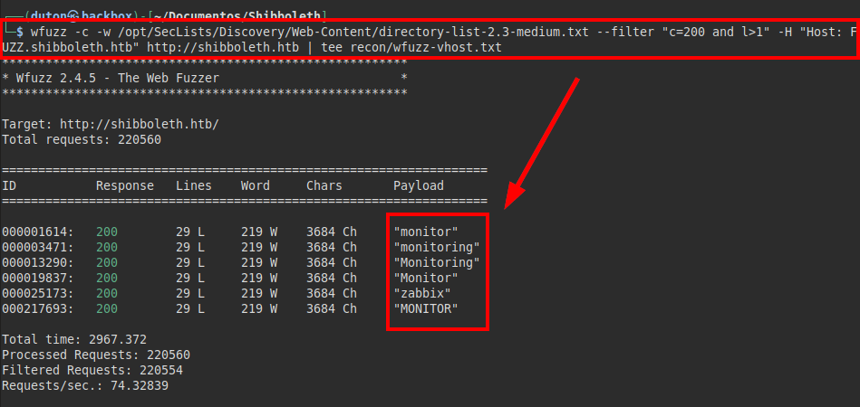

All subdomains found point to the Zabbix dashboard.
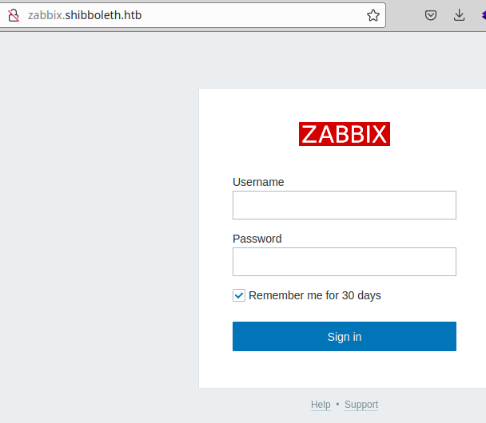

After a long time without finding anything, I try again to launch **nmap**, this time only to *UDP ports*.

*Port 623* appears, used in **IPMI** services.
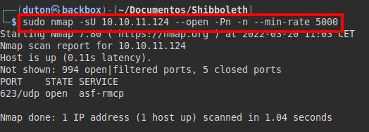

We tried using the metasploit scanner and managed to enumerate the version used in the IPMI service.
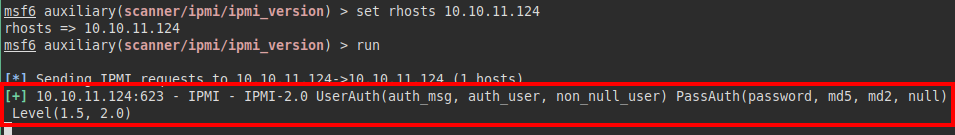


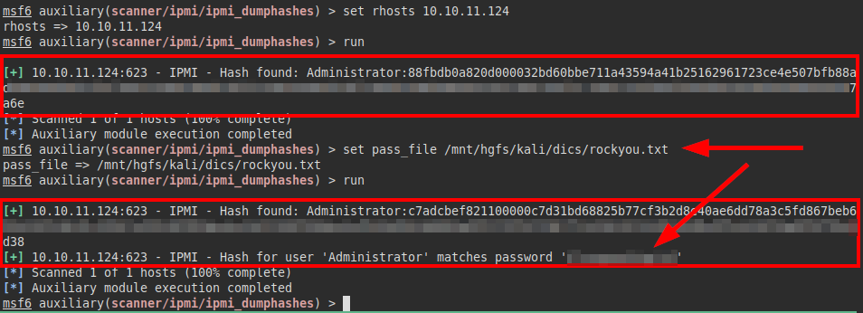

With the valid credentials, we access the site panel and the **Zabbix 5.0.17** version.
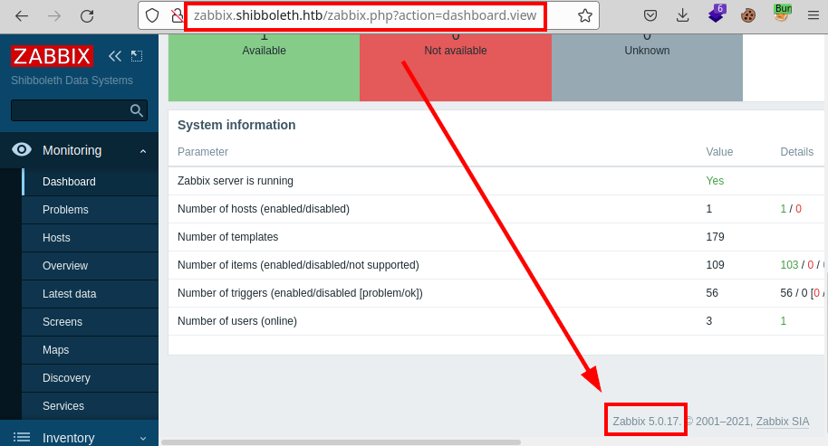

## Exploitation
We searched for exploits in **searchsploit** and found a Remote Code Execution (RCE) in our version. (It can't be a coincidence :P)
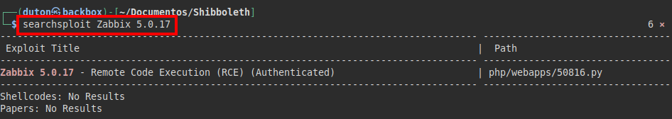

#### Exploit: [Zabbix 5.0.17 - Remote Code Execution (RCE) (Authenticated) - PHP webapps Exploit (exploit-db.com)](https://www.exploit-db.com/exploits/50816)

We set a **netcat** to listen and run the exploit to gain access to the machine:
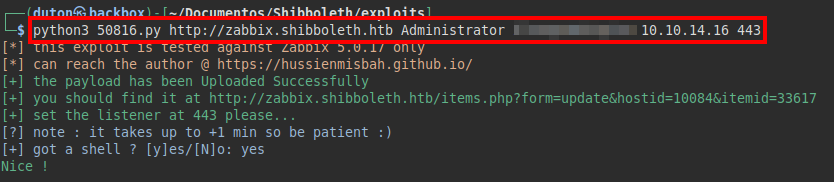

#### Result
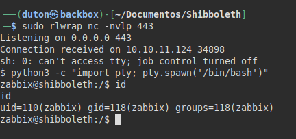

We access the user folder "*ipmi-svc*", but we do not have access to read the file "*user.txt*".

We also found the file *.backup.sh* and *.ipmi-svc.log*, it turned out to be the tool "**linpeas.sh**" and the log with the result, from here thank the person who left me the dirty work done! ;)
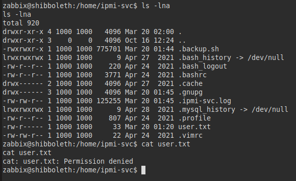

We review what **linpeas** has put out, we see that we have the database credentials.
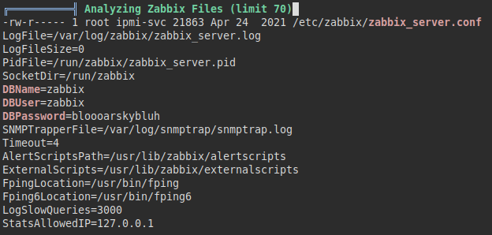

We access the **MariaDB** database, find the hashes of the three users. Here I realized that I had the **Zabbix** password of the "*administrator*" user (*Administrator aka IPMI Service*, does it ring a bell?).
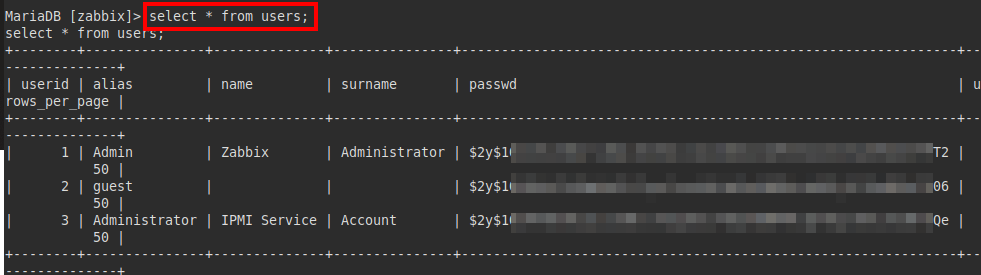

We try to authenticate with the password and yes! We gain access with the user and we can read the flag of *user.txt*.

PS: I tried to crack the other two hashes, but without success.
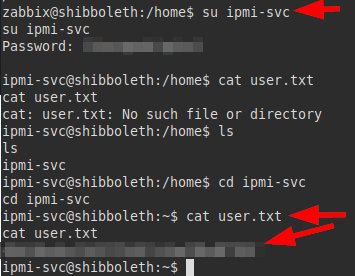

## Privilege Escalation
After a while of looking around, I was listing software versions that I could use, until I found that I had the solution right under my nose.
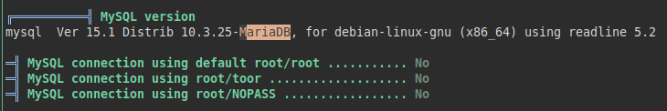

This version of **MariaDB** is vulnerable to *command injection* by abusing the "*wsrep_provider*" functionality, we will take advantage of this flaw to load our own malicious binary and gain root access.

#### Exploit: [MariaDB 10.2 - 'wsrep_provider' OS Command Execution](https://www.exploit-db.com/exploits/49765)

We create our malicious binary in which we will insert a reverse shell.
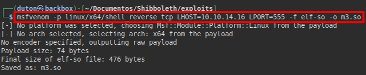

Afterwards, we will put a **netcat** listening and execute the following command.
```bash
mysql -u zabbix -p -e 'SET GLOBAL wsrep_provider="/tmp/m3.so";'
```
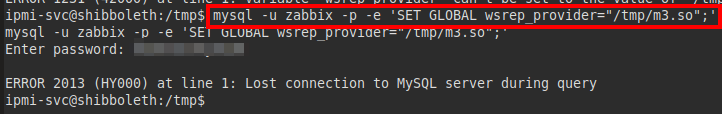

We gain root access and we can read the flag *root.txt*.
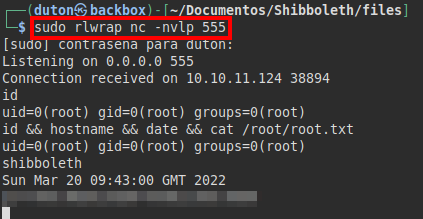

---
## About

David Utón is Penetration Tester and security auditor for web and mobiles applications, perimeter networks, internal and industrial corporate infrastructures, and wireless networks.

#### Contacted on:

 [David-Uton](https://www.linkedin.com/in/david-uton/)
 [@David_Uton](https://twitter.com/David_Uton)
