# Ollie TryHackMe Writeup
### Level: `Medium` | OS: `Linux`

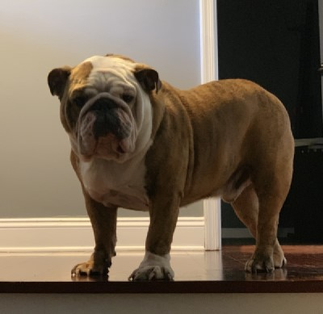

## Scanning
We run nmap on all ports with scripts and software versions.

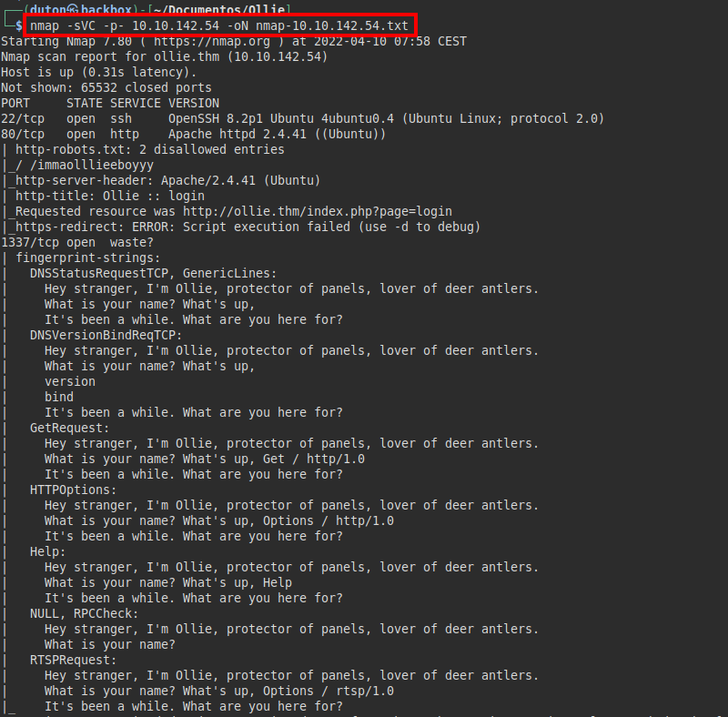

## Enumeration
Enter the IP and the domain olliet.thm in "*/etc/hosts*" file to speed up in case of machine reset.

We access the website, list the software version and a user "*0day*".

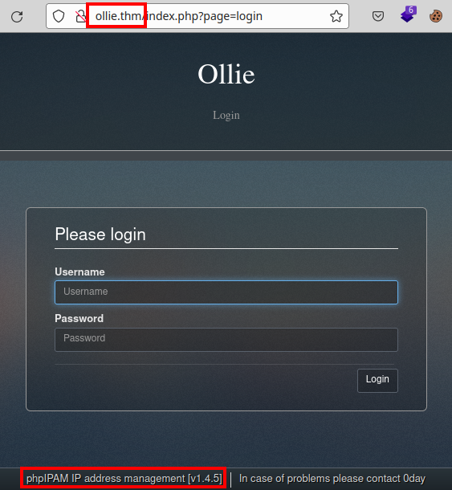

If we search **exploit-db.com**, we find at least two exploits reported in previous versions.

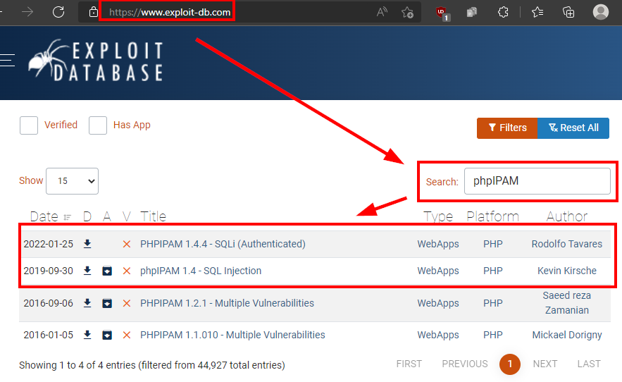

Both exploits require valid credentials, if we try to do some quick tests we see that the software is protected against automated attacks, blocking our access for 5 minutes.

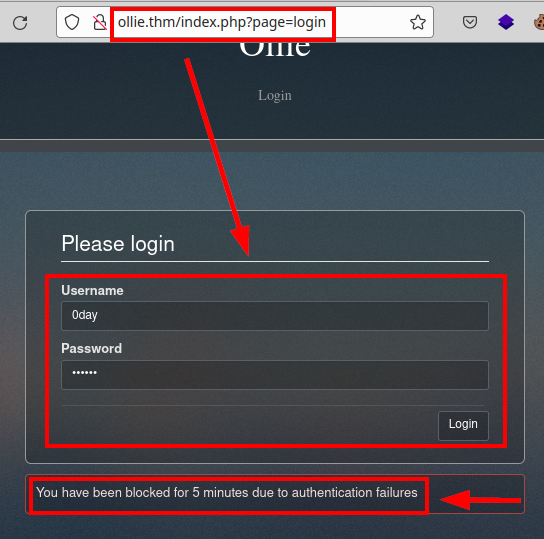

We run **wfuzz** tool and we found db folder:

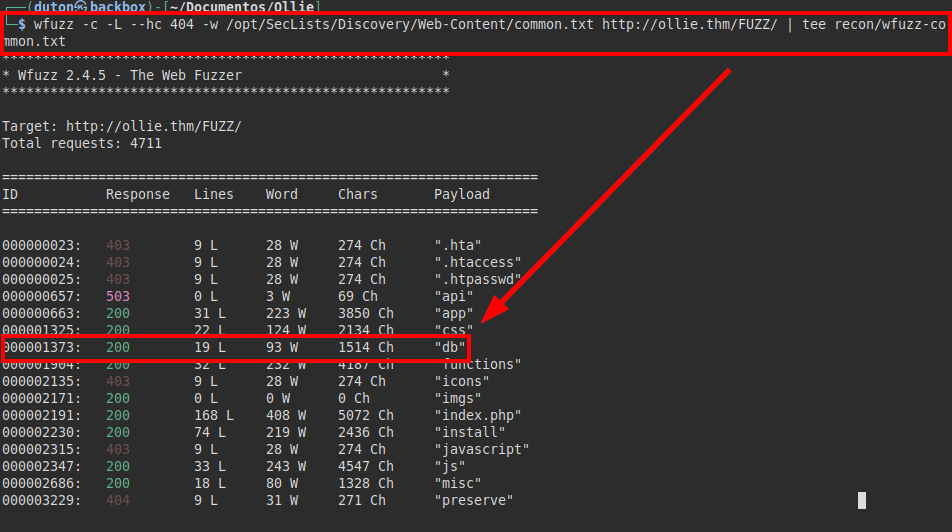

We have directory listing, we find the default database file.

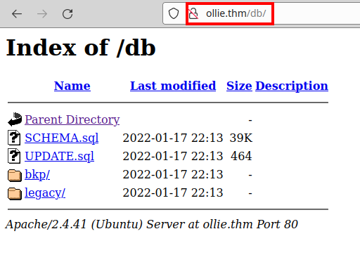

If we look at the file "*SCHEMA.sql*" we see some default creds.

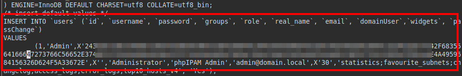

We tried cracking the hash at **hashes.com**:

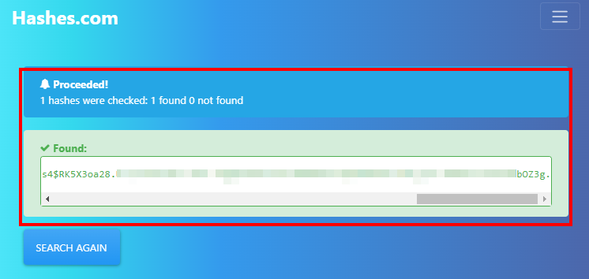

The hash takes us to the default credentials, but they are not valid, so we will have to find another way.

We go back to the nmap information, this time we will connect to port 1337, it seems that there is a bot asking questions, as we know the breed of the dog, we answer "*bulldog*" and it gives us some credentials.

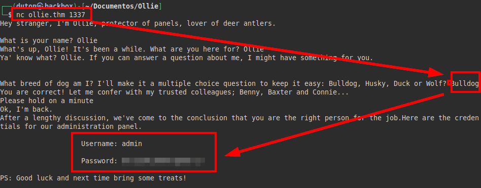

## Exploitation
Log in as administrator, now we will have to find a way to access the server from the CMS.

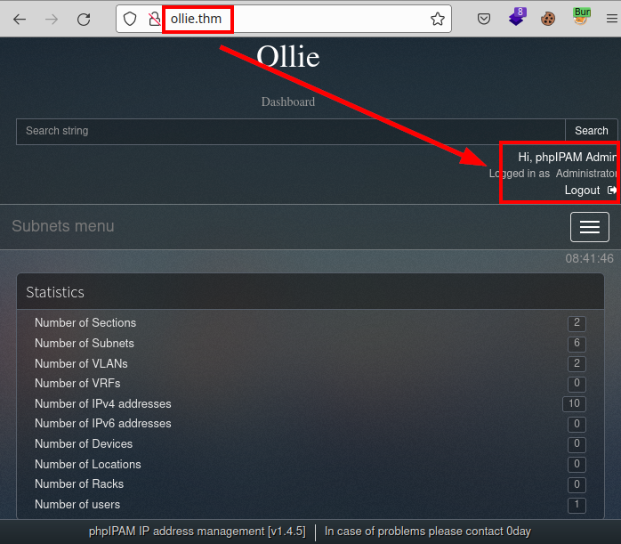

I tried to run the exploit of version "*1.4.4*", but it doesn't work (logical, possibly patched). Anyway, it is good practice to check it manually.

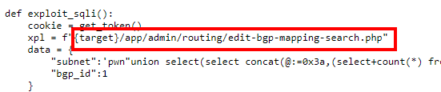

If we do the manual check, we can see that the server response is still deficient to SQL Injection attacks.

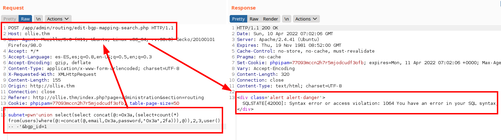

We capture the **Burp** request and run **sqlmap** indicating the file, we can see that we can list the databases.

We check our privileges, we see that we have many privileges that would allow us to read and write files.

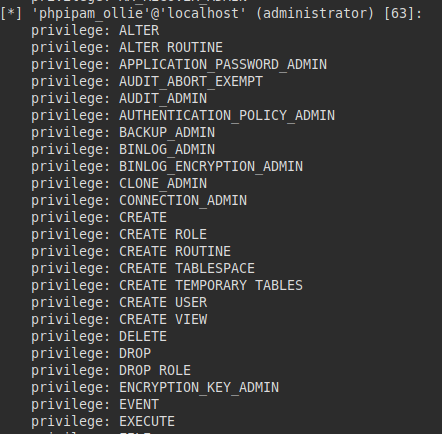

Extract the file "*/etc/passwd*":

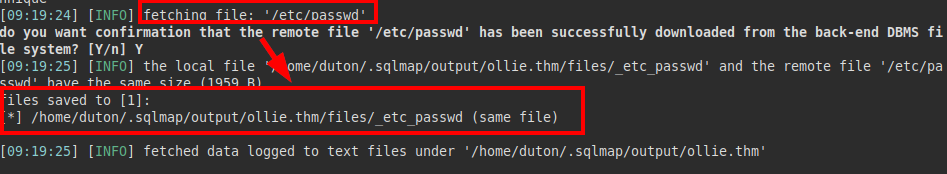

#### Content passwd file:
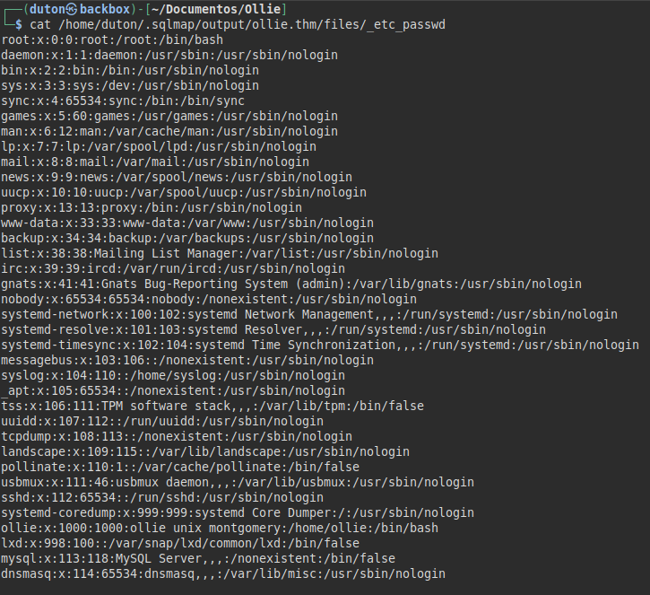

In my case, I used a reverse shell of pentester monkey and uploaded it in the default directory.

We check if the file exists, we see that it does!

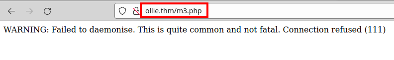

Now, we go on listen, re-execute the file *m3.php* and gain access.

We try to read the user flag and we do not have access. We try the password and we see that we can access (remember that we were asked for authentication by key in the SSH and prevented us from connecting), we read the flag of *user.txt*

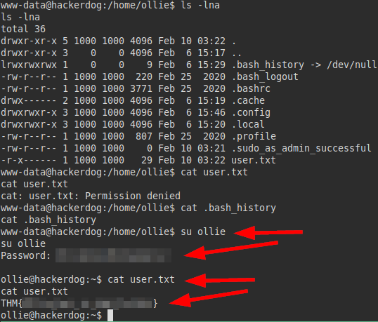

## Privilege Escalation
If we look for files with inherited SUID, we check that there is "**pkexec**", although the machine does not have the "**gcc**" binary, we could try to compile it locally, upload it and run it... But let's try to exploit the machine from another attack vector.

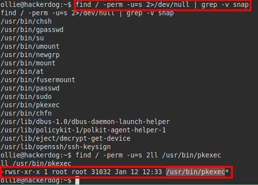

We run the **linpeas** tool, we see that it is running interesting actions:

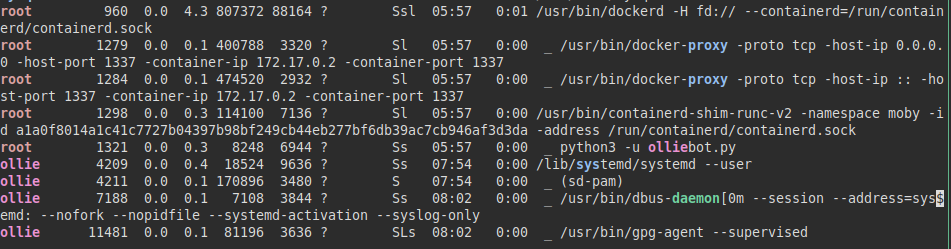

We download and run "**pspy**" on the machine, we see that every few minutes the "*feedme*" binary with *UID "0" (root)* is executed.

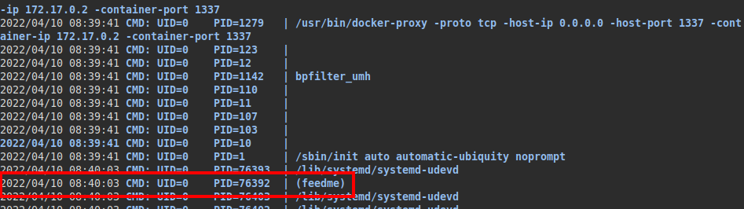

We look for the file, check that we have permissions on it so that we can replace it with another malicious binary controlled by us.

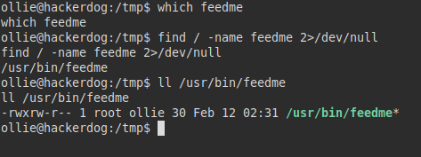

#### Content feedme file:
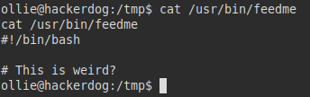

We create our malicious "*feedme*" file, in my case I inserted a line in bash to get a reverse shell:

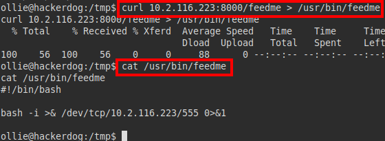

We put a **netcat** listening, wait a few minutes, we will receive a connection as root and read the flag *root.txt*:

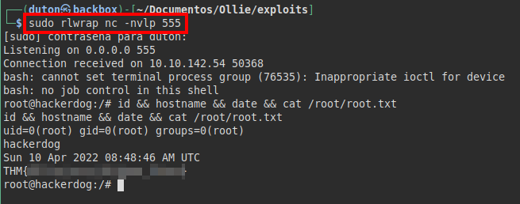

---
## About

David Utón is Penetration Tester and security auditor for web and mobiles applications, perimeter networks, internal and industrial corporate infrastructures, and wireless networks.

#### Contacted on:

 [David-Uton](https://www.linkedin.com/in/david-uton/)
 [@David_Uton](https://twitter.com/David_Uton)
